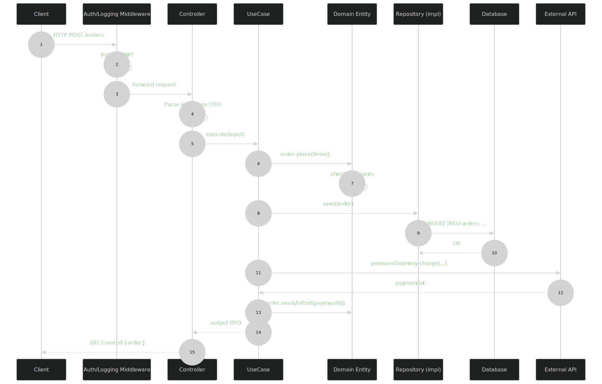

# The Clean Architecture Bible
## A Production-Grade Engineering Reference
> Audience: Backend Developers · Full Stack Engineers · Software Architects · DevOps Engineers · CS Students · System Designers
! Reference value: Lifetime

---

# Table of Contents
* [**Introduction**](#introduction)
* [**What is Clean Architecture?**](#what-is-clean-architecture)
* [**Why Clean Architecture Exists**](#why-clean-architecture-exists)
* [**History & Origins**](#history--origins)
* [**Architecture Goals**](#architecture-goals)
* [**The Dependency Rule**](#the-dependency-rule)
* [**SOLID Principles Recap**](#solid-principles-recap)
* [**Architectural Comparisons**](#architectural-comparisons)
* [**Core Layers**](#core-layers)
* [**Architecture Diagrams**](#architecture-diagrams)
* [**Folder Structures by Stack**](#folder-structures-by-stack)
* [**Request Lifecycle**](#request-lifecycle)
* [**Dependency Injection**](#dependency-injection)
* [**Repository Pattern**](#repository-pattern)
* [**Use Cases**](#use-cases)
* [**Domain Layer Deep Dive**](#domain-layer-deep-dive)
* [**Infrastructure Layer**](#infrastructure-layer)
* [**Presentation Layer**](#presentation-layer)
* [**Authentication Example**](#authentication-example)
* [**Error Handling**](#error-handling)
* [**Validation Strategy**](#validation-strategy)
* [**Database Independence**](#database-independence)
* [**Testing Strategy**](#testing-strategy)
* [**Scaling Clean Architecture**](#scaling-clean-architecture)
* [**Security Architecture**](#security-architecture)
* [**Performance Considerations**](#performance-considerations)
* [**Common Mistakes**](#common-mistakes)
* [**Real Project Example: E-Commerce API**](#real-project-example-e-commerce-api)
* [**Comparison Tables**](#comparison-tables)
* [**Best Practices Checklist**](#best-practices-checklist)
* [**Frequently Asked Questions**](#frequently-asked-questions)
* [**Summary**](#summary)
* [**Resources**](#resources)

---

# Introduction
> NOTE ! 
    This is not a tutorial. This is an engineering manual. Treat it like a reference book you keep open while designing systems.

Software systems decay. Not because of bad developers, but because of bad architecture. Frameworks get replaced. Databases change. UI paradigms shift. Business rules persist.

**Clean Architecture** is the discipline of separating what changes rarely (business rules) from what changes often (frameworks, databases, transport layers), so your system can survive decades of evolution without rewriting itself.

This guide will give you a complete mental model, practical implementation patterns, multi-language examples, and hard-won lessons from real production systems.

---

# What is Clean Architecture?
Clean Architecture is an **architectural pattern** proposed by **Robert C. Martin (Uncle Bob)** in 2012 that organizes code into concentric layers where:
1. **Inner layers know nothing about outer layers**.
2. **Business rules are isolated from frameworks, databases, and delivery mechanisms**.
3. **Dependencies point inward**, never outward.
<p align="center">
  
</p>

The outer ring is volatile. The inner ring is stable. **Everything depends inward**.

---

# Why Clean Architecture Exists
<b>The core problem Clean Architecture solves (click to expand)</b>
Modern software has three enemies:
| Enemy | Example | Frequency of Change |
|---|---|---|
| **Frameworks** | React, Express, Spring, Django | Every 2–3 years |
| **Delivery Mechanisms** | REST → GraphQL → gRPC | Every 1–2 years |
| **Persistence** | MySQL → MongoDB → PostgreSQL | Every 3–5 years |
| **Business Rules** | Order must be paid before shipping | Decades |
If you let the first three pollute your business logic, every change to them forces a rewrite of your core domain. Clean Architecture **inverts the dependency** so business rules don't know or care what database, framework, or UI you use.

---

# History & Origins
<p align="center">
  
</p>

**Robert C. Martin (Uncle Bob)** synthesized decades of architectural thinking — Hexagonal, Onion, BCE, and DDD — into a unified pattern called Clean Architecture. The book "Clean Architecture: A Craftsman's Guide to Software Structure and Design" (2017) remains the canonical reference.

---

# Architecture Goals
| # | Goal | Description |
|---|---|---|
| 1 | **Independent of Frameworks** | Architecture doesn't depend on Spring, Express, Rails. |
| 2 | **Independent of UI** | REST → GraphQL swap doesn't touch business logic. |
| 3 | **Independent of Database** | MySQL → MongoDB swap doesn't touch entities. |
| 4 | **Independent of External Services** | Stripe → Adyen swap doesn't touch use cases. |
| 5 | **Testable** | Business rules can be tested without UI, DB, or web server. |
| 6 | **Maintainable** | New developers find their way quickly. |
| 7 | **Deployable** | Each use case is a candidate for a microservice. |
> IMPORTANT !
    Goals 1–4 are about decoupling. Goals 5–7 are the emergent benefits of that decoupling.

## Separation of Concerns
Every layer has **one reason to change**:
* Entities change when business rules change.
* Use Cases change when application behavior changes.
* Controllers change when API contracts change.
* Repositories change when persistence details change.
This is the **Single Responsibility Principle** applied at the architectural level.
## Independence of Frameworks
Frameworks are **tools, not architects**. A well-designed system treats the framework as a plugin in the outer ring. If you remove Express, NestJS, or Spring Boot from the project, the core business logic should still compile and run.
> TIP! Test it: Can you run your domain without starting a web server? If not, you have a leak.
## Independence of UI
A business rule like "a customer with overdue invoices cannot place new orders" is true whether the order is placed via:

* REST API
* GraphQL
* gRPC
* CLI tool
* Mobile app
* Admin dashboard
The UI is a delivery mechanism. The use case shouldn't know which one triggered it.
## Independence of Database
Your `Order` entity has a `place()` method. It doesn't know if persistence is:

* SQL
* NoSQL
* In-memory
* Event log
* File system
The repository abstracts this.
## Independence of External Services
Stripe charges a card → easy. Tomorrow, your bank acquires Stripe → you switch to Adyen. In a Clean system, you change **one adapter** and the entire domain is unaffected.

---

# The Dependency Rule
> "**Source code dependencies must point only inward, toward higher-level policies." — Robert C. Martin**
<p align="center">
  
</p>

**Nothing in an inner circle can know anything about something in an outer circle**.
* A `use case` may not import a database driver.
* A `domain entity` may not import a controller.
* A `repository interface` lives in the domain; its **implementation** lives in infrastructure.

## Source Code Dependencies
In **Java/TypeScript/C#**, you enforce this with module/package visibility:
```typescript
// Domain layer (inner)
export interface UserRepository {
  findById(id: string): Promise<User | null>;
}

// Infrastructure layer (outer)
import { UserRepository } from '@/domain/repositories/user.repository';
import { User } from '@/domain/entities/user.entity';

export class PostgresUserRepository implements UserRepository {
  async findById(id: string): Promise<User | null> {
    // SELECT * FROM users ...
  }
}
```
The interface lives inward. The implementation lives outward. **Imports always point inward**.
## The Dependency Inversion Principle (DIP)
DIP is the **mechanism** that makes the dependency rule work.
> High-level modules must not depend on low-level modules. **Both must depend on abstractions**.
<p align="center">
  
</p>
The use case depends on the interface, not the concrete class. This is the entire magic.

---

# SOLID Principles Recap
| Principle | Application to Clean Architecture |
|---|---|
| **S**ingle Responsibility | Each use case = one user action. Each entity = one business concept. |
| **O**pen/Closed | Add new use cases without modifying existing ones. |
| **L**iskov Substitution | Any repository implementation is substitutable. |
| **I**nterface Segregation | Small, focused interfaces (e.g., `ReadableRepository`, not `CrudRepository`). |
| **D**ependency Inversion | Domain owns interfaces; infrastructure implements them. |
## Architectural Comparisons
> TIP ! Hexagonal, Onion, and Clean Architecture are the same idea with different vocabularies. The differences are mostly cosmetic.
## Clean Architecture vs Traditional Layered Architecture
<p align="center">
  
</p>

| Aspect | Traditional Layered | Clean Architecture |
|---|---|---|
| Dependency direction | Top-down | Inward |
| DB swap impact | Touches service layer | Touches only adapters |
| Testability | Needs DB for service tests | Pure unit tests |
| Domain awareness of DB | Often leaky | Always isolated |
| Circular dependency risk | High | Low |
## Clean Architecture vs MVC
| Aspect | MVC | Clean Architecture |
|---|---|---|
| **Layers** | 3 (Model, View, Controller) | 4 (Entity, UseCase, Adapter, Framework) |
| **Focus** | UI concerns | Business logic |
| **Best for** | Web apps with simple domain | Complex business logic |
| **Fat controller risk** | Very high | Mitigated by use cases |
## Clean Architecture vs Onion Architecture
| Aspect | Onion | Clean |
|---|---|---|
| Origin | Jeffrey Palermo (2011) | Uncle Bob (2012) |
| Layers | 4 concentric rings | 4 concentric rings |
| Domain Model | Center | Center |
| Application Services | Layer 2 | Use Cases |
| UI/Holders | Outer | Interface Adapters |
| Infrastructure | Outermost | Frameworks & Drivers |
| **Verdict** | **Functionally equivalent** | Same philosophy, different vocabulary |
## Clean Architecture vs Hexagonal Architecture (Ports & Adapters)
| Aspect | Hexagonal | Clean |
|---|---|---|
| Origin | Alistair Cockburn (2008) | Uncle Bob (2012) |
| Terminology | Ports, Adapters | Interfaces, Implementations |
| Driving side | Primary (UI/API) | Interface Adapters |
| Driven side | Secondary (DB, External) | Frameworks & Drivers |
| **Verdict** | **Same pattern, different metaphor** | Same |
## Clean Architecture vs N-Tier Architecture
| Aspect | N-Tier | Clean |
|---|---|---|
| **Layers** | Physical (web server, app server, DB) | Logical (domain, use case, etc.) |
| **Coupling** | Often tight | Inverted |
| **Distribution** | Designed for it | Possible but not required |
| **Use case** | Simple CRUD apps | Complex domains |

---

# Core Layers
Clean Architecture has **four logical layers**. They can be implemented as packages, modules, projects, or microservices — the layering is what matters, not the technology.
## Layer Overview
<p align="center">
  
</p>

## Entities (Enterprise Business Rules)
<b>Deep dive: Entities</b>
**Definition**: Encapsulated enterprise-wide business rules. The most general and high-level rules. Critical business data and behavior lives here.

**Responsibilities**:
* Hold the most critical business data
* Enforce invariants (e.g., `Order.total` is always the sum of its `lineItems`)
* Pure logic, no framework dependencies
* Survive all UI/database changes

**Dependencies**:

* May NOT depend on any outer layer
* May NOT depend on any framework
* May NOT depend on any I/O concern

**Common mistakes**:

* Adding `createdAt`/ `updatedAt` directly to entity (this is persistence concern)
* Annotating with ORM decorators ( `@Entity`, `#[ORM\Entity]`)
* Putting validation rules that belong in use cases
* Returning `null` from entity methods instead of using `Option`/ `Either`

### Example:
```typescript
// src/domain/entities/order.entity.ts
export class Order {
  private constructor(
    public readonly id: string,
    public readonly customerId: string,
    private lineItems: LineItem[],
    public readonly status: OrderStatus,
  ) {
    this.validate();
  }

  static create(customerId: string, items: LineItem[]): Order {
    return new Order(
      crypto.randomUUID(),
      customerId,
      items,
      OrderStatus.Pending,
    );
  }

  total(): Money {
    return this.lineItems.reduce(
      (sum, item) => sum.add(item.subtotal()),
      Money.zero(),
    );
  }

  markAsPaid(paymentId: string): void {
    if (this.status !== OrderStatus.Pending) {
      throw new InvalidOrderStateError(
        `Cannot pay order in status ${this.status}`,
      );
    }
    this.status = OrderStatus.Paid;
    this.paymentId = paymentId;
  }

  private validate(): void {
    if (this.lineItems.length === 0) {
      throw new EmptyOrderError('Order must contain at least one item');
    }
  }
}
```

---

# Domain Models
A Domain Model is the **object-oriented representation of the domain**. Entities are part of domain models, but domain models can also contain value objects, aggregates, and domain services.
> See Domain Layer Deep Dive for full treatment. 

## Use Cases (Application Business Rules)
<b>Deep dive: Use Cases</b>

**Definition**: Application-specific business rules. Orchestrate the flow of data between entities and outer layers. Each use case represents one user intention.

### Responsibilities:

* Accept input via DTOs
* Validate input against business rules
* Coordinate entities and repositories
* Return output via DTOs
* Handle use-case-specific errors
### Dependencies:

* Depends on entities (inner)
* Depends on repository **interfaces** (inner)
* Does NOT depend on controllers, HTTP, DB, etc.
### Single Responsibility Principle applied:

* `CreateUserUseCase`
* `LoginUseCase`
* `PlaceOrderUseCase`
* `GenerateInvoiceUseCase`
One use case = one user action.
### Input/Output DTOs:
```typescript
// src/application/use-cases/create-user/create-user.input.ts
export interface CreateUserInput {
  email: string;
  password: string;
  name: string;
}

// src/application/use-cases/create-user/create-user.output.ts
export interface CreateUserOutput {
  id: string;
  email: string;
  name: string;
  createdAt: Date;
}

// src/application/use-cases/create-user/create-user.use-case.ts
export class CreateUserUseCase {
  constructor(
    private readonly userRepository: UserRepository,
    private readonly passwordHasher: PasswordHasher,
    private readonly eventBus: EventBus,
  ) {}

  async execute(input: CreateUserInput): Promise<CreateUserOutput> {
    const existing = await this.userRepository.findByEmail(input.email);
    if (existing) {
      throw new EmailAlreadyTakenError(input.email);
    }

    const hashedPassword = await this.passwordHasher.hash(input.password);
    const user = User.create({
      email: new Email(input.email),
      password: new HashedPassword(hashedPassword),
      name: new PersonName(input.name),
    });

    await this.userRepository.save(user);
    await this.eventBus.publish(new UserCreatedEvent(user.id, user.email));

    return {
      id: user.id,
      email: user.email.value,
      name: user.name.full,
      createdAt: user.createdAt,
    };
  }
}
```
### Common mistakes:

Making use cases generic services (the "fat service" anti-pattern)
Combining multiple user actions into one use case
Returning ORM entities instead of DTOs
Putting business logic in the use case that belongs in the entity
## Interface Adapters
<b>Deep dive: Interface Adapters</b>

### Definition:
 The set of adapters that convert data between the format most convenient for the use cases/entities and the format most convenient for the external agency (DB, web, etc.).

### Components:
| Component | Purpose |
|---|---|
| **Controllers** | Translate HTTP requests → use case input. Translate use case output → HTTP response. |
| **Presenters** | Format output for a specific view (CLI, GraphQL, JSON, etc.). |
| **Gateways** | Adapters to external systems (REST APIs, gRPC services, message brokers). |
| **Repositories (interface)** | Defined here, implemented in infrastructure. *(Note: many teams place these in domain instead.)* |
### Dependencies:

* Depend on use cases
* Depend on repository interfaces (or implement them)
* Do NOT know about HTTP frameworks directly (controllers do)
### Common mistakes:

* Business logic in controllers (the infamous fat controller)
* ORM models leaking into the controller response
* Validation duplicated between controller and use case
## Controllers
Controllers are the **entry point** for the presentation layer. They:

1. Parse HTTP request (body, params, headers)
2. Validate at the **transport level** (shape, types)
3. Map to use case input DTO
4. Invoke the use case
5. Map output / errors to HTTP response
6. Handle HTTP-specific concerns (status codes, headers, cookies)
```typescript
@Controller('/users')
export class CreateUserController {
  constructor(private readonly createUserUseCase: CreateUserUseCase) {}

  @Post('/')
  async handle(@Body() body: CreateUserRequestDto): Promise<HttpResponse> {
    try {
      const output = await this.createUserUseCase.execute({
        email: body.email,
        password: body.password,
        name: body.name,
      });
      return HttpResponse.created(output);
    } catch (error) {
      return ErrorMapper.toHttp(error);
    }
  }
}
```
> WARNING! Controllers should be **thin**. If your controller exceeds ~50 lines, you're leaking logic into it.
## Presenters
Presenters transform use case output into a format suitable for a specific UI. They're useful in:

* **MVC desktop apps** (formatting for the view)
* **GraphQL resolvers** (shaping the response)
* **Multi-format APIs** (JSON, XML, CSV)
In modern REST APIs, the controller and presenter often merge.

## Gateways
Gateways are adapters to **outbound external services** that aren't databases. For example:
* `PaymentGateway` → wraps Stripe SDK
* `EmailGateway` → wraps SendGrid SDK
* `SmsGateway` → wraps Twilio SDK
```typescript
// Domain (interface)
export interface PaymentGateway {
  charge(amount: Money, token: string): Promise<PaymentResult>;
}

// Infrastructure (implementation)
export class StripePaymentGateway implements PaymentGateway {
  async charge(amount: Money, token: string): Promise<PaymentResult> {
    const stripeCharge = await this.stripe.charges.create({
      amount: amount.cents,
      currency: amount.currency,
      source: token,
    });
    return new PaymentResult(stripeCharge.id, stripeCharge.status);
  }
}
```
## Repositories
Repositories abstract **persistence**. The interface lives in the domain; the implementation lives in infrastructure.

## Frameworks & Drivers
<b>Deep dive: Frameworks & Drivers</b>

The outermost layer. Contains:

**Web frameworks** (Express, Fastify, Spring, Gin, FastAPI)
**ORM/DB drivers** (TypeORM, Sequelize, Hibernate, GORM)
**External API SDKs** (Stripe, AWS SDK)
**UI frameworks** (React, Vue, Angular) — when full-stack
**I/O concerns** (file system, console)
This layer is **volatile**. You should be able to replace it without touching anything else.

**Rule of thumb**: If it's listed in `package.json` as a dependency and your domain imports it, you have a leak.

---

# Architecture Diagrams
## Overall Clean Architecture
<p align="center">
  
</p>

## Request Lifecycle
<p align="center">
  
</p>

## Dependency Direction
<p align="center">
  
</p>

## Backend API Architecture
<p align="center">
  
</p>

## Microservice Example
<p align="center">
  
</p>

Each microservice is a **self-contained Clean Architecture** with its own domain, use cases, and adapters.

## Domain Flow
<p align="center">
  
</p>

---

# Folder Structures by Stack
## General Structure (Language-Agnostic)
```text
src/
├── domain/           # Entities, value objects, domain services, repository interfaces
├── application/      # Use cases, DTOs, application services
├── infrastructure/   # DB, external APIs, framework-specific code
├── presentation/     # Controllers, presenters, HTTP-related code
├── shared/           # Cross-cutting utilities, value objects, error types
└── main/             # Composition root: DI, bootstrapping
```
## Node.js + Express + TypeScript
```text
src/
├── domain/
│   ├── entities/
│   │   ├── user.entity.ts
│   │   └── order.entity.ts
│   ├── value-objects/
│   │   ├── email.vo.ts
│   │   └── money.vo.ts
│   ├── repositories/                # Interfaces only
│   │   ├── user.repository.ts
│   │   └── order.repository.ts
│   ├── services/                    # Domain services
│   └── events/
│
├── application/
│   ├── use-cases/
│   │   ├── create-user/
│   │   │   ├── create-user.use-case.ts
│   │   │   ├── create-user.input.ts
│   │   │   └── create-user.output.ts
│   │   ├── login-user/
│   │   └── place-order/
│   ├── dtos/
│   ├── mappers/
│   └── events/
│
├── infrastructure/
│   ├── database/
│   │   ├── postgres/
│   │   │   ├── connection.ts
│   │   │   └── migrations/
│   │   └── redis/
│   ├── repositories/                # Implementations
│   │   ├── postgres-user.repository.ts
│   │   └── postgres-order.repository.ts
│   ├── gateways/
│   │   ├── stripe-payment.gateway.ts
│   │   └── sendgrid-email.gateway.ts
│   ├── services/
│   │   ├── bcrypt-password.hasher.ts
│   │   └── jwt-token.service.ts
│   └── events/
│       └── rabbitmq-event-bus.ts
│
├── presentation/
│   ├── http/
│   │   ├── controllers/
│   │   ├── routes/
│   │   ├── middlewares/
│   │   ├── filters/                 # Error handlers
│   │   └── decorators/
│   └── graphql/                     # If applicable
│
├── shared/
│   ├── errors/
│   ├── utils/
│   └── types/
│
└── main/
    ├── config/
    ├── factories/                   # Composition root
    ├── server.ts
    └── container.ts                 # DI container
```
## NestJS
```text
src/
├── modules/
│   ├── users/
│   │   ├── domain/
│   │   │   ├── entities/
│   │   │   ├── value-objects/
│   │   │   └── repositories/        # Interfaces
│   │   ├── application/
│   │   │   ├── use-cases/
│   │   │   ├── dtos/
│   │   │   └── services/
│   │   ├── infrastructure/
│   │   │   ├── persistence/
│   │   │   │   └── user.repository.ts
│   │   │   └── adapters/
│   │   └── presentation/
│   │       ├── controllers/
│   │       └── resolvers/
│   ├── orders/
│   └── payments/
│
├── shared/
│   └── ...
│
├── main.ts
└── app.module.ts
```
## FastAPI (Python)
```text
src/
├── domain/
│   ├── entities/
│   │   ├── user.py
│   │   └── order.py
│   ├── value_objects/
│   ├── repositories/                # Abstract base classes
│   └── services/
│
├── application/
│   ├── use_cases/
│   │   ├── create_user.py
│   │   └── place_order.py
│   ├── dtos/
│   └── interfaces/
│
├── infrastructure/
│   ├── database/
│   │   ├── models/                  # SQLAlchemy models
│   │   ├── repositories/            # Implementations
│   │   └── migrations/
│   ├── gateways/
│   │   └── stripe_gateway.py
│   └── services/
│       └── bcrypt_hasher.py
│
├── presentation/
│   ├── api/
│   │   ├── routes/
│   │   ├── schemas/                 # Pydantic
│   │   └── dependencies.py
│   └── middleware/
│
└── main.py
```
## Spring Boot (Java/Kotlin)
```text
src/main/java/com/example/app/
├── domain/
│   ├── model/                       # Entities, VOs
│   ├── repository/                  # Interfaces
│   └── service/                     # Domain services
│
├── application/
│   ├── usecase/
│   ├── dto/
│   └── port/                        # Gateway interfaces
│
├── infrastructure/
│   ├── persistence/
│   │   ├── jpa/                     # Spring Data impl
│   │   └── entity/                  # JPA entities (separate!)
│   ├── gateway/
│   │   └── stripe/                  # Stripe impl
│   └── config/
│
├── presentation/
│   ├── rest/
│   │   ├── controller/
│   │   └── dto/
│   └── graphql/                     # Optional
│
└── Application.java
```
## Go
```text
internal/
├── domain/
│   ├── entity/
│   ├── valueobject/
│   └── repository/                  # Interfaces
│
├── usecase/
│   ├── create_user.go
│   └── place_order.go
│
├── infrastructure/
│   ├── persistence/
│   │   └── postgres/
│   ├── gateway/
│   │   └── stripe/
│   └── service/
│
└── presentation/
    └── http/
        ├── handler/
        ├── middleware/
        └── router.go

cmd/
└── api/
    └── main.go                      # Composition root
```
> Each folder enforces the dependency rule at the file system level. If your domain folder contains `import express from 'express'`, something has gone very wrong.

---

# Request Lifecycle
<p align="center">
  
</p>

## Step-by-Step
1. **Client** sends HTTP request.
2. **Middleware** validates JWT, logs request, rate-limits.
3. **Controller** parses body, validates transport-level shape.
4. **Controller** invokes **Use Case** with an Input DTO.
5. **Use Case** loads aggregates via **Repository Interface**.
6. **Repository Implementation** queries the database.
7. **Domain Entity** mutates state, enforcing invariants.
8. **Use Case** orchestrates external gateways (payment, email).
9. **Use Case** persists changes.
10. **Repository** writes to the database.
11. **Use Case** returns an **Output DTO**.
12. **Controller** maps output to HTTP response (status, headers, body).
13. **Response** goes back through middleware (logging, error handling).
14. **Client** receives the response.

---

# Dependency Injection
## Why?
Without DI, your use case directly instantiates its dependencies:
```typescript
// ❌ Anti-pattern
class CreateUserUseCase {
  private repo = new PostgresUserRepository(); // tight coupling
  private hasher = new BcryptHasher();          // tight coupling
}
```
## Problems:

* Cannot swap implementations
* Cannot mock in tests
* Cannot run unit tests without a DB

With DI:
```typescript
// ✅ Correct
class CreateUserUseCase {
  constructor(
    private readonly repo: UserRepository,       // interface
    private readonly hasher: PasswordHasher,     // interface
  ) {}
}
```
## Inversion of Control (IoC)
IoC is the **principle**: don't call us, we'll call you.

DI is one **implementation** of IoC. The control of when and how dependencies are created is **inverted** from the use case to a container.

## Constructor Injection (Most Common)
```typescript
// TypeScript
class PlaceOrderUseCase {
  constructor(
    private readonly orderRepo: OrderRepository,
    private readonly paymentGateway: PaymentGateway,
    private readonly eventBus: EventBus,
  ) {}
}
```
```go
// Go
type PlaceOrderUseCase struct {
    OrderRepo      domain.OrderRepository
    PaymentGateway domain.PaymentGateway
    EventBus       domain.EventBus
}

func NewPlaceOrderUseCase(...) *PlaceOrderUseCase { ... }
```
```python
# Python
class PlaceOrderUseCase:
    def __init__(
        self,
        order_repo: OrderRepository,
        payment_gateway: PaymentGateway,
        event_bus: EventBus,
    ):
        self._order_repo = order_repo
        self._payment_gateway = payment_gateway
        self._event_bus = event_bus
```
```java
// Java
public class PlaceOrderUseCase {
    private final OrderRepository orderRepo;
    private final PaymentGateway paymentGateway;
    private final EventBus eventBus;

    public PlaceOrderUseCase(
        OrderRepository orderRepo,
        PaymentGateway paymentGateway,
        EventBus eventBus
    ) {
        this.orderRepo = orderRepo;
        this.paymentGateway = paymentGateway;
        this.eventBus = eventBus;
    }
}
```

## Interface Injection
Less common. The dependency provides an injector method that the container calls. Used in older Java frameworks and some PHP DI containers.

## DI Containers
| Language | Container |
|---|---|
| TypeScript | InversifyJS, tsyringe, NestJS built-in |
| Java | Spring IoC, Guice, Dagger |
| C# | .NET Core built-in `IServiceProvider` |
| Python | `dependency-injector`, `inject`, FastAPI's `Depends` |
| Go | Wire, Dig, manual composition root |
| Kotlin | Koin, Kodein, Spring |
| PHP | PHP-DI, Symfony Container |

**The Composition Root** is where you wire everything together:
```typescript
// main/container.ts
container.register('UserRepository', PostgresUserRepository);
container.register('PasswordHasher', BcryptHasher);

container.register(
  'CreateUserUseCase',
  CreateUserUseCase,
  ['UserRepository', 'PasswordHasher', 'EventBus'],
);

container.register(
  'CreateUserController',
  CreateUserController,
  ['CreateUserUseCase'],
);
```
> TIP ! Prefer manual composition roots for clarity in small/medium apps. Use containers for large apps with hundreds of components.

---

# Repository Pattern
## Why Repositories Exist
Repositories solve three problems:

* **Abstraction**: Domain doesn't know about SQL.
* **Testability**: Use cases can be tested with in-memory repos.
* **Single point of policy**: Caching, optimistic locking, audit fields centralized.
## Repository Interface
```typescript
// src/domain/repositories/user.repository.ts
export interface UserRepository {
  save(user: User): Promise<void>;
  findById(id: string): Promise<User | null>;
  findByEmail(email: Email): Promise<User | null>;
  delete(id: string): Promise<void>;
}
```
## Repository Implementation
```typescript
// src/infrastructure/repositories/postgres-user.repository.ts
import { UserMapper } from './mappers/user.mapper';

export class PostgresUserRepository implements UserRepository {
  constructor(private readonly pool: Pool) {}

  async save(user: User): Promise<void> {
    const data = UserMapper.toPersistence(user);
    await this.pool.query(
      `INSERT INTO users (id, email, password_hash, name, created_at)
       VALUES ($1, $2, $3, $4, $5)
       ON CONFLICT (id) DO UPDATE SET
         email = EXCLUDED.email,
         name = EXCLUDED.name`,
      [data.id, data.email, data.passwordHash, data.name, data.createdAt],
    );
  }

  async findById(id: string): Promise<User | null> {
    const result = await this.pool.query(
      'SELECT * FROM users WHERE id = $1',
      [id],
    );
    if (result.rows.length === 0) return null;
    return UserMapper.toDomain(result.rows);
  }

  async findByEmail(email: Email): Promise<User | null> {
    const result = await this.pool.query(
      'SELECT * FROM users WHERE email = $1',
      [email.value],
    );
    if (result.rows.length === 0) return null;
    return UserMapper.toDomain(result.rows);
  }

  async delete(id: string): Promise<void> {
    await this.pool.query('DELETE FROM users WHERE id = $1', [id]);
  }
}
```

## Persistence Mapper
> WARNING ! **Never expose ORM entities to the domain**. Always map between persistence models and domain entities.

```typescript
// src/infrastructure/repositories/mappers/user.mapper.ts
export class UserMapper {
  static toPersistence(user: User): UserRow {
    return {
      id: user.id,
      email: user.email.value,
      password_hash: user.passwordHash.value,
      name: user.name.full,
      created_at: user.createdAt,
    };
  }

  static toDomain(row: UserRow): User {
    return User.reconstitute({
      id: row.id,
      email: new Email(row.email),
      passwordHash: new HashedPassword(row.password_hash),
      name: new PersonName(row.name),
      createdAt: row.created_at,
    });
  }
}
```
## Advantages
| Advantage | Description |
|---|---|
| **Testability** | Swap with in-memory repo for unit tests |
| **DB Independence** | Change DB without touching domain |
| **Centralized queries** | No scattered SQL across codebase |
| **Performance control** | Caching, batching added in one place |
## Common Mistakes
* Returning ORM entities from repositories
* Adding business logic to repository methods
* Exposing `QueryBuilder` to the domain (leaks the DB)
* Mixing read and write methods into a single mega-interface (use CQRS instead)

---

# Use Cases
A use case is a **single user intention** that the system serves.
## Examples
| Use Case | Input | Output |
|---|---|---|
| `CreateUser` | email, password, name | userId, email, name, createdAt |
| `LoginUser` | email, password | accessToken, refreshToken, expiresIn |
| `ResetPassword` | email, newPassword | success |
| `PlaceOrder` | customerId, items, paymentToken | orderId, total, status |
| `CancelOrder` | orderId, reason | refundedAmount |
## Anatomy of a Use Case
```typescript
export class CreateOrderUseCase {
  constructor(
    private readonly orderRepo: OrderRepository,
    private readonly inventoryGateway: InventoryGateway,
    private readonly paymentGateway: PaymentGateway,
    private readonly eventBus: EventBus,
    private readonly clock: Clock,           // injectable time
    private readonly idGenerator: IdGenerator,
  ) {}

  async execute(input: CreateOrderInput): Promise<CreateOrderOutput> {
    // 1. Validate input
    if (input.items.length === 0) {
      throw new ValidationError('Order must contain at least one item');
    }

    // 2. Reserve inventory
    const reservation = await this.inventoryGateway.reserve(input.items);
    if (!reservation.success) {
      throw new InsufficientStockError(reservation.unavailableItems);
    }

    // 3. Charge payment
    const payment = await this.paymentGateway.charge(
      new Money(input.total, 'USD'),
      input.paymentToken,
    );
    if (!payment.success) {
      await this.inventoryGateway.release(reservation.id);
      throw new PaymentDeclinedError(payment.reason);
    }

    // 4. Create aggregate
    const order = Order.create({
      id: this.idGenerator.next(),
      customerId: input.customerId,
      items: input.items,
      paymentId: payment.id,
      placedAt: this.clock.now(),
    });

    // 5. Persist
    await this.orderRepo.save(order);

    // 6. Emit events
    await this.eventBus.publish(new OrderPlacedEvent(order.id, order.total()));

    // 7. Return DTO
    return {
      orderId: order.id,
      total: order.total().toJSON(),
      status: order.status,
    };
  }
}
```
## Validation
Use cases validate **business rules**, not syntax. Syntax validation belongs at the controller.

## Error Handling
Use cases throw **domain exceptions**, not HTTP errors. The controller maps them:
```typescript
catch (err) {
  if (err instanceof InsufficientStockError) return res.status(409).json(err);
  if (err instanceof PaymentDeclinedError) return res.status(402).json(err);
  throw err; // unhandled → 500
}
```

---

# Domain Layer Deep Dive
## Entities
Already covered above. Entities are objects with **identity** that persist over time.
```typescript
const user1 = User.create({...});
const user2 = await repo.findById(user1.id);
user1.equals(user2); // true — same identity
```
## Value Objects
Value Objects are **immutable, defined by their attributes**, and have no **identity**.
```typescript
export class Email {
  private constructor(private readonly value: string) {}
  static create(raw: string): Email {
    if (!/^[^@]+@[^@]+\.[^@]+$/.test(raw)) {
      throw new InvalidEmailError(raw);
    }
    return new Email(raw.toLowerCase().trim());
  }
  equals(other: Email): boolean {
    return this.value === other.value;
  }
}
```
| Type | Identity | Mutability | Example |
|---|---|---|---|
| **Entity** | Yes | Mutable | User, Order |
| **Value Object** | No | Immutable | Email, Money |
| **Aggregate** | Yes (root) | Mutable internally | Order + LineItems |
| **Domain Service** | N/A | Stateless | PricingService |
## Aggregates
An Aggregate is a **cluster of entities and value objects** treated as a single unit for data changes. One entity is the **aggregate root**.
```typescript
class Order {  // Aggregate Root
  private items: LineItem[] = [];  // Internal entities
  
  addItem(product: Product, qty: number): void {
    this.items.push(new LineItem(product, qty));
  }
  
  total(): Money { /* computed from items */ }
}
```
### Rule: 
External code may only hold references to the root, not the inner entities.

## Domain Services
When business logic **doesn't belong to a single entity**, use a domain service.
```typescript
export class PricingService {
  calculateTotal(items: LineItem[], discounts: Discount[]): Money {
    // Complex pricing logic that spans multiple aggregates
  }
}
```
## Domain Events
Domain events represent **things that happened** in the past tense:
```typescript
export class OrderPlacedEvent implements DomainEvent {
  readonly occurredAt = new Date();
  constructor(
    public readonly orderId: string,
    public readonly customerId: string,
    public readonly total: Money,
  ) {}
}
```
Events enable **loose coupling** between bounded contexts and are the foundation of event-driven architecture.

---

# Infrastructure Layer
This layer contains everything that talks to the outside world.
| Concern | Example |
|---|---|
| **Databases** | PostgreSQL, MySQL, MongoDB, DynamoDB |
| **Caches** | Redis, Memcached |
| **File Storage** | S3, Azure Blob |
| **Email** | SendGrid, SES |
| **Push Notifications** | FCM, APNS |
| **Payment** | Stripe, Adyen, PayPal |
| **Message Brokers** | RabbitMQ, Kafka, SQS |
| **Search** | Elasticsearch, Meilisearch |
| **Background Jobs** | BullMQ, Celery, Sidekiq |
> CAUTION ! The infrastructure layer should never be imported by the domain. It depends on the domain, not the other way around.

---

# Presentation Layer
## Controllers
Thin, focused on HTTP concerns.
```typescript
@Controller('/orders')
export class CreateOrderController {
  constructor(private readonly placeOrder: PlaceOrderUseCase) {}

  @Post('/')
  @UseGuards(AuthGuard)
  @HttpCode(201)
  async handle(
    @CurrentUser() user: AuthenticatedUser,
    @Body() body: CreateOrderRequestDto,
  ): Promise<CreateOrderResponseDto> {
    const output = await this.placeOrder.execute({
      customerId: user.id,
      items: body.items,
      paymentToken: body.paymentToken,
    });
    return CreateOrderResponseDto.from(output);
  }
}
```
## DTOs
DTOs are **data structures for transport**, not domain objects. They:

Define the shape of HTTP request/response
Are validated at the boundary
Live in the presentation layer
```typescript
export class CreateOrderRequestDto {
  @IsArray()
  @ValidateNested({ each: true })
  @Type(() => OrderItemDto)
  items: OrderItemDto[];

  @IsString()
  paymentToken: string;
}
```
## Middleware
Cross-cutting HTTP concerns:

* Authentication
* Authorization
* Rate limiting
* Request logging
* CORS
* Compression
* Body parsing
* Tracing
## Exception Handling
Centralize error → HTTP code mapping:
```typescript
@Catch()
export class GlobalExceptionFilter implements ExceptionFilter {
  catch(exception: unknown, host: ArgumentsHost) {
    const ctx = host.switchToHttp();
    const response = ctx.getResponse<Response>();

    const status = this.mapErrorToStatus(exception);
    const body = this.mapErrorToBody(exception);

    response.status(status).json(body);
  }

  private mapErrorToStatus(err: unknown): number {
    if (err instanceof ValidationError) return 400;
    if (err instanceof UnauthorizedError) return 401;
    if (err instanceof ForbiddenError) return 403;
    if (err instanceof NotFoundError) return 404;
    if (err instanceof ConflictError) return 409;
    return 500;
  }
}
```

---

# Authentication Example
## Domain Layer
```typescript
// src/domain/entities/session.entity.ts
export class Session {
  static create(props: {
    userId: string;
    refreshTokenHash: string;
    expiresAt: Date;
  }): Session { /* ... */ }
  
  isExpired(): boolean { /* ... */ }
}

// src/domain/services/token.service.ts
export interface TokenService {
  signAccessToken(userId: string): string;
  verifyAccessToken(token: string): { userId: string } | null;
  hashRefreshToken(token: string): string;
}

// src/domain/services/password.hasher.ts
export interface PasswordHasher {
  hash(plain: string): Promise<string>;
  verify(plain: string, hash: string): Promise<boolean>;
}
```
## Application Layer
```typescript
// src/application/use-cases/login/login.use-case.ts
export class LoginUseCase {
  constructor(
    private readonly userRepo: UserRepository,
    private readonly passwordHasher: PasswordHasher,
    private readonly tokenService: TokenService,
    private readonly sessionRepo: SessionRepository,
    private readonly clock: Clock,
  ) {}

  async execute(input: LoginInput): Promise<LoginOutput> {
    const user = await this.userRepo.findByEmail(new Email(input.email));
    if (!user) throw new InvalidCredentialsError();

    const valid = await this.passwordHasher.verify(input.password, user.passwordHash.value);
    if (!valid) throw new InvalidCredentialsError();

    const accessToken = this.tokenService.signAccessToken(user.id);
    const refreshToken = crypto.randomUUID() + crypto.randomUUID();
    const refreshTokenHash = this.tokenService.hashRefreshToken(refreshToken);

    const session = Session.create({
      userId: user.id,
      refreshTokenHash,
      expiresAt: this.clock.nowInDays(30),
    });
    await this.sessionRepo.save(session);

    return {
      accessToken,
      refreshToken,
      expiresIn: 900,
    };
  }
}
```
## Infrastructure Layer
```typescript
// src/infrastructure/services/jwt-token.service.ts
export class JwtTokenService implements TokenService {
  constructor(private readonly secret: string) {}

  signAccessToken(userId: string): string {
    return jwt.sign({ userId }, this.secret, { expiresIn: '15m' });
  }

  verifyAccessToken(token: string) {
    try {
      const payload = jwt.verify(token, this.secret) as { userId: string };
      return { userId: payload.userId };
    } catch {
      return null;
    }
  }

  hashRefreshToken(token: string): string {
    return crypto.createHash('sha256').update(token).digest('hex');
  }
}

export class BcryptPasswordHasher implements PasswordHasher {
  async hash(plain: string): Promise<string> {
    return bcrypt.hash(plain, 12);
  }
  async verify(plain: string, hash: string): Promise<boolean> {
    return bcrypt.compare(plain, hash);
  }
}
```
## Refresh Token Use Case
```typescript
export class RefreshTokenUseCase {
  async execute(input: RefreshInput): Promise<RefreshOutput> {
    const hash = this.tokenService.hashRefreshToken(input.refreshToken);
    const session = await this.sessionRepo.findByRefreshTokenHash(hash);

    if (!session || session.isExpired()) {
      throw new InvalidRefreshTokenError();
    }

    const newAccessToken = this.tokenService.signAccessToken(session.userId);
    return { accessToken: newAccessToken, expiresIn: 900 };
  }
}
```
## OAuth (e.g., Google) Integration
```typescript
// Domain interface
export interface OAuthProvider {
  exchangeCodeForUser(code: string): Promise<OAuthUser>;
}

// Infrastructure implementation
export class GoogleOAuthProvider implements OAuthProvider {
  async exchangeCodeForUser(code: string): Promise<OAuthUser> {
    const { tokens } = await this.oauth2Client.getToken(code);
    const ticket = await this.oauth2Client.verifyIdToken({
      idToken: tokens.id_token!,
      audience: this.clientId,
    });
    const payload = ticket.getPayload()!;
    return {
      email: payload.email!,
      name: payload.name!,
      providerId: payload.sub,
    };
  }
}
```

---

# Error Handling
## Error Taxonomy
<p align="center">
  
</p>

## Domain Errors
```typescript
// src/domain/errors/domain.error.ts
export abstract class DomainError extends Error {
  abstract readonly code: string;
}

// src/domain/errors/validation.error.ts
export class ValidationError extends DomainError {
  readonly code = 'VALIDATION_ERROR';
  constructor(message: string, public readonly fields?: Record<string, string>) {
    super(message);
  }
}

// src/domain/errors/not-found.error.ts
export class NotFoundError extends DomainError {
  readonly code = 'NOT_FOUND';
  constructor(resource: string, id: string) {
    super(`${resource} with id ${id} not found`);
  }
}
```

## Exception Mapping
The presentation layer maps domain errors to HTTP responses:
```typescript
const ErrorToHttpMap: Record<string, number> = {
  VALIDATION_ERROR: 400,
  UNAUTHORIZED: 401,
  FORBIDDEN: 403,
  NOT_FOUND: 404,
  CONFLICT: 409,
  INTERNAL: 500,
};
```
## Use Case Error Handling
```typescript
async execute(input: Input): Promise<Output> {
  try {
    return await this.runBusinessLogic(input);
  } catch (err) {
    if (err instanceof DomainError) throw err;
    this.logger.error('Unexpected error', { err, input });
    throw new InternalError('An unexpected error occurred');
  }
}
```

---

# Validation Strategy
Three layers, three purposes:
| Layer | Validates | Examples |
|---|---|---|
| **Presentation** | Syntax, type, shape | "Email must be a string", "Amount must be a number" |
| **Use Case** | Business rules | "User must be 18+", "Order total cannot exceed $10,000" |
| **Domain** | Invariants | "Order must have at least one item", "Email must be RFC 5322" |
```typescript
// Presentation - shape
class CreateUserDto {
  @IsEmail() email: string;
  @MinLength(8) password: string;
  @IsString() @MaxLength(100) name: string;
}

// Use Case - business rule
if (new Date().getFullYear() - input.birthYear < 18) {
  throw new UnderageUserError();
}

// Domain - invariant
class Email {
  static create(raw: string) {
    if (!/^...$/.test(raw)) throw new InvalidEmailError();
  }
}
```

---

# Database Independence
This is one of Clean Architecture's biggest wins.
## The Repository Abstraction
```typescript
// Domain interface
export interface OrderRepository {
  save(order: Order): Promise<void>;
  findById(id: string): Promise<Order | null>;
  findByCustomer(customerId: string): Promise<Order[]>;
}
```
## Switching from PostgreSQL to MongoDB
```typescript
// Before
export class PostgresOrderRepository implements OrderRepository { ... }

// After — nothing in domain/application changes
export class MongoOrderRepository implements OrderRepository {
  async save(order: Order): Promise<void> {
    await this.collection.insertOne({
      _id: order.id,
      customerId: order.customerId,
      items: order.items.map(i => ({...i})),
      status: order.status,
    });
  }
  
  async findById(id: string): Promise<Order | null> {
    const doc = await this.collection.findOne({ _id: id });
    return doc ? OrderMapper.toDomain(doc) : null;
  }
}
```
## Switching to SQLite (for tests)
```typescript
export class InMemoryOrderRepository implements OrderRepository {
  private store = new Map<string, Order>();

  async save(order: Order): Promise<void> {
    this.store.set(order.id, order);
  }
  async findById(id: string): Promise<Order | null> {
    return this.store.get(id) ?? null;
  }
}
```
> TIP ! The test suite can use the in-memory repo, eliminating the need for a test database. Tests run in milliseconds.

---

# Testing Strategy
## Test Pyramid
<p align="center">
  
</p>

## Unit Testing a Use Case
```typescript
describe('CreateUserUseCase', () => {
  let useCase: CreateUserUseCase;
  let userRepo: InMemoryUserRepository;
  let hasher: FakePasswordHasher;
  let eventBus: FakeEventBus;

  beforeEach(() => {
    userRepo = new InMemoryUserRepository();
    hasher = new FakePasswordHasher();
    eventBus = new FakeEventBus();
    useCase = new CreateUserUseCase(userRepo, hasher, eventBus);
  });

  it('creates a user successfully', async () => {
    const result = await useCase.execute({
      email: 'a@b.com',
      password: 'secret123',
      name: 'Alice',
    });

    expect(result.email).toBe('a@b.com');
    expect(userRepo.count()).toBe(1);
    expect(eventBus.publishedEvents).toContainEqual(
      expect.objectContaining({ type: 'UserCreated' }),
    );
  });

  it('rejects duplicate email', async () => {
    await useCase.execute({ email: 'a@b.com', password: 'pw', name: 'A' });
    await expect(
      useCase.execute({ email: 'a@b.com', password: 'pw', name: 'A' }),
    ).rejects.toThrow(EmailAlreadyTakenError);
  });
});
```
## Mocking Repositories
```typescript
const mockRepo: jest.Mocked<UserRepository> = {
  save: jest.fn(),
  findById: jest.fn().mockResolvedValue(fakeUser),
  findByEmail: jest.fn().mockResolvedValue(null),
  delete: jest.fn(),
};
```
## Integration Testing
Tests the full stack minus external services:
```typescript
describe('POST /users (integration)', () => {
  let app: INestApplication;
  let pg: PostgresContainer;

  beforeAll(async () => {
    pg = await new PostgresContainer().start();
    app = await bootstrapApp({ databaseUrl: pg.getConnectionUri() });
  });

  afterAll(async () => {
    await pg.stop();
    await app.close();
  });

  it('creates a user', async () => {
    const response = await request(app.getHttpServer())
      .post('/users')
      .send({ email: 'a@b.com', password: 'secret123', name: 'Alice' })
      .expect(201);

    expect(response.body.id).toBeDefined();
  });
});
```
## Repository Testing
```typescript
describe('PostgresUserRepository', () => {
  let repo: PostgresUserRepository;
  
  beforeEach(async () => {
    await db.migrate.latest();
    await db.seed.run({ specific: 'users.test.sql' });
    repo = new PostgresUserRepository(db.pool);
  });

  it('saves and retrieves a user', async () => {
    const user = User.create({...});
    await repo.save(user);
    const found = await repo.findById(user.id);
    expect(found?.email.value).toBe(user.email.value);
  });
});
```
## Testing Best Practices
* **Test entities** with pure unit tests (no mocks needed)
* **Test use cases** with in-memory or fake repositories
* **Test controllers** with mocked use cases
* **Test repositories** against a real test DB (Testcontainers)
* **Use E2E sparingly** — they're brittle and slow

---

# Scaling Clean Architecture
## Large Teams
<p align="center">
  
</p>
Each team owns a **bounded context** with its own Clean Architecture. Teams can deploy independently.

## Microservices
Each microservice is a self-contained Clean Architecture. The aggregate boundaries become service boundaries.
> See the Microservice Example diagram above.
## Domain-Driven Design
Clean Architecture and DDD are **complementary**:
| Clean Architecture | DDD |
|---|---|
| Provides the **structural** pattern | Provides the **strategic** model |
| Defines layers | Defines bounded contexts |
| Defines the dependency rule | Defines ubiquitous language |
| Defines use cases | Defines aggregates, entities, VOs |
Use them together: **DDD inside, Clean Architecture outside**.
## Event-Driven Architecture
<p align="center">
  
</p>
Domain events enable **decoupled, async communication** between services.

## CQRS (Command Query Responsibility Segregation)
<p align="center">
  
</p>
In Clean Architecture:

* **Commands** are write use cases
* **Queries** are read use cases
* **Read models** can bypass domain (CQRS optimization)

## Vertical Slice Architecture
<p align="center">
  
</p>
Vertical Slice complements Clean Architecture: instead of horizontal folders (`controllers/`, `repositories/`), you organize by feature (`create-user/`, `place-order/`). Many teams combine both:
```text
features/
├── create-user/
│   ├── controller.ts
│   ├── use-case.ts
│   ├── repository.ts
│   └── index.ts
└── place-order/
    └── ...
```

---

# Security Architecture
## Authentication vs Authorization
| Concept | Question | Example |
|---|---|---|
| **Authentication** | *Who are you?* | JWT, OAuth, session cookies |
| **Authorization** | *What can you do?* | RBAC, ABAC, policies |
## Input Validation
* Validate at the boundary (controller)
* Reject malformed input early
* Use libraries: `class-validator`, `zod`, `pydantic`, `joi`
## SQL Injection Prevention
* Use **parameterized queries** (always)
* Use **ORMs** that escape by default
* **Never** concatenate user input into SQL
```typescript
// ❌ Vulnerable
await pool.query(`SELECT * FROM users WHERE email = '${email}'`);

// ✅ Safe
await pool.query('SELECT * FROM users WHERE email = $1', [email]);
```
## XSS Prevention
* Escape HTML in templates
* Set `Content-Security-Policy` header
* Use frameworks that auto-escape (React, Vue)
* Sanitize rich text input
## CSRF Prevention
Use `SameSite=Strict` cookies
Issue CSRF tokens for state-changing requests
Validate `Origin` / `Referer` headers
## Secrets Management
| Source | Use |
|---|---|
| `.env` files | Local development |
| AWS Secrets Manager / Vault | Production |
| Kubernetes Secrets | K8s workloads |
| Never in code | Always |
## Rate Limiting
```typescript
const limiter = rateLimit({
  windowMs: 15 * 60 * 1000, // 15 min
  max: 100,                  // 100 req/IP
});
app.use('/api/', limiter);
```
## Logging
* Log **what** happened, **who, when, from where**
* Use structured logs (JSON)
* Include correlation IDs
* Never log secrets, PII, or passwords
## Audit Trails
For compliance (GDPR, HIPAA, SOC2), persist an immutable audit log:
```typescript
await this.auditLog.record({
  actor: userId,
  action: 'ORDER_CANCELLED',
  resource: orderId,
  timestamp: clock.now(),
  ip: request.ip,
});
```

---

# Performance Considerations
## DI Overhead
Constructor injection is essentially free at runtime. Don't worry about it.
## Repository Performance
<p align="center">
  
</p>
The **N+1 query problem** is the most common performance trap:

```typescript
// ❌ N+1
async getOrdersWithItems(): Promise<OrderWithItems[]> {
  const orders = await this.orderRepo.findAll();     // 1 query
  const result = [];
  for (const order of orders) {
    const items = await this.itemRepo.findByOrder(order.id); // N queries
    result.push({ ...order, items });
  }
  return result;
}

// ✅ Single query with JOIN
async getOrdersWithItems(): Promise<OrderWithItems[]> {
  return this.db.query(`
    SELECT o.*, i.*
    FROM orders o
    LEFT JOIN order_items i ON i.order_id = o.id
  `);
}
```
## Caching
```typescript
async findById(id: string): Promise<Order | null> {
  return this.cache.remember(`order:${id}`, 60, async () => {
    const row = await this.db.query('SELECT ...');
    return row ? OrderMapper.toDomain(row) : null;
  });
}
```
## Query Optimization
Index foreign keys and frequently queried columns
Use `EXPLAIN ANALYZE` to find slow queries
Paginate large result sets
Avoid `SELECT *`
## Caching Layers
<p align="center">
  
</p>

| Layer | TTL | Example |
|---|---|---|
| **HTTP cache** | Seconds–minutes | CDN, Cloudflare |
| **App cache** | Minutes–hours | Redis, Memcached |
| **DB query cache** | Inherent | PostgreSQL shared_buffers |
| **Object cache** | Hours–days | ORM-level identity map |

---

# Common Mistakes
## 1. Fat Controllers
**Symptom**: Controllers with business logic, validations, and orchestration.
```typescript
// ❌ Anti-pattern
@Post('/orders')
async createOrder(@Body() body) {
  const user = await this.userRepo.findById(body.userId);
  if (!user) throw new NotFoundError();
  if (user.balance < body.total) throw new InsufficientBalanceError();
  const order = new Order({...});
  await this.orderRepo.save(order);
  await this.emailService.send(user.email, 'Order placed');
  return order;
}
```
**Fix**: Move everything except parsing/mapping to a use case.
## 2. Fat Services
A "service" class that handles 15 use cases. Same problem, different name.

**Fix**: One use case = one class = one user action.
## 3. Anemic Domain Model
```typescript
// ❌ Anti-pattern
class Order {
  id: string;
  items: LineItem[];
  total: number;
  status: string;
  // ... no behavior, just getters/setters
}

class OrderService {
  cancel(order: Order) { /* logic lives here */ }
  ship(order: Order) { /* logic lives here */ }
  refund(order: Order) { /* logic lives here */ }
}
```
**Fix**: Put behavior on the entity.
```typescript
// ✅ Correct
class Order {
  cancel(reason: string) {
    if (this.status !== 'PENDING') throw new InvalidStateError();
    this.status = 'CANCELLED';
    this.cancellationReason = reason;
  }
}
```
## 4. Business Logic in Controllers
Same as fat controllers. Anti-pattern.
## 5. Leaking ORM Models
```typescript
// ❌ Anti-pattern — TypeORM entity in controller
@Get(':id')
async findOne(@Param('id') id: string) {
  return this.userRepo.findOne({ where: { id } }); // returns ORM entity
}
```
**Fix**: Map to DTO. Always.
## 6. Tight Coupling
Directly importing `PostgresUserRepository` in your use case. Use interfaces + DI.
## 7. Circular Dependencies
```typescript
// ❌
class A { constructor(b: B) {} }
class B { constructor(a: A) {} }
```
**Fix**: Introduce an interface in the domain layer that both depend on.
## 8. Overengineering
Clean Architecture in a 200-line CRUD app. **YAGNI applies**.
## 9. Framework-Centric Design
When you delete Express and the project breaks, your domain was too coupled to the framework.
## 10. Repository as Database Wrapper
A repository that exposes `query(sql)` to the use case has leaked the database.
```typescript
// ❌ Anti-pattern
interface OrderRepository {
  query(sql: string, params: any[]): Promise<any>;
}

// ✅ Correct
interface OrderRepository {
  save(order: Order): Promise<void>;
  findById(id: string): Promise<Order | null>;
}
```

---

# Real Project Example: E-Commerce API
## Bounded Contexts
<p align="center">
  
</p>

## Domain Model
```typescript
// Order aggregate
export class Order {
  private constructor(
    public readonly id: string,
    public readonly customerId: string,
    private _items: LineItem[],
    private _status: OrderStatus,
    private _paymentId: string | null,
    public readonly placedAt: Date,
  ) {}

  static place(props: {
    customerId: string;
    items: LineItem[];
    paymentId: string;
    placedAt: Date;
  }): Order {
    if (props.items.length === 0) throw new EmptyOrderError();
    return new Order(
      IdGenerator.next(),
      props.customerId,
      props.items,
      OrderStatus.Confirmed,
      props.paymentId,
      props.placedAt,
    );
  }

  cancel(reason: string, now: Date): void {
    if (!this._status.canBeCancelled()) {
      throw new OrderNotCancellableError(this._status);
    }
    this._status = OrderStatus.Cancelled;
    this._cancellation = { reason, cancelledAt: now };
  }

  get items(): readonly LineItem[] { return this._items; }
  get status(): OrderStatus { return this._status; }

  total(): Money {
    return this._items.reduce(
      (sum, item) => sum.add(item.subtotal()),
      Money.zero('USD'),
    );
  }
}
```
## Use Case: Place Order
```typescript
export class PlaceOrderUseCase {
  constructor(
    private readonly orderRepo: OrderRepository,
    private readonly productRepo: ProductRepository,
    private readonly inventoryGateway: InventoryGateway,
    private readonly paymentGateway: PaymentGateway,
    private readonly eventBus: EventBus,
    private readonly clock: Clock,
  ) {}

  async execute(input: PlaceOrderInput): Promise<PlaceOrderOutput> {
    // Load products (validate they exist & get prices)
    const productIds = input.items.map(i => i.productId);
    const products = await this.productRepo.findByIds(productIds);
    this.assertAllProductsExist(productIds, products);

    // Reserve inventory
    const reservation = await this.inventoryGateway.reserve(input.items);
    if (!reservation.success) {
      throw new InsufficientStockError(reservation.failed);
    }

    // Calculate total
    const lineItems = input.items.map(item => {
      const product = products.find(p => p.id === item.productId)!;
      return LineItem.create(product, item.quantity);
    });
    const total = lineItems.reduce(
      (sum, li) => sum.add(li.subtotal()),
      Money.zero('USD'),
    );

    // Charge payment
    const payment = await this.paymentGateway.charge(total, input.paymentToken);
    if (!payment.success) {
      await this.inventoryGateway.release(reservation.id);
      throw new PaymentFailedError(payment.failureReason);
    }

    // Place order
    const order = Order.place({
      customerId: input.customerId,
      items: lineItems,
      paymentId: payment.id,
      placedAt: this.clock.now(),
    });
    await this.orderRepo.save(order);

    // Publish events
    await this.eventBus.publish(new OrderPlacedEvent(
      order.id, order.customerId, order.total(),
    ));

    return {
      orderId: order.id,
      status: order.status,
      total: order.total().toJSON(),
    };
  }
}
```
## Controller
```typescript
@Controller('orders')
export class PlaceOrderController {
  constructor(private readonly placeOrder: PlaceOrderUseCase) {}

  @Post()
  @UseGuards(AuthGuard)
  @HttpCode(201)
  async handle(
    @CurrentUser() user: AuthenticatedUser,
    @Body() body: PlaceOrderRequestDto,
  ): Promise<PlaceOrderResponseDto> {
    const output = await this.placeOrder.execute({
      customerId: user.id,
      items: body.items,
      paymentToken: body.paymentToken,
    });
    return PlaceOrderResponseDto.fromOutput(output);
  }
}
```
## End-to-End Flow
<p align="center">
  
</p>

---

# Comparison Tables
## MVC vs Clean Architecture
| Aspect | MVC | Clean |
|---|---|---|
| Primary concern | UI | Business logic |
| Layers | 3 | 4 |
| Domain awareness of UI | Common | None |
| Domain awareness of DB | Common | None |
| Testability | Hard | Easy |
| Best for | CRUD web apps | Complex domains |
## Onion vs Clean
| Aspect | Onion | Clean |
|---|---|---|
| Diagram | Concentric rings | Concentric rings |
| Inner core | Domain Model | Entities |
| Layer 2 | Domain Services | Use Cases |
| Layer 3 | Application Services | Interface Adapters |
| Outer | UI, Infrastructure | Frameworks & Drivers |
| **Verdict** | **Same pattern** | **Same pattern** |
## Hexagonal vs Clean
| Aspect | Hexagonal | Clean |
|---|---|---|
| Inner | Domain | Entities |
| Driving adapters | User side (UI) | Interface Adapters |
| Driven adapters | Server side (DB) | Frameworks & Drivers |
| Ports | Interfaces | Interfaces |
| **Verdict** | **Same pattern** | **Same pattern** |
## Layered vs Clean
| Aspect | Traditional Layered | Clean |
|---|---|---|
| Dependency direction | Top-down | Inward |
| Domain isolated | Rarely | Always |
| Test without DB | Hard | Easy |
| Change DB | Refactor service | Change adapter |
## Repository vs Active Record
| Aspect | Repository | Active Record |
|---|---|---|
| Domain logic | In entity | In model |
| Persistence awareness | None | Embedded |
| Testability | High | Medium |
| Frameworks | None required | Rails, Laravel |
| Example | `user.save()` (repo method) | `user.save()` (model method) |
## DTO vs Entity
| Aspect | DTO | Entity |
|---|---|---|
| Layer | Presentation/Application | Domain |
| Mutability | Mutable (data transport) | Mutable state |
| Validation | Transport-level | Invariants |
| Identity | None | Yes |
| Exposed via | API | Use case inputs |
## Entity vs Model
| Aspect | Entity | Model |
|---|---|---|
| Used in | Domain | Various |
| Has identity | Yes | Sometimes |
| Behavior | Yes | Sometimes |
| Persistence | No | Yes (often ORM) |
## Use Case vs Service
| Aspect | Use Case | Service |
|---|---|---|
| Granularity | One per user action | Often multiple |
| Responsibility | Single | Multiple |
| Clarity | High | Variable |
| Recommended | ✅ Yes | ⚠️ Avoid |
## Interface vs Implementation
| Aspect | Interface | Implementation |
|---|---|---|
| Layer | Domain | Infrastructure |
| Purpose | Contract | Realization |
| Imports | Inner | Depends on inner |
| Examples | `UserRepository` | `PostgresUserRepository` |

---

# Best Practices Checklist
## Project Structure
[] Strict folder boundaries (`domain/`, `application/`, `infrastructure/`, `presentation/`)

[] Domain folder contains only domain code (no framework imports)

[] One folder per use case

[] Shared kernel is minimal
## Dependency Management

[] Use interfaces in the domain

[] Implement interfaces in infrastructure

[] DI container (or composition root) wires everything

[] No circular dependencies
## Folder Organization

[] Vertical slices for features inside horizontal layers

[] [] Clear naming: `create-user.use-case.ts`, not `usecase1.ts`

[] Tests live next to the code they test
## Naming Conventions
| Element | Convention |
|---|---|
| Use Case | `VerbNounUseCase` (e.g., `PlaceOrderUseCase`) |
| Repository | `EntityNameRepository` (interface) |
| Repository impl | `DatabaseEngineEntityNameRepository` |
| Controller | `VerbNounController` |
| DTO | `VerbNounInputDto`, `VerbNounOutputDto` |
| Domain Event | `PastTenseEvent` (e.g., `OrderPlacedEvent`) |
| Test file | `*.spec.ts` or `*.test.ts` |
## Error Handling
[] Domain throws domain errors

[] Controllers map errors to HTTP

[] No `try/catch` swallowing errors

[] Structured logging on unexpected errors
## Testing

[] Unit tests for entities and use cases

[] Integration tests for repositories

[] E2E tests for critical paths

[] Test pyramid respected (mostly unit, few E2E)
## Security

[] All inputs validated at boundary

[] Parameterized queries only

[] Passwords hashed with bcrypt/argon2

[] JWTs with short expiry + refresh tokens

[] Secrets in environment, not code

[] Rate limiting on public endpoints

[] Audit logging for sensitive operations
## Performance

[] No N+1 queries

[] Indexes on foreign keys and search columns

[] Caching where appropriate

[] Pagination on list endpoints

[] Connection pooling enabled
## Code Reviews

[] Verify no business logic in controllers

[] Verify no ORM leakage

[] Verify dependency rule respected

[] Verify tests added for new code

---

# Frequently Asked Questions
## Is Clean Architecture worth it?
**Yes**, if your system has non-trivial business logic and will live for years. The cost is upfront; the benefit compounds over time.
## Is it overkill?
For CRUD apps and prototypes, yes. Use it when complexity justifies it.
## Should startups use it?
**For the MVP, no**. Once you have product-market fit and a team > 3, refactor toward Clean. Start simple, evolve deliberately.
## Can small projects use it?
Yes. The "folder structure" overhead is small. The benefit is testability and clarity.
## Does it hurt performance?
No. The extra layers add microseconds. The bottleneck is almost always the database.
## How does it compare to DDD?
They are **complementary**. Clean Architecture provides the structure; DDD provides the modeling vocabulary. Use both.
## Is the Repository Pattern mandatory?
No, but it's the most common abstraction for persistence. Some teams use DAOs or direct query services.
## Can I use an ORM like TypeORM/Hibernate directly?
Yes, but **inside the infrastructure layer only**. Never expose ORM entities to the domain or presentation layers.
## How do I handle transactions?
Through the repository interface or a `UnitOfWork` pattern:
```typescript
interface UnitOfWork {
  withTransaction<T>(work: (repos: TransactionalRepos) => Promise<T>): Promise<T>;
}
```
## How do I handle cross-aggregate operations?
Use **domain services or eventual consistency** via domain events. Avoid database transactions across aggregates.
## Can I have multiple bounded contexts in one project?
Yes. Use modules. Each module has its own Clean Architecture.

## How do I deal with framework upgrades?
Clean Architecture reduces upgrade blast radius. You only need to update the framework-specific adapters.

---

# Summary
## Core Principles
1. **Dependency** Rule: Inner layers don't know about outer layers.
2. **Entities** hold enterprise business rules.
3. **Use Cases** hold application business rules.
4. **Interface Adapters** convert between formats.
5. **Frameworks & Drivers** are the outermost, most volatile layer.
## Advantages
| Advantage | Description |
|---|---|
| **Testability** | Pure domain unit tests, no I/O |
| **Independence** | UI, DB, framework, external services are swappable |
| **Clarity** | Each layer has one responsibility |
| **Longevity** | Business logic survives technology changes |
| **Team scaling** | Clear boundaries for parallel work |
## Disadvantages
| Disadvantage | Mitigation |
|---|---|
| **Initial complexity** | Use only where justified |
| **More files/folders** | Vertical slices + clear naming |
| **Learning curve** | Invest in training |
| **Slight indirection cost** | Negligible at runtime |
## When to Use It
* ✅ Complex business logic
* ✅ Long-lived systems
* ✅ Large teams
* ✅ Multiple delivery channels (web, mobile, API)
* ✅ Frequent framework/DB changes
## When NOT to Use It
* ❌ Throwaway prototypes
* ❌ Tiny CRUD apps
* ❌ Single-developer weekend projects
* ❌ When the framework is your product

---

# Resources
## Books
| Book | Author | Year | Focus |
|---|---|---|---|
| **Clean Architecture** | Robert C. Martin | 2017 | The foundational text |
| **Clean Code** | Robert C. Martin | 2008 | Code-level craftsmanship |
| **The Clean Coder** | Robert C. Martin | 2011 | Professionalism |
| **Domain-Driven Design** | Eric Evans | 2003 | Strategic domain modeling |
| **Implementing Domain-Driven Design** | Vaughn Vernon | 2013 | Practical DDD |
| **Patterns of Enterprise Application Architecture** | Martin Fowler | 2002 | Foundational patterns |
| **Refactoring** | Martin Fowler | 1999 | Code improvement |
## Articles & Talks
* [Uncle Bob's Blog](https://blog.cleancoder.com/uncle-bob/) — Original Clean Architecture post (2012)
* [Alistair Cockburn](https://alistair.cockburn.us/hexagonal-architecture/) — Hexagonal Architecture
* [Jeffrey Palermo](https://jeffreypalermo.com/2008/07/the-onion-architecture-part-1/) — Onion Architecture
## Frameworks & Documentation
| Stack | Documentation |
|---|---|
| Node.js / Express | [expressjs.com](https://expressjs.com) |
| NestJS | [docs.nestjs.com](https://docs.nestjs.com) |
| TypeScript | [typescriptlang.org](https://www.typescriptlang.org) |
| FastAPI | [fastapi.tiangolo.com](https://fastapi.tiangolo.com) |
| Spring Boot | [spring.io/projects/spring-boot](https://spring.io/projects/spring-boot) |
| Go | [go.dev/doc](https://go.dev/doc) |
| Python | [python.org](https://www.python.org) |
## Principles
* **SOLID** — Single responsibility, Open-closed, Liskov substitution, Interface segregation, Dependency inversion
* **DRY** — Don't Repeat Yourself
* **KISS** — Keep It Simple, Stupid
* **YAGNI** — You Aren't Gonna Need It
* **CQS** / CQRS — Command-Query Separation / Responsibility Segregation

---
> Final thought: Clean Architecture is not a rulebook. It's a discipline. The goal is sustainable software — systems that remain maintainable, testable, and adaptable for decades. Use the principles; adapt them to your context. Always ship working software first; apply Clean Architecture where complexity demands it.

<div align="center">

⭐ If this guide helped you, star the repository. Share it with your team. Build systems that last. ⭐

</div>

---
*Maintained with curiosity by [ItsWanheda](https://github.com/ItsWanheda)*