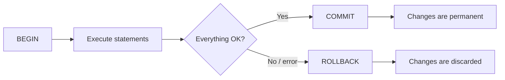
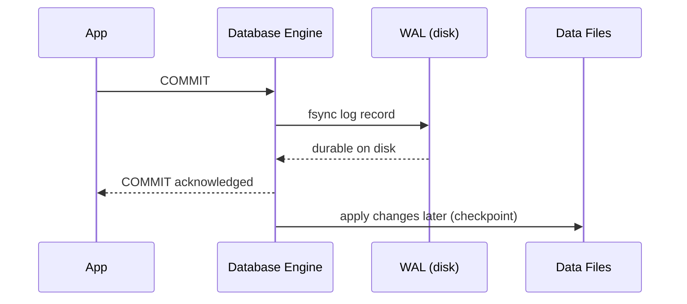
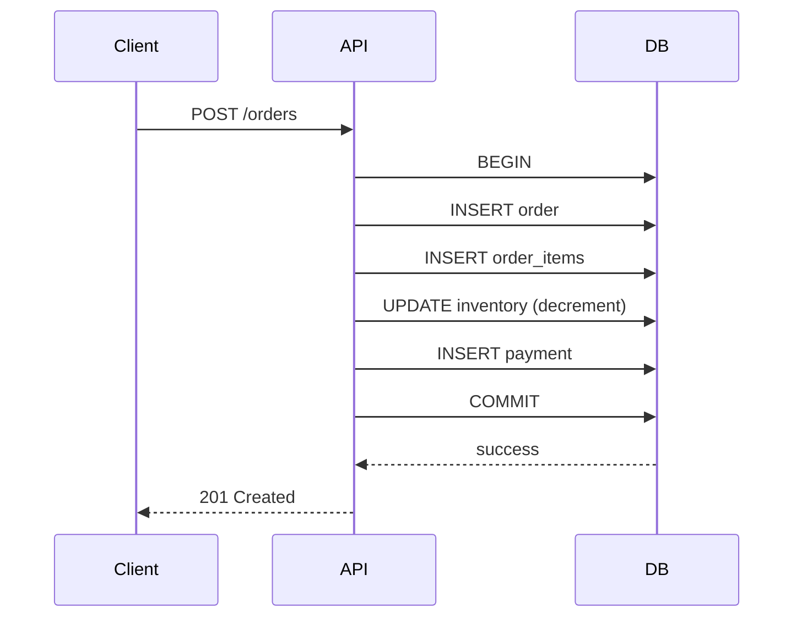
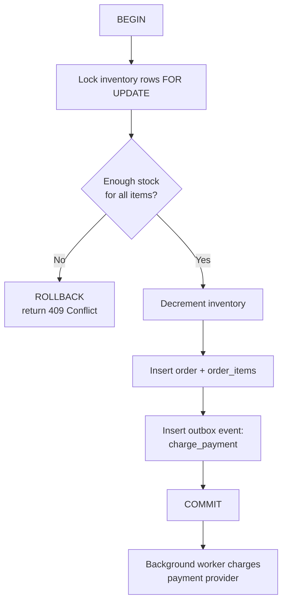

# Database Transactions

<p>
  
  
  
  
  
</p>
A practical, in-depth guide to how database transactions actually work — atomicity, isolation, locking, concurrency, deadlocks, and how to use transactions correctly in real backend systems.

This isn't a definitions glossary. It's written for developers who already know SQL and want to understand *why* transactions behave the way they do, and how to avoid the mistakes that quietly corrupt production data.

## Table of Contents

<details open>
<summary><strong>30 sections — click to collapse</strong></summary>

1. [Introduction](#1-introduction)
2. [What Is a Transaction?](#2-what-is-a-transaction)
3. [ACID Properties](#3-acid-properties)
4. [A Practical Example: Money Transfer](#4-a-practical-example-money-transfer)
5. [Transactions Without ACID](#5-transactions-without-acid)
6. [Transaction Isolation Levels](#6-transaction-isolation-levels)
7. [Transaction Anomalies](#7-transaction-anomalies)
8. [Concurrency and Transactions](#8-concurrency-and-transactions)
9. [Database Locks](#9-database-locks)
10. [Optimistic vs Pessimistic Concurrency](#10-optimistic-vs-pessimistic-concurrency)
11. [Transactions and Deadlocks](#11-transactions-and-deadlocks)
12. [Transactions and Database Constraints](#12-transactions-and-database-constraints)
13. [Transactions and Exceptions](#13-transactions-and-exceptions)
14. [Transactions in PostgreSQL](#14-transactions-in-postgresql)
15. [SAVEPOINT](#15-savepoint)
16. [Transactions in MySQL](#16-transactions-in-mysql)
17. [Transactions in ORMs](#17-transactions-in-orms)
18. [Transactions in REST APIs](#18-transactions-in-rest-apis)
19. [Transactions and External Services](#19-transactions-and-external-services)
20. [Long-Running Transactions](#20-long-running-transactions)
21. [Transaction Best Practices](#21-transaction-best-practices)
22. [Common Mistakes](#22-common-mistakes)
23. [Real-World Case Study: E-Commerce Orders](#23-real-world-case-study-e-commerce-orders)
24. [Transaction Design Patterns](#24-transaction-design-patterns)
25. [Performance Considerations](#25-performance-considerations)
26. [Security Considerations](#26-security-considerations)
27. [Debugging Transactions](#27-debugging-transactions)
28. [Transactions: Mental Model](#28-transactions-mental-model)
29. [Quick Reference](#29-quick-reference)
30. [Final Summary](#30-final-summary)

</details>

### Prerequisites

You should already be comfortable with:

- Basic SQL (`SELECT`, `INSERT`, `UPDATE`, `DELETE`)
- Primary/foreign keys and basic schema design
- The general idea that a "connection" to a database exists

You do **not** need prior knowledge of isolation levels, locking, or concurrency control — that's what this article covers.

Examples use **PostgreSQL** as the primary SQL dialect and **Node.js** for backend integration. Where MySQL/InnoDB behaves differently, it's called out explicitly. Nothing here assumes all databases behave identically — they don't, and pretending otherwise is how subtle production bugs get written.

<div align="right"><a href="#database-transactions">⬆️ Back to top</a></div>

---

## 1. Introduction

A **transaction** is a way of telling the database: "Treat this group of operations as a single unit. Either all of them happen, or none of them happen."

That sounds simple, but it exists to solve a very real problem: **most meaningful operations in a database aren't actually single operations** — they're several statements that only make sense together.

Consider transferring money between two bank accounts. Conceptually it's "one operation" — a transfer. In SQL, it's at least two statements:

```sql
UPDATE accounts SET balance = balance - 100 WHERE id = 'A';
UPDATE accounts SET balance = balance + 100 WHERE id = 'B';
```

If the first statement runs and the second one fails — because the process crashed, the network dropped, or the database rejected a constraint — you're left with $100 that vanished from account A and never arrived at account B. The database isn't "corrupted" in a technical sense; every row is individually valid. But the *system as a whole* is now lying about how much money exists.

This is the problem transactions solve: they let you define a boundary around a set of operations so that partial failure is impossible. Either every statement inside the boundary succeeds and is made permanent (`COMMIT`), or every statement is undone as if it never happened (`ROLLBACK`). There is no in-between state that a client can observe.

**A simple analogy:** think of a transaction like moving apartments in one trip instead of several. If you can only carry everything in one trip or nothing at all, you never end up with half your furniture at the old place and half at the new one. A transaction gives you that same all-or-nothing guarantee for database writes.

Here's the transfer done correctly:

```sql
BEGIN;

UPDATE accounts SET balance = balance - 100 WHERE id = 'A';
UPDATE accounts SET balance = balance + 100 WHERE id = 'B';

COMMIT;
```

If anything goes wrong between `BEGIN` and `COMMIT`, the database guarantees that neither `UPDATE` takes effect. That guarantee — atomicity — is only one of four properties transactions provide. The rest of this article works through all of them, plus the concurrency and locking machinery that makes transactions actually *safe* when multiple users hit the database at the same time, which is where most of the real complexity lives.

<div align="right"><a href="#database-transactions">⬆️ Back to top</a></div>

---

## 2. What Is a Transaction?

Mechanically, a transaction is a sequence bounded by three possible commands:



### BEGIN / START TRANSACTION

This opens a transaction block. In PostgreSQL you write `BEGIN;` (or `START TRANSACTION;` — they're synonyms). Every statement you run after this point is part of the transaction, but **nothing is visible to other connections yet**, and nothing is permanent.

```sql
BEGIN;

INSERT INTO orders (user_id, total) VALUES (42, 59.99);
UPDATE inventory SET quantity = quantity - 1 WHERE product_id = 7;
```

At this point, if you opened a second `psql` session and queried `orders`, you would not see the new row (under the default isolation level). The insert exists only inside this transaction's view of the world.

### COMMIT

`COMMIT;` tells the database: "I'm satisfied — make everything in this transaction permanent and visible to everyone else."

```sql
COMMIT;
```

Once this returns successfully, the changes have survived to disk (durability — more on that in Section 3) and other connections can now see them.

### ROLLBACK

`ROLLBACK;` tells the database: "Discard everything since `BEGIN`." It's as if the transaction never happened.

```sql
BEGIN;
UPDATE accounts SET balance = balance - 100 WHERE id = 'A';
-- something goes wrong here
ROLLBACK;
-- balance for 'A' is unchanged
```

### What happens when an error occurs

This is where PostgreSQL and MySQL diverge in an important, easy-to-miss way.

**In PostgreSQL**, once *any* statement inside a transaction errors (a constraint violation, a syntax error, a type error), the entire transaction is marked as **aborted**. Every subsequent statement — even a harmless `SELECT 1` — will be rejected with `current transaction is aborted, commands ignored until end of transaction block`, until you explicitly run `ROLLBACK`. PostgreSQL will not let you silently continue after an error inside a transaction; you either roll back the whole thing or roll back to a `SAVEPOINT` (Section 15).

```sql
BEGIN;
INSERT INTO users (email) VALUES ('duplicate@example.com'); -- fails: unique constraint
SELECT 1; -- ERROR: current transaction is aborted
ROLLBACK; -- required to recover the session
```

**In MySQL/InnoDB**, a statement error does *not* automatically abort the whole transaction. The failed statement's effects are rolled back, but earlier successful statements in the same transaction remain pending, and you can keep issuing statements or explicitly `COMMIT`/`ROLLBACK`. This is a meaningful behavioral difference — code that assumes "one error means the whole transaction is dead" is assuming PostgreSQL/Oracle-style behavior, and porting it to MySQL without adjustment can hide bugs.

> [!WARNING]
> **Common mistake:** Assuming that catching an exception in application code and continuing is safe inside a PostgreSQL transaction. If the failed query already put the transaction in the aborted state, every following query — including ones unrelated to the error — will fail until you roll back.

### Transaction boundaries

A "transaction boundary" is just the answer to: *which statements are inside this transaction, and which aren't?* Deciding this correctly is arguably the single most important design decision when writing transactional code. Too narrow, and you lose atomicity guarantees you actually needed. Too wide, and you hold locks and resources far longer than necessary (Section 20).

A useful rule of thumb: **a transaction boundary should match a business invariant, not a code structure.** "Debit and credit must happen together" is a business invariant — that's a transaction. "Log this event, which is nice to have but not required for correctness" is usually not part of the same invariant, and probably shouldn't share the same transaction.

<div align="right"><a href="#database-transactions">⬆️ Back to top</a></div>

---

## 3. ACID Properties

ACID is the contract a transactional database makes with you. It stands for **Atomicity, Consistency, Isolation, Durability**. Each one solves a distinct problem, and it's worth understanding them separately because in practice you'll trade some of them off against performance (particularly isolation).

### Atomicity

Atomicity means the operations inside a transaction behave as a single, indivisible unit — "atomic" in the original sense of "cannot be split." Either all statements' effects are applied, or none are.

```sql
BEGIN;
UPDATE inventory SET quantity = quantity - 1 WHERE product_id = 7;
UPDATE orders SET status = 'confirmed' WHERE id = 501; -- suppose this fails
ROLLBACK; -- the inventory decrement is undone too, even though it "succeeded"
```

The important nuance: atomicity is about the database's guarantee, not about your code's control flow. If your application crashes after the first `UPDATE` but before `COMMIT`, the database itself will roll the transaction back once it notices the connection is gone (or on recovery, via the mechanisms in Section 3's Durability discussion). You don't have to write cleanup code for that case — that's the entire point of atomicity.

**Partial failure** is the scenario atomicity exists to prevent: some writes landing, others not, from what was conceptually one operation. Without atomicity, every multi-statement operation is a potential source of silent data corruption.

### Consistency

This is the most misunderstood ACID letter, partly because "consistency" also means something different in the CAP theorem (a distributed-systems concept unrelated to this one).

In ACID, **consistency** means: a transaction takes the database from one valid state to another valid state, where "valid" is defined by your constraints — primary keys, foreign keys, unique constraints, `CHECK` constraints, and any triggers that enforce invariants. The database will not let a transaction commit if it would violate these rules.

```sql
CREATE TABLE accounts (
    id TEXT PRIMARY KEY,
    balance NUMERIC NOT NULL CHECK (balance >= 0)
);

BEGIN;
UPDATE accounts SET balance = balance - 100 WHERE id = 'A'; -- balance would go negative
COMMIT; -- ERROR: new row for relation "accounts" violates check constraint
```

Notice what's important here: consistency in the ACID sense is *enforced by the database*, not by your application. Atomicity guarantees the transaction is all-or-nothing; consistency guarantees that "all" is only allowed if it doesn't break your declared rules. This is also why Section 12 makes the case for real database constraints instead of relying purely on application-level checks — the database is the last line of defense, and it's the only one that's guaranteed to run inside the same atomic boundary as the write.

### Isolation

Isolation defines what one transaction is allowed to see from *other, concurrently running* transactions. This is the property with the most nuance, because full isolation (as if transactions ran one at a time, in sequence) is expensive, and every real database gives you a dial to trade correctness for throughput — that dial is the isolation level, covered fully in Section 6.

The core question isolation answers: if Transaction A is mid-flight and has written but not committed a change, can Transaction B see it?

```sql
-- Transaction A
BEGIN;
UPDATE accounts SET balance = 500 WHERE id = 'A';
-- not committed yet

-- Transaction B, running concurrently
BEGIN;
SELECT balance FROM accounts WHERE id = 'A';
-- Does this see 500, or the old value? Depends on isolation level.
```

Under every isolation level PostgreSQL and MySQL/InnoDB support by default, the answer is "the old value" — neither database allows dirty reads by default. But other anomalies (non-repeatable reads, phantom reads, lost updates) are permitted at weaker isolation levels, and understanding which is what Sections 6 and 7 are for.

### Durability

Durability means: once `COMMIT` returns successfully, the data survives — even if the database process crashes, the OS crashes, or the machine loses power one millisecond later.

This is achieved primarily through **write-ahead logging (WAL)**. Before the database modifies its actual data files, it first writes a record of the intended change to a append-only log on disk, and only considers the transaction committed once that log record is safely persisted (`fsync`'d, not just handed to the OS's page cache). If the machine crashes right after, the database replays the WAL on startup and reconstructs any committed changes that hadn't yet been written to the main data files.



The crucial, practical point: **durability depends on configuration**, not just on the database engine existing. Both PostgreSQL and MySQL let you relax durability for performance:

- PostgreSQL's `synchronous_commit = off` will return `COMMIT` to the client before the WAL flush is confirmed, trading a small window of potential data loss on crash for lower commit latency.
- MySQL's `innodb_flush_log_at_trx_commit` set to `0` or `2` (instead of the durable default `1`) similarly allows committed transactions to be lost in a crash.
- Many managed database offerings, ORMs, and connection poolers don't change this by default, but it's worth knowing it's tunable — "the database guarantees durability" is really "the database guarantees durability *given your durability-related settings*."

> [!TIP]
> **Best practice:** don't disable synchronous commit / relax flush settings for a system where losing the last few seconds of committed transactions on a crash is unacceptable (payments, inventory, anything with legal/financial consequences). It's a legitimate optimization for high-throughput, loss-tolerant workloads (analytics ingestion, telemetry), not a free performance win everywhere.

<div align="right"><a href="#database-transactions">⬆️ Back to top</a></div>

---

## 4. A Practical Example: Money Transfer

Let's build the canonical example properly, including all the ways it can go wrong.

Schema:

```sql
CREATE TABLE accounts (
    id TEXT PRIMARY KEY,
    balance NUMERIC(12, 2) NOT NULL CHECK (balance >= 0)
);
```

### The correct transaction

```sql
BEGIN;

-- Lock and check the source account's balance first
SELECT balance FROM accounts WHERE id = 'A' FOR UPDATE;
-- application checks: is balance >= 100?

UPDATE accounts SET balance = balance - 100 WHERE id = 'A';
UPDATE accounts SET balance = balance + 100 WHERE id = 'B';

COMMIT;
```

The `FOR UPDATE` (Section 9) locks account A's row for the duration of the transaction, so a concurrent transfer out of A can't read a stale balance and cause an overdraft. The `CHECK (balance >= 0)` constraint is a backstop: even if the application's balance check has a bug, the database itself refuses to let the balance go negative, and the whole transaction rolls back.

### What happens in each failure scenario

**Deduction succeeds, deposit fails (e.g., account B doesn't exist — foreign key or check violation):**
Nothing has actually been committed yet, because both statements are inside the same `BEGIN`/`COMMIT` block. The failing `UPDATE` puts the transaction in an error state (PostgreSQL); the application must `ROLLBACK`, which undoes the deduction from A as well. Result: no money is lost, no inconsistency exists.

**The application crashes midway (after the first `UPDATE`, before `COMMIT`):**
The database notices the connection has closed and automatically rolls back the open transaction. This isn't something your application code has to handle explicitly — it's a consequence of the transaction never having reached `COMMIT`. No partial write survives.

**The database connection drops:**
Same outcome as a crash — an uncommitted transaction tied to a dead connection is rolled back by the server. The dangerous case isn't the drop itself, it's the *application* misinterpreting a dropped connection as "unknown state" and blindly retrying without checking whether the original transaction actually committed first (see idempotency, Section 18). If the connection dropped strictly before you received a `COMMIT` acknowledgment, the transaction did not commit. If it dropped while you were *waiting* for the acknowledgment, you genuinely don't know — the commit may have succeeded on the server even though you never received confirmation. That ambiguity is exactly why idempotency matters for retries, not just for duplicate client requests.

**The balance is insufficient:**
This should be caught by application logic (checking the locked row's balance before issuing the debit) *and* backstopped by the `CHECK` constraint. If both layers are in place, an attempted overdraft either gets rejected early with a clean application error, or — if that logic has a bug — gets rejected by the database and the whole transfer rolls back. Either way, the account never goes negative.

### Why this is dangerous without a transaction

```sql
-- DANGEROUS: no transaction boundary
UPDATE accounts SET balance = balance - 100 WHERE id = 'A';
UPDATE accounts SET balance = balance + 100 WHERE id = 'B';
```

Each `UPDATE` here auto-commits independently (this is the default behavior of most database clients/drivers when no transaction is explicitly open). If the process dies, the network drops, or the second statement throws after the first one has already been sent and applied, account A permanently loses $100 that never reaches account B. There is no `ROLLBACK` available anymore — the first statement is already committed. This isn't a rare edge case; in a system processing thousands of transfers, this failure mode *will* eventually occur under real-world conditions (deploys mid-request, database failovers, connection pool timeouts).

<div align="right"><a href="#database-transactions">⬆️ Back to top</a></div>

---

## 5. Transactions Without ACID

To make the risk concrete, here's what independently-executed operations look like under specific real failure conditions.

**Scenario: order creation without a transaction**

```sql
INSERT INTO orders (user_id, total, status) VALUES (42, 59.99, 'pending');
UPDATE inventory SET quantity = quantity - 1 WHERE product_id = 7;
INSERT INTO payments (order_id, amount, status) VALUES (currval('orders_id_seq'), 59.99, 'charged');
```

| Failure | Resulting state |
|---|---|
| Server crash after statement 1 | Order exists as `pending`, forever, with no inventory reserved and no payment. Looks like an abandoned cart, but the customer may believe they ordered something. |
| Network failure after statement 2 | Order exists, inventory was decremented, but no payment record exists. You've sold an item you didn't get paid for, and nothing tells you this happened unless you go looking. |
| Application exception between statements 2 and 3 | Same as above — a silently unpaid, inventory-reserved order. |
| Database timeout on statement 3 | Identical outcome, but now compounded by the fact your payment provider may have *actually charged the customer* (Section 19) while your database has no record of it. |
| Two concurrent requests for the same product | Without any locking, both requests can read `quantity = 1`, both decrement it, and `quantity` ends up at `-1` or two customers are told they bought the last unit. |

None of these individual `INSERT`/`UPDATE` statements "fail" in a way that throws an obvious error — each one, in isolation, succeeds and commits. The corruption is at the level of the *business operation* they were supposed to jointly represent, which is exactly the level a transaction boundary protects.

> [!WARNING]
> **Common mistake:** treating "no error was thrown" as equivalent to "the operation succeeded correctly." Without a transaction, each statement's individual success tells you nothing about whether the overall multi-step operation is consistent.

<div align="right"><a href="#database-transactions">⬆️ Back to top</a></div>

---

## 6. Transaction Isolation Levels

Isolation levels exist because **full isolation is expensive**. The strongest possible guarantee — transactions behaving as if they ran one after another, never overlapping — requires the database to do significant extra work (locking or version-checking) to prevent transactions from stepping on each other. Weaker isolation levels let more concurrency through at the cost of allowing certain anomalies.

The SQL standard defines four levels:

| Isolation Level | Dirty Read | Non-Repeatable Read | Phantom Read | Typical Performance |
|---|---|---|---|---|
| Read Uncommitted | Possible (in theory) | Possible | Possible | Highest concurrency |
| Read Committed | Prevented | Possible | Possible | High concurrency (PostgreSQL & MySQL default*) |
| Repeatable Read | Prevented | Prevented | Possible (standard) / Prevented (PostgreSQL, MySQL) | Moderate |
| Serializable | Prevented | Prevented | Prevented | Lowest concurrency, full correctness |

*PostgreSQL's default is `READ COMMITTED`. MySQL/InnoDB's default is `REPEATABLE READ`. These are commonly confused — don't assume they match just because both are relational databases.

### Read Uncommitted

Would allow reading data that another transaction has written but not committed. In practice, **PostgreSQL does not actually implement Read Uncommitted** — if you request it, PostgreSQL silently treats it as Read Committed instead, because PostgreSQL's MVCC design (Section 14) never exposes uncommitted rows to other transactions regardless of the requested level. MySQL/InnoDB does implement a genuine Read Uncommitted level, where dirty reads are possible.

This level is rarely appropriate. It might be acceptable for a rough, non-critical approximate count/report where a small chance of reading soon-to-be-rolled-back data is tolerable, but it's a poor default for anything touching real business data.

### Read Committed

A query only ever sees data from transactions that had already committed *before that query started*. This is the default in both PostgreSQL and MySQL for a good reason — it prevents dirty reads (the most dangerous anomaly) while still allowing high concurrency.

The trade-off: within the same transaction, if you run the same query twice, you can get different results, because each individual statement takes a fresh snapshot of "what's committed right now." This is a **non-repeatable read**.

### Repeatable Read

Guarantees that all reads within a transaction see a consistent snapshot taken at the *start* of the transaction (not the start of each statement). Running the same query twice within the transaction returns the same rows, even if other transactions commit changes in the meantime.

PostgreSQL's implementation of Repeatable Read also prevents phantom reads as a side effect of its snapshot-based MVCC design, which is stronger than the SQL standard technically requires at this level. MySQL/InnoDB's Repeatable Read also prevents most phantom reads in practice (via "next-key locking" on locking reads), though the mechanism is different — gap locks rather than pure snapshots — and the guarantees are not byte-for-byte identical between the two engines.

The cost: if a transaction using Repeatable Read tries to write something that a *concurrent* transaction has already changed and committed, PostgreSQL will raise a serialization error rather than silently letting the write proceed against a stale view (this is the "first committer wins" behavior discussed in Section 7 under Lost Update).

### Serializable

The strongest level: transactions behave *as if* they executed one at a time, in some serial order, even though they physically ran concurrently. Both PostgreSQL and MySQL implement this without literally running everything sequentially — PostgreSQL uses **Serializable Snapshot Isolation (SSI)**, which detects, at commit time, whether the actual concurrent execution could have produced a result inconsistent with any serial ordering, and aborts one of the conflicting transactions if so.

This eliminates dirty reads, non-repeatable reads, phantom reads, and lost updates entirely — but it does so by increasing the rate of serialization failures under contention, which your application **must** be prepared to catch and retry. Serializable isn't "safer for free" — it converts correctness risk into a a retry-handling requirement.

> [!TIP]
> **Best practice:** default to `READ COMMITTED` for most application code. Reach for `REPEATABLE READ` when a transaction needs a consistent view across multiple reads (e.g., generating a report from several related queries). Reach for `SERIALIZABLE` only for the specific transactions where subtle concurrent-write anomalies are unacceptable and you've built retry logic around serialization failures — not as a blanket default, since it will measurably reduce throughput under contention.

Setting the level in PostgreSQL:

```sql
BEGIN ISOLATION LEVEL REPEATABLE READ;
-- ...
COMMIT;
```

<div align="right"><a href="#database-transactions">⬆️ Back to top</a></div>

---

## 7. Transaction Anomalies

These are the specific ways concurrent transactions can produce incorrect results. Isolation levels are defined *by which of these they prevent*.

### Dirty Read

Transaction A reads data that Transaction B has written but not yet committed.

```
Transaction A                     Transaction B
--------------                     --------------
                                    BEGIN;
                                    UPDATE accounts SET balance = 1000 WHERE id = 'A';
BEGIN;
SELECT balance FROM accounts
  WHERE id = 'A';  -- reads 1000
                                    ROLLBACK;  -- B's change never happened
-- A now has a value that never
-- actually existed in the database
```

**Problem:** Transaction A made a decision based on data that turned out to never be real. If A used that `1000` to authorize something, it authorized it against a phantom value.

**Prevented by:** Read Committed and above, in both PostgreSQL and MySQL by default. This is why dirty reads are rarely seen in practice on either engine — you'd have to explicitly request Read Uncommitted on MySQL, and PostgreSQL won't give it to you at all.

### Non-Repeatable Read

The same query, run twice within one transaction, returns different data because another transaction committed a change in between.

```
Transaction A                     Transaction B
--------------                     --------------
BEGIN;
SELECT balance FROM accounts
  WHERE id = 'A';  -- reads 500
                                    BEGIN;
                                    UPDATE accounts SET balance = 700
                                      WHERE id = 'A';
                                    COMMIT;
SELECT balance FROM accounts
  WHERE id = 'A';  -- reads 700 (different!)
COMMIT;
```

**Problem:** Any logic in Transaction A that assumed the balance was stable throughout the transaction is now working from inconsistent premises — it read 500 to make a decision, but by the time it acts on that decision, the real value is 700.

**Prevented by:** Repeatable Read and above.

### Phantom Read

A repeated *range* query returns a different set of rows because another transaction inserted or deleted rows matching the query's condition.

```
Transaction A                          Transaction B
--------------                          --------------
BEGIN;
SELECT COUNT(*) FROM orders
  WHERE status = 'pending';  -- returns 5
                                         BEGIN;
                                         INSERT INTO orders (status) VALUES ('pending');
                                         COMMIT;
SELECT COUNT(*) FROM orders
  WHERE status = 'pending';  -- returns 6 (phantom row appeared)
COMMIT;
```

**Problem:** distinct from a non-repeatable read because no *existing* row changed — an entirely new row appeared that matches a condition the first transaction was relying on being stable.

**Prevented by:** Serializable per the SQL standard. In practice, PostgreSQL's Repeatable Read also prevents this (via snapshot isolation), and MySQL/InnoDB's Repeatable Read prevents most phantom cases for locking reads (via gap locks on the index ranges scanned) — but a plain, non-locking `SELECT` inside MySQL Repeatable Read can still be more subtle depending on the query, so don't treat "Repeatable Read" as an unconditional guarantee across engines without checking your specific database's documentation for the exact behavior.

### Lost Update

Two transactions read the same row, then both write back a modified version — and one write silently overwrites the other's, losing the first update entirely.

```
Transaction A                          Transaction B
--------------                          --------------
BEGIN;                                  BEGIN;
SELECT quantity FROM inventory
  WHERE product_id = 7;  -- reads 10
                                         SELECT quantity FROM inventory
                                           WHERE product_id = 7;  -- also reads 10
UPDATE inventory SET quantity = 9
  WHERE product_id = 7;  -- 10 - 1
COMMIT;
                                         UPDATE inventory SET quantity = 9
                                           WHERE product_id = 7;  -- ALSO 10 - 1
                                         COMMIT;
-- Two units were sold, but quantity
-- only ever went from 10 to 9 once.
-- One decrement was lost.
```

**Problem:** each transaction computed its new value from a stale read, unaware the other transaction was doing the same thing concurrently. The final state reflects only one of the two updates, even though both "succeeded."

**Prevented by:** Repeatable Read or Serializable will cause one of the two transactions to fail with a serialization error at commit time (rather than silently losing data) in PostgreSQL. The more common and more efficient real-world fix, though, isn't raising the isolation level — it's rewriting the update to be relative rather than read-then-write:

```sql
UPDATE inventory SET quantity = quantity - 1 WHERE product_id = 7 AND quantity >= 1;
```

This performs the read and write atomically as a single statement, so there's no window between "read the value" and "write the new value" for another transaction to interleave in. This single change eliminates the lost-update anomaly for this specific pattern without needing a stronger (and slower) isolation level at all. Locking reads (`SELECT ... FOR UPDATE`, Section 9) are the other standard fix when the update logic is too complex to express as a single atomic statement.

<div align="right"><a href="#database-transactions">⬆️ Back to top</a></div>

---

## 8. Concurrency and Transactions

Everything above matters because production databases are never handling one transaction at a time — they're handling hundreds or thousands concurrently, and the database's job is to make that safe without serializing everything into a single-file queue (which would be correct but unusably slow).

**Concurrent reads** are essentially free — multiple transactions reading the same row at the same time don't conflict with each other under MVCC-based engines like PostgreSQL and InnoDB, because readers don't block readers, and (critically) readers don't block writers either under the default isolation levels. This is one of the main reasons Read Committed is a reasonable default: readers see a consistent-enough snapshot without needing to acquire locks that would stall writers.

**Concurrent writes** are where the actual complexity lives. Two transactions writing to *different* rows never conflict. Two transactions writing to the *same* row need coordination — either one waits for the other (locking), or both proceed optimistically and one is told to retry if there was a conflict (optimistic concurrency, Section 10).

**Race conditions** in a database context almost always reduce to one of the anomalies in Section 7 — most commonly lost updates on counters, balances, and inventory levels, since those are the fields every concurrent request tends to touch.

A realistic backend example — an API endpoint that increments a "view count":

```javascript
// BAD: read-modify-write race condition
const { rows } = await client.query('SELECT views FROM posts WHERE id = $1', [postId]);
const newViews = rows[0].views + 1;
await client.query('UPDATE posts SET views = $1 WHERE id = $2', [newViews, postId]);
```

Under concurrent requests, this loses increments constantly — exactly the lost-update pattern from Section 7. The fix is the same one from that section: push the arithmetic into the database as a single atomic statement.

```javascript
// GOOD: atomic increment, no race window
await client.query('UPDATE posts SET views = views + 1 WHERE id = $1', [postId]);
```

**Serialization**, in the concurrency-control sense, refers to whichever mechanism the database uses to make concurrent execution behave *as if* it were sequential where it matters — locks that force one transaction to wait for another, or abort-and-retry when a true conflict is detected under Serializable isolation. It's not about turning everything into a literal queue; it's about guaranteeing the *outcome* is one that some valid sequential ordering could have produced.

<div align="right"><a href="#database-transactions">⬆️ Back to top</a></div>

---

## 9. Database Locks

Locks are the mechanism that makes concurrent access safe when transactions touch the same data. A lock is, at its core, a claim: "I'm using this, wait your turn" (exclusive) or "I'm looking at this, others can look too, but no one can change it right now" (shared).

### Shared locks

A **shared lock** (`S`) allows multiple transactions to hold it on the same row/table simultaneously — it's for reading. Any number of transactions can hold a shared lock on the same resource at once, but a shared lock blocks anyone from acquiring an exclusive lock on that resource until all shared locks are released.

### Exclusive locks

An **exclusive lock** (`X`) is held by exactly one transaction at a time and blocks both other exclusive locks and shared locks from being acquired on the same resource. Writes require exclusive locks.

### Row-level locks

A lock scoped to a single row. This is what you get from `SELECT ... FOR UPDATE` or from a plain `UPDATE`/`DELETE` statement (which implicitly takes an exclusive lock on the rows it touches). Row-level locking is what allows two transactions to update *different* rows of the same table with zero contention.

### Table-level locks

A lock scoped to an entire table. These are much coarser and block far more concurrent activity — used for schema changes (`ALTER TABLE`), certain bulk operations, or explicit `LOCK TABLE` statements. You generally want to avoid table-level locks in normal application transaction logic; they're a common cause of unexpected, wide-blast-radius contention.

### Pessimistic locking

**Pessimistic locking** assumes conflicts are likely, so it acquires a lock *before* doing any work, blocking other transactions from touching the same row until the lock is released.

```sql
BEGIN;
SELECT quantity FROM inventory WHERE product_id = 7 FOR UPDATE;
-- other transactions trying to SELECT ... FOR UPDATE the same row now wait here
UPDATE inventory SET quantity = quantity - 1 WHERE product_id = 7;
COMMIT; -- lock released
```

`FOR UPDATE` is the standard way to take a pessimistic, exclusive row lock as part of a `SELECT`. Any other transaction attempting `SELECT ... FOR UPDATE` (or an `UPDATE`/`DELETE`) on that same row will block until the first transaction commits or rolls back.

### Optimistic locking

**Optimistic locking** assumes conflicts are rare, so it does the work without taking a lock up front, and instead checks — at write time — whether the data changed since it was read. Covered in full in Section 10.

### Realistic example: last item in stock

Two customers try to buy the same product, and only one is left in stock.

```sql
-- Customer A's transaction
BEGIN;
SELECT quantity FROM inventory WHERE product_id = 7 FOR UPDATE;
-- quantity = 1, proceed

-- Customer B's transaction (started slightly later, same product)
BEGIN;
SELECT quantity FROM inventory WHERE product_id = 7 FOR UPDATE;
-- BLOCKS here, waiting for Customer A's transaction to finish
```

```sql
-- Customer A continues
UPDATE inventory SET quantity = quantity - 1 WHERE product_id = 7;
COMMIT; -- releases the lock

-- Customer B's blocked SELECT now proceeds
-- quantity = 0, application correctly tells Customer B "out of stock"
```

Without `FOR UPDATE`, both customers' transactions could read `quantity = 1` before either commits, both would proceed to purchase, and you'd oversell by one unit — a lost-update variant specific to inventory systems, and one of the most common real production bugs in e-commerce backends.

> [!WARNING]
> **Common mistake:** checking stock with a plain `SELECT` and then issuing a separate `UPDATE`, with no lock and no atomic guard condition. Always either lock the row you're about to modify, or fold the check into the `UPDATE`'s `WHERE` clause (`WHERE quantity >= 1`), and check the number of affected rows to know whether it actually succeeded.

<div align="right"><a href="#database-transactions">⬆️ Back to top</a></div>

---

## 10. Optimistic vs Pessimistic Concurrency

| | Optimistic | Pessimistic |
|---|---|---|
| **Assumption** | Conflicts are rare | Conflicts are likely |
| **Mechanism** | Version/timestamp check at write time | Lock acquired before work begins |
| **Blocking** | Never blocks other transactions | Blocks conflicting transactions |
| **Failure mode** | Write rejected, caller must retry | Caller waits (or times out) |
| **Throughput under low contention** | High | Slightly lower (lock overhead) |
| **Throughput under high contention** | Poor (many wasted retries) | Better (orderly waiting, no wasted work) |
| **Typical use case** | Web forms, rarely-contested rows, long user "think time" between read and write | Inventory, financial balances, anything with frequent concurrent writes to the same row |

### How optimistic locking works

Add a version column to the table:

```sql
ALTER TABLE products ADD COLUMN version INTEGER NOT NULL DEFAULT 0;
```

Read the row *along with* its version, do your work outside the database (e.g., a user editing a form for a few minutes), then write back conditionally:

```sql
-- Read
SELECT id, name, price, version FROM products WHERE id = 42;
-- returns version = 3

-- Later, write back conditionally on that version
UPDATE products
SET name = 'New Name', price = 19.99, version = version + 1
WHERE id = 42 AND version = 3;
```

Check the number of affected rows in the application:

```javascript
const result = await client.query(
  'UPDATE products SET name = $1, price = $2, version = version + 1 WHERE id = $3 AND version = $4',
  [newName, newPrice, productId, expectedVersion]
);

if (result.rowCount === 0) {
  // Someone else updated this row since we read it.
  // Surface a conflict to the caller — don't silently overwrite.
  throw new ConflictError('This product was modified by someone else. Please reload and retry.');
}
```

If `rowCount` is `0`, the `version` didn't match — someone else committed a change between your read and your write. The application must decide what to do: reject the change and ask the user to retry, merge changes, or re-apply the intended change on top of the new state. This is the fundamental trade-off of optimistic concurrency — it never blocks anyone, but conflicts surface as failures the caller has to handle rather than as waiting.

### Why not just always lock?

Pessimistic locking is the safer default *when conflicts are actually likely* — inventory decrements under a flash sale, balance updates on a popular shared account. But if you take a `FOR UPDATE` lock and then do something slow inside that transaction (call an external API, wait on user input, run a slow report query), every other transaction wanting that row queues up behind you for however long that slow thing takes. Optimistic locking avoids this by never holding a lock across "slow" work — it only ever does a fast, final conditional write.

> [!TIP]
> **Best practice:** use pessimistic locking for short, hot-path writes where contention is expected (inventory, ledger balances). Use optimistic locking wherever there's a gap between "user reads data" and "user submits a change" (edit forms, anything involving human think-time or a round trip to a client).

<div align="right"><a href="#database-transactions">⬆️ Back to top</a></div>

---

## 11. Transactions and Deadlocks

A **deadlock** occurs when two (or more) transactions each hold a lock the other one needs, and neither can proceed.

```
Transaction A                          Transaction B
--------------                          --------------
BEGIN;                                  BEGIN;
UPDATE accounts SET balance = balance - 10
  WHERE id = 'A';  -- locks row A
                                         UPDATE accounts SET balance = balance - 10
                                           WHERE id = 'B';  -- locks row B
UPDATE accounts SET balance = balance + 10
  WHERE id = 'B';  -- waits for B's lock on row B
                                         UPDATE accounts SET balance = balance + 10
                                           WHERE id = 'A';  -- waits for A's lock on row A

-- A is waiting on B, B is waiting on A. Neither can proceed.
```

Both databases run a **deadlock detector** in the background. PostgreSQL and MySQL/InnoDB will both notice this cycle and forcibly abort one of the two transactions (raising an error like `deadlock detected` in PostgreSQL, or `Deadlock found when trying to get lock` in MySQL), letting the other proceed. This isn't optional behavior you can disable — the database *will* pick a victim rather than let both transactions hang forever.

### What applications should do

The application must catch the deadlock error and retry the aborted transaction from the beginning — not resume mid-transaction, since its work was rolled back entirely.

```javascript
async function transferWithRetry(client, fromId, toId, amount, maxRetries = 3) {
  for (let attempt = 0; attempt < maxRetries; attempt++) {
    try {
      await client.query('BEGIN');
      await client.query(
        'UPDATE accounts SET balance = balance - $1 WHERE id = $2',
        [amount, fromId]
      );
      await client.query(
        'UPDATE accounts SET balance = balance + $1 WHERE id = $2',
        [amount, toId]
      );
      await client.query('COMMIT');
      return;
    } catch (err) {
      await client.query('ROLLBACK');
      if (err.code === '40P01' /* deadlock_detected in Postgres */ && attempt < maxRetries - 1) {
        continue; // retry from the top
      }
      throw err;
    }
  }
}
```

### Preventing deadlocks

- **Consistent lock ordering** — if every transaction that needs to touch both account A and account B always locks the lower ID first, the circular-wait pattern above becomes structurally impossible. This is the single most effective deadlock prevention technique.
- **Short transactions** — the smaller the window a lock is held for, the smaller the chance another transaction shows up wanting the same resource in the meantime.
- **Proper indexes** — an `UPDATE ... WHERE` clause without a supporting index forces a scan that can lock far more rows (or ranges) than intended, dramatically increasing the surface area for lock conflicts.
- **Avoiding unnecessary locks** — don't take `FOR UPDATE` locks on rows you're not actually going to modify.
- **Retry logic** — deadlocks are a normal, expected occurrence in any system with meaningful write concurrency, not a bug to eliminate entirely. Treat them like a transient error class with a retry policy, the same way you'd treat a network timeout.

<div align="right"><a href="#database-transactions">⬆️ Back to top</a></div>

---

## 12. Transactions and Database Constraints

Constraints are what give the "C" in ACID (Section 3) teeth. A transaction can only commit if every constraint on every row it touched still holds.

- **`PRIMARY KEY`** — guarantees uniqueness and non-null for the identifying column(s). Prevents a transaction from committing a duplicate ID even under concurrent inserts.
- **`FOREIGN KEY`** — guarantees a referenced row actually exists. Prevents an `order_items` row from pointing at an `order_id` that doesn't exist, even if application code has a bug that skips the check.
- **`UNIQUE`** — guarantees no two rows share a value in the given column(s) — e.g., preventing two users from registering with the same email, even if two signup requests race each other.
- **`NOT NULL`** — guarantees a required field is always populated.
- **`CHECK`** — guarantees an arbitrary boolean condition, like `balance >= 0` or `quantity >= 0`.

### Why constraints matter even with application-level validation

Application validation runs in your code, on one instance, at one point in time. It cannot see what a *concurrent* request on a different instance is doing at the same moment. Two signup requests for the same email, hitting two different application server instances at the same millisecond, can both pass an application-level "check if email exists" query before either has committed its `INSERT`. Without a `UNIQUE` constraint, you get two accounts with the same email. With one, the second `INSERT` fails at the database level — the only place with a consistent, atomic view of "does this already exist" at commit time.

```sql
CREATE TABLE users (
    id SERIAL PRIMARY KEY,
    email TEXT NOT NULL UNIQUE
);
```

```javascript
try {
  await client.query('INSERT INTO users (email) VALUES ($1)', [email]);
} catch (err) {
  if (err.code === '23505' /* unique_violation */) {
    throw new ConflictError('Email already registered');
  }
  throw err;
}
```

> [!TIP]
> **Best practice:** treat database constraints as the source of truth for data integrity, and application-level validation as a way to give users fast, friendly error messages *before* hitting the database. Never treat application validation as sufficient on its own for anything where two requests could race.

<div align="right"><a href="#database-transactions">⬆️ Back to top</a></div>

---

## 13. Transactions and Exceptions

Production transaction code needs to handle three things every time: the happy path, the error path (rollback), and cleanup (releasing the connection back to the pool) — regardless of which path was taken.

```javascript
const { Pool } = require('pg');
const pool = new Pool();

async function createOrder(userId, items) {
  const client = await pool.connect();
  try {
    await client.query('BEGIN');

    const orderResult = await client.query(
      'INSERT INTO orders (user_id, status) VALUES ($1, $2) RETURNING id',
      [userId, 'pending']
    );
    const orderId = orderResult.rows[0].id;

    for (const item of items) {
      const inventoryResult = await client.query(
        'UPDATE inventory SET quantity = quantity - $1 WHERE product_id = $2 AND quantity >= $1',
        [item.quantity, item.productId]
      );

      if (inventoryResult.rowCount === 0) {
        throw new InsufficientStockError(item.productId);
      }

      await client.query(
        'INSERT INTO order_items (order_id, product_id, quantity) VALUES ($1, $2, $3)',
        [orderId, item.productId, item.quantity]
      );
    }

    await client.query('COMMIT');
    return orderId;

  } catch (error) {
    await client.query('ROLLBACK');
    throw error; // let the caller decide how to respond (e.g., HTTP 409 for stock errors)

  } finally {
    client.release(); // ALWAYS return the connection to the pool
  }
}
```

Three things worth calling out:

1. **`ROLLBACK` happens in the `catch` block, not in `finally`.** If the transaction committed successfully, there's nothing to roll back, and issuing `ROLLBACK` after a successful `COMMIT` is a harmless no-op — but the logic should be structured so rollback is explicitly tied to the failure path, keeping intent clear.
2. **`client.release()` happens in `finally`, unconditionally.** Forgetting this is one of the most common causes of connection pool exhaustion in production Node.js services — every request that throws before reaching a `release()` call leaks a connection.
3. **The check-and-update for inventory is a single atomic statement** (`WHERE quantity >= $1`), not a separate `SELECT` followed by an `UPDATE` — per the lost-update fix in Section 7.

> [!WARNING]
> **Common mistake:** calling `client.release()` inside the `try` block right after `COMMIT`, and not also having it in a `finally`. Any exception between `BEGIN` and that release call then leaks the connection permanently.

<div align="right"><a href="#database-transactions">⬆️ Back to top</a></div>

---

## 14. Transactions in PostgreSQL

PostgreSQL's transaction behavior is built on **MVCC (Multi-Version Concurrency Control)**. Instead of readers blocking writers or writers blocking readers, every row can have multiple physical versions simultaneously. When a transaction reads a row, it sees the version that was current as of its snapshot (taken at transaction start for Repeatable Read/Serializable, or at each statement start for Read Committed) — not necessarily the very latest version, and not blocked by a concurrent writer's in-progress change to that row.

```mermaid
flowchart TD
    subgraph Row versions for id=42
        V1["Version 1: balance=100 (created by Tx 10, deleted by Tx 15)"]
        V2["Version 2: balance=80 (created by Tx 15, still current)"]
    end
    R1["Transaction 12 (snapshot before Tx 15 committed)"] -->|sees| V1
    R2["Transaction 20 (snapshot after Tx 15 committed)"] -->|sees| V2
```

Old row versions aren't deleted immediately when superseded — they're marked as obsolete and cleaned up later by **`VACUUM`**, PostgreSQL's background process for reclaiming space. This is why long-running transactions are especially costly in PostgreSQL specifically (Section 20): a transaction that's still "in flight" prevents `VACUUM` from cleaning up any row version that might still be needed by that old snapshot, causing table bloat across the entire database, not just the tables that old transaction touches.

Key PostgreSQL transaction commands:

```sql
BEGIN;                          -- or START TRANSACTION
SAVEPOINT my_savepoint;         -- see Section 15
ROLLBACK TO SAVEPOINT my_savepoint;
COMMIT;
ROLLBACK;
```

**Row-level locking** in PostgreSQL is explicit via `FOR UPDATE`, `FOR NO KEY UPDATE`, `FOR SHARE`, and `FOR KEY SHARE` — four flavors with progressively narrower locking semantics, useful for fine-tuning exactly what kind of concurrent access you want to block (full detail is in the PostgreSQL documentation on row locking; `FOR UPDATE` is the one you'll reach for the vast majority of the time).

**Isolation levels** are set per-transaction with `BEGIN ISOLATION LEVEL ...` as shown in Section 6, defaulting to `READ COMMITTED`.

**WAL** (Section 3, Durability) underlies both crash recovery and PostgreSQL's replication mechanism — physical/streaming replication is, at its core, shipping the WAL to replicas and replaying it there.

This isn't universal database behavior — Oracle's MVCC implementation, MySQL/InnoDB's, and PostgreSQL's all differ in meaningful details (what exactly gets versioned, how undo/rollback data is stored, default isolation levels). Don't assume behavior verified on PostgreSQL transfers unchanged to another engine.

<div align="right"><a href="#database-transactions">⬆️ Back to top</a></div>

---

## 15. SAVEPOINT

A `SAVEPOINT` lets you roll back part of a transaction without discarding the whole thing — effectively a checkpoint you can return to.

```sql
BEGIN;

INSERT INTO orders (user_id, status) VALUES (42, 'pending');

SAVEPOINT before_discount;

UPDATE orders SET total = total * 0.9 WHERE user_id = 42; -- apply a discount
-- suppose we discover the discount code was invalid

ROLLBACK TO SAVEPOINT before_discount;
-- the discount UPDATE is undone, but the INSERT above it is NOT undone

UPDATE orders SET status = 'confirmed' WHERE user_id = 42;

COMMIT;
```

Crucially, `ROLLBACK TO SAVEPOINT` does not end the transaction — it rewinds to that point, and you can continue issuing new statements, eventually reaching a normal `COMMIT` or `ROLLBACK` for the transaction as a whole.

This is also the standard way to recover from a single failed statement inside a PostgreSQL transaction without discarding everything that came before it (recall from Section 2 that PostgreSQL aborts the *entire* transaction on any error unless you've established a savepoint to fall back to):

```sql
BEGIN;
INSERT INTO users (email) VALUES ('a@example.com');

SAVEPOINT before_risky_insert;
INSERT INTO users (email) VALUES ('a@example.com'); -- fails: duplicate
ROLLBACK TO SAVEPOINT before_risky_insert; -- recovers; transaction is usable again

INSERT INTO users (email) VALUES ('b@example.com'); -- this still works
COMMIT;
```

### When not to abuse it

Savepoints have real overhead, and deeply nested savepoint logic ("nested-like transactions" simulated via many layered savepoints) tends to produce hard-to-follow control flow and can itself become a performance and maintainability liability. Most ORMs' "nested transaction" support is implemented via savepoints under the hood — which is useful to know, but not a reason to hand-roll elaborate savepoint trees in application code when a simpler transaction boundary would do. Reserve savepoints for genuinely optional sub-steps within a larger transaction (an optional enrichment step that's fine to skip, a batch item within a larger batch where you want to skip just the failing item) rather than as a general substitute for proper transaction design.

<div align="right"><a href="#database-transactions">⬆️ Back to top</a></div>

---

## 16. Transactions in MySQL

MySQL's transactional behavior lives specifically in the **InnoDB** storage engine (MySQL's default engine since 5.5, but historically MySQL also shipped MyISAM, which does not support transactions at all — worth checking if you're touching an older schema).

```sql
START TRANSACTION; -- MySQL's canonical form; BEGIN also works
UPDATE accounts SET balance = balance - 100 WHERE id = 'A';
UPDATE accounts SET balance = balance + 100 WHERE id = 'B';
COMMIT;
```

InnoDB also uses an MVCC design conceptually similar to PostgreSQL's, but with different mechanics: InnoDB keeps old row versions in an **undo log**, rather than as additional row versions in the main table storage, and its `REPEATABLE READ` default (versus PostgreSQL's `READ COMMITTED` default) means InnoDB transactions see a consistent snapshot from their first read for the entire transaction, unless you explicitly choose a different level.

```sql
SET TRANSACTION ISOLATION LEVEL READ COMMITTED;
START TRANSACTION;
-- ...
COMMIT;
```

**Row locks** in InnoDB use `SELECT ... FOR UPDATE` the same way PostgreSQL does, plus `SELECT ... LOCK IN SHARE MODE` (older syntax) / `SELECT ... FOR SHARE` (newer, standard-aligned syntax) for shared locks.

**Important differences from PostgreSQL to be aware of:**

- Default isolation level: `REPEATABLE READ` (MySQL/InnoDB) vs `READ COMMITTED` (PostgreSQL).
- Error handling inside a transaction: a failed statement doesn't automatically abort the whole transaction in InnoDB, unlike PostgreSQL (Section 2).
- Phantom-read prevention under Repeatable Read is achieved via **gap locks** and **next-key locks** on index ranges in InnoDB, versus pure MVCC snapshotting in PostgreSQL — this affects which rows get locked (and can therefore block other transactions) even for ranges that don't yet contain matching rows.
- `SELECT` statements without a locking clause never block in either engine, but the exact snapshot semantics under concurrent writes differ enough between the two that code relying on precise repeatable-read guarantees should be tested against the actual engine in use, not assumed portable.

<div align="right"><a href="#database-transactions">⬆️ Back to top</a></div>

---

## 17. Transactions in ORMs

ORMs generally offer two transaction styles: an explicit block you manage yourself, and a callback/batch style where the ORM manages `COMMIT`/`ROLLBACK` for you based on whether your callback throws.

### Prisma (interactive transactions)

```javascript
await prisma.$transaction(async (tx) => {
  const order = await tx.order.create({
    data: { userId: 42, status: 'pending' },
  });

  const updated = await tx.inventory.updateMany({
    where: { productId: 7, quantity: { gte: 1 } },
    data: { quantity: { decrement: 1 } },
  });

  if (updated.count === 0) {
    throw new Error('Out of stock'); // throwing here triggers an automatic rollback
  }

  return order;
});
```

If the callback throws, Prisma rolls back automatically. If it returns normally, Prisma commits. This is the "interactive" style — you get a `tx` client scoped to the transaction and can run arbitrary conditional logic inside it.

### Sequelize (managed vs unmanaged)

```javascript
// Managed transaction — Sequelize commits/rolls back based on the callback
await sequelize.transaction(async (t) => {
  await Order.create({ userId: 42, status: 'pending' }, { transaction: t });
  await Inventory.decrement('quantity', {
    by: 1,
    where: { productId: 7 },
    transaction: t,
  });
});
```

```javascript
// Unmanaged transaction — you call commit/rollback explicitly
const t = await sequelize.transaction();
try {
  await Order.create({ userId: 42, status: 'pending' }, { transaction: t });
  await t.commit();
} catch (err) {
  await t.rollback();
  throw err;
}
```

### TypeORM (query runner)

```javascript
const queryRunner = dataSource.createQueryRunner();
await queryRunner.connect();
await queryRunner.startTransaction();

try {
  await queryRunner.manager.save(order);
  await queryRunner.manager.decrement(Inventory, { productId: 7 }, 'quantity', 1);
  await queryRunner.commitTransaction();
} catch (err) {
  await queryRunner.rollbackTransaction();
  throw err;
} finally {
  await queryRunner.release();
}
```

### Batch/callback-style (simpler, but limited)

Some ORMs also offer a "batch" mode where you pass an array of independent operations and the ORM wraps them all in one transaction without letting you branch on intermediate results:

```javascript
await prisma.$transaction([
  prisma.order.create({ data: { userId: 42, status: 'pending' } }),
  prisma.inventory.update({ where: { productId: 7 }, data: { quantity: { decrement: 1 } } }),
]);
```

This is convenient but less flexible than the interactive style — you can't inspect the result of the first operation to decide whether to run the second (e.g., you can't easily bail out if stock turns out to be insufficient, since there's no `updateMany`-with-`count`-check equivalent here without falling back to a raw query or the interactive form).

### Why you still need to understand transactions with an ORM

An ORM doesn't change the underlying isolation level, locking behavior, or the possibility of deadlocks and lost updates — it just gives you a nicer API surface for `BEGIN`/`COMMIT`/`ROLLBACK`. A developer who doesn't understand isolation levels will still write a lost-update bug through an ORM; the ORM will happily execute a `SELECT` followed by a separate `UPDATE` exactly as instructed, race condition and all. The ORM manages the *boundary*, not the *concurrency semantics* inside it.

> [!WARNING]
> **Common mistake:** assuming `sequelize.transaction()` or `prisma.$transaction()` automatically makes concurrent-safe code out of code that wasn't concurrent-safe to begin with. It guarantees atomicity of the statements you put inside it — it does not retroactively fix a read-then-write race condition within that same block.

<div align="right"><a href="#database-transactions">⬆️ Back to top</a></div>

---

## 18. Transactions in REST APIs

Consider a typical order-creation endpoint:

```
POST /orders
```

with several operations that need to happen together:

1. Create the order record
2. Create order line items
3. Decrease inventory for each item
4. Create a payment record
5. Commit



These need to be atomic because a partial completion — order created but inventory not decremented, or inventory decremented but no payment recorded — is exactly the inconsistent-state scenario from Section 5. Wrapping steps 1–4 in a single transaction is what makes "the order was created" and "the inventory reflects that order" a single indivisible fact rather than two facts that can drift apart.

### HTTP failures, retries, and duplicate requests

HTTP is not reliable in the way a database transaction is. A client can send `POST /orders`, the server can fully process it and commit the transaction, and the response can still be lost on the way back (a proxy timeout, a mobile connection dropping). From the client's perspective, this is indistinguishable from the request never having been received at all — so a naively-implemented client will retry, and now you risk creating **two** orders for one purchase.

This is not a transaction problem — the transaction did its job perfectly, committing exactly once. It's a problem of **the client not knowing whether the transaction happened**, and that's solved one layer up, at the API design level, using idempotency.

### Idempotency

The standard pattern is an **idempotency key**: the client generates a unique key for a given logical operation (e.g., a UUID generated once per checkout attempt) and sends it with the request. The server records which idempotency keys have already been processed, and if it sees a repeat, it returns the *original* result instead of executing the operation again.

```sql
CREATE TABLE idempotency_keys (
    key TEXT PRIMARY KEY,
    response_status INTEGER,
    response_body JSONB,
    created_at TIMESTAMPTZ NOT NULL DEFAULT now()
);
```

```javascript
app.post('/orders', async (req, res) => {
  const idempotencyKey = req.headers['idempotency-key'];
  const client = await pool.connect();

  try {
    await client.query('BEGIN');

    const existing = await client.query(
      'SELECT response_status, response_body FROM idempotency_keys WHERE key = $1',
      [idempotencyKey]
    );

    if (existing.rows.length > 0) {
      await client.query('COMMIT');
      const { response_status, response_body } = existing.rows[0];
      return res.status(response_status).json(response_body);
    }

    const order = await createOrderWithinTransaction(client, req.body); // as in Section 13

    await client.query(
      'INSERT INTO idempotency_keys (key, response_status, response_body) VALUES ($1, $2, $3)',
      [idempotencyKey, 201, order]
    );

    await client.query('COMMIT');
    res.status(201).json(order);

  } catch (err) {
    await client.query('ROLLBACK');
    res.status(500).json({ error: 'Failed to create order' });
  } finally {
    client.release();
  }
});
```

Recording the idempotency key **inside the same transaction** as the order creation is what makes this safe — if the transaction rolls back for any reason, the key isn't recorded either, so a genuine retry after a genuine failure is correctly allowed to try again. If they were recorded in separate transactions, you could end up recording "this key was processed" without the order actually existing, or vice versa — the exact partial-failure problem transactions exist to prevent, just one level up the stack.

> [!TIP]
> **Best practice:** any endpoint that causes a side effect (creates a resource, charges money, decrements stock) and might reasonably be retried by a client or a load balancer should support idempotency keys. `GET` requests don't need this — they're naturally idempotent by not changing anything.

<div align="right"><a href="#database-transactions">⬆️ Back to top</a></div>

---

## 19. Transactions and External Services

Here's a limitation that trips up a lot of backend developers: **a database transaction can only roll back changes inside that database.** It has no way to "undo" a call to an external service — a payment provider, an email service, a third-party API.

```
BEGIN;
INSERT INTO orders (...) VALUES (...);
-- call payment provider's API here
-- payment provider charges the customer successfully
UPDATE orders SET status = 'paid';
-- suppose the database connection drops right here, before COMMIT
ROLLBACK; -- (implicit, from the dropped connection)
```

The `INSERT` and `UPDATE` are rolled back. **The payment is not.** You now have a customer who was charged, with no order in your database reflecting it. This isn't a bug in the database — the database did exactly what it promised. It's a fundamental limit of what a local ACID transaction can guarantee: it only covers the resources that participate in it, and an HTTP call to a third party is never one of those resources.

This class of problem is called **distributed consistency**, and it can't be solved by reaching for a bigger transaction — you cannot wrap an external HTTP call inside a database `BEGIN`/`COMMIT` and get atomicity across both systems. The patterns below don't eliminate the underlying uncertainty; they give you a structured way to detect and reconcile it.

### Transactional outbox pattern

Instead of calling the external service directly inside your transaction, write a record describing the action you intend to take *into the same database transaction* as your other changes. A separate background process then reads that outbox table and performs the actual external call, retrying as needed.

```sql
BEGIN;
INSERT INTO orders (...) VALUES (...);
INSERT INTO outbox_events (event_type, payload, status)
  VALUES ('charge_payment', '{"order_id": 501, "amount": 59.99}', 'pending');
COMMIT;
```

A worker process then picks up `pending` outbox rows, calls the payment provider, and updates the row's status — with the external call and the "I did this" record now able to be retried independently and idempotently, since the database write that recorded intent is guaranteed to have happened (it was part of the original atomic transaction) before the external call is ever attempted.

### Saga pattern

For a sequence of steps spanning multiple services (not just one external call), a **saga** breaks the operation into a series of local transactions, each with a defined **compensating action** to run if a later step fails — e.g., if payment succeeds but shipment reservation fails, the saga runs a "refund payment" compensating step rather than relying on a rollback that can't reach across service boundaries. This is a coordination pattern implemented in application/workflow code, not a database feature.

### Idempotency (again, at the integration boundary)

Every external call in this kind of flow should be idempotent on the *provider's* side too — most payment providers support an idempotency key on the charge request itself, so that if your outbox worker retries a charge because it didn't get a confirmed response the first time, the provider recognizes the duplicate and doesn't charge the customer twice. This is the same idea as Section 18's idempotency keys, applied at the outbound call rather than the inbound API.

### Event-driven architecture

At a broader scale, the outbox pattern generalizes into publishing domain events (`OrderPlaced`, `PaymentCharged`) that other services subscribe to, rather than services calling each other synchronously inside a request. This trades immediate consistency for a system where each service's local database transaction is genuinely sufficient for its own correctness, and cross-service consistency is achieved *eventually*, through event processing and compensating actions rather than a single atomic operation.

None of this makes the problem disappear — it makes the uncertainty explicit and recoverable instead of silent. The core takeaway: **the moment your logical operation spans a database and an external system, you are no longer in ACID-transaction territory, and pretending otherwise (by, say, hoping the external call and the `COMMIT` never disagree) is how "charged but no order" bugs make it to production.**

<div align="right"><a href="#database-transactions">⬆️ Back to top</a></div>

---

## 20. Long-Running Transactions

A transaction that stays open for a long time — because it's doing a slow computation, waiting on a network call, or simply forgot to commit — causes problems disproportionate to how "small" its actual writes are.

- **Lock contention:** any row locks it holds (explicit `FOR UPDATE`, or implicit from `UPDATE`/`DELETE`) stay held for the transaction's entire lifetime, blocking every other transaction that wants those rows.
- **Deadlocks:** the longer a transaction holds locks, the larger the window for another transaction to request an overlapping set of resources in a conflicting order — directly increasing deadlock probability (Section 11).
- **Increased resource usage:** an open transaction holds a database connection (and everything tied to it — memory for its snapshot, locks, etc.) for the duration.
- **MVCC/version cleanup implications:** as discussed in Section 14, PostgreSQL cannot vacuum away old row versions that a still-open transaction's snapshot might still need to see — even if that old transaction never touches the tables being bloated. A single forgotten long-running transaction can cause table and index bloat across an entire database.
- **Reduced throughput:** every one of the above translates directly into other transactions waiting longer, retrying more, and the system handling less load overall.

### Bad vs good transaction boundaries

```javascript
// BAD: transaction spans a slow external call and unrelated work
await client.query('BEGIN');
await client.query('UPDATE inventory SET quantity = quantity - 1 WHERE product_id = $1', [id]);
const receipt = await paymentProvider.charge(amount); // network call, could take seconds
await client.query('INSERT INTO payments (...) VALUES (...)', [receipt.id]);
await client.query('COMMIT');
```

The inventory row stays locked for however long the payment provider takes to respond — potentially seconds, potentially much longer under provider-side degradation, blocking every other purchase attempt for that product the entire time.

```javascript
// GOOD: keep the database transaction short; do slow work outside it
await client.query('BEGIN');
const result = await client.query(
  'UPDATE inventory SET quantity = quantity - 1 WHERE product_id = $1 AND quantity >= 1 RETURNING quantity',
  [id]
);
if (result.rowCount === 0) throw new InsufficientStockError(id);
await client.query('COMMIT'); // lock released quickly

const receipt = await paymentProvider.charge(amount); // outside any open transaction

await client.query('BEGIN');
await client.query('INSERT INTO payments (...) VALUES (...)', [receipt.id]);
await client.query('COMMIT');
```

This version uses the outbox-style idea from Section 19 in spirit even without a literal outbox table: the risky external call happens *between* two short transactions rather than nested inside one long one. (A production system would likely still want the actual outbox pattern here for full recoverability if the process crashes between the two transactions — this simplified version is about illustrating the locking difference, not a complete solution to Section 19's distributed consistency problem.)

> [!TIP]
> **Best practice:** never make a network call — to a payment provider, an email service, another microservice, anything outside the database itself — while holding an open database transaction, unless you have a specific, well-understood reason to accept the lock contention that results.

<div align="right"><a href="#database-transactions">⬆️ Back to top</a></div>

---

## 21. Transaction Best Practices

- **Keep transactions short.** Minimize the time between `BEGIN` and `COMMIT`/`ROLLBACK`.
- **Only include operations that actually need atomicity together.** Don't pull unrelated writes into a transaction just because they happen to occur near each other in the code.
- **Always handle rollback explicitly** in a `catch`/`finally` structure — don't rely on the connection eventually timing out.
- **Use the isolation level the operation actually needs** — default to Read Committed, escalate deliberately (Section 6).
- **Avoid unnecessary locks** — don't `SELECT ... FOR UPDATE` rows you're not going to modify.
- **Use indexes properly** on any column referenced in a transaction's `WHERE` clauses — an unindexed `UPDATE`/`DELETE` can lock far more than intended via a full scan.
- **Maintain consistent lock ordering** across every code path that can lock multiple rows/tables together, to prevent deadlocks structurally (Section 11).
- **Handle deadlocks and transient failures with retry logic** — they're an expected part of concurrent systems, not an error condition to eliminate entirely.
- **Validate what you can before entering the transaction** — cheap format/permission checks don't need to happen while holding database locks.
- **Never trust application validation alone** — back it with real database constraints (Section 12), since only the database has a consistent view across concurrent requests.
- **Use database constraints** (`UNIQUE`, `CHECK`, `FOREIGN KEY`) as your actual correctness guarantee, not just documentation of intent.
- **Make retry logic idempotency-safe** — a retried transaction shouldn't double-apply its effects (Section 18).
- **Consider idempotency at every layer** where a client, load balancer, or your own retry logic might resend a request.
- **Avoid external network calls inside database transactions** wherever possible (Section 19, Section 20).

<div align="right"><a href="#database-transactions">⬆️ Back to top</a></div>

---

## 22. Common Mistakes

- **Forgetting `COMMIT`.** An application-level bug (an early `return` before reaching the commit statement) can leave a transaction open indefinitely, holding locks and a connection.
- **Forgetting `ROLLBACK`** on the error path — leaving the connection in an aborted-transaction state (PostgreSQL) that poisons every subsequent query on that connection.
- **Starting transactions too early** — opening `BEGIN` before doing slow, non-database work (parsing, validation, external calls) that doesn't need to be inside the transactional boundary at all.
- **Keeping transactions open while calling external APIs** — the single most common source of avoidable lock contention (Section 20).
- **Using `SERIALIZABLE` everywhere "to be safe"** — it doesn't come free; it increases serialization-failure rates under contention and demands retry logic you may not have built.
- **Ignoring deadlocks** rather than building retry logic — treating them as rare, unrecoverable errors instead of an expected, retriable condition.
- **Updating related tables across separate, independent statements** without wrapping them in a transaction — reintroducing the exact partial-failure problem from Section 5.
- **Assuming ORM transactions magically solve concurrency** — an ORM manages the boundary; it doesn't fix a read-then-write race inside it (Section 17).
- **Relying only on application validation** for uniqueness/integrity checks that concurrent requests can race past (Section 12).
- **Creating unnecessary nested transactions** — most databases don't support true nested transactions; ORM "nesting" is usually savepoints under the hood (Section 15), and overusing them adds complexity without proportional benefit.
- **Not considering concurrent requests at all** during design — writing code that's correct for exactly one request at a time and untested under any concurrent load.

<div align="right"><a href="#database-transactions">⬆️ Back to top</a></div>

---

## 23. Real-World Case Study: E-Commerce Orders

A complete example bringing together isolation, locking, constraints, and error handling.

### Schema

```sql
CREATE TABLE users (
    id SERIAL PRIMARY KEY,
    email TEXT NOT NULL UNIQUE
);

CREATE TABLE products (
    id SERIAL PRIMARY KEY,
    name TEXT NOT NULL,
    price NUMERIC(10, 2) NOT NULL CHECK (price >= 0)
);

CREATE TABLE inventory (
    product_id INTEGER PRIMARY KEY REFERENCES products(id),
    quantity INTEGER NOT NULL CHECK (quantity >= 0)
);

CREATE TABLE orders (
    id SERIAL PRIMARY KEY,
    user_id INTEGER NOT NULL REFERENCES users(id),
    status TEXT NOT NULL DEFAULT 'pending' CHECK (status IN ('pending', 'paid', 'cancelled')),
    total NUMERIC(10, 2) NOT NULL CHECK (total >= 0),
    created_at TIMESTAMPTZ NOT NULL DEFAULT now()
);

CREATE TABLE order_items (
    id SERIAL PRIMARY KEY,
    order_id INTEGER NOT NULL REFERENCES orders(id),
    product_id INTEGER NOT NULL REFERENCES products(id),
    quantity INTEGER NOT NULL CHECK (quantity > 0),
    unit_price NUMERIC(10, 2) NOT NULL CHECK (unit_price >= 0)
);

CREATE TABLE payments (
    id SERIAL PRIMARY KEY,
    order_id INTEGER NOT NULL REFERENCES orders(id),
    amount NUMERIC(10, 2) NOT NULL CHECK (amount >= 0),
    status TEXT NOT NULL CHECK (status IN ('pending', 'charged', 'failed')),
    provider_reference TEXT
);
```

### Transaction flow



```javascript
async function placeOrder(pool, userId, items) {
  const client = await pool.connect();
  try {
    await client.query('BEGIN');

    let total = 0;
    const orderResult = await client.query(
      'INSERT INTO orders (user_id, status, total) VALUES ($1, $2, $3) RETURNING id',
      [userId, 'pending', 0] // total updated after computing it below
    );
    const orderId = orderResult.rows[0].id;

    for (const item of items) {
      // Lock the specific product's inventory row before checking/decrementing
      const invResult = await client.query(
        'SELECT quantity FROM inventory WHERE product_id = $1 FOR UPDATE',
        [item.productId]
      );

      if (invResult.rows.length === 0 || invResult.rows[0].quantity < item.quantity) {
        throw new InsufficientStockError(item.productId);
      }

      await client.query(
        'UPDATE inventory SET quantity = quantity - $1 WHERE product_id = $2',
        [item.quantity, item.productId]
      );

      const priceResult = await client.query('SELECT price FROM products WHERE id = $1', [item.productId]);
      const unitPrice = priceResult.rows[0].price;
      total += unitPrice * item.quantity;

      await client.query(
        'INSERT INTO order_items (order_id, product_id, quantity, unit_price) VALUES ($1, $2, $3, $4)',
        [orderId, item.productId, item.quantity, unitPrice]
      );
    }

    await client.query('UPDATE orders SET total = $1 WHERE id = $2', [total, orderId]);

    await client.query(
      `INSERT INTO outbox_events (event_type, payload, status)
       VALUES ('charge_payment', $1, 'pending')`,
      [JSON.stringify({ orderId, amount: total })]
    );

    await client.query('COMMIT');
    return orderId;

  } catch (err) {
    await client.query('ROLLBACK');
    throw err;
  } finally {
    client.release();
  }
}
```

### Two customers, one item left in stock

If two requests for the same last-unit product arrive concurrently, both transactions attempt `SELECT ... FOR UPDATE` on the same `inventory` row. The database serializes them at that lock: whichever transaction's `SELECT` arrives first proceeds, decrements the quantity to zero, and commits. The second transaction's `SELECT ... FOR UPDATE` was blocked waiting for the lock; once released, it sees `quantity = 0`, fails the stock check, and its entire transaction rolls back — the order it had already started inserting is undone along with everything else, thanks to atomicity. The second customer correctly receives an "out of stock" response, and no overselling occurs.

### Error handling and rollback behavior

Any failure — insufficient stock, a constraint violation, an unexpected exception — triggers `ROLLBACK`, which undoes the order insert, the order items, and the inventory decrement together. Nothing partial survives. The payment itself is deliberately handled *outside* this transaction via the outbox pattern (Section 19), since a payment provider call can't participate in this database transaction's atomicity anyway.

<div align="right"><a href="#database-transactions">⬆️ Back to top</a></div>

---

## 24. Transaction Design Patterns

**Unit of Work** — track all the changes a business operation needs to make, and commit them as a single transaction at the end. Most ORM transaction wrappers (Prisma's `$transaction`, Sequelize's managed transactions) are direct implementations of this pattern. Use it whenever an operation naturally produces several related writes that must succeed or fail together. Not particularly useful for single-statement operations where there's nothing to "coordinate."

**Transaction Script** — organize business logic as straightforward procedural scripts, one per operation, each opening and managing its own transaction from start to finish (much like the `placeOrder` function in Section 23). Simple and easy to follow for CRUD-heavy applications. Tends to get unwieldy as business logic grows more complex and cross-cutting, where a richer domain model becomes easier to maintain.

**Repository + Unit of Work** — combine a Repository pattern (objects that abstract data access per entity) with a Unit of Work that tracks and commits changes across multiple repositories in one transaction. Useful in larger codebases where you want data-access logic centralized and testable independently of transaction boundaries. Adds a layer of abstraction that's overkill for small services with a handful of tables.

**Transactional Outbox** (Section 19) — solves the "can't atomically combine a database write with an external call" problem by recording intent in the same database transaction, then acting on it asynchronously. Use whenever a business operation must reliably trigger an external effect. Not needed for purely internal, single-database operations.

**Saga** (Section 19) — solves multi-service atomicity by breaking an operation into local transactions with compensating actions. Use for cross-service workflows where a true distributed transaction isn't available. Overkill for anything that fits inside one database and one service.

**Idempotency Key** (Section 18) — solves the "did my request actually happen" ambiguity created by unreliable networks and client retries. Use on any endpoint with side effects that a caller might retry. Unnecessary for pure `GET`/read-only endpoints.

<div align="right"><a href="#database-transactions">⬆️ Back to top</a></div>

---

## 25. Performance Considerations

- **Transaction duration** is the single biggest lever — every lock held, every resource pinned, scales with how long the transaction stays open (Section 20).
- **Lock duration** follows directly from transaction duration for any locks acquired early in a long transaction, but can also be affected by lock *granularity* — a table-level lock held briefly can still block more concurrent work than a row-level lock held slightly longer.
- **Isolation level** trades correctness guarantees for concurrency — Serializable will reduce throughput under real contention by design (Section 6), which is a legitimate cost, not a bug, but one you should choose deliberately.
- **Indexing** affects transactions specifically because unindexed `WHERE` clauses in `UPDATE`/`DELETE` statements can lock far more rows (via broader scans, or in InnoDB's case, wider gap locks) than a properly indexed equivalent.
- **Connection pools** limit how many transactions can be open simultaneously — a pool sized too small under transaction-heavy load causes request queueing at the pool level, independent of anything happening inside the database itself; a pool sized too large can overwhelm the database with more concurrent transactions than it can efficiently schedule.
- **Batch operations** (bulk inserts, bulk updates) inside a single transaction reduce the overhead of multiple round trips and multiple commit operations, but a batch that's too large turns into exactly the long-running-transaction problem from Section 20.
- **Commit frequency** is a genuine trade-off: committing after every single row in a large batch multiplies the fixed overhead of each commit (particularly the durability cost of a WAL flush); committing only once at the very end of an enormous batch maximizes lock duration and the blast radius of a single failure partway through.

**"More transactions" is not automatically better** — wrapping every single statement in its own transaction adds commit overhead without adding correctness where a single statement was already atomic on its own. **"Fewer transactions" is not automatically better** either — merging unrelated operations into one large transaction "for efficiency" increases lock duration and the amount of work lost on any single failure. The right granularity is the one aligned with the actual business invariant, per Section 2 — not "smaller for speed" or "bigger for fewer round trips" as blanket rules.

<div align="right"><a href="#database-transactions">⬆️ Back to top</a></div>

---

## 26. Security Considerations

- **SQL injection** remains exactly as dangerous inside a transaction as outside one — a transaction boundary provides zero protection against unparameterized query construction. Parameterized queries (as used throughout every example in this article) are required regardless of transaction usage.
- **Authorization checks inside transactions** should re-verify permissions against current data where relevant, not rely solely on a check performed before the transaction opened — state can change between an initial permission check and the point where the transaction actually executes, especially in longer-running flows.
- **Race conditions as a security vector**: a classic example is a coupon or promo-code redemption endpoint without proper locking — concurrent requests can redeem a single-use code multiple times if the check-then-redeem logic isn't atomic, the same lost-update pattern from Section 7, just with a fraud/abuse consequence rather than a data-quality one.
- **Privilege escalation through concurrent updates** — if a "change my role" and an admin's "review pending role change requests" operation aren't properly isolated, a carefully timed concurrent request can occasionally produce a state the application never intended to allow. This is a strong argument for backing sensitive state transitions with database constraints (`CHECK` on valid state transitions) rather than trusting application-level sequencing alone.
- **Data integrity** — constraints (Section 12) are a security control as much as a correctness one: a `CHECK (balance >= 0)` prevents both an application bug *and* a maliciously-crafted request path from ever driving an account negative.
- **Audit logging** — consider inserting audit/history records inside the same transaction as the change they're documenting, so an audit trail entry can never exist without the change it describes actually having committed, or vice versa.

> [!IMPORTANT]
> **Why parameterized queries are still required:** a transaction guarantees atomicity, consistency, isolation, and durability of the *statements you send* — it has no concept of "well-formed" versus "attacker-controlled" SQL. String-concatenating user input into a query is exactly as exploitable inside `BEGIN`/`COMMIT` as it is with autocommit.

<div align="right"><a href="#database-transactions">⬆️ Back to top</a></div>

---

## 27. Debugging Transactions

**Investigating deadlocks (PostgreSQL):** deadlock errors are logged with full detail if `log_lock_waits` is enabled and `deadlock_timeout` is reached; the PostgreSQL log will show both transactions' queries and the lock cycle.

**Investigating lock waits — who's blocking whom, right now:**

```sql
SELECT
    blocked_locks.pid AS blocked_pid,
    blocked_activity.query AS blocked_query,
    blocking_locks.pid AS blocking_pid,
    blocking_activity.query AS blocking_query
FROM pg_catalog.pg_locks blocked_locks
JOIN pg_catalog.pg_stat_activity blocked_activity ON blocked_activity.pid = blocked_locks.pid
JOIN pg_catalog.pg_locks blocking_locks
    ON blocking_locks.locktype = blocked_locks.locktype
    AND blocking_locks.database IS NOT DISTINCT FROM blocked_locks.database
    AND blocking_locks.relation IS NOT DISTINCT FROM blocked_locks.relation
    AND blocking_locks.pid != blocked_locks.pid
JOIN pg_catalog.pg_stat_activity blocking_activity ON blocking_activity.pid = blocking_locks.pid
WHERE NOT blocked_locks.granted;
```

This surfaces exactly which query is waiting on which other query's lock — the first thing to check when requests appear to be hanging under load.

**Finding slow or long-running transactions:**

```sql
SELECT pid, now() - xact_start AS duration, state, query
FROM pg_stat_activity
WHERE state != 'idle'
ORDER BY duration DESC;
```

A transaction whose `duration` is unexpectedly large is a strong candidate for the long-running-transaction problems in Section 20 — check whether it's waiting on a lock, waiting on the application (a slow external call mid-transaction), or genuinely running a slow query.

**Unexpected rollbacks:** check application logs around the rollback for the actual triggering error — a constraint violation, a serialization failure under Serializable isolation, or a deadlock victim selection are the most common causes, and each has a distinct error code (e.g., PostgreSQL's `23505` for unique violations, `40001` for serialization failures, `40P01` for deadlocks) worth branching your error handling on rather than treating every rollback identically.

**Isolation problems:** if you suspect a non-repeatable read or phantom read is causing incorrect behavior, the most direct diagnostic is to reproduce the interleaving deliberately — open two `psql` sessions, step through the exact sequence of statements from Section 7's anomaly examples, and observe directly what each transaction sees at each step.

**Connection leaks:** a steadily climbing count of idle-in-transaction connections (visible via `SELECT state, count(*) FROM pg_stat_activity GROUP BY state;`) pointing to `idle in transaction` is a strong sign of application code that opened a transaction and never reached `COMMIT` or `ROLLBACK` — usually a missing `finally`/`catch` path exactly like the anti-pattern flagged in Section 13.

<div align="right"><a href="#database-transactions">⬆️ Back to top</a></div>

---

## 28. Transactions: Mental Model

It's tempting to think of a transaction as just "a group of SQL statements sent together." That framing misses most of what actually matters.

A transaction is better understood as a **boundary** — a line you draw around a set of operations that establishes four distinct guarantees inside it:

- **Atomicity boundary** — everything inside either fully happens or fully doesn't.
- **Consistency boundary** — everything inside must leave the data satisfying every constraint that applies to it.
- **Concurrency-control boundary** — the isolation level you chose defines exactly what this transaction can and cannot see of other transactions running at the same time, and what it can and cannot block.
- **Recovery boundary** — a crash, a dropped connection, or an explicit rollback all resolve to the same outcome: nothing inside the boundary survives unless it reached `COMMIT`.

Every design decision in this article — how long to keep a transaction open, which isolation level to choose, whether to lock pessimistically or optimistically, where to draw the line between "inside the transaction" and "outside it" — is really a decision about how wide and how strict to make this boundary. Too narrow, and you lose atomicity you needed. Too wide, and you pay for concurrency and lock contention you didn't need to pay for. There's no universal right size — only the size that matches the actual business invariant the operation represents.

<div align="right"><a href="#database-transactions">⬆️ Back to top</a></div>

---

## 29. Quick Reference

### Core commands

```sql
BEGIN;                              -- start a transaction (or START TRANSACTION)
COMMIT;                             -- make changes permanent
ROLLBACK;                           -- discard all changes since BEGIN
SAVEPOINT name;                     -- create a rollback point within a transaction
ROLLBACK TO SAVEPOINT name;         -- rewind to that point, transaction stays open
RELEASE SAVEPOINT name;             -- discard a savepoint you no longer need
SELECT ... FOR UPDATE;              -- pessimistic exclusive row lock
SELECT ... FOR SHARE;               -- pessimistic shared row lock
```

### Isolation levels (weakest to strongest)

| Level | Prevents |
|---|---|
| Read Uncommitted | Nothing extra (dirty reads possible in engines that implement it) |
| Read Committed | Dirty reads |
| Repeatable Read | Dirty reads, non-repeatable reads |
| Serializable | Dirty reads, non-repeatable reads, phantom reads, lost updates |

### Anomalies at a glance

| Anomaly | What happens |
|---|---|
| Dirty Read | Reading another transaction's uncommitted, possibly-never-committed data |
| Non-Repeatable Read | Same row, read twice, different values within one transaction |
| Phantom Read | Same range query, read twice, different row set within one transaction |
| Lost Update | Two transactions' writes overlap; one silently overwrites the other |

### Locking strategies

| Strategy | Use when |
|---|---|
| Pessimistic (`FOR UPDATE`) | Conflicts are likely; write is fast; no external calls in between |
| Optimistic (version column) | Conflicts are rare; there's a gap between read and write (user think-time) |

### Common mistakes, condensed

- Forgetting `COMMIT` or `ROLLBACK`
- Holding a transaction open across a network call
- Trusting application-only validation for uniqueness/integrity
- Using `SERIALIZABLE` everywhere without retry logic
- Read-then-write instead of atomic `UPDATE ... WHERE`
- Leaking connections by skipping `finally { client.release() }`

<div align="right"><a href="#database-transactions">⬆️ Back to top</a></div>

---

## 30. Final Summary

A transaction is a boundary that gives you four guarantees — atomicity, consistency, isolation, and durability — around a group of operations that need to succeed or fail as one unit. Atomicity prevents partial writes; consistency (backed by real constraints) prevents invalid states; isolation defines exactly what concurrent transactions can see of each other, at a cost you control via isolation level; durability means a successful commit survives a crash, provided your configuration hasn't traded that away for performance.

Concurrency is where the real-world complexity lives. Anomalies like dirty reads, non-repeatable reads, phantom reads, and lost updates are specific, well-understood failure modes — and isolation levels are simply a dial for which of them you're willing to allow in exchange for throughput. Locking — pessimistic or optimistic — is how you actively prevent the anomalies your chosen isolation level doesn't rule out for you automatically. Deadlocks are a normal, expected consequence of concurrent locking, not a sign something is broken, and your application needs retry logic to handle them.

In backend systems, transactions need to be implemented deliberately: short-lived, scoped to an actual business invariant, backed by real database constraints rather than application validation alone, and never left open across a network call. And transactions have a hard boundary of their own — they stop being sufficient the moment an operation needs to coordinate with something outside the database, which is where idempotency keys, the transactional outbox pattern, and sagas take over.

None of this is academic. Every anomaly and every mistake catalogued in this article corresponds to a real, reproducible production bug — oversold inventory, double-charged customers, silently lost balance updates, connection pools exhausted by leaked transactions. Understanding transactions deeply isn't about reciting ACID from memory; it's about recognizing, at the moment you're writing a multi-step database operation, exactly which of these failure modes your code is currently exposed to — and closing that gap deliberately, rather than finding out from an incident report.