# 🔐 The Definitive Guide to OAuth 2.0 and OpenID Connect (OIDC)
> A production-grade, comprehensive technical reference for engineers building secure, modern authentication and authorization systems.

---

## 📑 Table of Contents
* [Introduction](#-introduction)
* [What is Authentication?](#-what-is-authentication)
* [What is Authorization?](#-what-is-authorization)
* [Authentication vs Authorization](#️-authentication-vs-authorization)
* [Problems OAuth Solves](#problems-oauth-solves)
* [History of OAuth](#-history-of-oauth)
* [OAuth 1.0 vs OAuth 2.0](#-oauth-10-vs-oauth-20)
* [What is OpenID Connect?](#-what-is-openid-connect)
* [Why OAuth Alone Isn't Authentication](#-why-oauth-alone-isnt-authentication)
* [OAuth 2.0 Architecture](#️-oauth-20-architecture)
* [OAuth Roles](#oauth-roles)
* [OAuth Terminology](#-oauth-terminology)
* [OAuth Endpoints](#oauth-endpoints)
* [OAuth Authorization Flow Overview](#-oauth-authorization-flow-overview)
* [Authorization Code Flow](#-authorization-code-flow)
* [Authorization Code + PKCE](#️-authorization-code--pkce)
* [Client Credentials Flow](#-client-credentials-flow)
* [Device Authorization Flow](#-device-authorization-flow)
* [Refresh Token Flow](#-refresh-token-flow)
* [Why Implicit Flow is Deprecated](#️-why-implicit-flow-is-deprecated)
* [PKCE Explained](#-pkce-explained)
* [OAuth Sequence Diagrams](#-oauth-sequence-diagrams)
* [OpenID Connect Authentication Flow](#-openid-connect-authentication-flow)
* [ID Token Structure](#-id-token-structure)
* [JWT inside OAuth](#-jwt-inside-oauth)
* [Opaque Tokens vs JWT Tokens](#-opaque-tokens-vs-jwt-tokens)
* [Access Token Validation](#-access-token-validation)
* [Token Introspection](#-token-introspection-rfc-7662)
* [Token Revocation](#-token-revocation-rfc-7009)
* [Token Rotation](#-token-rotation)
* [OAuth Scopes Explained](#-oauth-scopes-explained)
* [Single Sign-On (SSO)](#-single-sign-on-sso)
* [Federated Identity](#-federated-identity)
* [Social Login](#-social-login)
* [OAuth with Google](#google-oauth)
* [OAuth with GitHub](#github-oauth)
* [OAuth with Microsoft Entra ID](#microsoft-entra-id)
* [OAuth with Auth0](#auth0)
* [OAuth with Keycloak](#keycloak)
* [OAuth in Microservices](#-oauth-in-microservices)
* [API Gateway Authentication](#-api-gateway-authentication)
* [Zero Trust Architecture](#-zero-trust-architecture)
* [OAuth Security Best Practices](#️-oauth-security-best-practices)
* [Common OAuth Vulnerabilities](#-common-oauth-vulnerabilities)
* [OAuth Error Responses](#-oauth-error-responses)
* [HTTP Status Codes](#-http-status-codes)
* [Production Best Practices](#-production-best-practices)
* [Common Mistakes Developers Make](#️-common-mistakes-developers-make)
* [Code Examples](#-code-examples)
* [Comparison Tables](#-comparison-tables)
* [Frequently Asked Questions](#-frequently-asked-questions)
* [Summary](#-summary)
* [References](#-references)

---

# 📖 Introduction
Authentication and authorization are the two pillars of application security. As systems scale—from monolithic web apps to distributed microservices, mobile apps, and IoT devices—the way we handle identity must evolve. **OAuth 2.0 and OpenID Connect (OIDC)** are the industry-standard protocols that enable secure delegated access and federated authentication across the modern internet.

This guide is designed to take you from "What is OAuth?" to "I can design, implement, and audit OAuth/OIDC systems in production"—with real code, real diagrams, and real-world trade-offs.
> Who is this guide for?
    Backend, frontend, and full-stack engineers, DevOps/SREs, security engineers, API developers, software architects, and CS students who want a deep, practical understanding of OAuth 2.0 and OIDC.
> How to read this guide. If you are new to OAuth, read sequentially. If you have experience, use the table of contents and comparison tables as a reference. Every security claim is grounded in RFCs or well-documented attack research.

---

# 🔑 What is Authentication?
**Authentication** is the process of verifying who a user (or system) is. It answers the question: "**Are you really who you say you are**?"

## Common Authentication Factors
| Factor | Description | Examples |
|--------|-------------|----------|
| **Knowledge** | Something you know | Password, PIN, security question |
| **Possession** | Something you have | Phone (SMS/OTP), hardware token (YubiKey), smart card |
| **Inherence** | Something you are | Fingerprint, Face ID, retina scan, voice |
| **Location** | Somewhere you are | IP geolocation, GPS, network |
| **Behavior** | Something you do | Typing pattern, gait analysis |

## Real-World Examples
* Logging into Gmail with email + password
* Unlocking your phone with Face ID
* Entering a one-time password (OTP) from Google Authenticator
* Tapping a hardware security key (FIDO2/WebAuthn)

## Authentication Outcomes
+----------------+      verify       +------------------+
|  Credentials   |  ------------->   | Identity Provider|
| (user/system)  |                   +------------------+
+----------------+                          |
                                            |  Yes/No
                                            v
                                     +-------------+
                                     | Auth Result |
                                     +-------------+
                                       |        |
                                  Success    Failure
                                    |          |
                              Create session  Log attempt
                              Issue token     Notify user

> WARNING:
    **Authentication ≠ Session Management**. Authentication produces an identity assertion (e.g., a session cookie or token). Session management is the broader concern of maintaining that identity across requests.

---

# 🛡️ What is Authorization?
**Authorization** is the process of determining what an authenticated user is allowed to do. It answers: "**Are you permitted to perform this action**?"
**Examples**
* A user with role editor can update articles but cannot delete users.
* A service account billing-service can read invoices but cannot modify customer passwords.
* A mobile app is allowed to read your calendar but cannot publish posts to your social feed.

## Authorization Models
| Model | Description | Best For |
|-------|-------------|----------|
| **RBAC** (Role-Based) | Permissions are tied to roles; users are assigned roles | Most business apps |
| **ABAC** (Attribute-Based) | Permissions based on attributes (user, resource, environment) | Complex enterprise policies |
| **ReBAC** (Relationship-Based) | Permissions based on relationships (e.g., Google Docs sharing) | Collaborative apps |
| **PBAC** (Policy-Based) | Policies evaluated against a context (OPA, Cedar) | Microservices, fine-grained access |

---

# ⚖️ Authentication vs Authorization
This is the most commonly confused pair in security. Here is the definitive comparison:

| Aspect | Authentication (AuthN) | Authorization (AuthZ) |
|--------|------------------------|----------------------|
| **Question answered** | *Who are you?* | *What can you do?* |
| **Goal** | Establish identity | Determine permissions |
| **Inputs** | Credentials (password, biometric, token) | Identity + requested action + resource |
| **Output** | Identity assertion (session, token, claim) | Allow / Deny decision |
| **Failure** | 401 Unauthorized (in HTTP terms) | 403 Forbidden |
| **Standards** | OIDC, SAML, WebAuthn, FIDO2 | OAuth 2.0 scopes, XACML, OPA, Cedar |
| **Example** | Logging in with Google | "This token has `read:orders` scope, so allow `GET /orders`" |
| **Order** | Always happens first | Happens *after* successful auth |

> IMPORTANT!
    The HTTP status code 401 Unauthorized is misleadingly named—it really means "**not authenticated**." The code for "**authenticated but not allowed**" is 403 Forbidden.

## The Relationship
<p align="center">
  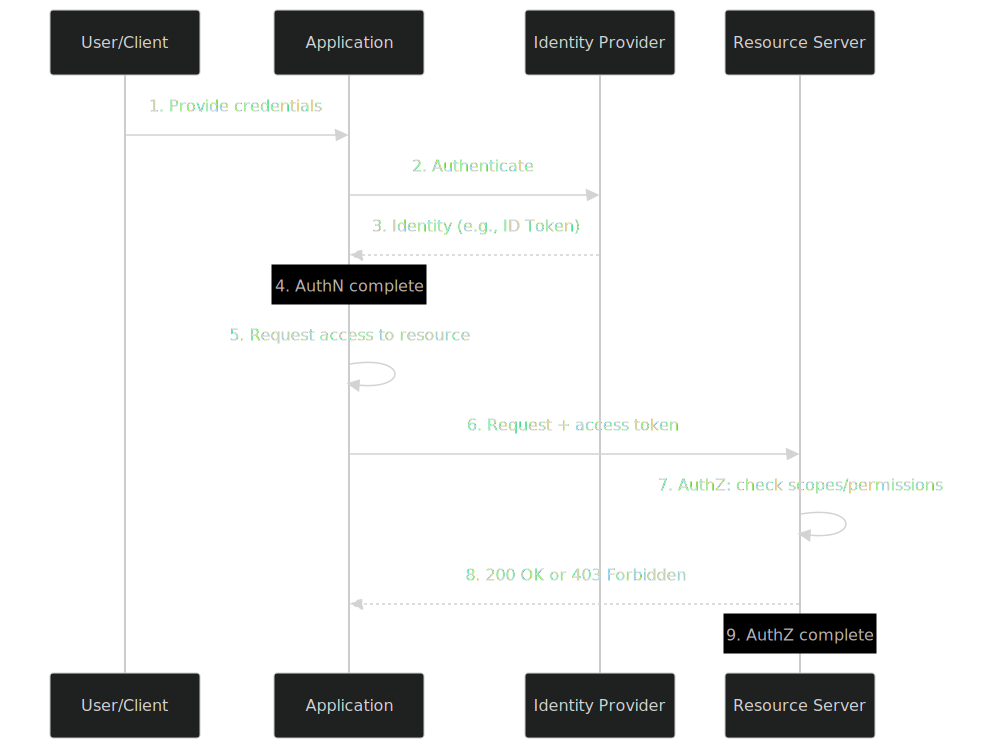
</p>

---

# ❓ Problems OAuth Solves
Before OAuth, the internet had a serious "**password anti-pattern**":
> You want to build a photo-printing app that needs to access users' photos stored on Google. The only way to do it was to ask users for their Google password and store it. This is catastrophic.

**The Anti-Pattern (Pre-OAuth)**
<p align="center">
  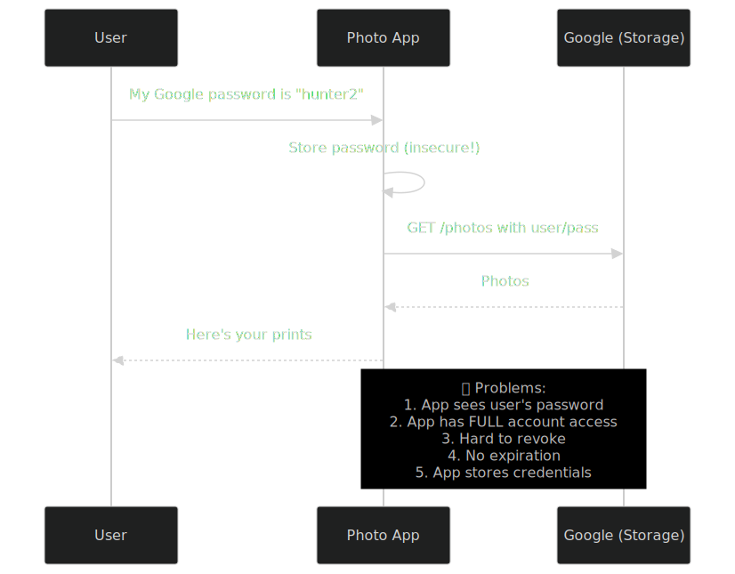
</p>

## Problems OAuth Solves

| # | Problem | OAuth's Solution |
|---|---------|------------------|
| 1 | Apps needed user passwords | Apps never see user passwords—only scoped tokens |
| 2 | No way to limit access | Scopes limit what an app can do |
| 3 | No revocation | Tokens can be revoked via the revocation endpoint |
| 4 | No expiration | Access tokens are short-lived; refresh tokens rotate |
| 5 | No auditing | Authorization Server logs every grant |
| 6 | Trust issues across organizations | Standardized protocol with cryptographic signatures |
| 7 | Mobile/JS clients had no secure place for secrets | PKCE extension (RFC 7636) |
| 8 | No standard for delegated API access | OAuth 2.0 became the de-facto standard |

> TIP:
    **The Core Idea of OAuth**: Instead of giving a third-party your password, you give it a **limited-use token** issued by the resource owner (you), through a trusted **Authorization Server**.

---

# 📜 History of OAuth
| Year | Event | Significance |
|------|-------|--------------|
| 2006 | Twitter implements "OAuth-like" protocol | Early groundwork |
| 2007 | OAuth 1.0 finalized | First standardized delegated auth |
| 2010 | **RFC 5849** (OAuth 1.0a) | Security fix for session fixation |
| 2011 | OAuth 2.0 work begins | Major redesign |
| 2012 | **RFC 6749** + **RFC 6750** | OAuth 2.0 + Bearer tokens |
| 2015 | **RFC 7636** (PKCE) | Secures public clients |
| 2015 | **OpenID Connect Core 1.0** | Identity layer on top of OAuth |
| 2017 | **RFC 8252** (OAuth for Native Apps) | Best practices for mobile |
| 2020 | **RFC 8705** (mTLS) | Certificate-bound tokens |
| 2020 | **RFC 9068** (JWT Profile for Access Tokens) | Standardizes JWT access tokens |
| 2021+ | OAuth 2.1 draft | Consolidation of OAuth 2.0 + best practices |
| 2024 | FAPI 2.0 final | High-security profile for financial APIs |

> NOTE
    OAuth 2.1 (in draft) is not a new protocol but a consolidation: it removes deprecated flows (Implicit, Resource Owner Password Credentials) and mandates PKCE. Modern implementations should target OAuth 2.1 semantics.

---

# 🔄 OAuth 1.0 vs OAuth 2.0

| Feature | OAuth 1.0 | OAuth 2.0 |
|---------|-----------|-----------|
| **Status** | Deprecated | Current standard |
| **Signature** | Every request cryptographically signed (HMAC-SHA1, RSA) | TLS (HTTPS) provides transport security; signing optional |
| **Complexity** | High — requires signature libraries per language | Low — bearer tokens over HTTPS |
| **Token types** | Single token | Access token + refresh token + ID token |
| **User-agent flow** | Complex | Simple redirect-based flows |
| **Mobile/SPA support** | Poor | Excellent (with PKCE) |
| **Performance** | Heavy (per-request signing) | Lightweight |
| **Extensibility** | Limited | Highly extensible (PKCE, mTLS, DPoP, FAPI) |
| **Standardization** | RFC 5849 | RFC 6749 + many companion RFCs |
| **Recommended today?** | ❌ No | ✅ Yes (with PKCE) |

## Why OAuth 2.0 Simplified Things
OAuth 1.0 required every API request to be cryptographically signed using a complex scheme. This was secure but painful: developers had to implement correct signing in every language, and signing libraries were notoriously buggy. OAuth 2.0 traded per-request signing for **mandatory TLS**, which is simpler and equally secure when properly deployed.

> WARNING
    OAuth 2.0's biggest weakness is also its greatest strength: by relying on TLS, it pushes security to the transport layer. If TLS is misconfigured (e.g., weak ciphers, expired certs), OAuth 2.0 inherits those vulnerabilities.

---

# 🆔 What is OpenID Connect?
**OpenID Connect (OIDC)** is a thin **identity layer** built on top of OAuth 2.0. While OAuth 2.0 is purely an **authorization** framework, OIDC adds **authentication** by standardizing:
1. **ID Token** — a signed JWT that proves the user's identity.
2. UserInfo **endpoint** — for fetching additional profile data.
3. **Standardized Claims** — sub, email, name, picture, etc.
4. **Discovery & Dynamic Registration** — auto-configuration via metadata.
5. **Session Management** — logout, front-channel, back-channel.

## The Core Insight
> OAuth 2.0 answers: 
    "Can this app access my photos?"
    OIDC answers: "Who is the user logging into this app?"

## OIDC in One Picture
<p align="center">
  
</p>

## OIDC Specifications
| Specification | Purpose |
|---------------|---------|
| **OpenID Connect Core 1.0** | Defines ID Token, UserInfo, flows |
| **OpenID Connect Discovery 1.0** | `.well-known/openid-configuration` metadata |
| **OpenID Connect Dynamic Client Registration 1.0** | Auto-register clients |
| **OpenID Connect Session Management 1.0** | Logout, session lifecycle |
| **OpenID Connect Front-Channel Logout 1.0** | Browser-based logout |
| **OpenID Connect Back-Channel Logout 1.0** | Server-to-server logout |

---

# 🚫 Why OAuth Alone Isn't Authentication
This is the single most misunderstood point in the industry. The OAuth 2.0 specification **(RFC 6749)** explicitly states:
> "OAuth 2.0 is NOT an authentication protocol."
## The Reason
When a client receives an access token, it knows **it has permission** to call an API—but the access token alone does not prove **who the user is**. An access token might be:

* A machine-to-machine token (Client Credentials flow) — there is no user!
* A token with no openid scope — not intended to identify a user.
* An opaque token — no identity information encoded.

## A Real-World Mistake
```javascript
// ❌ DANGEROUS — Treating OAuth as authentication
app.get('/api/user', async (req, res) => {
  const accessToken = req.headers.authorization?.split(' ');
  // Calling an API with the token tells you nothing about WHO the user is.
  // Anyone with a valid token (even a service-to-service one) could reach here.
  res.json({ message: "You're authenticated!" }); // ❌ This is a lie.
});
```
## The Right Way
```javascript
// ✅ CORRECT — Use OIDC's ID Token for authentication
app.get('/api/user', async (req, res) => {
  const idToken = req.session.idToken; // From OIDC login
  const claims = jwt.verify(idToken, publicKey, {
    algorithms: ['RS256'],
    issuer: 'https://accounts.google.com',
    audience: process.env.GOOGLE_CLIENT_ID,
  });
  res.json({ sub: claims.sub, email: claims.email });
});
```
> WARNING
    Critical rule: Never use an access token as proof of identity. Always use an ID Token (validated against the Authorization Server's public key) for that purpose.

---

# 🏗️ OAuth 2.0 Architecture
## High-Level Architecture
<p align="center">
  
</p>

## Component Relationships
| Component | Role | Example |
|-----------|------|---------|
| **Resource Owner** | The entity that owns the data | End user |
| **Client** | App requesting access | Mobile app, SPA, backend service |
| **Authorization Server (AS)** | Issues tokens after authenticating user & consent | Google OAuth, Auth0, Keycloak |
| **Resource Server (RS)** | Hosts the protected resources (APIs) | Your REST API, GraphQL server |
| **User-Agent** | Browser or app that mediates redirects | Chrome, Safari, native app |

> TIP
    The Authorization Server and Resource Server may be the same system (e.g., Keycloak can both issue tokens and serve APIs), or they may be separate (e.g., Google issues OAuth tokens; your API validates them).

---

# 👥 OAuth Roles
## 1. Resource Owner
The entity capable of granting access to a protected resource. In most cases, this is the **end user**.
* Can be a person (most common).
* Can be an organization or a machine account in machine-to-machine flows.
## 2. Client
An application requesting access to a protected resource on behalf of the Resource Owner.
### Client Types (per RFC 8252 & OAuth 2.1):

| Type | Can Keep Secret? | Examples | Recommended Flow |
|------|------------------|----------|------------------|
| **Confidential** | Yes (server-side) | Server-rendered web app, backend API | Authorization Code + PKCE |
| **Public** | No | SPA, mobile app, native desktop, CLI | Authorization Code + PKCE |
| **Credentialed** | Yes (mTLS) | High-security B2B | mTLS + Authorization Code |

> WARNING
    The old "confidential vs public" distinction based purely on type of app (web vs SPA) is outdated. Use PKCE for every client, regardless of type.

## 3. Authorization Server
The server that authenticates the Resource Owner and issues tokens after successful authorization.
### Responsibilities:
* Authenticate the user (login forms, MFA, passkeys).
* Display consent screens.
* Issue access tokens, refresh tokens, ID tokens.
* Manage token lifecycle (introspection, revocation).
* Publish metadata at .well-known/oauth-authorization-server.
* Expose JWKS endpoint for public key discovery.

## 4. Resource Server
The server hosting protected resources. It accepts and validates access tokens.
### Responsibilities:
* Validate access tokens (signature, expiry, audience, scopes).
* Optionally call introspection endpoint for opaque tokens.
* Enforce authorization rules based on scopes/claims.
* Reject expired or revoked tokens.

---

# 📚 OAuth Terminology
## Access Tokens
A credential used to access protected resources. The bearer of the token can use it.
* **Format**: JWT (signed) or opaque (random string).
* **Lifetime**: Short (typically 5–60 minutes).
* **Transmission**: HTTP Authorization: Bearer <token> header (RFC 6750).

## Refresh Tokens
A credential used to obtain new access tokens **without** user interaction.
* **Format**: Opaque (random string). Never a JWT.
* **Lifetime**: Long (days to months).
* **Storage**: Must be stored securely (encrypted at rest, HttpOnly cookies for browser apps).
* **Rotation**: Should be rotated on each use (see Refresh Token Rotation).

## ID Tokens
A JWT issued by the OIDC provider that **proves the user's identity**.
* **Audience**: The client application.
* **Lifetime**: Very short (typically 5–10 minutes).
* **Usage**: Authentication only—**never** as an API access token.

## Scopes
Strings that define the **extent of access** being requested.

openid              // Required for OIDC
profile             // User's profile claims
email               // Email + verification status
https://api.example.com/read:invoices   // Custom resource scopes


## Claims
Key-value pairs containing information about the user or token.

| Claim | Meaning | Example |
|-------|---------|---------|
| `sub` | Subject — unique user ID at the AS | `"102394835"` |
| `iss` | Issuer — the Authorization Server URL | `"https://accounts.google.com"` |
| `aud` | Audience — intended recipient | `"your-client-id"` |
| `exp` | Expiration time (Unix) | `1715456789` |
| `iat` | Issued at | `1715453189` |
| `nbf` | Not before | `1715453189` |
| `email` | User's email | `"user@example.com"` |
| `email_verified` | Email verified? | `true` |

## Consent
The explicit approval given by the Resource Owner to allow a client to access specific resources.

> IMPORTANT
    Consent ≠ Authentication. Consent is the act of granting permission. Authentication is the act of proving identity. A user must successfully authenticate before they can consent.

---

# 🌐 OAuth Endpoints

| Endpoint | Purpose | Defined In |
|----------|---------|-----------|
| **Authorization Endpoint** | Where the user authenticates and consents | RFC 6749 §3.1 |
| **Token Endpoint** | Where clients exchange code/credentials for tokens | RFC 6749 §3.2 |
| **Introspection Endpoint** | Validate opaque tokens | RFC 7662 |
| **Revocation Endpoint** | Revoke tokens | RFC 7009 |
| **Discovery Endpoint** | Server metadata | RFC 8414 / OIDC Discovery |
| **JWKS Endpoint** | Public keys for JWT verification | RFC 7517 |
| **UserInfo Endpoint** | Get user profile (OIDC) | OIDC Core §5.3 |
| **End-Session Endpoint** | Logout (OIDC) | OIDC Session Management |

## Discovery Example
```bash
GET https://accounts.google.com/.well-known/openid-configuration
```
```json
{
  "issuer": "https://accounts.google.com",
  "authorization_endpoint": "https://accounts.google.com/o/oauth2/v2/auth",
  "token_endpoint": "https://oauth2.googleapis.com/token",
  "userinfo_endpoint": "https://openidconnect.googleapis.com/v1/userinfo",
  "jwks_uri": "https://www.googleapis.com/oauth2/v3/certs",
  "revocation_endpoint": "https://oauth2.googleapis.com/revoke",
  "introspection_endpoint": "https://oauth2.googleapis.com/tokeninfo",
  "scopes_supported": ["openid", "email", "profile"],
  "response_types_supported": ["code", "id_token", "token id_token"],
  "grant_types_supported": ["authorization_code", "refresh_token", "urn:ietf:params:oauth:grant-type:device_code"],
  "code_challenge_methods_supported": ["S256", "plain"]
}
```
## JWKS Example
```bash
GET https://www.googleapis.com/oauth2/v3/certs
```
```json
{
  "keys": [
    {
      "kty": "RSA",
      "use": "sig",
      "kid": "abc123",
      "alg": "RS256",
      "n": "0vx7agoebGcQSuuPiLJXZptN9nndrQmbXEps2aiAFbWhM78LhWx...",
      "e": "AQAB"
    }
  ]
}
```

---

# 🔁 OAuth Authorization Flow Overview
OAuth 2.0 defines several **grant types** (also called flows). Each is suited to a specific scenario.
| Grant Type | When to Use | Client Type | User Interaction |
|------------|-------------|-------------|------------------|
| **Authorization Code** | Web apps with backend | Confidential | Yes |
| **Authorization Code + PKCE** | SPAs, mobile, native apps | Public or confidential | Yes |
| **Client Credentials** | Service-to-service (M2M) | Confidential | No |
| **Device Authorization** | Input-constrained devices (TVs, IoT) | Public | Yes (on second device) |
| **Refresh Token** | Get new access tokens | Confidential/Public | No |
| ~~Implicit~~ | ❌ **Deprecated** | — | — |
| ~~Resource Owner Password (ROPG)~~ | ❌ **Avoid** | — | — |
> WARNING
    The Implicit and Resource Owner Password Credentials grants are deprecated. OAuth 2.1 removes them entirely. Always use Authorization Code + PKCE.

---

# 🔐 Authorization Code Flow
The **gold standard** for user-facing applications with a backend.
## When to Use
* Traditional server-rendered web apps.
* Backend-for-frontend (BFF) patterns for SPAs.
* Mobile/native apps calling your API.
* Any time a user is involved.
## Step-by-Step
<p align="center">
  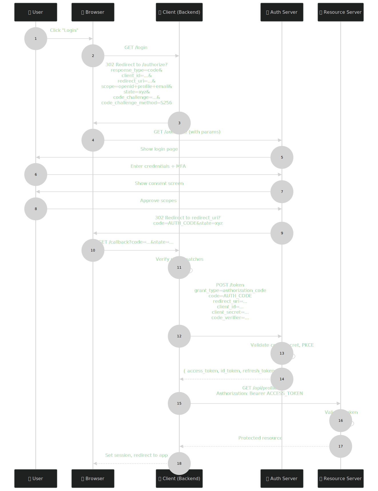
</p>

## Key Parameters (Authorization Request)
| Parameter | Required | Description |
|-----------|----------|-------------|
| `response_type` | ✅ | Must be `code` |
| `client_id` | ✅ | Your registered client ID |
| `redirect_uri` | ✅ | Must exactly match a registered URI |
| `scope` | ✅ | Space-separated scopes (e.g., `openid profile email`) |
| `state` | ✅ | CSRF token — random, unique per request |
| `code_challenge` | ✅ (with PKCE) | Base64url(SHA-256(code_verifier)) |
| `code_challenge_method` | ✅ (with PKCE) | `S256` (preferred) or `plain` |
| `nonce` | For OIDC | Binds ID Token to browser session |
## Key Parameters (Token Request)
```http
POST /token HTTP/1.1
Host: auth.example.com
Content-Type: application/x-www-form-urlencoded

grant_type=authorization_code
&code=AUTH_CODE_HERE
&redirect_uri=https%3A%2F%2Fapp.example.com%2Fcallback
&client_id=YOUR_CLIENT_ID
&client_secret=YOUR_CLIENT_SECRET
&code_verifier=ORIGINAL_CODE_VERIFIER
```
## Token Response
```json
{
  "access_token": "ya29.a0AfH6SMA...",
  "token_type": "Bearer",
  "expires_in": 3600,
  "refresh_token": "1//09GcRRlx...",
  "id_token": "eyJhbGciOiJSUzI1NiIs...",
  "scope": "openid profile email"
}
```

---

# 🛡️ Authorization Code + PKCE
**PKCE (Proof Key for Code Exchange, RFC 7636)** is not a separate flow — it's a security layer added to the Authorization Code flow that protects public clients (SPAs, mobile apps) from authorization code interception attacks.
> TIP 
    **Modern best practice**: Use PKCE for **every** client, including confidential server-side apps. It costs nothing and eliminates entire classes of attacks.

## PKCE Flow
<p align="center">
  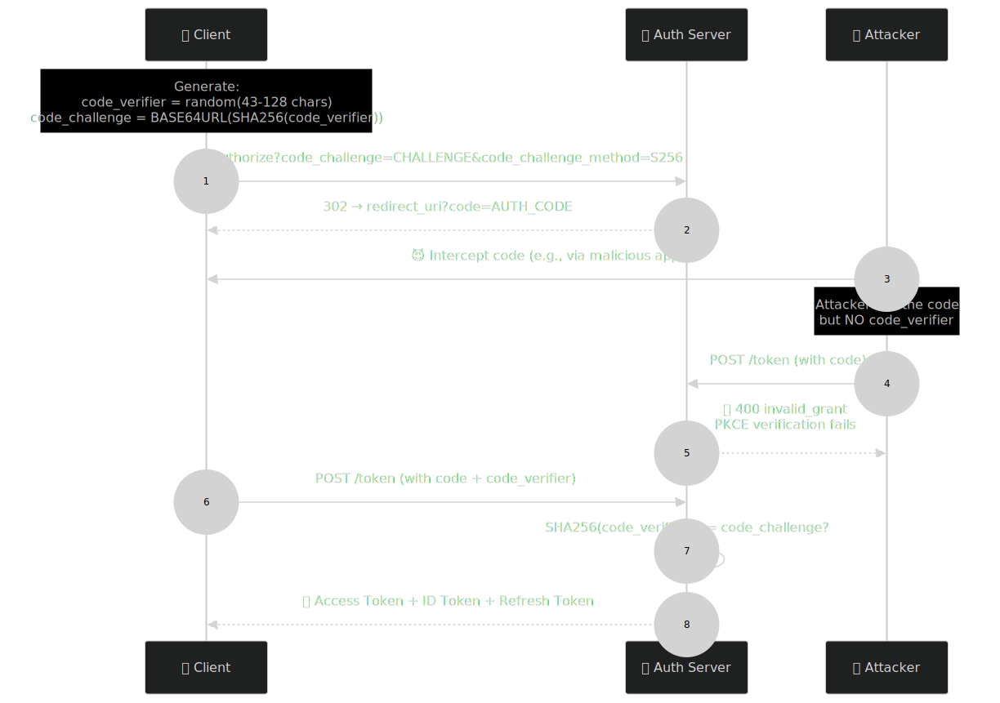
</p>

## PKCE Code Generator
```typescript
import { randomBytes, createHash } from 'crypto';

function generatePKCE() {
  // 1. Generate a high-entropy random verifier (43–128 chars)
  const code_verifier = randomBytes(32)
    .toString('base64')
    .replace(/\+/g, '-')
    .replace(/\//g, '_')
    .replace(/=/g, ''); // Base64URL

  // 2. Hash it with SHA-256
  const code_challenge = createHash('sha256')
    .update(code_verifier)
    .digest('base64')
    .replace(/\+/g, '-')
    .replace(/\//g, '_')
    .replace(/=/g, '');

  return { code_verifier, code_challenge };
}
```
> WARNING
    **Never use** plain for code_challenge_method. Always use S256. The plain method sends the verifier as the challenge, defeating the entire purpose

---

# 🤖 Client Credentials Flow
For **machine-to-machine (M2M)** communication where there is no user.
## When to Use
* Microservices calling other microservices.
* Cron jobs calling internal APIs.
* CI/CD pipelines deploying to cloud APIs.
* Daemons performing background tasks.
## Flow
<p align="center">
  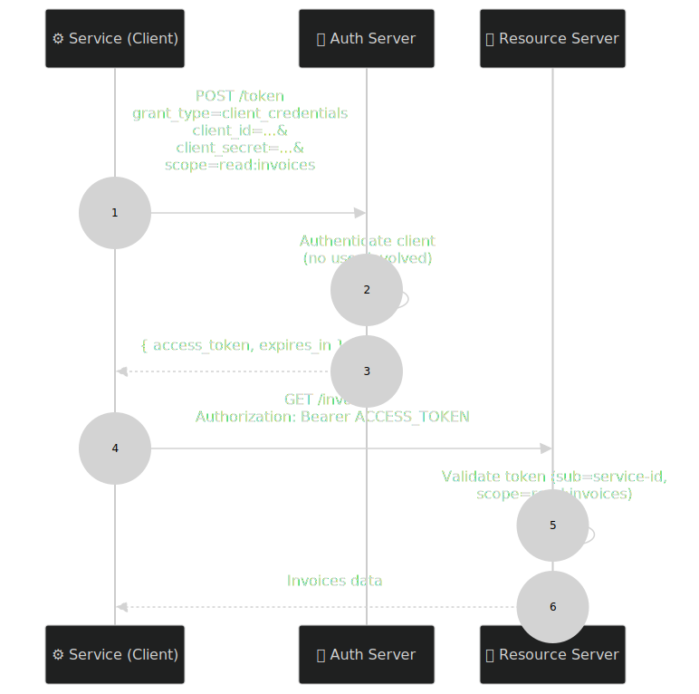
</p>

## Token Request
```bash
curl -X POST https://auth.example.com/token \
  -H "Content-Type: application/x-www-form-urlencoded" \
  -d "grant_type=client_credentials" \
  -d "client_id=service-a" \
  -d "client_secret=secret-from-vault" \
  -d "scope=read:invoices"
```
> IMPORTANT
    In Client Credentials flow, the sub (subject) claim of the access token is the **client ID**, not a user. There is **no user**. This is why you cannot use this flow for user authentication.

---

# 📺 Device Authorization Flow
For **input-constrained devices** like smart TVs, IoT devices, CLI tools, or anything without a browser.
## Flow
<p align="center">
  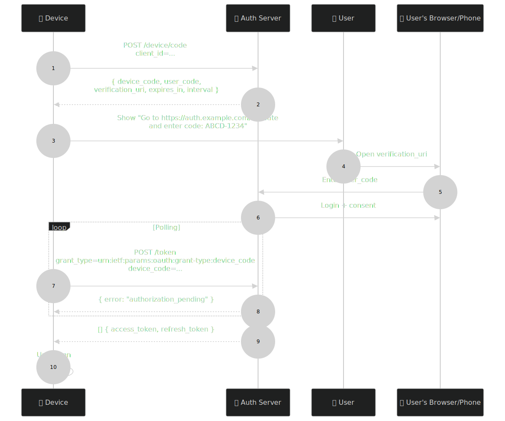
</p>

## Use Cases
* **Smart TV login**: "Visit netflix.com/activate on your phone and enter this code."
* **GitHub CLI**: gh auth login --web uses a similar pattern.
* **AWS SSO**: Uses device flow for CLI access.
* **Zoom**: Device activation codes.

---

# 🔄 Refresh Token Flow
Access tokens are short-lived. Refresh tokens let clients get new access tokens without bothering the user.

## Standard Refresh
```http
POST /token HTTP/1.1
Content-Type: application/x-www-form-urlencoded

grant_type=refresh_token
&refresh_token=OLD_REFRESH_TOKEN
&client_id=YOUR_CLIENT_ID
&client_secret=YOUR_CLIENT_SECRET
&scope=read:orders
```
## Refresh Token Rotation (Recommended)
For security, every refresh token should be **single-use**. When a refresh token is used, the Authorization Server issues a new refresh token AND invalidates the old one.
<p align="center">
  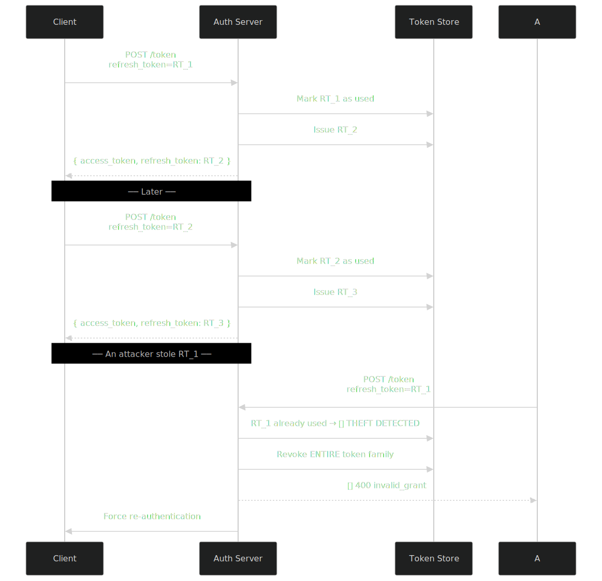
</p>

> WARNING 
    **Reuse detection is critical**. If an attacker steals a refresh token and uses it after the legitimate client used it, the server must detect the reuse and revoke the entire token family. This is called **refresh token reuse detection** (RFC 6819 §5.2.2.3, formalized in OAuth 2.1).

---

# ⚰️ Why Implicit Flow is Deprecated
The Implicit flow returned access tokens **directly in the URL fragment** (#access_token=...). It was designed for browser-only SPAs in 2012.
## Why It Was Killed
| Issue | Why It Matters |
|-------|----------------|
| Tokens in URL fragments | Logged in browser history, server logs, Referer headers |
| No client authentication | Anyone with the redirect URI could intercept |
| No PKCE | Authorization code interception was unmitigated |
| Token leakage via XSS | Fragments are accessible to JS in the same origin |
| No refresh tokens | Users had to re-login frequently |
| Violates OAuth 2.1 | Completely removed |

## What to Use Instead
**Authorization Code + PKCE** for all public clients (SPAs, mobile apps). Pair with a backend or BFF if you need to securely handle refresh tokens.

---

# 🔬 PKCE Explained
## The Attack PKCE Prevents: Authorization Code Interception
<p align="center">
  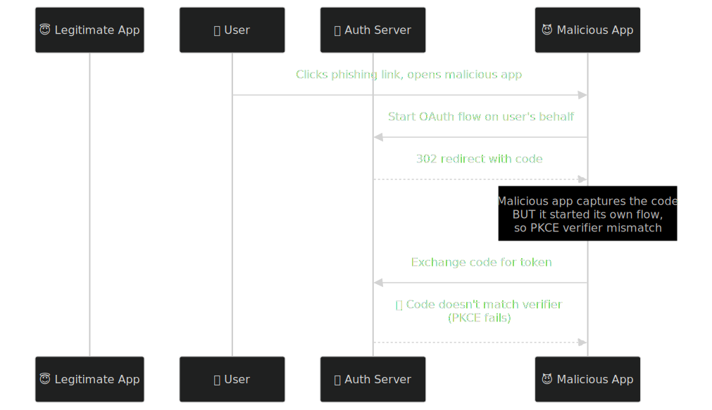
</p>

## How PKCE Prevents It
1. The **client generates** code_verifier (random secret) and code_challenge (its hash).
2. The Authorization Server **stores** the code_challenge with the issued authorization code.
3. When exchanging the code, the client must present the **original** code_verifier.
4. The server hashes it and compares to the stored code_challenge.
5. An attacker who intercepts the code but doesn't have the verifier **cannot exchange it**.
## Why It's Mandatory for Public Clients
| Client Type | Has Client Secret? | PKCE Required? |
|-------------|--------------------|----------------|
| Server-side web app | ✅ Yes (kept on server) | Recommended (OAuth 2.1) |
| SPA | ❌ No | ✅ **Mandatory** |
| Mobile app | ❌ No | ✅ **Mandatory** |
| Native desktop | ❌ No | ✅ **Mandatory** |
| M2M (Client Credentials) | ✅ Yes | N/A (no user involved) |

---

# 📊 OAuth Sequence Diagrams
## Architecture Overview
<p align="center">
  
</p>

---

# 🆔 OpenID Connect Authentication Flow
OIDC reuses OAuth 2.0 flows but adds the openid scope and ID Token.
## Standard OIDC Login
<p align="center">
  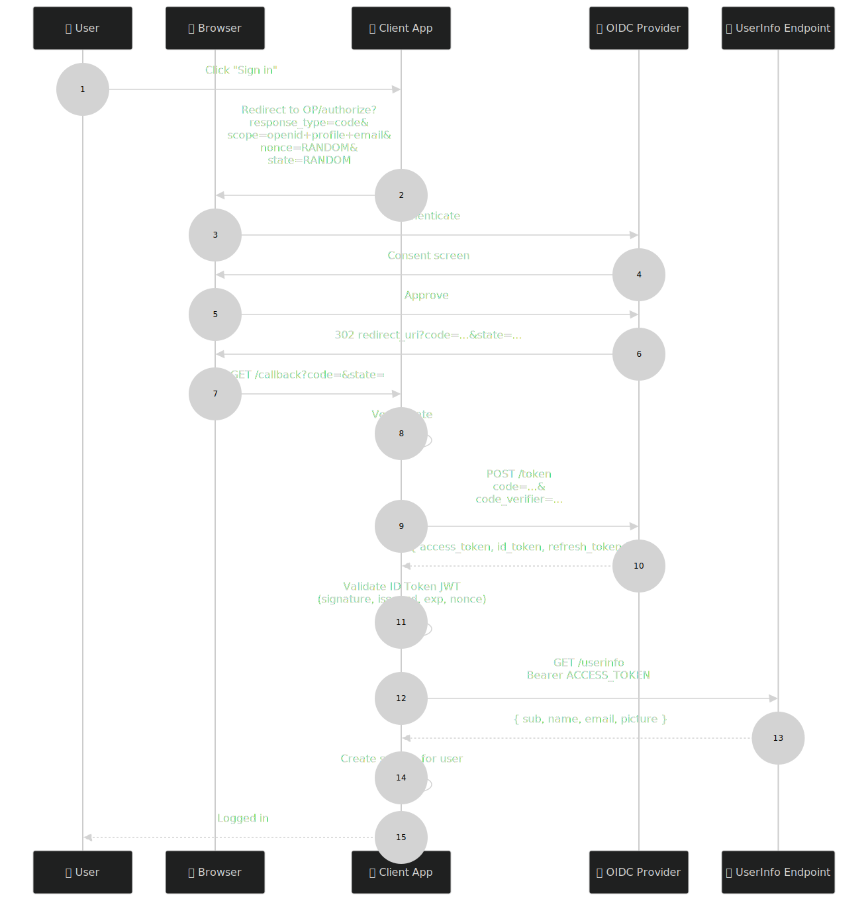
</p>

## Critical ID Token Validations
When you receive an ID Token, you **MUST** validate:
| Check | Why |
|-------|-----|
| **Signature** | Use JWKS from the OP; verify with `alg` from header |
| **`iss`** (Issuer) | Must match the expected OP URL exactly |
| **`aud`** (Audience) | Must contain your `client_id` |
| **`exp`** (Expiration) | Must be in the future |
| **`iat`** (Issued At) | Should be recent |
| **`nonce`** | Must match the nonce you sent in the auth request |
| **`azp`** (Authorized Party) | For OIDC, if present, must equal your `client_id` |
> WARNING 
    **Never accept an unsigned ID Token** (alg: none). Always whitelist algorithms (e.g., RS256 only). Algorithm confusion attacks (e.g., RS256 → HS256 with public key as secret) are a real threat.

---

# 🎫 ID Token Structure
A JWT has three Base64URL-encoded parts separated by dots:
(header.payload.signature)
## Decoded Example
### Header
```json
{
  "alg": "RS256",
  "typ": "JWT",
  "kid": "abc123"
}
```
### Payload (Claims)
```json
{
  "iss": "https://accounts.google.com",
  "azp": "1234567890-abc.apps.googleusercontent.com",
  "aud": "1234567890-abc.apps.googleusercontent.com",
  "sub": "1023948357239485723",
  "email": "jane.doe@example.com",
  "email_verified": true,
  "at_hash": "HK6E_P6Dh8Y93mRNtsDB1Q",
  "iat": 1715453189,
  "exp": 1715456789,
  "nonce": "abc123def456"
}
```
### Signature
The signature is computed as:
```text
RSASHA256(
  base64UrlEncode(header) + "." + base64UrlEncode(payload),
  privateKey
)
```
## Standard OIDC Claims
| Claim | Type | Description |
|-------|------|-------------|
| `sub` | string | Subject — unique user ID (stable per AS) |
| `iss` | string | Issuer URL |
| `aud` | string | Audience (your client_id) |
| `exp` | int | Expiration time (Unix) |
| `iat` | int | Issued at |
| `auth_time` | int | When user authenticated |
| `nonce` | string | Echoed from request |
| `acr` | string | Authentication Context Class (e.g., `urn:mace:incommon:iap:silver`) |
| `amr` | array | Auth Methods Reference (`pwd`, `mfa`, `otp`) |
| `azp` | string | Authorized Party (client_id for OIDC) |
| `at_hash` | string | Hash of access token (binds them together) |

---

# 🔐 JWT inside OAuth
## When to Use JWT Access Tokens
| Use JWT When | Use Opaque When |
|--------------|-----------------|
| Resource Servers can validate locally (no network call) | Centralized revocation is critical |
| Low-latency validation is needed (every API call) | Tokens must be opaque to clients |
| You need to pass claims downstream (user identity in claims) | Strict compliance requires revocation lists |
| Microservices architecture (each service validates independently) | Simple monolith deployment |
## JWT Profile for Access Tokens (RFC 9068)
This RFC standardizes how JWT access tokens should look:
```json
{
  "iss": "https://auth.example.com",
  "sub": "user-123",
  "aud": "https://api.example.com",
  "exp": 1715456789,
  "iat": 1715453189,
  "jti": "unique-token-id",
  "client_id": "my-app",
  "scope": "read:orders write:orders",
  "token_type": "access_token",
  "auth_time": 1715453000,
  "acr": "urn:mace:incommon:iap:silver",
  "amr": ["pwd", "mfa"]
}
```
## JWT Header Requirements
```json
{
  "typ": "at+jwt",    // REQUIRED — distinguishes from ID tokens (typ: "JWT")
  "alg": "RS256",
  "kid": "key-1"
}
```
> IMPORTANT
    The typ: at+jwt header is critical. Without it, an attacker might confuse an ID token with an access token. Always check the typ header.

---

# 🔍 Opaque Tokens vs JWT Tokens
| Aspect | Opaque Token | JWT Token |
|--------|--------------|-----------|
| **Format** | Random string (e.g., `abc123xyz`) | Three-part signed structure |
| **Self-contained?** | ❌ No — needs DB lookup | ✅ Yes — claims inside |
| **Validation** | Must call introspection endpoint | Verify signature locally |
| **Revocation** | Instant (delete from DB) | Wait for expiry (or use denylist) |
| **Performance** | Network call per validation | Cryptographic verification only |
| **Size** | Small (~32 bytes) | Larger (~500–2000 bytes) |
| **Best for** | Centralized control, strict revocation | Distributed services, performance |
| **Inspectable?** | ❌ No | ✅ Yes (claims visible — be careful with PII) |

## Hybrid Approach
Many production systems use:

* **Short-lived JWT access tokens** (5–15 min) for performance.
* **Opaque refresh tokens** for revocation control.
* **Token introspection** for sensitive operations.

---

# ✅ Access Token Validation
A Resource Server must validate **every** access token on every request. Here is the full checklist:
## For JWT Tokens
```typescript
import { jwtVerify, createRemoteJWKSet } from 'jose';

const JWKS = createRemoteJWKSet(new URL('https://auth.example.com/.well-known/jwks.json'));

async function validateAccessToken(token: string, expectedAudience: string) {
  const { payload, protectedHeader } = await jwtVerify(token, JWKS, {
    issuer: 'https://auth.example.com',
    audience: expectedAudience,
    algorithms: ['RS256'], // Whitelist — NEVER trust header's alg
    typ: 'at+jwt',         // RFC 9068
    clockTolerance: 30,    // Allow small clock skew
  });

  // Check required claims
  if (!payload.scope || !payload.scope.includes('read:orders')) {
    throw new Error('Insufficient scope');
  }

  return payload;
}
```
## For Opaque Tokens
```typescript
async function validateOpaqueToken(token: string) {
  const response = await fetch('https://auth.example.com/oauth/introspect', {
    method: 'POST',
    headers: {
      'Content-Type': 'application/x-www-form-urlencoded',
      'Authorization': `Basic ${Buffer.from(clientId + ':' + clientSecret).toString('base64')}`,
    },
    body: `token=${token}`,
  });

  const result = await response.json();
  if (!result.active) {
    throw new Error('Token is not active');
  }
  return result;
}
```
## Validation Checklist
| Check | Required? | What Happens if Skipped |
|-------|-----------|-------------------------|
| Signature verification | ✅ Always | Anyone can forge tokens |
| `iss` matches | ✅ Always | Cross-AS token reuse |
| `aud` contains your API | ✅ Always | Tokens for other APIs accepted |
| `exp` in the future | ✅ Always | Expired tokens accepted |
| `nbf` in the past | ✅ Always | Future-dated tokens accepted |
| Algorithm whitelist | ✅ Always | Algorithm confusion attacks |
| `typ` check | ✅ (RFC 9068) | ID token used as access token |
| Scope check | ✅ Always | Authorization bypass |
| `client_id` check (if needed) | Depends | Cross-client token replay |

---

# 🔎 Token Introspection (RFC 7662)
Allows a Resource Server to ask the Authorization Server whether a token is still valid.
## Request 
```bash
POST /oauth/introspect HTTP/1.1
Host: auth.example.com
Authorization: Basic BASE64(client_id:client_secret)
Content-Type: application/x-www-form-urlencoded

token=ACCESS_TOKEN_TO_CHECK
&token_type_hint=access_token
```
## Response (Active)
```json
{
  "active": true,
  "scope": "read:orders write:orders",
  "client_id": "my-app",
  "sub": "user-123",
  "exp": 1715456789,
  "iat": 1715453189,
  "iss": "https://auth.example.com",
  "aud": "https://api.example.com",
  "token_type": "Bearer"
}
```
## Response (Inactive)
```json
{ "active": false }
```
> WARNING
    **Cache introspection responses**. Otherwise, every API call becomes a network round-trip. Cache for min(exp - now, 60s).

---

# ⛔ Token Revocation (RFC 7009)
Allows clients to invalidate tokens before they expire.
## Revoke a Token
```bash
POST /oauth/revoke HTTP/1.1
Host: auth.example.com
Authorization: Basic BASE64(client_id:client_secret)
Content-Type: application/x-www-form-urlencoded

token=REFRESH_TOKEN_TO_REVOKE
&token_type_hint=refresh_token
```
## Response
```http
HTTP/1.1 200 OK
```
> IMPORTANT
    RFC 7009 §2.2: The Authorization Server responds with HTTP 200 whether or not the token existed. This prevents token enumeration attacks. Don't rely on the response to verify token existence.

## When to Revoke
* User clicks "Log out" on all devices.
* User changes password.
* Suspicious activity detected.
* User uninstalls the app.
* Admin revokes a compromised account.

---

# 🔁 Token Rotation
## Access Token Rotation
Access tokens are short-lived (5–60 min) and rotated via refresh tokens. This minimizes the blast radius if a token leaks.
## Refresh Token Rotation
Refresh tokens should be **single-use**. Every time a refresh token is used, a new one is issued and the old one is invalidated.
> TIP
    Implement refresh token reuse detection. If a refresh token is used twice, treat it as a compromise and revoke the entire token family. This catches both theft and bugs.

---

# 🎯 OAuth Scopes Explained
Scopes are **strings** that define the extent of access. They're opaque to the Authorization Server — the Resource Server enforces what they mean.

## Naming Conventions
| Style | Example | Used By |
|-------|---------|---------|
| OIDC standard | `openid`, `profile`, `email`, `address`, `phone` | All OIDC providers |
| Colon-separated | `read:users`, `write:orders` | GitHub, Auth0 |
| URL-style | `https://api.example.com/read:invoices` | Google |
| Single word | `read`, `write`, `admin` | Keycloak |
## Good Scope Design
| Principle | Example |
|-----------|---------|
| **Action + Resource** | `read:invoices`, `delete:users` |
| **Avoid coarse scopes** | ❌ `admin` — too broad |
| **Granular over broad** | `read:billing` > `billing` |
| **Document each scope** | What does `read:invoices` actually include? |
## Least Privilege Principle
> IMPORTANT
    Always request the minimum scope necessary. Requesting * or broad admin scopes is a security risk and degrades user trust on the consent screen.
## Consent UX Best Practices
* **Use plain language**: "This app will be able to read your invoices" not "Scope: read:invoices".
* **Group related scopes**: "Access your profile" instead of listing name, email, picture separately.
* **Explain why**: "We need access to your calendar to schedule meetings."

---

# ✅ Single Sign-On (SSO)
SSO lets users authenticate **once** and access multiple applications.
## OIDC-Based SSO Architecture
<p align="center">
  
</p>

## OIDC Session Management
* **Front-channel logout**: Browser navigates to OP's logout endpoint, which redirects to all registered clients.
* **Back-channel logout**: OP directly calls each client's logout endpoint (more secure, survives browser closes).
## SSO with OIDC Discovery
Clients can auto-configure by fetching .well-known/openid-configuration. This is how SSO integrations like "Sign in with Google" work across thousands of apps with zero per-app setup.

---

# 🌐 Federated Identity
Federated identity extends SSO across **organizational boundaries**. Examples:
* Logging into a SaaS app with your corporate Google Workspace account.
* A university student accessing library resources via Shibboleth/InCommon.
* Cross-border eGovernment identity (eIDAS in the EU).
## Federated Identity Architecture
<p align="center">
  
</p>

---

# 🌍 Social Login
"Sign in with Google/GitHub/Apple/Microsoft" — all use **OIDC underneath**.
| Provider | Protocol | Special Notes |
|----------|----------|---------------|
| **Google** | OIDC 2.0 | JWT access tokens; well-documented |
| **GitHub** | OAuth 2.0 (not OIDC) | No ID Token; fetch user info via `/user` API |
| **Apple** | OIDC 2.0 | Requires JWT-signed client secret |
| **Microsoft** | OIDC 2.0 | Entra ID (formerly Azure AD) |
| **Facebook** | OAuth 2.0 (custom) | Limited OIDC support |
| **Twitter/X** | OAuth 2.0 + OIDC 1.0 | PKCE required |

---

# 🛠️ OAuth Provider Integrations
## Google OAuth
### Discovery: https://accounts.google.com/.well-known/openid-configuratio
### Setup Steps:
* Create project in Google Cloud Console.
* Configure OAuth consent screen.
* Create OAuth 2.0 credentials.
* Add authorized redirect URIs (exact match!).
* Enable required scopes.
## GitHub OAuth
GitHub supports OAuth 2.0 but **not OIDC** (no ID Token). To get user info:
```bash
GET https://api.github.com/user
Authorization: Bearer GITHUB_ACCESS_TOKEN
```
```json
{
  "id": 12345,
  "login": "octocat",
  "name": "The Octocat",
  "email": "octocat@github.com",
  "avatar_url": "https://..."
}
```
## Microsoft Entra ID
### Discovery: https://login.microsoftonline.com/{tenant-id}/v2.0/.well-known/openid-configuration
Supports both personal accounts and organizational (Work/School) accounts via the tenant parameter.
## Auth0
A developer-friendly identity platform with OIDC out of the box.
```JavaScript
// Auth0 SDK example
import { createAuth0Client } from '@auth0/auth0-spa-js';

const auth0 = await createAuth0Client({
  domain: 'your-tenant.auth0.com',
  clientId: 'YOUR_CLIENT_ID',
  authorizationParams: {
    redirect_uri: window.location.origin,
    scope: 'openid profile email',
  },
});

await auth0.loginWithRedirect();
```
## Keycloak
An open-source IAM solution. Self-hosted, full control.
```bash
# Get Keycloak's discovery document
curl http://localhost:8080/realms/myrealm/.well-known/openid-configuration
```

---

# 🧩 OAuth in Microservices
## The Challenge
In a microservices architecture, you have many services. How do you propagate user identity?
## Token Propagation Patterns
| Pattern | Description | Pros | Cons |
|---------|-------------|------|------|
| **Token Pass-Through** | Service A forwards user's access token to Service B | Simple | Token must be valid for all services |
| **Token Exchange (RFC 8693)** | Service A exchanges user's token for a new one for Service B | Service-specific scopes | More complex |
| **JWT with Claims** | Decode JWT, pass claims in headers (e.g., `X-User-Id`) | Fast | Trust boundary issues |
| **Sidecar/Service Mesh** | Istio/Linkerd handle auth automatically | Centralized | Operational overhead |
## Microservices Auth Architecture
<p align="center">
  
</p>

## Token Exchange (RFC 8693)
For service-to-service with user context:
```bash
POST /token HTTP/1.1
Content-Type: application/x-www-form-urlencoded
Authorization: Basic BASE64(client_id:client_secret)

grant_type=urn:ietf:params:oauth:grant-type:token-exchange
&subject_token=USER_ACCESS_TOKEN
&subject_token_type=urn:ietf:params:oauth:token-type:access_token
&audience=service-b
&scope=read:inventory
```

---

# 🚪 API Gateway Authentication
The API Gateway is the central choke point for all API requests. It should:
1. Validate access tokens (signature, expiry, audience, scopes).
2. Reject invalid requests before they reach services.
3. Inject identity into requests (headers like X-User-Id).
4. Apply rate limiting per client/token.

## Common Gateway Solutions
| Gateway | OAuth Support | Notes |
|---------|---------------|-------|
| **Kong** | ✅ Excellent | Plugins: `oauth2`, `jwt`, `key-auth` |
| **AWS API Gateway** | ✅ Built-in | Native Cognito / Lambda authorizers |
| **NGINX** | ✅ Via `auth_request` | Custom JWT validation |
| **Envoy** | ✅ Via `jwt_authn` filter | Common in service mesh |
| **Traefik** | ✅ Forward auth | Integrates with Authelia, Ory |
| **Azure API Management** | ✅ Built-in | Entra ID native |
## Example: Kong OAuth 2.0 Plugin
```yaml
plugins:
  - name: oauth2
    route: my-api-route
    config:
      scopes_required: ["read:orders"]
      mandatory_scope: true
      token_expiration: 3600
      enable_authorization_code: true
      enable_client_credentials: true
      pkce_enabled: true
```

---

# 🔒 Zero Trust Architecture
**Zero Trust** assumes no implicit trust based on network location. OAuth/OIDC fits naturally:
| Zero Trust Principle | OAuth/OIDC Implementation |
|----------------------|----------------------------|
| Verify explicitly | Validate every JWT on every request |
| Least privilege access | Granular scopes per API |
| Assume breach | Short-lived tokens + refresh rotation |
| Continuous verification | Token refresh + step-up auth for sensitive ops |
| Don't trust the network | Tokens work over any network (no VPN needed) |
## Beyond Bearer Tokens: Sender-Constrained Tokens
| Mechanism | Description | RFC |
|-----------|-------------|-----|
| **mTLS (RFC 8705)** | Bind token to client certificate | RFC 8705 |
| **DPoP (RFC 9449)** | Demonstrating Proof-of-Possession | RFC 9449 |
| **DPoP + mTLS** | Combined | — |
> TIP
    Bearer tokens are like cash — anyone holding them can use them. DPoP/mTLS tokens are like a chip-and-PIN card — useless without the cryptographic proof of possession.

---

# 🛡️ OAuth Security Best Practices
## The Comprehensive Checklist
| # | Best Practice | Attack Prevented | What Happens if Ignored |
|---|---------------|------------------|------------------------|
| 1 | **Always use TLS 1.2+** | Token interception | Tokens stolen in transit |
| 2 | **Always use PKCE** | Code interception | Attackers steal codes |
| 3 | **Validate `state` parameter** | CSRF | Attackers log victims into attacker's account |
| 4 | **Validate `nonce` (OIDC)** | Replay of ID Token | Same ID Token replayed |
| 5 | **Exact `redirect_uri` match** | Open redirect | Auth codes sent to attacker |
| 6 | **Whitelist JWT algorithms** | Algorithm confusion | `alg: none` or HS256 with public key |
| 7 | **Validate `iss`, `aud`, `exp`** | Cross-AS token use | Tokens for other APIs accepted |
| 8 | **Short access token lifetimes** | Token theft impact | Long-lived stolen tokens valid |
| 9 | **Refresh token rotation** | Refresh token theft | Stolen refresh tokens used indefinitely |
| 10 | **Reuse detection** | Replay attacks | Attackers use tokens undetected |
| 11 | **Secure token storage** | XSS / local theft | Tokens stolen via JS injection |
| 12 | **HttpOnly + Secure + SameSite cookies** | XSS, CSRF | Tokens exposed to JS / sent cross-site |
| 13 | **Use authorization code flow** | Multiple (vs implicit) | Tokens in URL fragments |
| 14 | **Scope minimization** | Over-privileged apps | Apps get more access than needed |
| 15 | **Step-up auth for sensitive ops** | Stolen low-privilege tokens | Sensitive APIs accessed with weak tokens |
| 16 | **Audit log all token issuance** | Forensic blindness | No trail after breach |
| 17 | **Rate-limit token endpoints** | Brute force / DoS | Service disruption |
| 18 | **Use DPoP or mTLS for high-value APIs** | Bearer token theft | Stolen tokens usable from anywhere |

---

# 🚨 Common OAuth Vulnerabilities
## 1. CSRF on the Callback (state not validated)
### Attack:
<p align="center">
  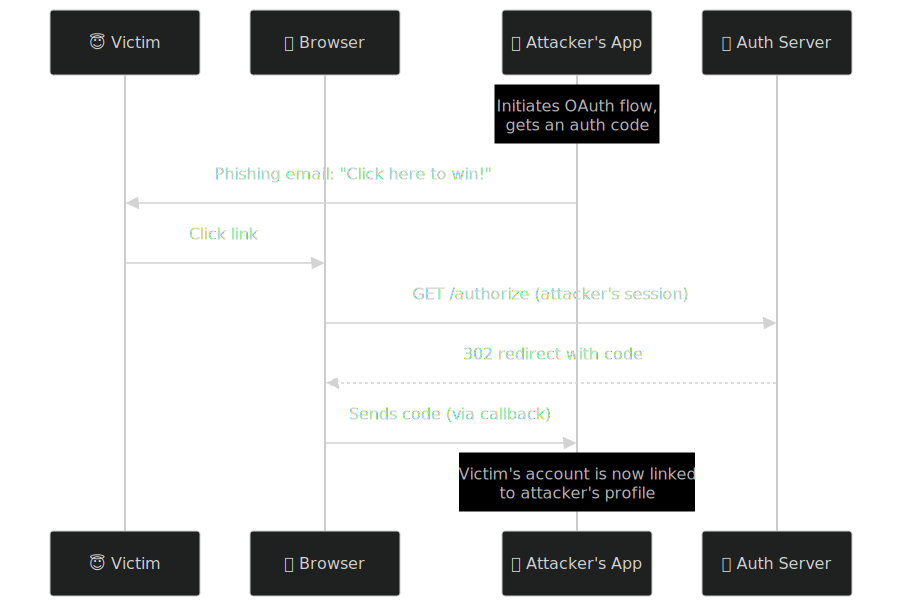
</p>

**Mitigation**: Always validate state. Bind state to the user's session.

## 2. Authorization Code Injection
Attacker tricks a victim's browser into using an authorization code controlled by the attacker.

**Mitigation**: PKCE prevents this — the attacker's code was issued with their verifier, not the victim's.

## 3. Open Redirect via redirect_uri
### Vulnerable:
```text
https://auth.example.com/authorize?redirect_uri=https://evil.com/callback
```
**Mitigation**: Use exact match (no wildcards, no path prefix matches). Some providers allow only specific domains.

## 4. Token Leakage via Referer Headers
If your redirect URI page loads third-party resources, the URL (containing the code) might leak via the Referer header.

**Mitigation**:
* Use a dedicated callback page that doesn't load external resources.
* Use the Referrer-Policy: no-referrer header.

## 5. Mix-Up Attacks
Attacker registers their own OAuth provider with similar name; victim's browser mixes up responses.
**Mitigation**: Validate iss in the authorization response (per OAuth 2.1).

## 6. Scope Escalation
Client requests read:invoices, then modifies request to get admin:*.
**Mitigation**: Authorization Server must validate scopes against client config. Never trust client-side scope manipulation.

## 7. Refresh Token Theft
Long-lived refresh tokens are gold for attackers.
**Mitigation**:

* Rotation with reuse detection.
* Bind refresh tokens to device (e.g., DPoP).
* Short maximum lifetime (e.g., 30 days).

## 8. Phishing via Fake Consent Screens
**Mitigation**: Train users to verify the issuer URL. Use verified app badges.

## 9. Clickjacking
Consent screen loaded in an invisible iframe, user clicks "Allow" thinking they're clicking something else.

**Mitigation**:
```text
Content-Security-Policy: frame-ancestors 'none';
X-Frame-Options: DENY
```

## 10. Token Replay
Attacker captures a valid token and reuses it.
**Mitigation**:
Use sender-constrained tokens (DPoP, mTLS).
Short lifetimes.
Bind tokens to client (cnf claim).

---

# 🔒 Secure Cookie Usage
When storing tokens in cookies (e.g., session cookies after OIDC login):
```http
Set-Cookie: session=...;
  HttpOnly;          ← Prevents JS access (XSS protection)
  Secure;            ← Only sent over HTTPS
  SameSite=Lax;      ← Or Strict for max CSRF protection
  Path=/;
  Max-Age=3600;
  Priority=High
```
## Cookie Attribute Cheat Sheet
| Attribute | Value | Purpose |
|-----------|-------|---------|
| `HttpOnly` | Always | Block JS access (XSS protection) |
| `Secure` | Always | Only send over HTTPS |
| `SameSite` | `Lax` or `Strict` | CSRF protection |
| `Domain` | Specific | Don't use broad domains |
| `Path` | `/` | Available app-wide |
| `__Host-` prefix | Recommended | Strongest cookie scoping (RFC 6265bis) |

---

# 🌐 HTTPS Requirements
> WARNING
    OAuth 2.0 absolutely requires HTTPS for all endpoints. Token leakage over HTTP is catastrophic.

## Recommended TLS Configuration
| Setting | Recommended |
|---------|-------------|
| TLS version | TLS 1.2 minimum, prefer TLS 1.3 |
| Cipher suites | AEAD only (AES-GCM, ChaCha20-Poly1305) |
| Certificate | From trusted CA; renew automatically |
| HSTS | `Strict-Transport-Security: max-age=31536000; includeSubDomains; preload` |
| Certificate pinning | Use for native apps (with backup pins) |

---

# ❌ OAuth Error Responses
## Standard Error Codes (RFC 6749 §4.1.2.1, §5.2)
| Error Code | Meaning | When |
|-----------|---------|------|
| `invalid_request` | Malformed request | Missing params, syntax errors |
| `invalid_client` | Client auth failed | Wrong client_secret |
| `invalid_grant` | Grant invalid/expired | Code used twice, PKCE failed |
| `unauthorized_client` | Client not authorized for this grant | Client doesn't have permission |
| `unsupported_grant_type` | AS doesn't support this grant | Wrong grant_type |
| `invalid_scope` | Scope invalid/unauthorized | Requested scope not allowed |
| `access_denied` | User denied consent | User clicked "Cancel" |
| `unsupported_response_type` | AS doesn't support response_type | Wrong response_type |
| `server_error` | AS internal error | Something broke server-side |
| `temporarily_unavailable` | AS overloaded/maintenance | Try again later |

## Example Error Response
```json
{
  "error": "invalid_grant",
  "error_description": "PKCE verification failed: code_verifier does not match",
  "error_uri": "https://auth.example.com/docs/errors#invalid_grant"
}
```
## Authorization Endpoint Errors
These are returned as query parameters in the redirect:
```text
https://app.example.com/callback?
  error=access_denied
  &error_description=The+user+denied+the+request
  &state=xyz
```
> IMPORTANT
    Always include state even in error responses — clients use it to correlate the error with the original request.

---

# 📊 HTTP Status Codes
| Status | Use For |
|--------|---------|
| **200 OK** | Successful API call |
| **201 Created** | Resource created |
| **204 No Content** | Successful but no body |
| **301 Moved Permanently** | Permanent redirect |
| **302 Found** | OAuth redirects (for historical compatibility) |
| **303 See Other** | OAuth redirect after POST (RFC 6749 §4.1.4) |
| **400 Bad Request** | Malformed request (also OAuth `invalid_request`) |
| **401 Unauthorized** | Missing/invalid token (also OAuth `invalid_token`) |
| **403 Forbidden** | Token valid but lacks permission |
| **404 Not Found** | Resource doesn't exist |
| **429 Too Many Requests** | Rate limited |
| **500 Internal Server Error** | Generic server error (also OAuth `server_error`) |
| **503 Service Unavailable** | Temporarily unavailable (also OAuth `temporarily_unavailable`) |
## WWW-Authenticate Header (RFC 6750)
When returning 401:
```http
HTTP/1.1 401 Unauthorized
WWW-Authenticate: Bearer realm="api",
  error="invalid_token",
  error_description="The access token has expired",
  error_uri="https://auth.example.com/docs/errors#expired"
```

---

# 🏭 Production Best Practices
## Architecture
| Practice | Why |
|----------|-----|
| Separate Authorization Server from Resource Servers | Independent scaling, audit isolation |
| Use a managed provider (Auth0, Okta, Cognito) when possible | Security maintenance burden is huge |
| Self-host (Keycloak) only if compliance requires it | Operational cost is significant |
| Run a dedicated JWKS cache (Redis) | Avoid hammering the AS on cold starts |
| Implement circuit breakers around token validation | Don't take down your API when AS is down |

## Token Management
| Practice | Why |
|----------|-----|
| 5–15 min access token lifetime | Limits blast radius |
| Refresh token rotation with reuse detection | Catches theft |
| HttpOnly + Secure cookies for browser apps | XSS + CSRF protection |
| In-memory storage for SPA tokens | XSS-resistant |
| Server-side sessions (BFF pattern) for SPAs | Best security |

## Observability
| Metric | Why |
|--------|-----|
| Token issuance rate per client | Detect anomalies |
| Failed token validation rate | Detect misconfiguration or attack |
| Refresh token reuse events | Detect theft |
| Consent grant rate per client | Detect phishing |
| Token endpoint latency | Performance baseline |

## Compliance
| Standard | Requirement |
|----------|-------------|
| **GDPR** | Don't put PII in JWTs (they're hard to revoke) |
| **HIPAA** | Encrypt tokens at rest; audit all access |
| **PCI-DSS** | Strong auth for admin operations |
| **SOC 2** | Audit logs of all token lifecycle events |
| **FAPI 2.0** | For financial-grade APIs: mTLS or DPoP, sender-constrained tokens |

---

# ⚠️ Common Mistakes Developers Make
## Top 20 Mistakes
| # | Mistake | Fix |
|---|---------|-----|
| 1 | Using Implicit flow | Use Authorization Code + PKCE |
| 2 | Storing tokens in `localStorage` (SPA) | Use in-memory + refresh via BFF |
| 3 | Not validating `state` | Always generate + validate `state` |
| 4 | Not using PKCE | Always use PKCE (S256) |
| 5 | Accepting `alg: none` | Whitelist algorithms |
| 6 | Wildcard in `redirect_uri` | Use exact match |
| 7 | Long-lived access tokens (24h+) | Use 5–15 min tokens |
| 8 | No refresh token rotation | Rotate + reuse detection |
| 9 | Trusting access token for authentication | Use ID Token for identity |
| 10 | Not validating `aud` | Always check audience |
| 11 | Not validating `iss` | Always check issuer |
| 12 | Putting PII in JWT claims | Use opaque tokens or minimal claims |
| 13 | Not using HTTPS in dev | Always HTTPS, even localhost (mkcert) |
| 14 | Using Resource Owner Password flow | Never (use Authorization Code) |
| 15 | Rolling your own OAuth | Use proven libraries |
| 16 | Not setting cookie flags correctly | `HttpOnly; Secure; SameSite` |
| 17 | Logging tokens | Redact all token values in logs |
| 18 | Sending tokens in URL params | Use headers (`Authorization: Bearer`) |
| 19 | Not implementing logout properly | Revoke tokens server-side |
| 20 | No rate limiting on `/token` | Add rate limits + bot detection |

---

# 💻 Code Examples
## Node.js + Express + Passport.js
### Install Dependencies
```bash
npm install express passport passport-openidconnect express-session
```
### Server
```JavaScript
const express = require('express');
const session = require('express-session');
const passport = require('passport');
const { Strategy: OIDCStrategy } = require('passport-openidconnect');

const app = express();

app.use(session({
  secret: process.env.SESSION_SECRET,
  resave: false,
  saveUninitialized: false,
  cookie: {
    httpOnly: true,
    secure: process.env.NODE_ENV === 'production',
    sameSite: 'lax',
    maxAge: 3600000,
  },
}));

app.use(passport.initialize());
app.use(passport.session());

passport.use('oidc', new OIDCStrategy({
  issuer: 'https://accounts.google.com',
  authorizationURL: 'https://accounts.google.com/o/oauth2/v2/auth',
  tokenURL: 'https://oauth2.googleapis.com/token',
  userInfoURL: 'https://openidconnect.googleapis.com/v1/userinfo',
  clientID: process.env.GOOGLE_CLIENT_ID,
  clientSecret: process.env.GOOGLE_CLIENT_SECRET,
  callbackURL: '/auth/callback',
  scope: ['openid', 'profile', 'email'],
}, (issuer, profile, done) => {
  // Save or look up user in DB
  return done(null, { id: profile.id, email: profile.emails.value });
}));

passport.serializeUser((user, done) => done(null, user.id));
passport.deserializeUser((id, done) => {
  // Lookup user by ID
  done(null, { id });
});

app.get('/auth/login', passport.authenticate('oidc'));
app.get('/auth/callback',
  passport.authenticate('oidc', { failureRedirect: '/login' }),
  (req, res) => res.redirect('/dashboard'));
app.get('/auth/logout', (req, res) => {
  req.logout(() => {
    res.redirect('/');
  });
});

app.listen(3000);
```
## Node.js + openid-client (Modern, Recommended)
```Typescript
import express from 'express';
import * as client from 'openid-client';

const config: client.Configuration = await client.discovery(
  new URL('https://accounts.google.com'),
  process.env.GOOGLE_CLIENT_ID!,
  process.env.GOOGLE_CLIENT_SECRET!,
);

const app = express();

const code_verifier = client.randomPKCECodeVerifier();
const code_challenge = await client.calculatePKCECodeChallenge(code_verifier);
const state = client.randomState();
const nonce = client.randomNonce();

app.get('/login', (req, res) => {
  const url = client.buildAuthorizationUrl(config, {
    redirect_uri: 'https://app.example.com/callback',
    scope: 'openid profile email',
    code_challenge,
    code_challenge_method: 'S256',
    state,
    nonce,
  });
  // Store code_verifier, state, nonce in session
  req.session.oidc = { code_verifier, state, nonce };
  res.redirect(url.href);
});

app.get('/callback', async (req, res) => {
  const { code_verifier, state, nonce } = req.session.oidc;
  const tokens = await client.authorizationCodeGrant(config, new URL(req.url), {
    pkceCodeVerifier: code_verifier,
    expectedState: state,
    expectedNonce: nonce,
  });

  const claims = tokens.claims();
  req.session.user = {
    sub: claims.sub,
    email: claims.email,
    name: claims.name,
  };
  res.redirect('/dashboard');
});
```
## Python (FastAPI)
```python
from fastapi import FastAPI, Request, HTTPException
from authlib.integrations.starlette_client import OAuth
from starlette.config import Config

app = FastAPI()
config = Config('.env')
oauth = OAuth(config)

oauth.register(
    name='google',
    server_metadata_url=(
        'https://accounts.google.com/.well-known/openid-configuration'
    ),
    client_kwargs={'scope': 'openid profile email'},
)

@app.get('/login')
async def login(request: Request):
    redirect_uri = request.url_for('callback')
    return await oauth.google.authorize_redirect(request, redirect_uri)

@app.get('/callback')
async def callback(request: Request):
    token = await oauth.google.authorize_access_token(request)
    user = token.get('userinfo')
    request.session['user'] = dict(user)
    return {'message': 'Logged in', 'user': user}

@app.get('/api/protected')
async def protected(request: Request):
    user = request.session.get('user')
    if not user:
        raise HTTPException(status_code=401, detail='Not authenticated')
    return {'user': user}
```
## Go
```Go
package main

import (
    "context"
    "net/http"
    "os"

    "github.com/coreos/go-oidc/v3/oidc"
    "golang.org/x/oauth2"
)

var (
    provider *oidc.Provider
    verifier *oidc.IDTokenVerifier
    oauthConfig oauth2.Config
)

func init() {
    ctx := context.Background()
    var err error
    provider, err = oidc.NewProvider(ctx, "https://accounts.google.com")
    if err != nil {
        panic(err)
    }
    verifier = provider.Verifier(&oidc.Config{ClientID: os.Getenv("GOOGLE_CLIENT_ID")})
    oauthConfig = oauth2.Config{
        ClientID:     os.Getenv("GOOGLE_CLIENT_ID"),
        ClientSecret: os.Getenv("GOOGLE_CLIENT_SECRET"),
        RedirectURL:  "https://app.example.com/callback",
        Scopes:       []string{"openid", "profile", "email"},
        Endpoint:     provider.Endpoint(),
    }
}

func main() {
    http.HandleFunc("/login", func(w http.ResponseWriter, r *http.Request) {
        state := randomString()
        http.SetCookie(w, &http.Cookie{Name: "state", Value: state, HttpOnly: true, Secure: true})
        http.Redirect(w, r, oauthConfig.AuthCodeURL(state), http.StatusFound)
    })

    http.HandleFunc("/callback", func(w http.ResponseWriter, r *http.Request) {
        cookie, _ := r.Cookie("state")
        if r.URL.Query().Get("state") != cookie.Value {
            http.Error(w, "state mismatch", http.StatusBadRequest)
            return
        }
        token, err := oauthConfig.Exchange(r.Context(), r.URL.Query().Get("code"))
        if err != nil {
            http.Error(w, err.Error(), http.StatusInternalServerError)
            return
        }
        rawIDToken, _ := token.Extra("id_token").(string)
        idToken, err := verifier.Verify(r.Context(), rawIDToken)
        if err != nil {
            http.Error(w, err.Error(), http.StatusInternalServerError)
            return
        }
        var claims map[string]any
        idToken.Claims(&claims)
        // Set session, etc.
        _ = claims
    })

    http.ListenAndServe(":8080", nil)
}

func randomString() string {
    // Use crypto/rand for secure random
    b := make([]byte, 32)
    _, _ = rand.Read(b)
    return base64.RawURLEncoding.EncodeToString(b)
}
```
## Java (Spring Boot)
```Java
@Configuration
@EnableWebSecurity
public class SecurityConfig {

    @Bean
    SecurityFilterChain filterChain(HttpSecurity http) throws Exception {
        http
            .authorizeHttpRequests(auth -> auth
                .requestMatchers("/", "/login", "/error").permitAll()
                .anyRequest().authenticated()
            )
            .oauth2Login(oauth2 -> oauth2
                .loginPage("/login")
                .defaultSuccessUrl("/dashboard", true)
            )
            .oauth2ResourceServer(oauth2 -> oauth2
                .jwt(jwt -> jwt.jwkSetUri("https://auth.example.com/.well-known/jwks.json"))
            )
            .logout(logout -> logout.logoutSuccessUrl("/"));
        return http.build();
    }
}
```
application.yml:
```yaml
spring:
  security:
    oauth2:
      client:
        registration:
          google:
            client-id: ${GOOGLE_CLIENT_ID}
            client-secret: ${GOOGLE_CLIENT_SECRET}
            scope:
              - openid
              - profile
              - email
```

---

# 📊 Comparison Tables
## OAuth vs OpenID Connect
| Aspect | OAuth 2.0 | OpenID Connect |
|--------|-----------|----------------|
| **Purpose** | Authorization | Authentication |
| **Layer** | Base protocol | Built on OAuth 2.0 |
| **Token** | Access token (and optionally refresh) | Adds ID Token (JWT) |
| **Scope required** | Any | `openid` (mandatory) |
| **User identity** | ❌ Not specified | ✅ Standardized claims |
| **Standards body** | IETF | OpenID Foundation |
| **Use for** | API access, M2M | "Sign in with X" flows |

## OAuth vs JWT
| Aspect | OAuth 2.0 | JWT |
|--------|-----------|-----|
| **What is it?** | A protocol (framework) | A token format (RFC 7519) |
| **Scope** | Defines flows, endpoints, roles | Defines token structure |
| **Relationship** | Can USE JWTs for tokens | Used WITHIN OAuth |
| **Self-contained?** | N/A | ✅ Yes (claims inside) |
| **Typical lifetime** | Varies | Configurable |

## OAuth vs Session Authentication
| Aspect | OAuth 2.0 / OIDC | Session Cookie |
|--------|------------------|----------------|
| **State** | Stateless (tokens) | Stateful (server stores session) |
| **Storage** | Client (token) or server (refresh) | Server (session ID) |
| **Scalability** | Easy (no shared session store) | Needs sticky sessions or shared store |
| **Cross-domain** | ✅ Native | ❌ CORS issues |
| **Revocation** | Easy (token revocation) | Easy (delete session) |
| **Mobile/SPA** | ✅ Natural fit | ❌ Awkward |
| **CSRF** | Not applicable | Requires SameSite/CSRF tokens |

## OAuth Flows Comparison
| Flow | User? | Client Type | Use Case | PKCE? |
|------|-------|-------------|----------|-------|
| Authorization Code | ✅ | Confidential | Server-side web apps | Recommended |
| Authorization Code + PKCE | ✅ | Public or confidential | SPAs, mobile, native | ✅ Required |
| Client Credentials | ❌ | Confidential | M2M, microservices | N/A |
| Device Authorization | ✅ | Public | TVs, IoT, CLIs | ✅ Required |
| Refresh Token | ❌ | Either | Get new access tokens | N/A |
| ~~Implicit~~ | ✅ | Public | ❌ Deprecated | — |
| ~~ROPG~~ | ✅ | Confidential | ❌ Deprecated | — |

## Authorization Code vs PKCE
| Aspect | Authorization Code | Authorization Code + PKCE |
|--------|--------------------|-----------------------------|
| Public clients safe? | ❌ Vulnerable | ✅ Safe |
| Confidential clients? | ✅ Safe | ✅ Even safer |
| Complexity | Lower | Slightly higher (verifier generation) |
| Recommended today? | Legacy | ✅ Default choice |

## JWT vs Opaque Access Tokens
| Aspect | JWT | Opaque |
|--------|-----|--------|
| Validation | Local (signature check) | Remote (introspection) |
| Revocation | Hard (wait for expiry) | Easy (delete from DB) |
| Performance | Fast | Slower (network call) |
| Claims access | Direct | Introspection response |
| Size | Larger | Small |

## Authentication Methods Comparison
| Method | Pros | Cons | Best For |
|--------|------|------|----------|
| Password | Simple | Phishable, breachable | Low-security apps |
| MFA (TOTP) | Strong | UX friction | Most apps |
| WebAuthn/Passkeys | Phishing-resistant | Device-dependent | High-security |
| SMS OTP | Easy | SIM swap attacks | Legacy fallback |
| Magic Link | No password | Email account = account | Consumer apps |
| Social Login | Easy | Provider dependency | Consumer apps |
| SSO (OIDC) | Great UX, secure | Requires IdP | Enterprise |

## OAuth Providers Comparison
| Provider | OIDC | Free Tier | Best For |
|----------|------|-----------|----------|
| **Auth0** | ✅ | 7,500 MAU | Developer-friendly SaaS |
| **Okta** | ✅ | Limited | Enterprise |
| **Keycloak** | ✅ | Unlimited (self-hosted) | Full control |
| **AWS Cognito** | ✅ | 50,000 MAU | AWS ecosystem |
| **Azure Entra ID** | ✅ | Limited | Microsoft ecosystem |
| **Google Cloud Identity** | ✅ | Pay-per-use | Google ecosystem |
| **Ory** | ✅ | Unlimited (open-source) | Self-hosted modern stack |
| **Logto** | ✅ | Unlimited (open-source) | Developer-friendly OSS |
| **Supabase Auth** | ✅ | 50,000 MAU | Postgres apps |

## PKCE vs Client Secret
| Aspect | Client Secret | PKCE |
|--------|---------------|------|
| Held by | Server (backend) | Client (any) |
| Suitable for | Confidential clients | All clients |
| Protects against | Unauthorized token exchange | Code interception |
| Required for public clients? | ❌ N/A | ✅ Yes |
| Storage risk | If leaked, can forge any token | Single-flow verifier |

## OAuth Roles
| Role | What It Is | Example |
|------|------------|---------|
| **Resource Owner** | Owns the data | End user |
| **Client** | Wants access to data | Mobile app |
| **Authorization Server** | Issues tokens | Auth0 |
| **Resource Server** | Hosts the data | Your API |

## OAuth Endpoints
| Endpoint | URL Example | Purpose |
|----------|-------------|---------|
| Authorization | `/oauth/authorize` | User login + consent |
| Token | `/oauth/token` | Code → tokens |
| Introspection | `/oauth/introspect` | Check token validity |
| Revocation | `/oauth/revoke` | Invalidate tokens |
| Discovery | `/.well-known/openid-configuration` | Server metadata |
| JWKS | `/.well-known/jwks.json` | Public keys |
| UserInfo | `/userinfo` | OIDC user profile |
| End-Session | `/logout` | OIDC logout |

## Token Types
| Token | Format | Purpose | Lifetime |
|-------|--------|---------|----------|
| Access Token | JWT or opaque | API authentication | Short (5–60 min) |
| Refresh Token | Opaque | Get new access tokens | Long (days–months) |
| ID Token | JWT | User identity (OIDC) | Very short (5–10 min) |

## OAuth Grant Types
| Grant Type | RFC | Use Case | User? |
|------------|-----|----------|-------|
| Authorization Code | RFC 6749 | Standard user login | ✅ |
| Authorization Code + PKCE | RFC 7636 | Public clients | ✅ |
| Client Credentials | RFC 6749 | M2M | ❌ |
| Device Authorization | RFC 8628 | Input-constrained | ✅ |
| Refresh Token | RFC 6749 | Renew access tokens | ❌ |
| Token Exchange | RFC 8693 | Service-to-service with context | Varies |

---

# ❓ Frequently Asked Questions
<strong>Is OAuth 2.0 an authentication protocol?</strong>
No. OAuth 2.0 is strictly an authorization framework. For authentication, use OpenID Connect (OIDC), which is built on top of OAuth 2.0 and adds ID Tokens for identity.

<strong>What's the difference between an access token and an ID token?</strong>
* **Access Token**: Used to call APIs. Proves "this client has permission." Format: JWT or opaque.
* **ID Token**: Used for identity. Proves "this user is who they say they are." Format: Always a JWT.
Never use an ID Token to call APIs. Never use an access Token for identity.
<strong>Should I store tokens in localStorage?</strong>
**No**. localStorage is accessible to any JavaScript on your page (XSS risk). Better options:

* **Backend-only storage**: Server stores tokens, browser has a session cookie.
* **In-memory storage (SPA)**: Tokens in JS variables, lost on refresh (acceptable with silent renew).
* **BFF pattern*: Browser talks to your backend; backend holds tokens.
<strong>What's the right access token lifetime?</strong>
5–15 minutes for most applications. Long enough to avoid constant refresh chatter, short enough to limit blast radius if leaked. For very high-security APIs, go even shorter (1–5 min).
<strong>Can I use the same access token for multiple APIs?</strong>
Technically yes (if the aud includes all of them or is unset), but it's better to:

* Use a different audience per API.
* Or use **Token Exchange (RFC 8693)** to get service-specific tokens.
This prevents a single token compromise from giving an attacker access to everything.
<strong>Why is PKCE required even for confidential clients?</strong>
OAuth 2.1 mandates PKCE for **all** clients because it eliminates an entire class of attacks (code interception) at zero cost. Even if a confidential client's secret leaks, PKCE provides defense in depth.
<strong>What happens when a refresh token expires?</strong>
The user must re-authenticate. The Authorization Server returns invalid_grant from the /token endpoint, and the client should redirect to login.
<strong>Can I use OAuth 2.0 without OIDC?</strong>
Yes, but only for **authorization** (API access). You cannot use OAuth 2.0 alone for user authentication — you need OIDC (or SAML, or a custom solution).
<strong>Should I roll my own OAuth server?</strong>
**Almost always no**. Implementing OAuth correctly is extremely difficult and security-critical. Use:

**Hosted**: Auth0, Okta, AWS Cognito, Clerk.
**Self-hosted**: Keycloak, Ory Hydra, Logto.
Only build your own if you have a dedicated security team and a compliance requirement.
<strong>What's the difference between OIDC and SAML?</strong>
| Aspect | OIDC | SAML |
|--------|------|------|
| Format | JSON / JWT | XML |
| Transport | HTTP redirects | HTTP redirects + POST |
| Modern usage | Web, mobile, APIs | Enterprise SSO (legacy) |
| Tokens | JWTs | SAML assertions (XML) |
<strong>How does OAuth relate to API keys?</strong>
API keys identify the **calling application**, not a user. OAuth access tokens identify **the user** (or service) and carry **scoped permissions**. Use API keys for server-to-server with no user context; use OAuth tokens when users are involved or when you need fine-grained scopes.

---

# 📝 Summary
OAuth 2.0 and OpenID Connect are the foundation of modern delegated authentication and authorization. To recap the most important points:
| Concept | Takeaway |
|---------|----------|
| **OAuth 2.0** | An authorization framework. **Not authentication.** |
| **OpenID Connect** | Adds authentication via ID Tokens (JWTs). |
| **Authorization Code + PKCE** | The default flow for all modern apps. |
| **Client Credentials** | For M2M and microservices. |
| **JWT vs Opaque** | Trade-off: performance vs revocation. |
| **Security** | Validate everything. Use PKCE. Use short tokens. Rotate refresh tokens. |
| **Don't roll your own** | Use established providers and libraries. |
> TIP
    Bookmark the RFCs. When in doubt, the RFCs are the source of truth. They are written to be precise, even if verbose.

---

# 📚 References
## IETF RFCs
| RFC | Title |
|-----|-------|
| [RFC 6749](https://datatracker.ietf.org/doc/html/rfc6749) | The OAuth 2.0 Authorization Framework |
| [RFC 6750](https://datatracker.ietf.org/doc/html/rfc6750) | Bearer Token Usage |
| [RFC 6819](https://datatracker.ietf.org/doc/html/rfc6819) | OAuth 2.0 Threat Model |
| [RFC 7009](https://datatracker.ietf.org/doc/html/rfc7009) | Token Revocation |
| [RFC 7033](https://datatracker.ietf.org/doc/html/rfc7033) | WebFinger |
| [RFC 7517](https://datatracker.ietf.org/doc/html/rfc7517) | JSON Web Key (JWK) |
| [RFC 7519](https://datatracker.ietf.org/doc/html/rfc7519) | JSON Web Token (JWT) |
| [RFC 7636](https://datatracker.ietf.org/doc/html/rfc7636) | PKCE |
| [RFC 7662](https://datatracker.ietf.org/doc/html/rfc7662) | Token Introspection |
| [RFC 8252](https://datatracker.ietf.org/doc/html/rfc8252) | OAuth 2.0 for Native Apps |
| [RFC 8414](https://datatracker.ietf.org/doc/html/rfc8414) | Authorization Server Metadata |
| [RFC 8628](https://datatracker.ietf.org/doc/html/rfc8628) | Device Authorization Grant |
| [RFC 8693](https://datatracker.ietf.org/doc/html/rfc8693) | Token Exchange |
| [RFC 8705](https://datatracker.ietf.org/doc/html/rfc8705) | mTLS Client Authentication |
| [RFC 9068](https://datatracker.ietf.org/doc/html/rfc9068) | JWT Profile for Access Tokens |
| [RFC 9449](https://datatracker.ietf.org/doc/html/rfc9449) | DPoP (Demonstrating Proof-of-Possession) |
## OpenID Connect Specifications
| Spec | Title |
|------|-------|
| [OIDC Core 1.0](https://openid.net/specs/openid-connect-core-1_0.html) | Core protocol |
| [OIDC Discovery 1.0](https://openid.net/specs/openid-connect-discovery-1_0.html) | Discovery |
| [OIDC Dynamic Client Registration](https://openid.net/specs/openid-connect-registration-1_0.html) | Auto-registration |
| [OIDC Session Management](https://openid.net/specs/openid-connect-session-1_0.html) | Logout |
| [OIDC Front-Channel Logout](https://openid.net/specs/openid-connect-frontchannel-1_0.html) | Browser logout |
| [OIDC Back-Channel Logout](https://openid.net/specs/openid-connect-backchannel-1_0.html) | Server logout |
| [FAPI 2.0](https://openid.net/specs/fapi-2_0-security-profile.html) | High-security profile |
## Libraries & Tools
| Language | Library | Purpose |
|----------|---------|---------|
| Node.js | [openid-client](https://github.com/panva/node-openid-client) | OIDC client |
| Node.js | [jose](https://github.com/panva/jose) | JWT/JWE/JWK |
| Node.js | [passport](http://www.passportjs.org/) | Auth strategies |
| Node.js | [oidc-provider](https://github.com/panva/node-oidc-provider) | OIDC server |
| Python | [Authlib](https://authlib.org/) | OAuth/OIDC |
| Python | [python-jose](https://github.com/mpdavis/python-jose) | JWT |
| Go | [go-oidc](https://github.com/coreos/go-oidc) | OIDC verifier |
| Go | [golang.org/x/oauth2](https://pkg.go.dev/golang.org/x/oauth2) | OAuth client |
| Java | [Spring Security](https://spring.io/projects/spring-security) | OAuth/OIDC server & client |
| Java | [Nimbus OAuth SDK](https://connect2id.com/products/nimbus-oauth-openid-connect-sdk) | OAuth/OIDC |
| Rust | [oauth2-rs](https://github.com/ramosbugs/oauth2-rs) | OAuth client |
| Ruby | [omniauth](https://github.com/omniauth/omniauth) | Auth strategies |
## Self-Hosted Identity Providers
* [Keycloak](https://www.keycloak.org/)
* [Ory Hydra](https://www.ory.sh/hydra/)
* [Authentik](https://goauthentik.io/)
## Security Resources
* [OWASP API Security Top 10](https://owasp.org/www-project-api-security/)
* [OAuth 2.0 Security Best Current Practice](https://datatracker.ietf.org/doc/html/draft-ietf-oauth-security-topics)
* [PortSwigger Web Security Academy](https://portswigger.net/web-security)
* [OAuth.net](OAuth.net)
## Books
* **OAuth 2.0 in Action** by Justin Richer & Antonio Sanso
* **API Security** in Action by Neil Madden
* **Identity and Data Sovereignty** by various (OpenID Foundation)

---

# 🎓 Final Thoughts
OAuth 2.0 and OpenID Connect are **not optional** in modern application development — they are the lingua franca of identity. Mastering them takes time, but the investment pays dividends:
* You can integrate with hundreds of identity providers out of the box.
* Your applications become portable across mobile, web, and API clients.
* You get defense-in-depth security with proven patterns.
* You meet compliance requirements (GDPR, HIPAA, PCI-DSS) more easily.
> TIP
    **Continue learning**. Read the **OAuth 2.0 Security Best Current Practice** (IETF draft) every six months — it's updated as new attacks are discovered. Subscribe to the [**IETF oauth working group mailing list**](https://www.ietf.org/mailman/listinfo/oauth).

If you found this guide useful, star ⭐ the repo, share it with your team, and contribute improvements back. Security is a community effort.

---
**Author's Note**: This article is a living document. OAuth, OIDC, and the security landscape around them evolve continuously. If you spot an error, an outdated recommendation, or a missing topic, please open an issue or a pull request.

---
*Maintained with curiosity by [ItsWanheda](https://github.com/ItsWanheda)*