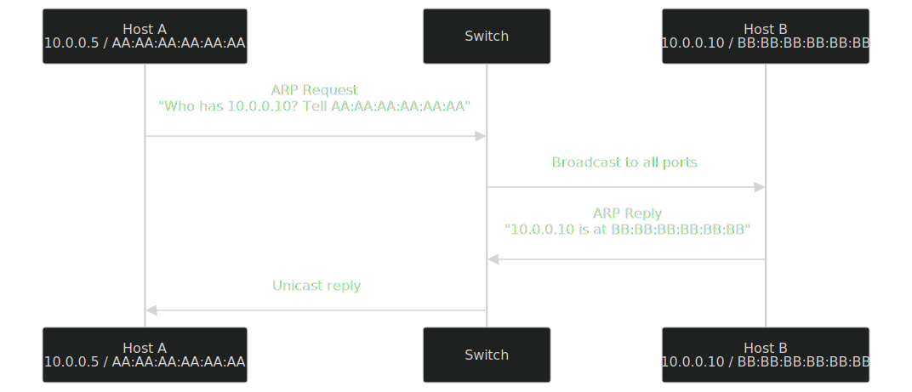

# 🌐 The Ultimate Computer Networks Handbook
## A Production-Grade, Enterprise-Ready Guide to Modern Networking
> 📘 About This Document
    This is the definitive GitHub handbook on Computer Networks — engineered for Computer Science students, Network Engineers, Cybersecurity professionals, DevOps/Cloud Engineers, System Administrators, Software Engineers, Ethical Hackers, and IT practitioners. It spans foundational theory to enterprise architecture, from copper cabling to cloud-native SDN, from ping to BGP route reflectors.
    📖 Reference Use: Lifetime

---

# 📑 Table of Contents
* 🌟 Introduction
🧱 Networking Fundamentals
🗺️ Types of Networks
🔗 Network Topologies
🏛️ OSI Model — Layer by Layer
🌍 TCP/IP Model
🔌 Ethernet Deep Dive
🆔 MAC Addressing
🧮 IP Addressing
🎯 Subnetting Masterclass
🛣️ Routing
🔀 Switching
🖥️ Network Devices
📡 DNS — Domain Name System
🎁 DHCP
📜 Network Protocols
🚪 Ports Reference
📶 Wireless Networking
💡 Fiber Networking
🧵 Cabling & Physical Media
🛡️ Network Security
☁️ Cloud Networking
🐳 Containers & Kubernetes Networking
🧠 SDN & SD-WAN
📊 Network Monitoring
🔬 Packet Analysis
⚡ Network Performance
🔧 Troubleshooting Toolkit
🏢 Enterprise Architecture
🎓 Certifications Roadmap
💼 Interview Questions
📋 Cheat Sheets
✅ Best Practices
⚠️ Common Mistakes
📚 Resources & References

---

# 🌟 Introduction
## What is Computer Networking?
> 💡 Definition
    Computer Networking is the discipline of designing, implementing, managing, and troubleshooting the infrastructure that enables digital devices to exchange data, share resources, and coordinate operations across local, metropolitan, wide-area, and global distances using standardized protocols.

At its core, networking solves three fundamental problems:
1. **Reachability** — How does a packet from device A find device B?
2. **Reliability** — How do we guarantee data integrity across unreliable media?
3. **Resource Sharing** — How do multiple users share expensive hardware (printers, storage, bandwidth)?
<p align="center">
  
</p>

## History of Networking
| Year | Milestone | Impact |
|------|-----------|--------|
| **1837** | Telegraph (Morse code) | First electrical long-distance communication |
| **1876** | Telephone (Bell) | Voice communication becomes viable |
| **1969** | **ARPANET** (4 nodes) | Birth of packet switching; UCLA, SRI, UCSB, Utah |
| **1971** | Ray Tomlinson invents email | First networked application |
| **1973** | TCP/IP designed (Vint Cerf, Bob Kahn) | Foundational Internet protocol |
| **1983** | ARPANET switches to TCP/IP | January 1, 1983 — "Flag Day" |
| **1984** | DNS introduced (RFC 882/883) | Replaces `/etc/hosts` files |
| **1985** | NSFNET (56 Kbps) | Internet becomes academic backbone |
| **1989** | Tim Berners-Lee proposes WWW | CERN, HTTP/HTML/URL |
| **1991** | World Wide Web public | HTTP, first browser |
| **1995** | Commercial Internet opens | NSFNET decommissioned |
| **1998** | Google founded | Search transforms the web |
| **2003** | Wi-Fi 802.11g | Wireless becomes mainstream |
| **2006** | Amazon Web Services (AWS) | Cloud networking emerges |
| **2008** | iPhone + App Store | Mobile-first networking |
| **2014** | Kubernetes released | Container orchestration networking |
| **2019** | Wi-Fi 6 (802.11ax) | Modern high-density wireless |
| **2023** | Wi-Fi 7 (802.11be) | 320 MHz channels, MLO |
| **2024+** | AI-driven networking, 800G Ethernet | Data center backbone evolution |
## Evolution of Networks
<p align="center">
  
</p>

## Why Networks Matter
Networks are the **nervous system of modern civilization**:
* 🏥 **Healthcare**: MRI machines, telemedicine, EHR systems
* 💰 **Finance**: High-frequency trading, payment networks (SWIFT, Visa)
* 🚦 **Transportation**: Air traffic control, autonomous vehicles, smart cities
* 🏭 **Industry**: SCADA systems, IoT, Industry 4.0
* 🎓 **Education**: Distance learning, research collaboration
* 🎬 **Entertainment**: Streaming, gaming, social media
* 🛡️ **Defense**: Command & control, intelligence networks
* 🔬 **Science**: CERN's LHC produces ~1 PB/s of data
## Real-world Applications
| Domain | Network Use Case | Key Technologies |
|--------|------------------|------------------|
| **Banking** | ATM networks, HFT | MPLS, low-latency Ethernet, dark fiber |
| **Healthcare** | PACS imaging, EHR | HL7, DICOM, VPNs, private clouds |
| **Retail** | POS systems, inventory | SD-WAN, 4G/5G failover |
| **Manufacturing** | OT/ICS networks | Industrial Ethernet, Profinet, TSN |
| **Media** | Live broadcasting | Multicast, JPEG-XS, SMPTE 2110 |
| **Education** | Campus networks | NAC, 802.1X, BYOD |
| **Telecom** | 5G core networks | SBA, Service-Based Architecture |
| **Cloud** | Multi-region replication | Anycast, BGP, VXLAN, EVPN |
## Internet vs Network
| Aspect | Network | Internet |
|--------|---------|----------|
| **Scope** | Local (LAN), private | Global, public |
| **Ownership** | Single organization | Nobody / everyone (multi-stakeholder) |
| **Administration** | Centralized | Distributed |
| **Addressing** | Private (RFC 1918) or public | Public IP space |
| **Trust** | High (controlled) | Low (hostile environment) |
| **Examples** | Office LAN, hospital network | WWW, public services |
> 📝 Note
    The Internet (capitalized) is the global public network of networks. An internet (lowercase) is any interconnected network of networks — your home LAN with two routers technically forms an internet. 

---

# 🧱 Networking Fundamentals
## Nodes
A **node** is any device capable of sending, receiving, or forwarding data over a network. This includes computers, routers, switches, printers, IoT sensors, and even smartphones.
```text
Classification of Nodes:
├── End Nodes (Hosts): PCs, servers, phones, printers
├── Transit Nodes: Routers, switches, firewalls, gateways
└── Hybrid Nodes: Layer-3 switches (route + switch)
```
## Hosts
A **hos** is any end-system that originates or terminates data flows. Every host has:
* At least one **NIC** (Network Interface Card)
* A **MAC address** (Layer 2 identity)
* An **IP address** (Layer 3 identity)
* A **hostname** (human-readable label)
```bash
# Linux — Identify host networking
ip addr show                  # Show IP addresses
ip link show                  # Show interfaces
hostname -I                   # Show assigned IPs
cat /etc/hosts                # Local host mapping

# Windows
ipconfig /all
hostname
```
## Clients
A **client** is a host that initiates requests. Modern examples include:
* Web browsers (Chrome, Firefox)
* Mobile apps (Instagram, WhatsApp)
* CLI tools ( 'curl', 'psql', 'ssh')
* API consumers (microservices)
> ⚠️ Important
    "Client" is a role, not a hardware type. A server can act as a client to another server (e.g., a backend API calling a database). 

## Servers
A **server** is a host that listens for and responds to client requests. Server classes:
| Class | Form Factor | Use Case |
|-------|-------------|----------|
| Tower | Standalone | SMB file server |
| Rack (1U/2U/4U) | 19" rack | Enterprise workloads |
| Blade | Chassis-based | High-density compute |
| Hyperconverged | Rack + storage | HCI (Nutanix, vSAN) |
| Mainframe | Custom | Banking, transaction processing |
## Workstations
High-performance client machines used for engineering (CAD, EDA), video editing, scientific simulation, or financial modeling. They typically feature:
* Multi-core CPUs (Xeon, Threadripper)
* ECC memory
* Professional GPUs (NVIDIA RTX A-series, Quadro)
* 10GbE+ NICs
## End Devices
End devices (or end-points) are hosts where data originates or terminates. They include:
* 💻 Laptops, desktops
* 📱 Smartphones, tablets
* 🖨️ Network printers
* 📷 IP cameras
* 📺 Smart TVs, streaming boxes
* 🏭 IoT sensors, PLCs
## Network Devices
These operate at various OSI layers (covered in detail later):
| Device | Layer | Function |
|--------|-------|----------|
| Hub | 1 | Repeats electrical signals (legacy) |
| Repeater | 1 | Amplifies/regenerates signal |
| Bridge | 2 | Segments collision domains |
| Switch | 2 | MAC-based forwarding |
| Router | 3 | IP-based path selection |
| Layer-3 Switch | 3 | Hardware-accelerated routing + switching |
| Firewall | 3-7 | Stateful packet filtering |
| Load Balancer | 4-7 | Distributes traffic across servers |
| IDS/IPS | 7 | Signature/anomaly-based detection |
## Data Transmission
Data can travel via:
1. **Electrical signals** — Copper cables (Ethernet)
2. **Light pulses** — Fiber optic cables
3. **Radio waves** — Wi-Fi, cellular, satellite
4. **Microwaves** — Point-to-point links
5. **Infrared** — Short-range, line-of-sight
## Transmission modes:
* **Simplex** — One direction only (radio broadcast)
* **Half-duplex** — Both directions, not simultaneously (walkie-talkie)
* **Full-duplex** — Both directions simultaneously (modern Ethernet, telephone)
```text
Simplex:        A -----> B

Half-duplex:    A <----> B   (one at a time)

Full-duplex:    A <====> B   (simultaneous)
```
## Communication Models
### Connectionless Communication
No handshake; sender transmits immediately (e.g., UDP, IP). **Fast, unreliable**.
### Connection-Oriented Communication
Three-way handshake establishes state (e.g., TCP). **Slower, reliable, ordered**.
### Connection-Oriented (Lightweight)
Modern hybrids like **QUIC** combine TCP reliability with UDP's speed.
## Digital Communication
Digital data is fundamentally a sequence of bits. Encoding schemes translate bits to physical signals:
| Encoding | Description | Use |
|----------|-------------|-----|
| NRZ (Non-Return to Zero) | High = 1, Low = 0 | Legacy serial |
| Manchester | Transition in middle of bit | 10Base-T Ethernet |
| 8b/10b | 8 data bits → 10 encoded | Gigabit Ethernet, PCIe |
| 64b/66b | 64 data bits → 66 encoded | 10G+ Ethernet |
| PAM-4 (Pulse Amplitude Modulation 4-level) | 4 voltage levels per symbol | 25G/50G/100G/200G Ethernet |
> 💡 Tip
    Higher-order modulation (PAM-4, PAM-8) increases bandwidth at the cost of signal-to-noise ratio (SNR). This is why 400G/800G links require high-quality fiber and forward error correction (FEC). 

---

# 🗺️ Types of Networks
## 🌐 PAN (Personal Area Network)
**Range**: ~10 meters | **Owner**: Individual
| Aspect | Details |
|--------|---------|
| **Definition** | A network for personal devices within reach of one person |
| **Technologies** | Bluetooth, BLE, Zigbee, Infrared, NFC, USB, Thunderbolt |
| **Topology** | Star (around phone/laptop) |
| **Speed** | 1 Mbps (BLE) – 480 Mbps (USB 2.0) – 40 Gbps (Thunderbolt 3) |
| **Advantages** | No infrastructure; low power; cheap |
| **Disadvantages** | Very limited range; not scalable |
| **Use Cases** | Wireless earbuds, smartwatches, mouse/keyboard, IoT |
*Example*: A smartwatch connects to a phone via BLE, the phone to earbuds via Bluetooth, and the phone to a laptop via Wi-Fi Direct — all forming a personal ecosystem.
## 🏢 LAN (Local Area Network)
**Range**: Building or campus (up to a few km) | **Owner**: Organization
| Aspect | Details |
|--------|---------|
| **Definition** | A privately owned, high-speed network connecting devices in a limited area |
| **Technologies** | Ethernet (1G/10G/25G/100G), Wi-Fi |
| **Topology** | Star (modern), hierarchical |
| **Speed** | 1 Mbps – 400 Gbps |
| **Standards** | IEEE 802.3 (Ethernet), 802.11 (Wi-Fi) |
| **Advantages** | High bandwidth, low latency, low cost, full ownership |
| **Disadvantages** | Limited geographic scope; requires infrastructure |
| **Use Cases** | Office networks, schools, hospitals, factories |
<p align="center">
  
</p>

## 📶 WLAN (Wireless LAN)
A LAN using radio waves instead of cables.
| Aspect | Details |
|--------|---------|
| **Standards** | IEEE 802.11a/b/g/n/ac/ax/be |
| **Frequency Bands** | 2.4 GHz, 5 GHz, 6 GHz, 60 GHz (WiGig) |
| **Coverage** | 35m indoor / 100m outdoor (typical) |
| **Advantages** | Mobility, easy deployment, no cabling |
| **Disadvantages** | Shared medium, interference, security risks |
| **Use Cases** | Office Wi-Fi, home networks, public hotspots |
## 🏙️ CAN (Campus Area Network)
Range: Multiple buildings on a contiguous site (1–10 km)
| Aspect | Details |
|--------|---------|
| **Definition** | Interconnects multiple LANs within a university campus, corporate park, or military base |
| **Technologies** | Fiber Ethernet, dark fiber, MPLS |
| **Topology** | Hierarchical (core-distribution-access) |
| **Advantages** | Larger scope than LAN; still single management |
| **Disadvantages** | Requires fiber rollout; complex spanning tree |
| **Use Cases** | Universities, hospitals, corporate HQ |
## 🏙️ MAN (Metropolitan Area Network)
Range: City-wide (10–100 km)
| Aspect | Details |
|--------|---------|
| **Definition** | Spans a city or metropolitan area, often operated by a service provider |
| **Technologies** | Metro Ethernet, MPLS, dark fiber, GPON, DOCSIS |
| **Standards** | IEEE 802.16 (WiMAX, legacy), MEF (Metro Ethernet Forum) |
| **Advantages** | High bandwidth across city; shared infrastructure |
| **Disadvantages** | Costly; provider-dependent |
| **Use Cases** | Municipal networks, ISP backbones, government connectivity |
## 🌎 WAN (Wide Area Network)
**Range**: Country or global | **Owner**: Carriers / ISPs
| Aspect | Details |
|--------|---------|
| **Definition** | Covers broad geographic areas, connecting cities, countries, or continents |
| **Technologies** | MPLS, SD-WAN, leased lines, satellite, undersea fiber |
| **Topology** | Mesh, hub-and-spoke |
| **Speed** | 1 Mbps (legacy) to 100+ Gbps (modern backbones) |
| **Advantages** | Global reach; carrier-managed |
| **Disadvantages** | High cost, high latency, SLA-dependent |
| **Use Cases** | Enterprise connectivity, ISP backbones |
<p align="center">
  
</p>

## 💾 SAN (Storage Area Network)
**Range**: Data center | **Owner**: IT organization
| Aspect | Details |
|--------|---------|
| **Definition** | High-speed network dedicated to block-level storage access |
| **Technologies** | Fibre Channel (8G/16G/32G/64G/128G), iSCSI, FCoE, NVMe-oF |
| **Topology** | Switched fabric |
| **Advantages** | High throughput (16+ Gbps); low latency; isolated from LAN |
| **Disadvantages** | Expensive; specialized skills |
| **Use Cases** | Enterprise storage, databases, virtualization |
## 🔒 VPN (Virtual Private Network)
A tunneled, encrypted overlay network over a public or untrusted infrastructure.
| Type | Description | Use |
|------|-------------|-----|
| **Site-to-Site** | Connects two networks (e.g., branch to HQ) | Enterprise WAN replacement |
| **Remote Access** | Individual user to corporate network | Work-from-anywhere |
| **MPLS VPN (L3VPN / L2VPN)** | Provider-managed virtual circuits | Carrier services |
| **SSL/TLS VPN** | Browser-based, no client needed | Contractor access |
## 🛰️ GAN (Global Area Network)
**Range**: Global (satellite-based)
Examples: Iridium satellite network, Starlink constellation (3,000+ LEO satellites). GANs support voice and data over satellite links anywhere on Earth.
## 🏢 Intranet
A private network accessible only to an organization's employees. Uses private IPs (RFC 1918) and security controls (firewalls, NAC). Examples: corporate file shares, internal HR portals.
## 🔗 Extranet
A controlled extension of an intranet, granting limited access to external partners, suppliers, or customers. Example: a manufacturer sharing inventory data with retailers via a B2B portal.
## 🌐 Internet
The global, public, interconnected network of networks using TCP/IP. Governed (loosely) by ICANN, IETF, RIRs (ARIN, RIPE, APNIC, etc.).
| Property | Value |
|----------|-------|
| **Routing Protocol** | BGP (Border Gateway Protocol) |
| **Address Space** | ~4.3 billion IPv4, 340 undecillion IPv6 |
| **Number of ASNs** | 70,000+ (as of 2024) |
| **Undersea Cables** | 530+ active submarine cables |
| **Latency (light in fiber)** | ~67% of speed of light |

---

# 🔗 Network Topologies
## 🚌 Bus Topology
All devices share a single backbone cable.
```text
=========PC1====PC2====PC3====PC4=========
       (terminator)                (terminator)
```
| Pros | Cons |
|------|------|
| Simple, cheap | Single point of failure |
| Good for small networks | Performance degrades with traffic |
| Easy to extend (within limits) | Difficult to troubleshoot |
**Used in**: Legacy Ethernet (10Base-2/10Base-5), cable TV distribution
## 💍 Ring Topology
Each device connects to exactly two others, forming a closed loop.
```text
       PC1
      /    \
   PC6      PC2
    |        |
   PC5      PC3
      \    /
       PC4
```
| Pros | Cons |
|------|------|
| Predictable performance | Single break disables entire ring |
| Easy fault identification (token ring) | Difficult to add/remove devices |
| No need for server | Legacy technology |
*Used in**: Legacy Token Ring (IEEE 802.5), FDDI, SONET/SDH rings, modern *RPR* (Resilient Packet Ring).
## ⭐ Star Topology
All devices connect to a central hub/switch.
```texy
       PC1
        |
PC2 --- SW --- PC3
        |
       PC4
```
| Pros | Cons |
|------|------|
| Easy to install/manage | Central device is SPOF |
| One cable failure = one device down | More cabling required |
| Easy to scale | Hub broadcasts = collisions |
**Used in**: Modern Ethernet LANs, 99% of contemporary networks.
## 🕸️ Mesh Topology
Every device connects to every other device (full mesh) or some subset (partial mesh).
```text
Full Mesh (4 nodes):
PC1 --- PC2
 |  \   |
 |   \  |
PC3 --- PC4

Partial Mesh (5 nodes):
PC1 --- PC2
 |       |
PC3 --- PC4 --- PC5
```
| Pros | Cons |
|------|------|
| Maximum redundancy | Expensive (n(n-1)/2 links for full mesh) |
| Self-healing | Complex configuration |
| Load balancing | Difficult to troubleshoot |
**Used in**: Internet backbone (BGP), data center fabrics (spine-leaf), wireless mesh networks.
## 🌳 Tree (Hierarchical) Topology
A combination of star and bus topologies, organized in ranks.
```text
         [Core]
        /      \
    [Dist1]   [Dist2]
    /    \      /    \
[Acc1] [Acc2] [Acc3] [Acc4]
  |      |      |      |
 PC     PC     PC     PC
```
| Pros | Cons |
|------|------|
| Scalable | Root failure affects entire branch |
| Logical segmentation | Long cable runs |
| Easier troubleshooting | More complex than star |
**Used in**: Campus networks, large enterprises, Cisco's classic three-tier model.
## 🔀 Hybrid Topology
Combines two or more topologies. **Real-world networks are almost always hybrid**.
Example: A star-bus-ring hybrid (common in fiber-to-the-home deployments).
## 🔗 Point-to-Point Topology
A direct link between two devices.
```text
RouterA ========= RouterB
```
**Used in**: Leased lines, serial WAN links, fiber cross-connects, undersea cables.
## 🌼 Daisy Chain Topology
Devices connect in series; data passes through intermediate nodes.
```text
PC1 --- PC2 --- PC3 --- PC4 --- PC5
```
| Pros | Cons |
|------|------|
| Minimal cabling | Latency compounds |
| Easy to chain sensors/devices | One failure breaks the chain |
| Cheap | Difficult to identify failures |
**Used in**: USB devices, RS-485 industrial networks, daisy-chained monitors, MSTP/RSTP.
## 🏗️ Modern Enterprise Topology: Spine-Leaf
The data center standard replacing three-tier.
<p align="center">
  
</p>
| Property | Benefit |
|----------|---------|
| Every leaf is **N** hops from any other leaf | Predictable latency |
| All paths are equal-cost | Optimal ECMP utilization |
| Scale by adding spines or leaves | Linear scalability |
| VXLAN/EVPN overlay | Multi-tenancy, L2 over L3 |

---

# 🏛️ OSI Model — Layer by Layer
The **Open Systems Interconnection (OSI)** model is a seven-layer conceptual framework standardized by **ISO/IEC 7498-1**. It decouples networking functions into independent layers, each with well-defined responsibilities and interfaces.
<p align="center">
  
</p>

## Mnemonic Acronyms
| Direction | Acronym | Layers |
|-----------|---------|--------|
| Top-down | **A**ll **P**eople **S**eem **T**o **N**eed **D**ata **P**rocessing | 7→1 |
| Bottom-up | **P**lease **D**o **N**ot **T**hrow **S**ausage **P**izza **A**way | 1→7 |
## 🟣 Layer 1 — Physical
Purpose: Transmits raw bits over a physical medium.
| Attribute | Details |
|-----------|---------|
| **Responsibilities** | Bit synchronization, voltage levels, physical topology, mechanical connectors |
| **PDU** | **Bit** |
| **Devices** | Hub, Repeater, Network Interface Card (NIC), Cable, Connector |
| **Media** | Copper (UTP, STP, Coax), Fiber (SMF, MMF), Wireless (radio) |
| **Standards** | IEEE 802.3 (clause on physical), TIA-568, ISO/IEC 11801 |
| **Examples** | RJ45, LC, SC, MPO connectors; Cat6, OS2 fiber |
### Signal Characteristics
* **Voltage levels**: 1000BASE-T uses ±1 V differential
* **Encoding**: Manchester (10M), MLT-3 (100M), 8b/10b (1G), 64b/66b (10G+), PAM-4 (25G+)
* **Clock recovery**: Embedded in bit stream (e.g., 8b/10b comma character)
### Common Problems at Layer 1
* ❌ Cable too long (>100m for UTP)
* ❌ EMI/RFI interference from motors, fluorescents
* ❌ Bad connectors (untwist too much at termination)
* ❌ Mismatched fiber types (SM to MM)
* ❌ Dirty fiber end-faces (single biggest cause of optical issues)
* ❌ Duplex mismatch (one side auto, other fixed)
```bash
# Check link state
ethtool eth0                    # Linux
show interfaces status          # Cisco IOS

# Check optical power
show interfaces transceiver     # Cisco
```
> 💡 Best Practice
    Always label both ends of every cable. Always test new runs with a cable certifier (Fluke, Ideal). Always clean fiber connectors before connecting.

## 🔵 Layer 2 — Data Link
Purpose: Provides node-to-node data transfer across a physical link.
| Attribute | Details |
|-----------|---------|
| **Responsibilities** | Framing, MAC addressing, error detection (CRC), media access control (CSMA/CD, CSMA/CA), flow control |
| **PDU** | **Frame** |
| **Sub-layers** | **LLC** (Logical Link Control, IEEE 802.2) + **MAC** (Media Access Control) |
| **Devices** | Switch, Bridge, NIC |
| **Standards** | IEEE 802.3 (Ethernet), 802.11 (Wi-Fi), 802.1Q (VLAN), 802.1X (Auth) |
| **Example Protocols** | Ethernet, ARP, STP, LLDP, PPP, HDLC, Frame Relay (legacy) |
### Ethernet Frame Structure
```text
┌──────────┬────────┬─────────┬─────────┬─────────┬──────┬─────────┐
│Preamble  │ SFD    │ Dest MAC│ Src MAC │ EtherType│ Data │  FCS    │
│ 7 bytes  │1 byte  │ 6 bytes │ 6 bytes │ 2 bytes │46-1500│ 4 bytes │
└──────────┴────────┴─────────┴─────────┴─────────┴──────┴─────────┘

Preamble:    10101010... (clock synchronization)
SFD:         10101011 (Start Frame Delimiter)
Dest/Src:    MAC addresses
EtherType:   0x0800 = IPv4, 0x86DD = IPv6, 0x0806 = ARP
FCS:         CRC-32 checksum
```
### Switching Methods
| Method | Description | Latency | Use |
|--------|-------------|---------|-----|
| **Store-and-Forward** | Reads entire frame, checks CRC, forwards | Higher | Modern switches |
| **Cut-Through** | Forwards as soon as destination MAC is read | Lowest | HFT, niche |
| **Fragment-Free** | First 64 bytes checked (collision fragments) | Medium | Legacy |
### Spanning Tree Protocol (STP)
Prevents loops in switched L2 topologies by blocking redundant paths. **IEEE 802.1D** — converges in 30-50 seconds. **RSTP (802.1w)** — sub-second convergence. **MSTP (802.1s)** — multiple instances.
### Attacks at Layer 2
* 🚨 MAC flooding — Overwhelm CAM table → switch becomes hub
* 🚨 ARP spoofing — Trick hosts into sending traffic to attacker
* 🚨 VLAN hopping — Double-tagging attack
* 🚨 STP manipulation — Become root bridge
* 🚨 DHCP starvation — Exhaust DHCP pool
### Defenses
* Port security (limit MACs per port)
* DHCP snooping
* Dynamic ARP Inspection (DAI)
* BPDU Guard
* Root Guard

## 🟢 Layer 3 — Network
Purpose: Logical addressing and routing across networks.
| Attribute | Details |
|-----------|---------|
| **Responsibilities** | IP addressing, packet forwarding, fragmentation, routing |
| **PDU** | **Packet** (or **Datagram**) |
| **Devices** | Router, Layer-3 Switch |
| **Protocols** | IPv4, IPv6, ICMP, IGMP, OSPF, BGP, RIP, EIGRP, IS-IS |
| **Standards** | RFC 791 (IPv4), RFC 8200 (IPv6), RFC 2328 (OSPF), RFC 4271 (BGP) |
### IPv4 Header (20 bytes minimum)
```text
 0                   1                   2                   3
 0 1 2 3 4 5 6 7 8 9 0 1 2 3 4 5 6 7 8 9 0 1 2 3 4 5 6 7 8 9 0 1
+-+-+-+-+-+-+-+-+-+-+-+-+-+-+-+-+-+-+-+-+-+-+-+-+-+-+-+-+-+-+-+-+
|Version|  IHL  |    DSCP   |ECN|         Total Length          |
+-+-+-+-+-+-+-+-+-+-+-+-+-+-+-+-+-+-+-+-+-+-+-+-+-+-+-+-+-+-+-+-+
|         Identification        |Flags|    Fragment Offset      |
+-+-+-+-+-+-+-+-+-+-+-+-+-+-+-+-+-+-+-+-+-+-+-+-+-+-+-+-+-+-+-+-+
|  Time to Live |    Protocol   |       Header Checksum         |
+-+-+-+-+-+-+-+-+-+-+-+-+-+-+-+-+-+-+-+-+-+-+-+-+-+-+-+-+-+-+-+-+
|                       Source Address                          |
+-+-+-+-+-+-+-+-+-+-+-+-+-+-+-+-+-+-+-+-+-+-+-+-+-+-+-+-+-+-+-+-+
|                    Destination Address                        |
+-+-+-+-+-+-+-+-+-+-+-+-+-+-+-+-+-+-+-+-+-+-+-+-+-+-+-+-+-+-+-+-+
|                    Options                    |    Padding    |
+-+-+-+-+-+-+-+-+-+-+-+-+-+-+-+-+-+-+-+-+-+-+-+-+-+-+-+-+-+-+-+-+
```
### Routing Logic
```text
1. Receive packet on interface
2. Look up destination IP in routing table
3. Match longest prefix (most specific route)
4. Decrement TTL; drop if TTL = 0 (ICMP Time Exceeded)
5. Recalculate IP header checksum
6. Forward out egress interface (or to next hop)
```
### Layer 3 Devices
| Device | Purpose |
|--------|---------|
| **Router** | Connects different networks; makes forwarding decisions |
| **Layer-3 Switch** | Hardware-accelerated routing in campus/DC |
| **Firewall** | Filters based on IP/port/protocol |
| **Load Balancer** | Distributes across multiple L3 paths/servers |
## 🟡 Layer 4 — Transport
Purpose: End-to-end communication, reliability, multiplexing.
| Attribute | Details |
|-----------|---------|
| **Responsibilities** | Port-based multiplexing, segmentation, flow control, error recovery, congestion control |
| **PDU** | **Segment** (TCP) / **Datagram** (UDP) |
| **Protocols** | TCP (RFC 9293), UDP (RFC 768), QUIC (RFC 9000), SCTP (RFC 4960), DCCP |
| **Port Range** | 0–65535 (16-bit field) |
### TCP vs UDP vs QUIC
| Feature | TCP | UDP | QUIC |
|---------|-----|-----|------|
| **Connection setup** | 3-way handshake | None | 1-RTT (0-RTT optional) |
| **Reliability** | Yes (ACKs, retransmit) | No | Yes |
| **Ordering** | Yes | No | Yes |
| **Flow control** | Yes | No | Yes |
| **Congestion control** | Yes | No | Yes |
| **Header size** | 20-60 bytes | 8 bytes | Variable (~16B) |
| **Encryption** | Optional (TLS later) | Optional (DTLS) | Mandatory (TLS 1.3) |
| **Multiplexing** | Single stream per conn | Per-packet | Many streams per conn |
| **Use cases** | Web, email, SSH, FTP | DNS, VoIP, video, gaming | HTTP/3, modern web |
### TCP Three-Way Handshake
<p align="center">
  
</p>

## TCP State Machine
States: 'LISTEN', 'SYN_SENT', 'SYN_RECEIVED', 'ESTABLISHED', 'FIN_WAIT_1', 'FIN_WAIT_2', 'CLOSE_WAIT', 'CLOSING', 'LAST_ACK', 'TIME_WAIT', 'CLOSED'.

TIME_WAIT waits 2 × MSL (Maximum Segment Lifetime, typically 60s) to ensure the final ACK arrives.
## TCP Flags
* **SYN** — Synchronize (initiate connection)
* **ACK** — Acknowledgment
* **FIN** — Finish (graceful close)
* **RST** — Reset (abort connection)
* **PSH** — Push (deliver to app immediately)
* **URG** — Urgent pointer valid
## Famous TCP Attacks
* 🚨 **SYN flood** — Send many SYNs, exhaust resources (mitigation: SYN cookies)
* 🚨 **TCP reset attack** — Inject RST to kill connections
* 🚨 **Session hijacking** — Predict sequence numbers (mostly mitigated today)
* 🚨 **Slowloris** — Hold connections open with partial HTTP requests

## 🟠 Layer 5 — Session
Purpose: Manages sessions (dialogs) between applications.
| Aspect | Details |
|--------|---------|
| **Responsibilities** | Session establishment, maintenance, termination; checkpointing; recovery |
| **Protocols** | NetBIOS, RPC (ONC-RPC, DCE-RPC), PPTP, L2TP, SIP (signaling), SMB (sessions) |
| **Examples** | Authentication sessions, RPC bindings, SIP dialogs |
> 📝 Note
    In practice, the Session layer is rarely a discrete boundary in modern protocols. TCP handles most session lifecycle; TLS adds security; application protocols (HTTP, SIP) manage their own dialogs. 

## 🔴 Layer 6 — Presentation
Purpose: Data representation, encoding, encryption.
| Aspect | Details |
|--------|---------|
| **Responsibilities** | Character encoding (ASCII, UTF-8), data serialization (XDR, ASN.1, Protocol Buffers, JSON, XML), compression (gzip, deflate), encryption (TLS, SSL) |
| **Standards** | ASN.1 (BER, DER), MIME, TLS 1.2/1.3 |
## Common Encoding Formats
| Format | Use Case |
|--------|----------|
| **ASCII** | Legacy English text |
| **UTF-8** | Modern universal text (web, JSON, XML) |
| **ASN.1/BER** | X.509 certificates, SNMP, LDAP |
| **Protocol Buffers** | gRPC, high-perf RPC |
| **MessagePack** | Compact binary JSON alternative |
| **Avro** | Schema evolution, big data |
| **CBOR** | IoT, constrained devices |
## 🟣 Layer 7 — Application
Purpose: Network services to end-user applications.
| Aspect | Details |
|--------|---------|
| **Responsibilities** | High-level APIs, resource sharing, remote file access, directory services, email, web |
| **Protocols** | HTTP/1.1, HTTP/2, HTTP/3, DNS, DHCP, FTP, SFTP, SSH, SMTP, POP3, IMAP, SNMP, LDAP, MQTT, CoAP, WebSocket, gRPC |

### Application-Layer Attacks
* 🚨 **SQL injection** (in HTTP bodies)
* 🚨 **XSS** (cross-site scripting)
* 🚨 **CSRF** (cross-site request forgery)
* 🚨 **Path traversal**
* 🚨 **Buffer overflow** (e.g., IIS, Apache)
* 🚨 **HTTP request smuggling**
* 🚨 **Slowloris / R-U-Dead-Yet**

---

# 🔁 Packet Flow Through OSI Layers
When you browse to https://example.com:
<p align="center">
  
</p>

> 📝 Note
    Data flow is encapsulation going down (each layer adds a header), and de-encapsulation going up (each layer strips and processes its header).

---

# 🌍 TCP/IP Model
The **TCP/IP model** (also called the **Internet Protocol Suite**) is the practical model that powers the Internet. It was developed by DARPA in the 1970s, formalized in **RFC 1122**, and described in detail in **RFC 1180**.
<p align="center">
  
</p>

## Layer Comparison: OSI vs TCP/IP
| OSI Layer | TCP/IP Layer | Protocols |
|-----------|--------------|-----------|
| 7 Application | **Application** | HTTP, DNS, SMTP, SSH, FTP, SNMP |
| 6 Presentation | *(merged into App)* | TLS, MIME, ASN.1 |
| 5 Session | *(merged into App)* | NetBIOS, RPC |
| 4 Transport | **Transport** | TCP, UDP, QUIC, SCTP |
| 3 Network | **Internet** | IP, ICMP, IGMP, ARP (sometimes Link) |
| 2 Data Link | **Link** | Ethernet, Wi-Fi, PPP, Frame Relay |
| 1 Physical | *(part of Link)* | Cables, fiber, radio |
## Why TCP/IP Won Over OSI
| Factor | TCP/IP | OSI |
|--------|--------|-----|
| **Origin** | Practical, deployed by ARPANET | Academic, theoretical |
| **Implementation** | Already deployed | Rarely implemented |
| **Government backing** | US DoD | ISO/IEC |
| **Time to market** | 1970s — production | 1984 — standard |
| **Simplicity** | 4 layers | 7 layers |
| **Real-world use** | Foundation of the Internet | Reference model |
> 💡 Tip
    Use the OSI model to learn and diagnose ("start at Layer 1, work up"). Use TCP/IP to deploy and configure ("which interface? which subnet?").
## Mapping Example: HTTPS Web Request
| TCP/IP Layer | Encapsulation Unit | Example |
|--------------|-------------------|---------|
| Application | Message | `GET /index.html HTTP/1.1\r\nHost: example.com\r\n` |
| Transport | Segment | TCP header (src=54321, dst=443, seq=1, ack=1) + payload |
| Internet | Packet | IP header (src=10.0.0.5, dst=93.184.216.34, proto=6) + segment |
| Link | Frame | Ethernet header (src=aa:bb:cc:dd:ee:ff, dst=...) + packet + FCS |

---

# 🔌 Ethernet Deep Dive
## Ethernet Frame Formats
### Standard Ethernet II (DIX)
```text
┌──────────┬───┬────────┬────────┬────────┬─────────┬────┬─────┐
│Preamble  │SFD│Dest MAC│Src MAC │EtherType│ Payload │PAD │ FCS │
│ 7 bytes  │1  │ 6      │ 6      │ 2       │46-1500  │0-46│ 4   │
└──────────┴───┴────────┴────────┴────────┴─────────┴────┴─────┘
   Total: 64-1518 bytes
```
### IEEE 802.3 with 802.1Q VLAN Tag
```text
┌──────────┬───┬──────┬──────┬──────┬────┬──────────┬──────┬─────┬─────┐
│Preamble  │SFD│Dest  │Src   │TPID  │TCI │EtherType │ Data │ PAD │ FCS │
│ 7        │1  │ 6    │ 6    │0x8100│ 4  │ 2        │46-1500│0-46│ 4   │
└──────────┴───┴──────┴──────┴──────┴────┴──────────┴──────┴─────┴─────┘

TPID: 0x8100 (VLAN tag identifier)
TCI: Priority (3 bits) + DEI (1 bit) + VLAN ID (12 bits)
Max frame size with tag: 1522 bytes
```
## MTU (Maximum Transmission Unit)
| Network | MTU (bytes) |
|---------|-------------|
| Ethernet | 1500 |
| Ethernet with VLAN tag | 1496 (or 1500 with QinQ adjustments) |
| PPPoE | 1492 |
| IPSec tunnel | ~1400 (varies) |
| Jumbo Frames | 9000 (common) |
| NVMe-oF | Often uses jumbo |
### Path MTU Discovery (PMTUD)
1. Host sends packet with DF (Don't Fragment) flag set
2. If too large for a router, ICMP "Fragmentation Needed" is returned
3. Host lowers MTU and retries
4. Until success → discovered MTU
> ⚠️ Warning
    ICMP is often blocked by firewalls, breaking PMTUD. This causes mysterious connectivity failures (e.g., SSH works, HTTPS fails on large requests).

## Jumbo Frames
Frames larger than 1500 bytes, commonly 9000 bytes. Benefits:

* ✅ Higher throughput (less header overhead)
* ✅ Fewer interrupts (more data per packet)
* ✅ Lower CPU utilization
Drawbacks:

* ❌ Must be configured end-to-end (all switches, NICs, OS)
* ❌ Increases buffer requirements
* ❌ Not supported by some legacy equipment
## CRC (Cyclic Redundancy Check)
A 32-bit checksum (CRC-32) over the entire frame (excluding preamble/SFD/FCS). Detects all 1-bit errors, all 2-bit errors, all burst errors up to 32 bits, and >99.9999999% of all errors.
## Collision Domains
A network segment where simultaneous transmissions collide. **Switches separate collision domains per port**. Hubs share a collision domain.
## Broadcast Domains
A network segment where a broadcast frame reaches every device. **Routers separate broadcast domains**. VLANs partition a switch into multiple broadcast domains.
```text
Hub:        ═══════════════════════════
            [Collision + Broadcast domain: 1]

Switch:     [PC1]   [PC2]   [PC3]   [PC4]
            C1=B1   C2=B1   C3=B1   C4=B1
            (4 collision domains, 1 broadcast)

Router:     [SW1 ─ VLAN 10]──[R1]──[SW2 ─ VLAN 10]
            B=1                │     B=1
                              │
            [SW1 ─ VLAN 20]──[R1]──[SW2 ─ VLAN 20]
            B=2                      B=2
            (2 broadcast domains)
```
## CSMA/CD (Carrier Sense Multiple Access / Collision Detection)
Legacy half-duplex Ethernet access method:

1. Listen before transmitting
2. If medium idle → transmit
3. If collision detected → jam signal, back off (random delay)
4. Retry
> 📝 Note
    CSMA/CD is obsolete for full-duplex switched Ethernet (no collisions possible). Still present in Wi-Fi as CSMA/CA (Collision Avoidance). 
## Modern Ethernet Speeds
| Standard | Speed | Medium | Distance |
|----------|-------|--------|----------|
| 10BASE-T | 10 Mbps | Cat3+ UTP | 100 m |
| 100BASE-TX | 100 Mbps | Cat5 UTP | 100 m |
| 1000BASE-T | 1 Gbps | Cat5e UTP | 100 m |
| 2.5GBASE-T | 2.5 Gbps | Cat5e | 100 m |
| 5GBASE-T | 5 Gbps | Cat6 | 100 m |
| 10GBASE-T | 10 Gbps | Cat6a | 100 m |
| 10GBASE-SR | 10 Gbps | Multimode OM3 | 300 m |
| 10GBASE-LR | 10 Gbps | Singlemode | 10 km |
| 25GBASE-SR | 25 Gbps | OM4 | 100 m |
| 100GBASE-SR4 | 100 Gbps | OM4 MPO | 100 m |
| 400GBASE-DR4 | 400 Gbps | Singlemode | 500 m |
| 800GBASE-SR8 | 800 Gbps | OM4 | 100 m |

---

# 🆔 MAC Addressing
## MAC Address Format
A 48-bit identifier, typically written as six groups of two hex digits:
```text
A4:5E:60:DE:AD:BE
└────────────┬──────┘
   OUI (24-bit)   NIC-specific (24-bit)
```
## OUI (Organizationally Unique Identifier)
The first 24 bits are assigned by **IEEE** to a manufacturer. Examples:
| OUI (Hex) | Manufacturer |
|-----------|--------------|
| `00:1A:2B` | Apple |
| `00:50:F2` | Microsoft |
| `B8:27:EB` | Raspberry Pi Foundation |
| `F0:18:98` | Apple (newer) |
| `00:0C:29` | VMware |
| `00:50:56` | VMware |
| `00:1C:42` | Parallels |
## EUI-64 (64-bit MAC)
Used in IPv6 (modified EUI-64) and some modern interfaces. Format: 24-bit OUI + 40-bit extension.
## Special MAC Addresses
| Address | Purpose |
|---------|---------|
| `FF:FF:FF:FF:FF:FF` | **Broadcast** — every device on the LAN |
| `01:00:0C:CC:CC:CC` | Cisco HSRP multicast |
| `01:80:C2:00:00:00` | STP multicast (reserved) |
| `33:33:00:00:00:00` – `33:33:FF:FF:FF:FF` | IPv6 multicast |
| Locally administered bit | If first octet's bit 1 (U/L) is set, MAC is local-only |
## Unicast vs Multicast vs Broadcast
```text
Unicast:    Sender → One specific receiver (most traffic)
            AA:BB:CC:DD:EE:FF → 11:22:33:44:55:66

Multicast:  Sender → Group of interested receivers
            01:00:5E:xx:xx:xx (IPv4 multicast MACs)
            33:33:xx:xx:xx:xx (IPv6 multicast MACs)

Broadcast:  Sender → All devices on the LAN
            FF:FF:FF:FF:FF:FF
```
The **I/G bit** (Individual/Group) is the least significant bit of the first byte. Set to 1 for multicast.
## ARP (Address Resolution Protocol)
Maps IPv4 → MAC on a local network.
<p align="center">
  
</p>

## ARP Header
* Hardware Type: 1 (Ethernet)
* Protocol Type: 0x0800 (IPv4)
* Operation: 1 = Request, 2 = Reply
* Sender IP/MAC, Target IP/MAC
## ARP Table Commands
```bash
# Linux
arp -n                    # Show ARP cache
ip neigh show            # Modern equivalent
arping 10.0.0.10          # Send ARP request
arping -c 1 -I eth0 10.0.0.1

# Windows
arp -a                    # Show table
arp -d *                  # Clear table
```
## Gratuitous ARP
A host broadcasts its own IP-to-MAC mapping. Used to:

* Announce a new IP (e.g., when a NIC comes up)
* Detect IP conflicts
* Update switch CAM tables after MAC change (failover)
## CAM Table (Switch Forwarding Table)
A switch learns MAC addresses by examining source addresses of incoming frames:
```text
Frame: src=AA:AA:AA:AA:AA:AA, dst=BB:BB:BB:BB:BB:BB
Switch learns: AA:AA:AA:AA:AA:AA is on Port 1
Switch looks up BB:BB:BB:BB:BB:BB → if known, forward only to that port
                              → if unknown, flood to all ports except incoming
```
## CAM Table Attack & Defense
* **MAC Flooding**: Attacker floods thousands of random MACs → CAM overflow → switch falls back to hub mode (flooding everything).
* **Defense**: Port security — limit number of MACs per port; 802.1X authentication.

---

# 🧮 IP Addressing
## IPv4 Addressing
32-bit address, written as four dotted-decimal octets:
```text
192.168.1.10
  8 . 8 . 8 . 8 bits
```
### Address Classes (Legacy / Classful)
| Class | Range | Default Mask | Networks | Hosts |
|-------|-------|--------------|----------|-------|
| **A** | 1.0.0.0 – 126.255.255.255 | /8 | 128 | 16,777,214 |
| **B** | 128.0.0.0 – 191.255.255.255 | /16 | 16,384 | 65,534 |
| **C** | 192.0.0.0 – 223.255.255.255 | /24 | 2,097,152 | 254 |
| **D** | 224.0.0.0 – 239.255.255.255 | — | Multicast | — |
| **E** | 240.0.0.0 – 255.255.255.254 | — | Experimental | — |
> ⚠️ Warning
    Classful addressing is obsolete. Use CIDR (Classless Inter-Domain Routing) instead. 
## CIDR (Classless Inter-Domain Routing)
Replaces classes with variable-length prefixes. Written as 'IP/prefix_length'.
```text
192.168.1.0/24  =  256 addresses   (subnet mask 255.255.255.0)
10.0.0.0/8      =  16,777,216 addresses  (subnet mask 255.0.0.0)
172.16.0.0/12   =  1,048,576 addresses  (subnet mask 255.240.0.0)
203.0.113.5/30  =  4 addresses  (subnet mask 255.255.255.252)
```
### Common CIDR Cheat Sheet
| CIDR | Mask | Usable Hosts |
|------|------|--------------|
| /30 | 255.255.255.252 | 2 |
| /29 | 255.255.255.248 | 6 |
| /28 | 255.255.255.240 | 14 |
| /27 | 255.255.255.224 | 30 |
| /26 | 255.255.255.192 | 62 |
| /25 | 255.255.255.128 | 126 |
| /24 | 255.255.255.0 | 254 |
| /23 | 255.255.254.0 | 510 |
| /22 | 255.255.252.0 | 1,022 |
| /21 | 255.255.248.0 | 2,046 |
| /20 | 255.255.240.0 | 4,094 |
| /16 | 255.255.0.0 | 65,534 |
| /8 | 255.0.0.0 | 16,777,214 |
| /0 | 0.0.0.0 | 4,294,967,294 |
## Private IP Ranges (RFC 1918)
| Range | CIDR | Purpose |
|-------|------|---------|
| 10.0.0.0 – 10.255.255.255 | 10.0.0.0/8 | Large enterprises |
| 172.16.0.0 – 172.31.255.255 | 172.16.0.0/12 | Medium networks |
| 192.168.0.0 – 192.168.255.255 | 192.168.0.0/16 | Home/SMB |
## Special-Use Addresses
| Range | Purpose |
|-------|---------|
| 127.0.0.0/8 | **Loopback** (127.0.0.1 = localhost) |
| 169.254.0.0/16 | **APIPA** (Automatic Private IP Addressing — no DHCP) |
| 224.0.0.0/4 | Multicast |
| 240.0.0.0/4 | Reserved (RFC 1112) |
| 100.64.0.0/10 | **CGNAT** (Carrier-Grade NAT) shared address space |
| 192.0.2.0/24 | **TEST-NET-1** (documentation/examples) |
| 198.51.100.0/24 | **TEST-NET-2** |
| 203.0.113.0/24 | **TEST-NET-3** |
| 198.18.0.0/15 | Benchmark testing |
| 255.255.255.255 | Limited broadcast |
## Public IP Allocation
Allocated by IANA → Regional Internet Registries (RIRs) → ISPs → End users.
| RIR | Region |
|-----|--------|
| **ARIN** | USA, Canada, parts of Caribbean |
| **RIPE NCC** | Europe, Middle East, Central Asia |
| **APNIC** | Asia-Pacific |
| **LACNIC** | Latin America, Caribbean |
| **AFRINIC** | Africa |
## IPv6 Addressing
128-bit address, written as eight groups of four hex digits:
```text
2001:0db8:85a3:0000:0000:8a2e:0370:7334
```
### IPv6 Address Compression
* Leading zeros can be omitted: '2001:db8:85a3::8a2e:370:7334'
* Consecutive groups of zeros can be :: (only once per address):
* * '2001:0db8:0000:0000:0000:ff00:0042:8329 → 2001:db8::ff00:42:8329'
* '::1' = loopback
* '::' = unspecified (all zeros)
## IPv6 Address Types
| Type | Example | Scope |
|------|---------|-------|
| **Global Unicast** | `2001:db8::1` | Internet-routable (currently `2000::/3`) |
| **Link-Local** | `fe80::1` | Single L2 segment (auto-assigned) |
| **Unique Local** | `fc00::/7` | Private (RFC 4193) |
| **Multicast** | `ff02::1` (all nodes), `ff02::2` (all routers) | One-to-many |
| **Anycast** | Same address on multiple nodes | One-to-nearest |
## IPv6 Unicast Header (40 bytes)
```text
 0                   1                   2                   3
 0 1 2 3 4 5 6 7 8 9 0 1 2 3 4 5 6 7 8 9 0 1 2 3 4 5 6 7 8 9 0 1
+-+-+-+-+-+-+-+-+-+-+-+-+-+-+-+-+-+-+-+-+-+-+-+-+-+-+-+-+-+-+-+-+
|Version| Traffic Class |           Flow Label                  |
+-+-+-+-+-+-+-+-+-+-+-+-+-+-+-+-+-+-+-+-+-+-+-+-+-+-+-+-+-+-+-+-+
|         Payload Length        |  Next Header  |   Hop Limit   |
+-+-+-+-+-+-+-+-+-+-+-+-+-+-+-+-+-+-+-+-+-+-+-+-+-+-+-+-+-+-+-+-+
|                                                               |
+                                                               +
|                                                               |
|                       Source Address                          |
|                                                               |
+                                                               +
|                                                               |
+-+-+-+-+-+-+-+-+-+-+-+-+-+-+-+-+-+-+-+-+-+-+-+-+-+-+-+-+-+-+-+-+
|                                                               |
+                                                               +
|                                                               |
|                    Destination Address                        |
|                                                               |
+                                                               +
|                                                               |
+-+-+-+-+-+-+-+-+-+-+-+-+-+-+-+-+-+-+-+-+-+-+-+-+-+-+-+-+-+-+-+-+
```
> 💡 Tip
    IPv6 header is simpler and fixed-size (40 bytes). No fragmentation in routers (PMTUD end-to-end). No header checksum (faster forwarding).
## IPv4 vs IPv6
| Feature | IPv4 | IPv6 |
|---------|------|------|
| Address size | 32 bits | 128 bits |
| Total addresses | ~4.3 billion | ~3.4 × 10³⁸ |
| Header size | 20-60 bytes | 40 bytes (fixed) |
| Fragmentation | Routers + hosts | Hosts only |
| Broadcast | Yes | No (multicast only) |
| Multicast | Optional | Required |
| IPSec | Optional | Built-in |
| Auto-config | DHCP | SLAAC + DHCPv6 |
| NAT required? | Yes (address scarcity) | No (enough addresses) |
## Subnetting
Splitting a network into smaller sub-networks. (See Subnetting Masterclass section.)
## Supernetting (CIDR Aggregation)
Combining multiple networks into a single route advertisement:

* 192.168.0.0/24 + 192.168.1.0/24 → 192.168.0.0/23
* 10.0.0.0/24 + 10.0.1.0/24 + 10.0.2.0/24 + 10.0.3.0/24 → 10.0.0.0/22
## VLSM (Variable Length Subnet Masking)
Using different subnet sizes based on need. Example:

* /30 (2 hosts) for point-to-point WAN links
* /28 (14 hosts) for small office LANs
* /22 (1022 hosts) for large data center segments
## NAT (Network Address Translation)
| Type | Description |
|------|-------------|
| **Static NAT** | 1:1 mapping of public to private IP |
| **Dynamic NAT** | Pool of public IPs shared among private hosts |
| **PAT (Port Address Translation)** / NAT overload | Many private IPs share one public IP via unique port numbers |
| **CGNAT** | Carrier-Grade NAT — ISP-level PAT |
| **NAT64** | IPv6 ↔ IPv4 translation |
| **DS-Lite** | IPv4 over IPv6 tunnel with CGNAT |
## NAT Example
```text
Inside Local:    192.168.1.10:54321
Outside Global:  203.0.113.5:40001

NAT table:
192.168.1.10:54321 ↔ 203.0.113.5:40001
192.168.1.11:54322 ↔ 203.0.113.5:40002
192.168.1.12:54323 ↔ 203.0.113.5:40003
```
## APIPA (Automatic Private IP Addressing)
When a Windows host cannot reach a DHCP server, it self-assigns an address in 169.254.0.0/16 (random selection with ARP probe to detect collisions).
> ⚠️ Warning
    APIPA indicates DHCP failure. Common causes: DHCP server down, scope exhausted, VLAN misconfiguration, DHCP relay not configured, port blocked. 

---

