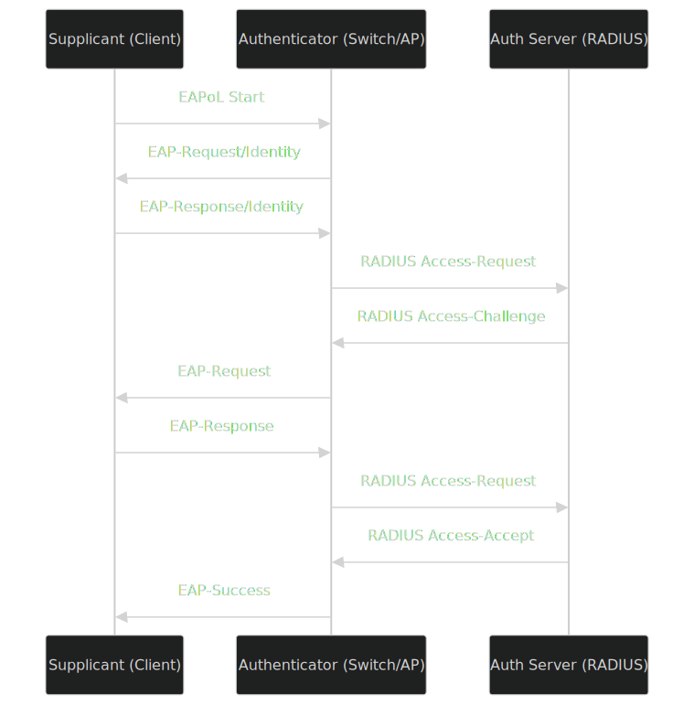

# 🌐 The Ultimate Computer Networks Handbook
## A Production-Grade, Enterprise-Ready Guide to Modern Networking
> 📘 About This Document
    This is the definitive GitHub handbook on Computer Networks — engineered for Computer Science students, Network Engineers, Cybersecurity professionals, DevOps/Cloud Engineers, System Administrators, Software Engineers, Ethical Hackers, and IT practitioners. It spans foundational theory to enterprise architecture, from copper cabling to cloud-native SDN, from ping to BGP route reflectors.
    📖 Reference Use: Lifetime

---

# 📑 Table of Contents
[🌟 Introduction](#-introduction)
[🧱 Networking Fundamentals](#-networking-fundamentals)
[🗺️ Types of Networks](#️-types-of-networks)
[🔗 Network Topologies](#-network-topologies)
[🏛️ OSI Model — Layer by Layer](#️-osi-model--layer-by-layer)
[🌍 TCP/IP Model](#-tcpip-model)
[🔌 Ethernet Deep Dive](#-ethernet-deep-dive)
[🆔 MAC Addressing](#-mac-addressing)
[🧮 IP Addressing](#-ip-addressing)
[🎯 Subnetting Masterclass](#-subnetting-masterclass)
[🛣️ Routing](#️-routing)
[🔀 Switching](#-switching)
[🖥️ Network Devices](#network-devices)
[📡 DNS — Domain Name System](#-dns--domain-name-system)
[🎁 DHCP](#-dhcp-dynamic-host-configuration-protocol)
[📜 Network Protocols](#-network-protocols)
[🚪 Ports Reference](#-ports-reference)
[📶 Wireless Networking](#-wireless-networking)
[💡 Fiber Networking](#-fiber-networking)
[🧵 Cabling & Physical Media](#-cabling--physical-media)
[🛡️ Network Security](#️-network-security)
[☁️ Cloud Networking](#️-cloud-networking)
[🐳 Containers & Kubernetes Networking](#-containers--kubernetes-networking)
[🧠 SDN & SD-WAN](#-sdn--sd-wan)
[📊 Network Monitoring](#-network-monitoring)
[🔬 Packet Analysis](#-packet-analysis)
[⚡ Network Performance](#-network-performance)
[🔧 Troubleshooting Toolkit](#-troubleshooting-toolkit)
[🏢 Enterprise Architecture](#-enterprise-architecture)
[🎓 Certifications Roadmap](#-certifications-roadmap)
[💼 Interview Questions](#-interview-questions)
[📋 Cheat Sheets](#-cheat-sheets)
[✅ Best Practices](#-best-practices)
[⚠️ Common Mistakes](#️-common-mistakes)
[📚 Resources & References](#-resources--references)

---

# 🌟 Introduction
## What is Computer Networking?
> 💡 Definition
    Computer Networking is the discipline of designing, implementing, managing, and troubleshooting the infrastructure that enables digital devices to exchange data, share resources, and coordinate operations across local, metropolitan, wide-area, and global distances using standardized protocols.

At its core, networking solves three fundamental problems:
1. **Reachability** — How does a packet from device A find device B?
2. **Reliability** — How do we guarantee data integrity across unreliable media?
3. **Resource Sharing** — How do multiple users share expensive hardware (printers, storage, bandwidth)?
<p align="center">
  
</p>

## History of Networking
| Year | Milestone | Impact |
|------|-----------|--------|
| **1837** | Telegraph (Morse code) | First electrical long-distance communication |
| **1876** | Telephone (Bell) | Voice communication becomes viable |
| **1969** | **ARPANET** (4 nodes) | Birth of packet switching; UCLA, SRI, UCSB, Utah |
| **1971** | Ray Tomlinson invents email | First networked application |
| **1973** | TCP/IP designed (Vint Cerf, Bob Kahn) | Foundational Internet protocol |
| **1983** | ARPANET switches to TCP/IP | January 1, 1983 — "Flag Day" |
| **1984** | DNS introduced (RFC 882/883) | Replaces `/etc/hosts` files |
| **1985** | NSFNET (56 Kbps) | Internet becomes academic backbone |
| **1989** | Tim Berners-Lee proposes WWW | CERN, HTTP/HTML/URL |
| **1991** | World Wide Web public | HTTP, first browser |
| **1995** | Commercial Internet opens | NSFNET decommissioned |
| **1998** | Google founded | Search transforms the web |
| **2003** | Wi-Fi 802.11g | Wireless becomes mainstream |
| **2006** | Amazon Web Services (AWS) | Cloud networking emerges |
| **2008** | iPhone + App Store | Mobile-first networking |
| **2014** | Kubernetes released | Container orchestration networking |
| **2019** | Wi-Fi 6 (802.11ax) | Modern high-density wireless |
| **2023** | Wi-Fi 7 (802.11be) | 320 MHz channels, MLO |
| **2024+** | AI-driven networking, 800G Ethernet | Data center backbone evolution |
## Evolution of Networks
<p align="center">
  
</p>

## Why Networks Matter
Networks are the **nervous system of modern civilization**:
* 🏥 **Healthcare**: MRI machines, telemedicine, EHR systems
* 💰 **Finance**: High-frequency trading, payment networks (SWIFT, Visa)
* 🚦 **Transportation**: Air traffic control, autonomous vehicles, smart cities
* 🏭 **Industry**: SCADA systems, IoT, Industry 4.0
* 🎓 **Education**: Distance learning, research collaboration
* 🎬 **Entertainment**: Streaming, gaming, social media
* 🛡️ **Defense**: Command & control, intelligence networks
* 🔬 **Science**: CERN's LHC produces ~1 PB/s of data
## Real-world Applications
| Domain | Network Use Case | Key Technologies |
|--------|------------------|------------------|
| **Banking** | ATM networks, HFT | MPLS, low-latency Ethernet, dark fiber |
| **Healthcare** | PACS imaging, EHR | HL7, DICOM, VPNs, private clouds |
| **Retail** | POS systems, inventory | SD-WAN, 4G/5G failover |
| **Manufacturing** | OT/ICS networks | Industrial Ethernet, Profinet, TSN |
| **Media** | Live broadcasting | Multicast, JPEG-XS, SMPTE 2110 |
| **Education** | Campus networks | NAC, 802.1X, BYOD |
| **Telecom** | 5G core networks | SBA, Service-Based Architecture |
| **Cloud** | Multi-region replication | Anycast, BGP, VXLAN, EVPN |
## Internet vs Network
| Aspect | Network | Internet |
|--------|---------|----------|
| **Scope** | Local (LAN), private | Global, public |
| **Ownership** | Single organization | Nobody / everyone (multi-stakeholder) |
| **Administration** | Centralized | Distributed |
| **Addressing** | Private (RFC 1918) or public | Public IP space |
| **Trust** | High (controlled) | Low (hostile environment) |
| **Examples** | Office LAN, hospital network | WWW, public services |
> 📝 Note
    The Internet (capitalized) is the global public network of networks. An internet (lowercase) is any interconnected network of networks — your home LAN with two routers technically forms an internet. 

---

# 🧱 Networking Fundamentals
## Nodes
A **node** is any device capable of sending, receiving, or forwarding data over a network. This includes computers, routers, switches, printers, IoT sensors, and even smartphones.
```text
Classification of Nodes:
├── End Nodes (Hosts): PCs, servers, phones, printers
├── Transit Nodes: Routers, switches, firewalls, gateways
└── Hybrid Nodes: Layer-3 switches (route + switch)
```
## Hosts
A **hos** is any end-system that originates or terminates data flows. Every host has:
* At least one **NIC** (Network Interface Card)
* A **MAC address** (Layer 2 identity)
* An **IP address** (Layer 3 identity)
* A **hostname** (human-readable label)
```bash
# Linux — Identify host networking
ip addr show                  # Show IP addresses
ip link show                  # Show interfaces
hostname -I                   # Show assigned IPs
cat /etc/hosts                # Local host mapping

# Windows
ipconfig /all
hostname
```
## Clients
A **client** is a host that initiates requests. Modern examples include:
* Web browsers (Chrome, Firefox)
* Mobile apps (Instagram, WhatsApp)
* CLI tools ( 'curl', 'psql', 'ssh')
* API consumers (microservices)
> ⚠️ Important
    "Client" is a role, not a hardware type. A server can act as a client to another server (e.g., a backend API calling a database). 

## Servers
A **server** is a host that listens for and responds to client requests. Server classes:
| Class | Form Factor | Use Case |
|-------|-------------|----------|
| Tower | Standalone | SMB file server |
| Rack (1U/2U/4U) | 19" rack | Enterprise workloads |
| Blade | Chassis-based | High-density compute |
| Hyperconverged | Rack + storage | HCI (Nutanix, vSAN) |
| Mainframe | Custom | Banking, transaction processing |
## Workstations
High-performance client machines used for engineering (CAD, EDA), video editing, scientific simulation, or financial modeling. They typically feature:
* Multi-core CPUs (Xeon, Threadripper)
* ECC memory
* Professional GPUs (NVIDIA RTX A-series, Quadro)
* 10GbE+ NICs
## End Devices
End devices (or end-points) are hosts where data originates or terminates. They include:
* 💻 Laptops, desktops
* 📱 Smartphones, tablets
* 🖨️ Network printers
* 📷 IP cameras
* 📺 Smart TVs, streaming boxes
* 🏭 IoT sensors, PLCs
## Network Devices
These operate at various OSI layers (covered in detail later):
| Device | Layer | Function |
|--------|-------|----------|
| Hub | 1 | Repeats electrical signals (legacy) |
| Repeater | 1 | Amplifies/regenerates signal |
| Bridge | 2 | Segments collision domains |
| Switch | 2 | MAC-based forwarding |
| Router | 3 | IP-based path selection |
| Layer-3 Switch | 3 | Hardware-accelerated routing + switching |
| Firewall | 3-7 | Stateful packet filtering |
| Load Balancer | 4-7 | Distributes traffic across servers |
| IDS/IPS | 7 | Signature/anomaly-based detection |
## Data Transmission
Data can travel via:
1. **Electrical signals** — Copper cables (Ethernet)
2. **Light pulses** — Fiber optic cables
3. **Radio waves** — Wi-Fi, cellular, satellite
4. **Microwaves** — Point-to-point links
5. **Infrared** — Short-range, line-of-sight
## Transmission modes:
* **Simplex** — One direction only (radio broadcast)
* **Half-duplex** — Both directions, not simultaneously (walkie-talkie)
* **Full-duplex** — Both directions simultaneously (modern Ethernet, telephone)
```text
Simplex:        A -----> B

Half-duplex:    A <----> B   (one at a time)

Full-duplex:    A <====> B   (simultaneous)
```
## Communication Models
### Connectionless Communication
No handshake; sender transmits immediately (e.g., UDP, IP). **Fast, unreliable**.
### Connection-Oriented Communication
Three-way handshake establishes state (e.g., TCP). **Slower, reliable, ordered**.
### Connection-Oriented (Lightweight)
Modern hybrids like **QUIC** combine TCP reliability with UDP's speed.
## Digital Communication
Digital data is fundamentally a sequence of bits. Encoding schemes translate bits to physical signals:
| Encoding | Description | Use |
|----------|-------------|-----|
| NRZ (Non-Return to Zero) | High = 1, Low = 0 | Legacy serial |
| Manchester | Transition in middle of bit | 10Base-T Ethernet |
| 8b/10b | 8 data bits → 10 encoded | Gigabit Ethernet, PCIe |
| 64b/66b | 64 data bits → 66 encoded | 10G+ Ethernet |
| PAM-4 (Pulse Amplitude Modulation 4-level) | 4 voltage levels per symbol | 25G/50G/100G/200G Ethernet |
> 💡 Tip
    Higher-order modulation (PAM-4, PAM-8) increases bandwidth at the cost of signal-to-noise ratio (SNR). This is why 400G/800G links require high-quality fiber and forward error correction (FEC). 

---

# 🗺️ Types of Networks
## 🌐 PAN (Personal Area Network)
**Range**: ~10 meters | **Owner**: Individual
| Aspect | Details |
|--------|---------|
| **Definition** | A network for personal devices within reach of one person |
| **Technologies** | Bluetooth, BLE, Zigbee, Infrared, NFC, USB, Thunderbolt |
| **Topology** | Star (around phone/laptop) |
| **Speed** | 1 Mbps (BLE) – 480 Mbps (USB 2.0) – 40 Gbps (Thunderbolt 3) |
| **Advantages** | No infrastructure; low power; cheap |
| **Disadvantages** | Very limited range; not scalable |
| **Use Cases** | Wireless earbuds, smartwatches, mouse/keyboard, IoT |
*Example*: A smartwatch connects to a phone via BLE, the phone to earbuds via Bluetooth, and the phone to a laptop via Wi-Fi Direct — all forming a personal ecosystem.
## 🏢 LAN (Local Area Network)
**Range**: Building or campus (up to a few km) | **Owner**: Organization
| Aspect | Details |
|--------|---------|
| **Definition** | A privately owned, high-speed network connecting devices in a limited area |
| **Technologies** | Ethernet (1G/10G/25G/100G), Wi-Fi |
| **Topology** | Star (modern), hierarchical |
| **Speed** | 1 Mbps – 400 Gbps |
| **Standards** | IEEE 802.3 (Ethernet), 802.11 (Wi-Fi) |
| **Advantages** | High bandwidth, low latency, low cost, full ownership |
| **Disadvantages** | Limited geographic scope; requires infrastructure |
| **Use Cases** | Office networks, schools, hospitals, factories |
<p align="center">
  
</p>

## 📶 WLAN (Wireless LAN)
A LAN using radio waves instead of cables.
| Aspect | Details |
|--------|---------|
| **Standards** | IEEE 802.11a/b/g/n/ac/ax/be |
| **Frequency Bands** | 2.4 GHz, 5 GHz, 6 GHz, 60 GHz (WiGig) |
| **Coverage** | 35m indoor / 100m outdoor (typical) |
| **Advantages** | Mobility, easy deployment, no cabling |
| **Disadvantages** | Shared medium, interference, security risks |
| **Use Cases** | Office Wi-Fi, home networks, public hotspots |
## 🏙️ CAN (Campus Area Network)
Range: Multiple buildings on a contiguous site (1–10 km)
| Aspect | Details |
|--------|---------|
| **Definition** | Interconnects multiple LANs within a university campus, corporate park, or military base |
| **Technologies** | Fiber Ethernet, dark fiber, MPLS |
| **Topology** | Hierarchical (core-distribution-access) |
| **Advantages** | Larger scope than LAN; still single management |
| **Disadvantages** | Requires fiber rollout; complex spanning tree |
| **Use Cases** | Universities, hospitals, corporate HQ |
## 🏙️ MAN (Metropolitan Area Network)
Range: City-wide (10–100 km)
| Aspect | Details |
|--------|---------|
| **Definition** | Spans a city or metropolitan area, often operated by a service provider |
| **Technologies** | Metro Ethernet, MPLS, dark fiber, GPON, DOCSIS |
| **Standards** | IEEE 802.16 (WiMAX, legacy), MEF (Metro Ethernet Forum) |
| **Advantages** | High bandwidth across city; shared infrastructure |
| **Disadvantages** | Costly; provider-dependent |
| **Use Cases** | Municipal networks, ISP backbones, government connectivity |
## 🌎 WAN (Wide Area Network)
**Range**: Country or global | **Owner**: Carriers / ISPs
| Aspect | Details |
|--------|---------|
| **Definition** | Covers broad geographic areas, connecting cities, countries, or continents |
| **Technologies** | MPLS, SD-WAN, leased lines, satellite, undersea fiber |
| **Topology** | Mesh, hub-and-spoke |
| **Speed** | 1 Mbps (legacy) to 100+ Gbps (modern backbones) |
| **Advantages** | Global reach; carrier-managed |
| **Disadvantages** | High cost, high latency, SLA-dependent |
| **Use Cases** | Enterprise connectivity, ISP backbones |
<p align="center">
  
</p>

## 💾 SAN (Storage Area Network)
**Range**: Data center | **Owner**: IT organization
| Aspect | Details |
|--------|---------|
| **Definition** | High-speed network dedicated to block-level storage access |
| **Technologies** | Fibre Channel (8G/16G/32G/64G/128G), iSCSI, FCoE, NVMe-oF |
| **Topology** | Switched fabric |
| **Advantages** | High throughput (16+ Gbps); low latency; isolated from LAN |
| **Disadvantages** | Expensive; specialized skills |
| **Use Cases** | Enterprise storage, databases, virtualization |
## 🔒 VPN (Virtual Private Network)
A tunneled, encrypted overlay network over a public or untrusted infrastructure.
| Type | Description | Use |
|------|-------------|-----|
| **Site-to-Site** | Connects two networks (e.g., branch to HQ) | Enterprise WAN replacement |
| **Remote Access** | Individual user to corporate network | Work-from-anywhere |
| **MPLS VPN (L3VPN / L2VPN)** | Provider-managed virtual circuits | Carrier services |
| **SSL/TLS VPN** | Browser-based, no client needed | Contractor access |
## 🛰️ GAN (Global Area Network)
**Range**: Global (satellite-based)
Examples: Iridium satellite network, Starlink constellation (3,000+ LEO satellites). GANs support voice and data over satellite links anywhere on Earth.
## 🏢 Intranet
A private network accessible only to an organization's employees. Uses private IPs (RFC 1918) and security controls (firewalls, NAC). Examples: corporate file shares, internal HR portals.
## 🔗 Extranet
A controlled extension of an intranet, granting limited access to external partners, suppliers, or customers. Example: a manufacturer sharing inventory data with retailers via a B2B portal.
## 🌐 Internet
The global, public, interconnected network of networks using TCP/IP. Governed (loosely) by ICANN, IETF, RIRs (ARIN, RIPE, APNIC, etc.).
| Property | Value |
|----------|-------|
| **Routing Protocol** | BGP (Border Gateway Protocol) |
| **Address Space** | ~4.3 billion IPv4, 340 undecillion IPv6 |
| **Number of ASNs** | 70,000+ (as of 2024) |
| **Undersea Cables** | 530+ active submarine cables |
| **Latency (light in fiber)** | ~67% of speed of light |

---

# 🔗 Network Topologies
## 🚌 Bus Topology
All devices share a single backbone cable.
```text
=========PC1====PC2====PC3====PC4=========
       (terminator)                (terminator)
```
| Pros | Cons |
|------|------|
| Simple, cheap | Single point of failure |
| Good for small networks | Performance degrades with traffic |
| Easy to extend (within limits) | Difficult to troubleshoot |
**Used in**: Legacy Ethernet (10Base-2/10Base-5), cable TV distribution
## 💍 Ring Topology
Each device connects to exactly two others, forming a closed loop.
```text
       PC1
      /    \
   PC6      PC2
    |        |
   PC5      PC3
      \    /
       PC4
```
| Pros | Cons |
|------|------|
| Predictable performance | Single break disables entire ring |
| Easy fault identification (token ring) | Difficult to add/remove devices |
| No need for server | Legacy technology |
*Used in**: Legacy Token Ring (IEEE 802.5), FDDI, SONET/SDH rings, modern *RPR* (Resilient Packet Ring).
## ⭐ Star Topology
All devices connect to a central hub/switch.
```texy
       PC1
        |
PC2 --- SW --- PC3
        |
       PC4
```
| Pros | Cons |
|------|------|
| Easy to install/manage | Central device is SPOF |
| One cable failure = one device down | More cabling required |
| Easy to scale | Hub broadcasts = collisions |
**Used in**: Modern Ethernet LANs, 99% of contemporary networks.
## 🕸️ Mesh Topology
Every device connects to every other device (full mesh) or some subset (partial mesh).
```text
Full Mesh (4 nodes):
PC1 --- PC2
 |  \   |
 |   \  |
PC3 --- PC4

Partial Mesh (5 nodes):
PC1 --- PC2
 |       |
PC3 --- PC4 --- PC5
```
| Pros | Cons |
|------|------|
| Maximum redundancy | Expensive (n(n-1)/2 links for full mesh) |
| Self-healing | Complex configuration |
| Load balancing | Difficult to troubleshoot |
**Used in**: Internet backbone (BGP), data center fabrics (spine-leaf), wireless mesh networks.
## 🌳 Tree (Hierarchical) Topology
A combination of star and bus topologies, organized in ranks.
```text
         [Core]
        /      \
    [Dist1]   [Dist2]
    /    \      /    \
[Acc1] [Acc2] [Acc3] [Acc4]
  |      |      |      |
 PC     PC     PC     PC
```
| Pros | Cons |
|------|------|
| Scalable | Root failure affects entire branch |
| Logical segmentation | Long cable runs |
| Easier troubleshooting | More complex than star |
**Used in**: Campus networks, large enterprises, Cisco's classic three-tier model.
## 🔀 Hybrid Topology
Combines two or more topologies. **Real-world networks are almost always hybrid**.
Example: A star-bus-ring hybrid (common in fiber-to-the-home deployments).
## 🔗 Point-to-Point Topology
A direct link between two devices.
```text
RouterA ========= RouterB
```
**Used in**: Leased lines, serial WAN links, fiber cross-connects, undersea cables.
## 🌼 Daisy Chain Topology
Devices connect in series; data passes through intermediate nodes.
```text
PC1 --- PC2 --- PC3 --- PC4 --- PC5
```
| Pros | Cons |
|------|------|
| Minimal cabling | Latency compounds |
| Easy to chain sensors/devices | One failure breaks the chain |
| Cheap | Difficult to identify failures |
**Used in**: USB devices, RS-485 industrial networks, daisy-chained monitors, MSTP/RSTP.
## 🏗️ Modern Enterprise Topology: Spine-Leaf
The data center standard replacing three-tier.
<p align="center">
  
</p>
| Property | Benefit |
|----------|---------|
| Every leaf is **N** hops from any other leaf | Predictable latency |
| All paths are equal-cost | Optimal ECMP utilization |
| Scale by adding spines or leaves | Linear scalability |
| VXLAN/EVPN overlay | Multi-tenancy, L2 over L3 |

---

# 🏛️ OSI Model — Layer by Layer
The **Open Systems Interconnection (OSI)** model is a seven-layer conceptual framework standardized by **ISO/IEC 7498-1**. It decouples networking functions into independent layers, each with well-defined responsibilities and interfaces.
<p align="center">
  
</p>

## Mnemonic Acronyms
| Direction | Acronym | Layers |
|-----------|---------|--------|
| Top-down | **A**ll **P**eople **S**eem **T**o **N**eed **D**ata **P**rocessing | 7→1 |
| Bottom-up | **P**lease **D**o **N**ot **T**hrow **S**ausage **P**izza **A**way | 1→7 |
## 🟣 Layer 1 — Physical
Purpose: Transmits raw bits over a physical medium.
| Attribute | Details |
|-----------|---------|
| **Responsibilities** | Bit synchronization, voltage levels, physical topology, mechanical connectors |
| **PDU** | **Bit** |
| **Devices** | Hub, Repeater, Network Interface Card (NIC), Cable, Connector |
| **Media** | Copper (UTP, STP, Coax), Fiber (SMF, MMF), Wireless (radio) |
| **Standards** | IEEE 802.3 (clause on physical), TIA-568, ISO/IEC 11801 |
| **Examples** | RJ45, LC, SC, MPO connectors; Cat6, OS2 fiber |
### Signal Characteristics
* **Voltage levels**: 1000BASE-T uses ±1 V differential
* **Encoding**: Manchester (10M), MLT-3 (100M), 8b/10b (1G), 64b/66b (10G+), PAM-4 (25G+)
* **Clock recovery**: Embedded in bit stream (e.g., 8b/10b comma character)
### Common Problems at Layer 1
* ❌ Cable too long (>100m for UTP)
* ❌ EMI/RFI interference from motors, fluorescents
* ❌ Bad connectors (untwist too much at termination)
* ❌ Mismatched fiber types (SM to MM)
* ❌ Dirty fiber end-faces (single biggest cause of optical issues)
* ❌ Duplex mismatch (one side auto, other fixed)
```bash
# Check link state
ethtool eth0                    # Linux
show interfaces status          # Cisco IOS

# Check optical power
show interfaces transceiver     # Cisco
```
> 💡 Best Practice
    Always label both ends of every cable. Always test new runs with a cable certifier (Fluke, Ideal). Always clean fiber connectors before connecting.

## 🔵 Layer 2 — Data Link
Purpose: Provides node-to-node data transfer across a physical link.
| Attribute | Details |
|-----------|---------|
| **Responsibilities** | Framing, MAC addressing, error detection (CRC), media access control (CSMA/CD, CSMA/CA), flow control |
| **PDU** | **Frame** |
| **Sub-layers** | **LLC** (Logical Link Control, IEEE 802.2) + **MAC** (Media Access Control) |
| **Devices** | Switch, Bridge, NIC |
| **Standards** | IEEE 802.3 (Ethernet), 802.11 (Wi-Fi), 802.1Q (VLAN), 802.1X (Auth) |
| **Example Protocols** | Ethernet, ARP, STP, LLDP, PPP, HDLC, Frame Relay (legacy) |
### Ethernet Frame Structure
```text
┌──────────┬────────┬─────────┬─────────┬─────────┬──────┬─────────┐
│Preamble  │ SFD    │ Dest MAC│ Src MAC │ EtherType│ Data │  FCS    │
│ 7 bytes  │1 byte  │ 6 bytes │ 6 bytes │ 2 bytes │46-1500│ 4 bytes │
└──────────┴────────┴─────────┴─────────┴─────────┴──────┴─────────┘

Preamble:    10101010... (clock synchronization)
SFD:         10101011 (Start Frame Delimiter)
Dest/Src:    MAC addresses
EtherType:   0x0800 = IPv4, 0x86DD = IPv6, 0x0806 = ARP
FCS:         CRC-32 checksum
```
### Switching Methods
| Method | Description | Latency | Use |
|--------|-------------|---------|-----|
| **Store-and-Forward** | Reads entire frame, checks CRC, forwards | Higher | Modern switches |
| **Cut-Through** | Forwards as soon as destination MAC is read | Lowest | HFT, niche |
| **Fragment-Free** | First 64 bytes checked (collision fragments) | Medium | Legacy |
### Spanning Tree Protocol (STP)
Prevents loops in switched L2 topologies by blocking redundant paths. **IEEE 802.1D** — converges in 30-50 seconds. **RSTP (802.1w)** — sub-second convergence. **MSTP (802.1s)** — multiple instances.
### Attacks at Layer 2
* 🚨 MAC flooding — Overwhelm CAM table → switch becomes hub
* 🚨 ARP spoofing — Trick hosts into sending traffic to attacker
* 🚨 VLAN hopping — Double-tagging attack
* 🚨 STP manipulation — Become root bridge
* 🚨 DHCP starvation — Exhaust DHCP pool
### Defenses
* Port security (limit MACs per port)
* DHCP snooping
* Dynamic ARP Inspection (DAI)
* BPDU Guard
* Root Guard

## 🟢 Layer 3 — Network
Purpose: Logical addressing and routing across networks.
| Attribute | Details |
|-----------|---------|
| **Responsibilities** | IP addressing, packet forwarding, fragmentation, routing |
| **PDU** | **Packet** (or **Datagram**) |
| **Devices** | Router, Layer-3 Switch |
| **Protocols** | IPv4, IPv6, ICMP, IGMP, OSPF, BGP, RIP, EIGRP, IS-IS |
| **Standards** | RFC 791 (IPv4), RFC 8200 (IPv6), RFC 2328 (OSPF), RFC 4271 (BGP) |
### IPv4 Header (20 bytes minimum)
```text
 0                   1                   2                   3
 0 1 2 3 4 5 6 7 8 9 0 1 2 3 4 5 6 7 8 9 0 1 2 3 4 5 6 7 8 9 0 1
+-+-+-+-+-+-+-+-+-+-+-+-+-+-+-+-+-+-+-+-+-+-+-+-+-+-+-+-+-+-+-+-+
|Version|  IHL  |    DSCP   |ECN|         Total Length          |
+-+-+-+-+-+-+-+-+-+-+-+-+-+-+-+-+-+-+-+-+-+-+-+-+-+-+-+-+-+-+-+-+
|         Identification        |Flags|    Fragment Offset      |
+-+-+-+-+-+-+-+-+-+-+-+-+-+-+-+-+-+-+-+-+-+-+-+-+-+-+-+-+-+-+-+-+
|  Time to Live |    Protocol   |       Header Checksum         |
+-+-+-+-+-+-+-+-+-+-+-+-+-+-+-+-+-+-+-+-+-+-+-+-+-+-+-+-+-+-+-+-+
|                       Source Address                          |
+-+-+-+-+-+-+-+-+-+-+-+-+-+-+-+-+-+-+-+-+-+-+-+-+-+-+-+-+-+-+-+-+
|                    Destination Address                        |
+-+-+-+-+-+-+-+-+-+-+-+-+-+-+-+-+-+-+-+-+-+-+-+-+-+-+-+-+-+-+-+-+
|                    Options                    |    Padding    |
+-+-+-+-+-+-+-+-+-+-+-+-+-+-+-+-+-+-+-+-+-+-+-+-+-+-+-+-+-+-+-+-+
```
### Routing Logic
```text
1. Receive packet on interface
2. Look up destination IP in routing table
3. Match longest prefix (most specific route)
4. Decrement TTL; drop if TTL = 0 (ICMP Time Exceeded)
5. Recalculate IP header checksum
6. Forward out egress interface (or to next hop)
```
### Layer 3 Devices
| Device | Purpose |
|--------|---------|
| **Router** | Connects different networks; makes forwarding decisions |
| **Layer-3 Switch** | Hardware-accelerated routing in campus/DC |
| **Firewall** | Filters based on IP/port/protocol |
| **Load Balancer** | Distributes across multiple L3 paths/servers |
## 🟡 Layer 4 — Transport
Purpose: End-to-end communication, reliability, multiplexing.
| Attribute | Details |
|-----------|---------|
| **Responsibilities** | Port-based multiplexing, segmentation, flow control, error recovery, congestion control |
| **PDU** | **Segment** (TCP) / **Datagram** (UDP) |
| **Protocols** | TCP (RFC 9293), UDP (RFC 768), QUIC (RFC 9000), SCTP (RFC 4960), DCCP |
| **Port Range** | 0–65535 (16-bit field) |
### TCP vs UDP vs QUIC
| Feature | TCP | UDP | QUIC |
|---------|-----|-----|------|
| **Connection setup** | 3-way handshake | None | 1-RTT (0-RTT optional) |
| **Reliability** | Yes (ACKs, retransmit) | No | Yes |
| **Ordering** | Yes | No | Yes |
| **Flow control** | Yes | No | Yes |
| **Congestion control** | Yes | No | Yes |
| **Header size** | 20-60 bytes | 8 bytes | Variable (~16B) |
| **Encryption** | Optional (TLS later) | Optional (DTLS) | Mandatory (TLS 1.3) |
| **Multiplexing** | Single stream per conn | Per-packet | Many streams per conn |
| **Use cases** | Web, email, SSH, FTP | DNS, VoIP, video, gaming | HTTP/3, modern web |
### TCP Three-Way Handshake
<p align="center">
  
</p>

## TCP State Machine
States: 'LISTEN', 'SYN_SENT', 'SYN_RECEIVED', 'ESTABLISHED', 'FIN_WAIT_1', 'FIN_WAIT_2', 'CLOSE_WAIT', 'CLOSING', 'LAST_ACK', 'TIME_WAIT', 'CLOSED'.

TIME_WAIT waits 2 × MSL (Maximum Segment Lifetime, typically 60s) to ensure the final ACK arrives.
## TCP Flags
* **SYN** — Synchronize (initiate connection)
* **ACK** — Acknowledgment
* **FIN** — Finish (graceful close)
* **RST** — Reset (abort connection)
* **PSH** — Push (deliver to app immediately)
* **URG** — Urgent pointer valid
## Famous TCP Attacks
* 🚨 **SYN flood** — Send many SYNs, exhaust resources (mitigation: SYN cookies)
* 🚨 **TCP reset attack** — Inject RST to kill connections
* 🚨 **Session hijacking** — Predict sequence numbers (mostly mitigated today)
* 🚨 **Slowloris** — Hold connections open with partial HTTP requests

## 🟠 Layer 5 — Session
Purpose: Manages sessions (dialogs) between applications.
| Aspect | Details |
|--------|---------|
| **Responsibilities** | Session establishment, maintenance, termination; checkpointing; recovery |
| **Protocols** | NetBIOS, RPC (ONC-RPC, DCE-RPC), PPTP, L2TP, SIP (signaling), SMB (sessions) |
| **Examples** | Authentication sessions, RPC bindings, SIP dialogs |
> 📝 Note
    In practice, the Session layer is rarely a discrete boundary in modern protocols. TCP handles most session lifecycle; TLS adds security; application protocols (HTTP, SIP) manage their own dialogs. 

## 🔴 Layer 6 — Presentation
Purpose: Data representation, encoding, encryption.
| Aspect | Details |
|--------|---------|
| **Responsibilities** | Character encoding (ASCII, UTF-8), data serialization (XDR, ASN.1, Protocol Buffers, JSON, XML), compression (gzip, deflate), encryption (TLS, SSL) |
| **Standards** | ASN.1 (BER, DER), MIME, TLS 1.2/1.3 |
## Common Encoding Formats
| Format | Use Case |
|--------|----------|
| **ASCII** | Legacy English text |
| **UTF-8** | Modern universal text (web, JSON, XML) |
| **ASN.1/BER** | X.509 certificates, SNMP, LDAP |
| **Protocol Buffers** | gRPC, high-perf RPC |
| **MessagePack** | Compact binary JSON alternative |
| **Avro** | Schema evolution, big data |
| **CBOR** | IoT, constrained devices |
## 🟣 Layer 7 — Application
Purpose: Network services to end-user applications.
| Aspect | Details |
|--------|---------|
| **Responsibilities** | High-level APIs, resource sharing, remote file access, directory services, email, web |
| **Protocols** | HTTP/1.1, HTTP/2, HTTP/3, DNS, DHCP, FTP, SFTP, SSH, SMTP, POP3, IMAP, SNMP, LDAP, MQTT, CoAP, WebSocket, gRPC |

### Application-Layer Attacks
* 🚨 **SQL injection** (in HTTP bodies)
* 🚨 **XSS** (cross-site scripting)
* 🚨 **CSRF** (cross-site request forgery)
* 🚨 **Path traversal**
* 🚨 **Buffer overflow** (e.g., IIS, Apache)
* 🚨 **HTTP request smuggling**
* 🚨 **Slowloris / R-U-Dead-Yet**

---

# 🔁 Packet Flow Through OSI Layers
When you browse to https://example.com:
<p align="center">
  
</p>

> 📝 Note
    Data flow is encapsulation going down (each layer adds a header), and de-encapsulation going up (each layer strips and processes its header).

---

# 🌍 TCP/IP Model
The **TCP/IP model** (also called the **Internet Protocol Suite**) is the practical model that powers the Internet. It was developed by DARPA in the 1970s, formalized in **RFC 1122**, and described in detail in **RFC 1180**.
<p align="center">
  
</p>

## Layer Comparison: OSI vs TCP/IP
| OSI Layer | TCP/IP Layer | Protocols |
|-----------|--------------|-----------|
| 7 Application | **Application** | HTTP, DNS, SMTP, SSH, FTP, SNMP |
| 6 Presentation | *(merged into App)* | TLS, MIME, ASN.1 |
| 5 Session | *(merged into App)* | NetBIOS, RPC |
| 4 Transport | **Transport** | TCP, UDP, QUIC, SCTP |
| 3 Network | **Internet** | IP, ICMP, IGMP, ARP (sometimes Link) |
| 2 Data Link | **Link** | Ethernet, Wi-Fi, PPP, Frame Relay |
| 1 Physical | *(part of Link)* | Cables, fiber, radio |
## Why TCP/IP Won Over OSI
| Factor | TCP/IP | OSI |
|--------|--------|-----|
| **Origin** | Practical, deployed by ARPANET | Academic, theoretical |
| **Implementation** | Already deployed | Rarely implemented |
| **Government backing** | US DoD | ISO/IEC |
| **Time to market** | 1970s — production | 1984 — standard |
| **Simplicity** | 4 layers | 7 layers |
| **Real-world use** | Foundation of the Internet | Reference model |
> 💡 Tip
    Use the OSI model to learn and diagnose ("start at Layer 1, work up"). Use TCP/IP to deploy and configure ("which interface? which subnet?").
## Mapping Example: HTTPS Web Request
| TCP/IP Layer | Encapsulation Unit | Example |
|--------------|-------------------|---------|
| Application | Message | `GET /index.html HTTP/1.1\r\nHost: example.com\r\n` |
| Transport | Segment | TCP header (src=54321, dst=443, seq=1, ack=1) + payload |
| Internet | Packet | IP header (src=10.0.0.5, dst=93.184.216.34, proto=6) + segment |
| Link | Frame | Ethernet header (src=aa:bb:cc:dd:ee:ff, dst=...) + packet + FCS |

---

# 🔌 Ethernet Deep Dive
## Ethernet Frame Formats
### Standard Ethernet II (DIX)
```text
┌──────────┬───┬────────┬────────┬────────┬─────────┬────┬─────┐
│Preamble  │SFD│Dest MAC│Src MAC │EtherType│ Payload │PAD │ FCS │
│ 7 bytes  │1  │ 6      │ 6      │ 2       │46-1500  │0-46│ 4   │
└──────────┴───┴────────┴────────┴────────┴─────────┴────┴─────┘
   Total: 64-1518 bytes
```
### IEEE 802.3 with 802.1Q VLAN Tag
```text
┌──────────┬───┬──────┬──────┬──────┬────┬──────────┬──────┬─────┬─────┐
│Preamble  │SFD│Dest  │Src   │TPID  │TCI │EtherType │ Data │ PAD │ FCS │
│ 7        │1  │ 6    │ 6    │0x8100│ 4  │ 2        │46-1500│0-46│ 4   │
└──────────┴───┴──────┴──────┴──────┴────┴──────────┴──────┴─────┴─────┘

TPID: 0x8100 (VLAN tag identifier)
TCI: Priority (3 bits) + DEI (1 bit) + VLAN ID (12 bits)
Max frame size with tag: 1522 bytes
```
## MTU (Maximum Transmission Unit)
| Network | MTU (bytes) |
|---------|-------------|
| Ethernet | 1500 |
| Ethernet with VLAN tag | 1496 (or 1500 with QinQ adjustments) |
| PPPoE | 1492 |
| IPSec tunnel | ~1400 (varies) |
| Jumbo Frames | 9000 (common) |
| NVMe-oF | Often uses jumbo |
### Path MTU Discovery (PMTUD)
1. Host sends packet with DF (Don't Fragment) flag set
2. If too large for a router, ICMP "Fragmentation Needed" is returned
3. Host lowers MTU and retries
4. Until success → discovered MTU
> ⚠️ Warning
    ICMP is often blocked by firewalls, breaking PMTUD. This causes mysterious connectivity failures (e.g., SSH works, HTTPS fails on large requests).

## Jumbo Frames
Frames larger than 1500 bytes, commonly 9000 bytes. Benefits:

* ✅ Higher throughput (less header overhead)
* ✅ Fewer interrupts (more data per packet)
* ✅ Lower CPU utilization
Drawbacks:

* ❌ Must be configured end-to-end (all switches, NICs, OS)
* ❌ Increases buffer requirements
* ❌ Not supported by some legacy equipment
## CRC (Cyclic Redundancy Check)
A 32-bit checksum (CRC-32) over the entire frame (excluding preamble/SFD/FCS). Detects all 1-bit errors, all 2-bit errors, all burst errors up to 32 bits, and >99.9999999% of all errors.
## Collision Domains
A network segment where simultaneous transmissions collide. **Switches separate collision domains per port**. Hubs share a collision domain.
## Broadcast Domains
A network segment where a broadcast frame reaches every device. **Routers separate broadcast domains**. VLANs partition a switch into multiple broadcast domains.
```text
Hub:        ═══════════════════════════
            [Collision + Broadcast domain: 1]

Switch:     [PC1]   [PC2]   [PC3]   [PC4]
            C1=B1   C2=B1   C3=B1   C4=B1
            (4 collision domains, 1 broadcast)

Router:     [SW1 ─ VLAN 10]──[R1]──[SW2 ─ VLAN 10]
            B=1                │     B=1
                              │
            [SW1 ─ VLAN 20]──[R1]──[SW2 ─ VLAN 20]
            B=2                      B=2
            (2 broadcast domains)
```
## CSMA/CD (Carrier Sense Multiple Access / Collision Detection)
Legacy half-duplex Ethernet access method:

1. Listen before transmitting
2. If medium idle → transmit
3. If collision detected → jam signal, back off (random delay)
4. Retry
> 📝 Note
    CSMA/CD is obsolete for full-duplex switched Ethernet (no collisions possible). Still present in Wi-Fi as CSMA/CA (Collision Avoidance). 
## Modern Ethernet Speeds
| Standard | Speed | Medium | Distance |
|----------|-------|--------|----------|
| 10BASE-T | 10 Mbps | Cat3+ UTP | 100 m |
| 100BASE-TX | 100 Mbps | Cat5 UTP | 100 m |
| 1000BASE-T | 1 Gbps | Cat5e UTP | 100 m |
| 2.5GBASE-T | 2.5 Gbps | Cat5e | 100 m |
| 5GBASE-T | 5 Gbps | Cat6 | 100 m |
| 10GBASE-T | 10 Gbps | Cat6a | 100 m |
| 10GBASE-SR | 10 Gbps | Multimode OM3 | 300 m |
| 10GBASE-LR | 10 Gbps | Singlemode | 10 km |
| 25GBASE-SR | 25 Gbps | OM4 | 100 m |
| 100GBASE-SR4 | 100 Gbps | OM4 MPO | 100 m |
| 400GBASE-DR4 | 400 Gbps | Singlemode | 500 m |
| 800GBASE-SR8 | 800 Gbps | OM4 | 100 m |

---

# 🆔 MAC Addressing
## MAC Address Format
A 48-bit identifier, typically written as six groups of two hex digits:
```text
A4:5E:60:DE:AD:BE
└────────────┬──────┘
   OUI (24-bit)   NIC-specific (24-bit)
```
## OUI (Organizationally Unique Identifier)
The first 24 bits are assigned by **IEEE** to a manufacturer. Examples:
| OUI (Hex) | Manufacturer |
|-----------|--------------|
| `00:1A:2B` | Apple |
| `00:50:F2` | Microsoft |
| `B8:27:EB` | Raspberry Pi Foundation |
| `F0:18:98` | Apple (newer) |
| `00:0C:29` | VMware |
| `00:50:56` | VMware |
| `00:1C:42` | Parallels |
## EUI-64 (64-bit MAC)
Used in IPv6 (modified EUI-64) and some modern interfaces. Format: 24-bit OUI + 40-bit extension.
## Special MAC Addresses
| Address | Purpose |
|---------|---------|
| `FF:FF:FF:FF:FF:FF` | **Broadcast** — every device on the LAN |
| `01:00:0C:CC:CC:CC` | Cisco HSRP multicast |
| `01:80:C2:00:00:00` | STP multicast (reserved) |
| `33:33:00:00:00:00` – `33:33:FF:FF:FF:FF` | IPv6 multicast |
| Locally administered bit | If first octet's bit 1 (U/L) is set, MAC is local-only |
## Unicast vs Multicast vs Broadcast
```text
Unicast:    Sender → One specific receiver (most traffic)
            AA:BB:CC:DD:EE:FF → 11:22:33:44:55:66

Multicast:  Sender → Group of interested receivers
            01:00:5E:xx:xx:xx (IPv4 multicast MACs)
            33:33:xx:xx:xx:xx (IPv6 multicast MACs)

Broadcast:  Sender → All devices on the LAN
            FF:FF:FF:FF:FF:FF
```
The **I/G bit** (Individual/Group) is the least significant bit of the first byte. Set to 1 for multicast.
## ARP (Address Resolution Protocol)
Maps IPv4 → MAC on a local network.
<p align="center">
  
</p>

## ARP Header
* Hardware Type: 1 (Ethernet)
* Protocol Type: 0x0800 (IPv4)
* Operation: 1 = Request, 2 = Reply
* Sender IP/MAC, Target IP/MAC
## ARP Table Commands
```bash
# Linux
arp -n                    # Show ARP cache
ip neigh show            # Modern equivalent
arping 10.0.0.10          # Send ARP request
arping -c 1 -I eth0 10.0.0.1

# Windows
arp -a                    # Show table
arp -d *                  # Clear table
```
## Gratuitous ARP
A host broadcasts its own IP-to-MAC mapping. Used to:

* Announce a new IP (e.g., when a NIC comes up)
* Detect IP conflicts
* Update switch CAM tables after MAC change (failover)
## CAM Table (Switch Forwarding Table)
A switch learns MAC addresses by examining source addresses of incoming frames:
```text
Frame: src=AA:AA:AA:AA:AA:AA, dst=BB:BB:BB:BB:BB:BB
Switch learns: AA:AA:AA:AA:AA:AA is on Port 1
Switch looks up BB:BB:BB:BB:BB:BB → if known, forward only to that port
                              → if unknown, flood to all ports except incoming
```
## CAM Table Attack & Defense
* **MAC Flooding**: Attacker floods thousands of random MACs → CAM overflow → switch falls back to hub mode (flooding everything).
* **Defense**: Port security — limit number of MACs per port; 802.1X authentication.

---

# 🧮 IP Addressing
## IPv4 Addressing
32-bit address, written as four dotted-decimal octets:
```text
192.168.1.10
  8 . 8 . 8 . 8 bits
```
### Address Classes (Legacy / Classful)
| Class | Range | Default Mask | Networks | Hosts |
|-------|-------|--------------|----------|-------|
| **A** | 1.0.0.0 – 126.255.255.255 | /8 | 128 | 16,777,214 |
| **B** | 128.0.0.0 – 191.255.255.255 | /16 | 16,384 | 65,534 |
| **C** | 192.0.0.0 – 223.255.255.255 | /24 | 2,097,152 | 254 |
| **D** | 224.0.0.0 – 239.255.255.255 | — | Multicast | — |
| **E** | 240.0.0.0 – 255.255.255.254 | — | Experimental | — |
> ⚠️ Warning
    Classful addressing is obsolete. Use CIDR (Classless Inter-Domain Routing) instead. 
## CIDR (Classless Inter-Domain Routing)
Replaces classes with variable-length prefixes. Written as 'IP/prefix_length'.
```text
192.168.1.0/24  =  256 addresses   (subnet mask 255.255.255.0)
10.0.0.0/8      =  16,777,216 addresses  (subnet mask 255.0.0.0)
172.16.0.0/12   =  1,048,576 addresses  (subnet mask 255.240.0.0)
203.0.113.5/30  =  4 addresses  (subnet mask 255.255.255.252)
```
### Common CIDR Cheat Sheet
| CIDR | Mask | Usable Hosts |
|------|------|--------------|
| /30 | 255.255.255.252 | 2 |
| /29 | 255.255.255.248 | 6 |
| /28 | 255.255.255.240 | 14 |
| /27 | 255.255.255.224 | 30 |
| /26 | 255.255.255.192 | 62 |
| /25 | 255.255.255.128 | 126 |
| /24 | 255.255.255.0 | 254 |
| /23 | 255.255.254.0 | 510 |
| /22 | 255.255.252.0 | 1,022 |
| /21 | 255.255.248.0 | 2,046 |
| /20 | 255.255.240.0 | 4,094 |
| /16 | 255.255.0.0 | 65,534 |
| /8 | 255.0.0.0 | 16,777,214 |
| /0 | 0.0.0.0 | 4,294,967,294 |
## Private IP Ranges (RFC 1918)
| Range | CIDR | Purpose |
|-------|------|---------|
| 10.0.0.0 – 10.255.255.255 | 10.0.0.0/8 | Large enterprises |
| 172.16.0.0 – 172.31.255.255 | 172.16.0.0/12 | Medium networks |
| 192.168.0.0 – 192.168.255.255 | 192.168.0.0/16 | Home/SMB |
## Special-Use Addresses
| Range | Purpose |
|-------|---------|
| 127.0.0.0/8 | **Loopback** (127.0.0.1 = localhost) |
| 169.254.0.0/16 | **APIPA** (Automatic Private IP Addressing — no DHCP) |
| 224.0.0.0/4 | Multicast |
| 240.0.0.0/4 | Reserved (RFC 1112) |
| 100.64.0.0/10 | **CGNAT** (Carrier-Grade NAT) shared address space |
| 192.0.2.0/24 | **TEST-NET-1** (documentation/examples) |
| 198.51.100.0/24 | **TEST-NET-2** |
| 203.0.113.0/24 | **TEST-NET-3** |
| 198.18.0.0/15 | Benchmark testing |
| 255.255.255.255 | Limited broadcast |
## Public IP Allocation
Allocated by IANA → Regional Internet Registries (RIRs) → ISPs → End users.
| RIR | Region |
|-----|--------|
| **ARIN** | USA, Canada, parts of Caribbean |
| **RIPE NCC** | Europe, Middle East, Central Asia |
| **APNIC** | Asia-Pacific |
| **LACNIC** | Latin America, Caribbean |
| **AFRINIC** | Africa |
## IPv6 Addressing
128-bit address, written as eight groups of four hex digits:
```text
2001:0db8:85a3:0000:0000:8a2e:0370:7334
```
### IPv6 Address Compression
* Leading zeros can be omitted: '2001:db8:85a3::8a2e:370:7334'
* Consecutive groups of zeros can be :: (only once per address):
* * '2001:0db8:0000:0000:0000:ff00:0042:8329 → 2001:db8::ff00:42:8329'
* '::1' = loopback
* '::' = unspecified (all zeros)
## IPv6 Address Types
| Type | Example | Scope |
|------|---------|-------|
| **Global Unicast** | `2001:db8::1` | Internet-routable (currently `2000::/3`) |
| **Link-Local** | `fe80::1` | Single L2 segment (auto-assigned) |
| **Unique Local** | `fc00::/7` | Private (RFC 4193) |
| **Multicast** | `ff02::1` (all nodes), `ff02::2` (all routers) | One-to-many |
| **Anycast** | Same address on multiple nodes | One-to-nearest |
## IPv6 Unicast Header (40 bytes)
```text
 0                   1                   2                   3
 0 1 2 3 4 5 6 7 8 9 0 1 2 3 4 5 6 7 8 9 0 1 2 3 4 5 6 7 8 9 0 1
+-+-+-+-+-+-+-+-+-+-+-+-+-+-+-+-+-+-+-+-+-+-+-+-+-+-+-+-+-+-+-+-+
|Version| Traffic Class |           Flow Label                  |
+-+-+-+-+-+-+-+-+-+-+-+-+-+-+-+-+-+-+-+-+-+-+-+-+-+-+-+-+-+-+-+-+
|         Payload Length        |  Next Header  |   Hop Limit   |
+-+-+-+-+-+-+-+-+-+-+-+-+-+-+-+-+-+-+-+-+-+-+-+-+-+-+-+-+-+-+-+-+
|                                                               |
+                                                               +
|                                                               |
|                       Source Address                          |
|                                                               |
+                                                               +
|                                                               |
+-+-+-+-+-+-+-+-+-+-+-+-+-+-+-+-+-+-+-+-+-+-+-+-+-+-+-+-+-+-+-+-+
|                                                               |
+                                                               +
|                                                               |
|                    Destination Address                        |
|                                                               |
+                                                               +
|                                                               |
+-+-+-+-+-+-+-+-+-+-+-+-+-+-+-+-+-+-+-+-+-+-+-+-+-+-+-+-+-+-+-+-+
```
> 💡 Tip
    IPv6 header is simpler and fixed-size (40 bytes). No fragmentation in routers (PMTUD end-to-end). No header checksum (faster forwarding).
## IPv4 vs IPv6
| Feature | IPv4 | IPv6 |
|---------|------|------|
| Address size | 32 bits | 128 bits |
| Total addresses | ~4.3 billion | ~3.4 × 10³⁸ |
| Header size | 20-60 bytes | 40 bytes (fixed) |
| Fragmentation | Routers + hosts | Hosts only |
| Broadcast | Yes | No (multicast only) |
| Multicast | Optional | Required |
| IPSec | Optional | Built-in |
| Auto-config | DHCP | SLAAC + DHCPv6 |
| NAT required? | Yes (address scarcity) | No (enough addresses) |
## Subnetting
Splitting a network into smaller sub-networks. (See Subnetting Masterclass section.)
## Supernetting (CIDR Aggregation)
Combining multiple networks into a single route advertisement:

* 192.168.0.0/24 + 192.168.1.0/24 → 192.168.0.0/23
* 10.0.0.0/24 + 10.0.1.0/24 + 10.0.2.0/24 + 10.0.3.0/24 → 10.0.0.0/22
## VLSM (Variable Length Subnet Masking)
Using different subnet sizes based on need. Example:

* /30 (2 hosts) for point-to-point WAN links
* /28 (14 hosts) for small office LANs
* /22 (1022 hosts) for large data center segments
## NAT (Network Address Translation)
| Type | Description |
|------|-------------|
| **Static NAT** | 1:1 mapping of public to private IP |
| **Dynamic NAT** | Pool of public IPs shared among private hosts |
| **PAT (Port Address Translation)** / NAT overload | Many private IPs share one public IP via unique port numbers |
| **CGNAT** | Carrier-Grade NAT — ISP-level PAT |
| **NAT64** | IPv6 ↔ IPv4 translation |
| **DS-Lite** | IPv4 over IPv6 tunnel with CGNAT |
## NAT Example
```text
Inside Local:    192.168.1.10:54321
Outside Global:  203.0.113.5:40001

NAT table:
192.168.1.10:54321 ↔ 203.0.113.5:40001
192.168.1.11:54322 ↔ 203.0.113.5:40002
192.168.1.12:54323 ↔ 203.0.113.5:40003
```
## APIPA (Automatic Private IP Addressing)
When a Windows host cannot reach a DHCP server, it self-assigns an address in 169.254.0.0/16 (random selection with ARP probe to detect collisions).
> ⚠️ Warning
    APIPA indicates DHCP failure. Common causes: DHCP server down, scope exhausted, VLAN misconfiguration, DHCP relay not configured, port blocked. 

---

# 🎯 Subnetting Masterclass
## Binary Math Refresher
Each octet: 8 bits → values 128, 64, 32, 16, 8, 4, 2, 1
```text
Example: 192.168.1.10 in binary
192 = 11000000
168 = 10101000
  1 = 00000001
 10 = 00001010

Full: 11000000.10101000.00000001.00001010
```
## Subnet Mask
The mask identifies which bits are network (1s) and which are host (0s).
```text
255.255.255.0 = 11111111.11111111.11111111.00000000
                ├──network──┤├────host────┤

255.255.255.252 = 11111111.11111111.11111111.11111100
                  ├──network──┤├────host────┤
                                          ↑↑
                                          2 host bits = 4 addresses (2 usable)
```
## Wildcard Mask
Inverse of subnet mask. Used in Cisco ACLs and OSPF network statements.
```text
Subnet mask: 255.255.255.0     → Wildcard: 0.0.0.255
Subnet mask: 255.255.252.0     → Wildcard: 0.0.3.255
Subnet mask: 255.0.0.0         → Wildcard: 0.255.255.255
```
## Quick Subnetting Trick (Block Size Method)
For '/n' in IPv4:

* Block size = 256 - (last non-zero octet of mask)
* Number of subnets = 2^(borrowed bits)
* Hosts per subnet = 2^(remaining host bits) - 2
### Example 1: /27
```text
255.255.255.224
Block size = 256 - 224 = 32
Subnets: 0, 32, 64, 96, 128, 160, 192, 224
Usable hosts per subnet: 2^5 - 2 = 30
```
### Example 2: /20
```text
255.255.240.0
Block size in 3rd octet: 256 - 240 = 16
Subnets: 0, 16, 32, 48, 64, ..., 240
Total addresses per subnet: 2^12 = 4096
Usable hosts: 4094
```
## Worked Examples
### Example 1: Network 192.168.10.0/26
* Mask: 255.255.255.192
* Block size: 64
* Subnets:
* * 192.168.10.0 – 192.168.10.63 (usable: .1 – .62, broadcast: .63)
* * 192.168.10.64 – 192.168.10.127 (.65 – .126, bcast: .127)
* * 192.168.10.128 – 192.168.10.191 (.129 – .190, bcast: .191)
* * 192.168.10.192 – 192.168.10.255 (.193 – .254, bcast: .255)
* Hosts per subnet: 62
### Example 2: Subnet 10.0.0.0/22 into 4 equal subnets
* /22 has 10 host bits; borrow 2 for subnetting → /24 in each
* Subnets:
* * 10.0.0.0/24 (10.0.0.1 – 10.0.0.254)
* * 10.0.1.0/24 (10.0.1.1 – 10.0.1.254)
* * 10.0.2.0/24
* * 10.0.3.0/24
### Example 3: How many /27 subnets in a /24?
* /24 has 8 host bits; /27 has 5 host bits → 3 bits borrowed
* 2³ = 8 subnets of /27 each
### Example 4: What subnet does 172.16.45.67/20 belong to?
* Mask: 255.255.240.0
* Block size in 3rd octet: 16
* 45 / 16 = 2.81 → multiply down → 32
* Subnet: 172.16.32.0/20
* Range: 172.16.32.0 – 172.16.47.255
* Host IP 172.16.45.67 is in this range.
## Exam-Style Questions
Q1: Given 192.168.1.0/27, list all subnets and identify the usable range for hosts.
Q2: A company needs 5 subnets with at least 60 hosts each. Find the smallest aggregate block.
Q3: What's the broadcast address of subnet 10.5.16.0/21?
Q4: Subnet 172.20.0.0/16 into 8 equal subnets. List them.
Q5: How many /30 subnets can fit inside a /20? 
## Solutions
A1: 8 subnets of 32 addresses each (block size 32):

192.168.1.0 – .31, .32 – .63, .64 – .95, ..., .224 – .255
First usable: .1, .33, .65, etc. Last usable: .30, .62, .94, etc.
30 usable hosts per subnet.
A2: 60 hosts → need at least 6 host bits (2⁶ - 2 = 62). Borrow 3 bits → /19 from /16.

Subnets: 192.168.0.0/19, 192.168.32.0/19, 192.168.64.0/19, 192.168.96.0/19, 192.168.128.0/19, ...
A3: /21 mask = 255.255.248.0, block 8. 16/8 = 2, so subnet starts at 10.5.16.0, ends at 10.5.23.255. Broadcast = 10.5.23.255.

A4: /16 → 8 equal subnets → /19. Subnets: 172.20.0.0/19, 172.20.32.0/19, 172.20.64.0/19, 172.20.96.0/19, 172.20.128.0/19, 172.20.160.0/19, 172.20.192.0/19, 172.20.224.0/19.

A5: /20 = 4096 addresses; /30 = 4 addresses; 4096/4 = 1024 subnets.

---

# 🛣️ Routing
Routing is the Layer 3 process of selecting paths in a network and forwarding packets accordingly.
## Routing Table
Each router maintains a routing table:
```bash
# Linux
ip route show
# default via 192.168.1.1 dev eth0
# 10.0.0.0/8 via 10.0.0.1 dev eth1
# 192.168.1.0/24 dev eth0 proto kernel scope link src 192.168.1.100

# Cisco IOS
show ip route
# Codes: C - connected, S - static, R - RIP, O - OSPF, B - BGP
# C    192.168.1.0/24 is directly connected, GigabitEthernet0/0
# S*   0.0.0.0/0 [1/0] via 192.168.1.1
```
### Routing Table Components
| Field | Description |
|-------|-------------|
| **Destination** | Network prefix (e.g., 10.0.0.0/8) |
| **Next Hop** | IP address of next router |
| **Interface** | Outgoing interface |
| **Metric** | Cost of the path |
| **Administrative Distance** | Trustworthiness of the source |
| **Age** | How long since last update |
## Administrative Distance (AD)
Cisco's measure of route source trustworthiness (lower = better):
| Route Source | AD |
|--------------|-----|
| Connected interface | 0 |
| Static route | 1 |
| EIGRP summary | 5 |
| eBGP | 20 |
| OSPF | 110 |
| IS-IS | 115 |
| RIP | 120 |
| iBGP | 200 |
| Unknown | 255 (never used) |
## Static Routing
Manually configured paths.
```bash
# Linux
ip route add 10.20.0.0/16 via 192.168.1.1 dev eth0
ip route add default via 192.168.1.1
```
```cisco
! Cisco IOS
ip route 10.20.0.0 255.255.0.0 192.168.1.1
ip route 0.0.0.0 0.0.0.0 192.168.1.1   ! Default route

! Floating static route (higher AD, backup)
ip route 10.20.0.0 255.255.0.0 192.168.1.2 210
```
### Pros and Cons of Static Routing
| Pros | Cons |
|------|------|
| No overhead, no CPU/memory on route updates | Manual config across many devices |
| Predictable paths | No automatic failover (without floating) |
| Ideal for small / stub networks | Doesn't scale to large networks |
## Dynamic Routing Protocols
### Classification
```text
Routing Protocols
├── IGP (Interior Gateway Protocol)
│   ├── Distance-Vector
│   │   ├── RIP (v1, v2, ng)
│   │   └── IGRP (legacy, Cisco)
│   └── Link-State
│       ├── OSPF
│       ├── IS-IS
│       └── (EIGRP is hybrid)
└── EGP (Exterior Gateway Protocol)
    └── BGP (v4, v6)
```
## RIP (Routing Information Protocol)
* Distance-vector, hop count metric
* Max hop = 15 (16 = unreachable)
* Updates every 30 seconds
* RIPv1: classful, broadcast
* RIPv2: classless (CIDR/VLSM), multicast (224.0.0.9), MD5 auth
* RIPng: IPv6
> ⚠️ Warning
    RIP is rarely used in production. Slow convergence (loop prevention by max-hop, split horizon, poison reverse, hold-down timers). 
## OSPF (Open Shortest Path First)
* **Link-state** protocol, uses **Dijkstra's SPF algorithm**
* Cost metric = reference bandwidth (default 100 Mbps) / interface bandwidth
* Hierarchical design with **areas** (Area 0 = backbone)
* Fast convergence, VLSM/CIDR support, multicast updates (224.0.0.5/6)
* **OSPFv3** = IPv6
## OSPF Areas
<p align="center">
  
</p>

## OSPF LSA Types
| LSA Type | Description | Flooded In |
|----------|-------------|------------|
| 1 | Router LSA | Within area |
| 2 | Network LSA | Within area |
| 3 | Summary LSA | Between areas (ABR) |
| 4 | ASBR Summary | Between areas |
| 5 | External LSA | Throughout AS (except stub) |
| 7 | NSSA External | NSSA area only |
## Cisco OSPF Example
```cisco
router ospf 1
 router-id 1.1.1.1
 passive-interface default
 no passive-interface GigabitEthernet0/0
 network 10.0.0.0 0.255.255.255 area 0
 network 192.168.1.0 0.0.0.255 area 1
!
interface GigabitEthernet0/0
 ip ospf network point-to-point
 ip ospf cost 10
```
## EIGRP (Enhanced Interior Gateway Routing Protocol)
* Cisco proprietary (now partially open as RFC)
* Hybrid (distance-vector with link-state features)
* DUAL algorithm — guaranteed loop-free
* Uses bandwidth, delay, reliability, load, MTU in composite metric
* Fast convergence, partial updates
* EIGRPv6 = IPv6
## IS-IS (Intermediate System to Intermediate System)
* Link-state, used by large ISPs and carriers
* Operates directly over Layer 2 (no IP required)
* Uses NET (Network Entity Title) addresses
* Two levels: L1 (intra-area), L2 (backbone)
* Used by Tier-1 ISPs, content providers
## BGP (Border Gateway Protocol)
The protocol of the Internet. Path-vector protocol.
* **eBGP** (external): between different ASNs
* **iBGP** (internal): within same ASN
* **ASNs**: 16-bit (1-65534 public, 64512-65534 private) and 32-bit
* Path selection based on **path attributes**
## BGP Attributes (in selection order)
| Attribute | Description |
|-----------|-------------|
| **Weight** (Cisco only) | Local preference, 0-65535 |
| **Local Preference** | iBGP-wide, 100 default |
| **Locally Originated** | Routes originated on this router |
| **AS Path Length** | Shorter wins |
| **Origin** | IGP < EGP < Incomplete |
| **MED** (Multi-Exit Discriminator) | Hint to neighbors |
| **eBGP > iBGP** | Tie-breaker |
| **IGP Metric to next-hop** | Lowest wins |
| **Router ID** | Final tie-breaker |
### BGP Configuration Example
```cisco
router bgp 65001
 bgp router-id 1.1.1.1
 neighbor 203.0.113.2 remote-as 65002
 neighbor 203.0.113.2 description ISP-B
 neighbor 10.0.0.2 remote-as 65001
 neighbor 10.0.0.2 update-source Loopback0
 !
 address-family ipv4
  network 192.168.1.0 mask 255.255.255.0
  network 10.0.0.0 mask 255.255.0.0
  neighbor 203.0.113.2 activate
  neighbor 203.0.113.2 route-map SET-LP out
  neighbor 10.0.0.2 activate
 exit-address-family
!
route-map SET-LP permit 10
 set local-preference 200
```
## BGP Troubleshooting
```cisco
show ip bgp summary
show ip bgp neighbors 203.0.113.2
show ip bgp 192.168.1.0/24
show ip bgp regexp _65002_
```
## Route Redistribution
When multiple routing protocols run in the same network, redistribution allows routes to be shared:
```cisco
router ospf 1
 redistribute rip subnets metric 100 metric-type 1
```
> ⚠️ Warning
    Redistribution can cause suboptimal routing, routing loops, and convergence issues. Always filter with route-maps and set explicit metrics.
## Policy-Based Routing (PBR)
Overrides routing table lookups based on source, protocol, port, etc.
```cisco
route-map PBR-WEB permit 10
 match ip address 101
 set ip next-hop 192.168.1.5
!
interface GigabitEthernet0/1
 ip policy route-map PBR-WEB
```
## Route Summarization
Aggregating multiple routes into one. Reduces routing table size and instability propagation.
```text
10.1.0.0/24
10.1.1.0/24
10.1.2.0/24
10.1.3.0/24  ──→  10.1.0.0/22 (summary)
```

---

# 🔀 Switching
Switches are Layer 2 devices (primarily) that forward frames based on MAC addresses.
## Switch Operation
1. **Learning**: Examines source MAC, records on incoming port
2. **Flooding**: Unknown unicast → all ports except source
3. **Forwarding**: Known unicast → only relevant port
4. **Filtering**: Same segment → drop
## Layer 2 vs Layer 3 Switching
| Aspect | Layer 2 Switch | Layer 3 Switch |
|--------|----------------|----------------|
| Forwarding basis | MAC address | IP address |
| Routing | No | Yes |
| VLANs | Yes | Yes |
| Inter-VLAN routing | No (needs router) | Yes |
| Use case | Access layer | Distribution / Core |
## Switching Methods (Forwarding Modes)
| Mode | Description | Latency |
|------|-------------|---------|
| Store-and-Forward | Reads full frame, checks CRC | Higher |
| Cut-Through | Forwards on first 6 bytes (DA) | Lowest |
| Fragment-Free | First 64 bytes | Medium |
| Adaptive Cut-Through | Switches to store-and-forward on errors | Dynamic |
## VLAN (Virtual LAN)
A logical broadcast domain. Devices in the same VLAN share broadcasts as if on the same physical switch.
### Why VLANs?
* ✅ Segmentation: Separate departments / projects
* ✅ Security: Isolate sensitive traffic
* ✅ Efficiency: Smaller broadcast domains
* ✅ Mobility: Move users without recabling
### VLAN Configuration (Cisco)
```cisco
vlan 10
 name Finance
vlan 20
 name Engineering
vlan 30
 name Guest-WiFi

interface GigabitEthernet0/1
 switchport mode access
 switchport access vlan 10
 spanning-tree portfast
 spanning-tree bpduguard enable

interface GigabitEthernet0/24
 switchport mode trunk
 switchport trunk encapsulation dot1q
 switchport trunk allowed vlan 10,20,30
 switchport trunk native vlan 999
```
## Trunking and 802.1Q
Trunks carry multiple VLANs over a single link. **IEEE 802.1Q** inserts a 4-byte VLAN tag into the Ethernet frame:
```text
Original:  [DA][SA][Type][Data][FCS]
Tagged:    [DA][SA][0x8100][TCI][Type][Data][FCS]
                         │    │
                         │    └── VLAN ID (12 bits), Priority (3 bits), DEI (1 bit)
                         └────── TPID = 0x8100 (VLAN-tagged EtherType)
```
> ⚠️ Warning
    Native VLAN mismatch is a common cause of VLAN hopping. Both sides must agree on the native VLAN. Best practice: set native to an unused VLAN (e.g., 999) and never use it.
## Inter-VLAN Routing
VLANs are separate broadcast domains. To route between them:
1. Router-on-a-Stick (legacy)
```cisco
interface GigabitEthernet0/0
 no ip address
!
interface GigabitEthernet0/0.10
 encapsulation dot1Q 10
 ip address 192.168.10.1 255.255.255.0
interface GigabitEthernet0/0.20
 encapsulation dot1Q 20
 ip address 192.168.20.1 255.255.255.0
```
2. Layer 3 Switch (SVIs) — modern, preferred:
```cisco
interface vlan 10
 ip address 192.168.10.1 255.255.255.0
interface vlan 20
 ip address 192.168.20.1 255.255.255.0
ip routing
```
## Spanning Tree Protocol (STP)
Prevents L2 loops by electing a Root Bridge and blocking redundant paths.
### STP States
* Disabled — Admin down
* Blocking — Receives BPDUs only (~20s)
* Listening — Sends/receives BPDUs (~15s)
* Learning — Builds CAM table (~15s)
* Forwarding — Normal operation
### RSTP (802.1w) — Rapid Spanning Tree
* 3 states: Discarding, Learning, Forwarding
* Sub-second convergence
* Port roles: Root, Designated, Alternate, Backup, Edge
### MSTP (802.1s) — Multiple Spanning Tree
* Maps multiple VLANs to a few STP instances
* Reduces CPU/memory usage on large networks
### STP Tuning
```cisco
spanning-tree mode rapid-pvst
spanning-tree vlan 1-4094 priority 4096   ! Lower = better, increment 4096

! PortFast: Skip listening/learning on access ports
interface range Gi0/1-24
 spanning-tree portfast
 spanning-tree bpduguard enable

! Root Guard: Protect against rogue root bridges
interface GigabitEthernet0/24
 spanning-tree guard root
```
## EtherChannel / Link Aggregation
Bundles multiple physical links into one logical link. Standards:

* LACP (Link Aggregation Control Protocol) — IEEE 802.3ad / 802.1AX
* PAgP (Port Aggregation Protocol) — Cisco proprietary
* Static (no protocol)
```cisco
interface range GigabitEthernet0/1-2
 channel-group 1 mode active       ! LACP
!
interface Port-channel 1
 switchport mode trunk
 switchport trunk allowed vlan 10,20
 spanning-tree portfast trunk
```
> 💡 Best Practice
    Always use LACP (active) for negotiation. Distribute ports across different line cards / chassis for true redundancy. 
## Switch Security Features
| Feature | Purpose |
|---------|---------|
| **Port Security** | Limit MACs per port |
| **DHCP Snooping** | Block rogue DHCP servers |
| **Dynamic ARP Inspection (DAI)** | Validate ARP via DHCP binding table |
| **IP Source Guard** | Block IP spoofing |
| **BPDU Guard** | Shut down port receiving BPDUs (access) |
| **Root Guard** | Prevent rogue root bridge |
| **Storm Control** | Throttle broadcast/multicast/unknown unicast |
| **Private VLAN (PVLAN)** | Isolate ports within same VLAN |
| **MAC Authentication Bypass (MAB)** | Fallback 802.1X auth |

---

# 🖥️ Network Devices
## Hub (Layer 1)
A multiport repeater. Obsolete.
* Repeats incoming electrical signal out all other ports
* Single collision domain
* Single broadcast domain
* Half-duplex only
## Repeater (Layer 1)
Regenerates a weak signal to extend cable distance. Largely obsolete (replaced by switches and fiber extenders).
## Bridge (Layer 2)
Connects two network segments, filtering frames by MAC. Functionally subsumed by switches.
## Switch (Layer 2)
The workhorse of modern LANs. Forwards frames by MAC, supports VLANs, STP, ACLs, port security.
## Router (Layer 3)
Connects different networks. Makes forwarding decisions based on IP destination, routing protocols, and policies.
## Layer 3 Switch
A switch with routing capability (hardware-accelerated). Common in campus cores and data centers.
## Gateway
A device that connects two networks using different protocols. Examples:

* Email gateway (SMTP ↔ X.400)
* VoIP gateway (PSTN ↔ SIP)
* IoT gateway (Modbus ↔ MQTT)
> 📝 Note
    In modern usage, "default gateway" often refers to the L3 device that forwards traffic off the local subnet — typically a router or L3 switch. 
## Firewall
| Type | Description | Use |
|------|-------------|-----|
| **Packet-Filtering** | Examines header fields only (stateless) | Simple ACLs |
| **Stateful Inspection** | Tracks connection state | Modern NGFW |
| **Application-Layer (Proxy)** | Inspects payload | Web filtering |
| **NGFW** | Deep packet inspection + IPS + app awareness | Enterprise edge |
| **WAF** | Web Application Firewall | HTTP-specific |
## IDS vs IPS
| | IDS | IPS |
|---|-----|-----|
| **Action** | Detects and alerts | Detects and blocks |
| **Placement** | Out-of-band (TAP) | In-line |
| **Latency** | None | Small |
| **Risk** | No traffic impact | False positive = dropped traffic |
## Proxy Server
| Type | Function |
|------|----------|
| **Forward Proxy** | Acts on behalf of clients (caching, anonymity) |
| **Reverse Proxy** | Acts on behalf of servers (load balancing, SSL termination) |
| **Transparent Proxy** | Intercepts without client config |
| **SOCKS Proxy** | Generic TCP/UDP proxy |
## Load Balancer
| Type | Layer | Examples |
|------|-------|----------|
| **L4 (Network)** | TCP/UDP | F5 BIG-IP, HAProxy (TCP mode), AWS NLB |
| **L7 (Application)** | HTTP content | HAProxy, NGINX, AWS ALB, Envoy |
| **GSLB** | DNS-based | Route 53, NS1, F5 DNS |
## Load Balancing Algorithms
* **Round Robin** — Sequential
* **Weighted Round Robin** — Proportional weights
* **Least Connections** — Fewest active
* **Least Response Time** — Fastest
* **IP Hash** — Same client → same server (session affinity)
* **Random** — Uniformly random
## Modem (Modulator-Demodulator)
Converts digital data to analog signals for transmission over legacy phone lines (DSL) or cable (DOCSIS).
## ONT (Optical Network Terminal)
Converts fiber optic signals to electrical (Ethernet) at the customer premises in FTTH deployments.
## CSU/DSU (Channel Service Unit / Data Service Unit)
Terminates digital circuits (T1/E1) at customer premises. Largely obsolete due to integrated functions in modern routers.
## Wireless Access Point (AP)
Provides Wi-Fi service. Modern APs support 802.11ax/be, multiple SSIDs, VLAN tagging, and controller-based management.
## Wireless LAN Controller (WLC)
Centralized management of multiple APs. Used for:

* Channel/power optimization
* Roaming coordination
* Security policy enforcement
* RF spectrum analysis

---

# 📡 DNS — Domain Name System
DNS translates human-friendly names to IP addresses. Defined primarily in RFC 1034/1035, with extensions in thousands of subsequent RFCs.
<p align="center">
  
</p>

## DNS Hierarchy
```text
                .  (root)
               / \
            .com  .org  .net  .gov ... (TLDs)
            / \
      example.com  google.com ... (2nd-level domains)
        /     \
  www.example.com   api.example.com ... (subdomains)
```
## Root Servers
13 logical root server clusters (A through M), but ~1,500 anycast instances worldwide.
| Operator | Hostname |
|----------|----------|
| Verisign | a.root-servers.net, j.root-servers.net |
| USC ISI | b.root-servers.net |
| Cogent | c.root-servers.net |
| UMD | d.root-servers.net |
| NASA | e.root-servers.net |
| ISC | f.root-servers.net |
| US Army | g.root-servers.net |
| Netnod | i.root-servers.net |
| RIPE | k.root-servers.net, l.root-servers.net |
| ICANN | l.root-servers.net |
| WIDE | m.root-servers.net |
## DNS Record Types
| Type | Purpose | Example |
|------|---------|---------|
| **A** | IPv4 address | `www.example.com. 3600 IN A 93.184.216.34` |
| **AAAA** | IPv6 address | `www.example.com. 3600 IN AAAA 2606:2800:220:1:248:1893:25c8:1946` |
| **CNAME** | Alias | `blog.example.com. IN CNAME ghs.google.com.` |
| **MX** | Mail exchange | `example.com. IN MX 10 mail.example.com.` |
| **NS** | Authoritative name server | `example.com. IN NS ns1.example.com.` |
| **TXT** | Text records | SPF, DKIM, DMARC, verification |
| **PTR** | Reverse lookup | `34.216.184.93.in-addr.arpa. IN PTR example.com.` |
| **SOA** | Start of Authority | Primary NS, admin, serial, refresh |
| **SRV** | Service locator | `_sip._tcp.example.com. IN SRV 10 5 5060 sip.example.com.` |
| **CAA** | Certification authority authorization | `example.com. IN CAA 0 issue "letsencrypt.org"` |
| **DS** | Delegation Signer (DNSSEC) | Used in parent zone to validate child |
| **DNSKEY** | Public key (DNSSEC) | Used to verify signatures |
| **NSEC/NSEC3** | Denial of existence (DNSSEC) | Proves no record exists |
| **HTTPS** | Bootstrapping (RFC 9460) | Service endpoints with ALPN hints |
| **SVCB** | Service binding (RFC 9460) | Like HTTPS, more general |
## DNS Resolution Process
<p align="center">
  
</p>

## DNS Query Types
| Type | Description |
|------|-------------|
| **Recursive** | Resolver must return final answer or error |
| **Iterative** | Resolver returns best answer or referral |
| **Inverse** (Inverse lookup) | Find name given IP (PTR records) |
## DNS Transport
* UDP/53 — Standard queries (small, fast)
* TCP/53 — Large responses (zone transfers, DNSSEC), fallback
* DoT (DNS over TLS) — RFC 7858, port 853
* DoH (DNS over HTTPS) — RFC 8484, port 443
* DoQ (DNS over QUIC) — RFC 9250, port 853
## DNSSEC (DNS Security Extensions)
Chain of cryptographic signatures from root to leaf, ensuring authenticity of DNS responses. Defined in RFCs 4033/4034/4035.
<p align="center">
  
</p>

> ⚠️ Warning
    DNSSEC doesn't encrypt DNS — it only authenticates. For privacy, use DoT/DoH/DoQ. 

## DNS Troubleshooting Commands
```bash
# Basic queries
dig example.com A
dig example.com MX
dig @8.8.8.8 example.com         # Use specific resolver
dig +trace example.com           # Show full resolution path
dig -x 8.8.8.8                   # Reverse lookup
dig +short example.com AAAA      # Brief output

# Windows
nslookup example.com
nslookup -type=mx example.com
Resolve-DnsName example.com      # PowerShell

# Authoritative check (bypass cache)
dig example.com @ns1.example.com +norecurse
```

---

# 🎁 DHCP (Dynamic Host Configuration Protocol)
Defined in RFC 2131 (IPv4) and RFC 8415 (DHCPv6). Provides automatic IP configuration.
## DORA Process
<p align="center">
  
</p>

## Lease Lifecycle
1. DISCOVER → OFFER → REQUEST → ACK (acquisition)
2. Client renews at T1 = 50% of lease time
3. If renewal fails, rebroadcasts at T2 = 87.5%
4. If still no response, lease expires → client discards IP
## DHCP Options (Common)
| Option | Name | Purpose |
|--------|------|---------|
| 1 | Subnet Mask | Subnet mask |
| 3 | Router | Default gateway |
| 6 | Domain Name Server | DNS servers |
| 15 | Domain Name | DNS suffix |
| 51 | IP Address Lease Time | Lease duration |
| 53 | DHCP Message Type | DORA identifier |
| 58 | Renewal (T1) | Lease renewal time |
| 59 | Rebinding (T2) | Rebind time |
| 66 | TFTP Server | PXE boot |
| 67 | Bootfile Name | PXE filename |
| 82 | Relay Agent Information | Option 82 |
| 121 | Classless Static Routes | Push routes to client |
## DHCP Relay (IP Helper)
DHCP is broadcast-based. Routers don't forward broadcasts by default. DHCP Relay (RFC 951/1542) allows a router to forward DHCP requests across subnets:
```cisco
! Cisco IOS — IP Helper Address
interface vlan 10
 ip address 192.168.10.1 255.255.255.0
 ip helper-address 10.0.0.10   ! DHCP server IP
```
### DHCP High Availability
| Method | Description |
|--------|-------------|
| **DHCP Failover** | RFC 3077, two servers share lease database |
| **Split Scope** | 80/20 split of address range across two servers |
| **Anycast** | Same IP on multiple servers (VRRP/HSRP-backed) |
| **DHCP Relay with HA** | Multiple helpers, server-side clustering |
## DHCP Snooping (Security)
Layer 2 security feature on switches:

* Trusted ports: legitimate DHCP servers
* Untrusted ports: blocks DHCP server messages
* Builds a binding table (MAC, IP, VLAN, port, lease time)

---

# 📜 Network Protocols
This section catalogs the protocols you must know.
## TCP (Transmission Control Protocol) — RFC 9293
| Field | Value |
|-------|-------|
| **Layer** | 4 (Transport) |
| **Port** | N/A (uses port numbers) |
| **PDU** | Segment |
| **Reliability** | Connection-oriented, reliable, ordered |
| **Use** | HTTP, SSH, FTP, SMTP |
## UDP (User Datagram Protocol) — RFC 768
| Field | Value |
|-------|-------|
| **Layer** | 4 (Transport) |
| **PDU** | Datagram |
| **Reliability** | Connectionless, best-effort |
| **Use** | DNS, VoIP, video streaming, gaming |
## ICMP (Internet Control Message Protocol) — RFC 792
Used for diagnostics and error reporting.
* **Type 0/8**: Echo Reply/Request ('ping')
* **Type 3**: Destination Unreachable
* * Code 1**: Host Unreachable
* * Code 3**: Port Unreachable
* **Type 4**: Source Quench (deprecated)
* **Type 5**: Redirect
* **Type 11**: Time Exceeded ('traceroute')
* **Type 12**: Parameter Problem
## ARP — See MAC Addressing section
### RARP (Reverse ARP) — RFC 903
Obsolete. Replaced by BOOTP, then DHCP.
## HTTP — RFC 9110/9112
Hypertext Transfer Protocol. Request-response model.
### HTTP/1.0 vs 1.1 vs 2 vs 3
| Version | Year | Key Features |
|---------|------|--------------|
| HTTP/0.9 | 1991 | GET only, HTML only |
| HTTP/1.0 | 1996 | Headers, status codes, methods |
| HTTP/1.1 | 1997 | Keep-alive, chunked, virtual hosting |
| HTTP/2 | 2015 | Multiplexed, binary, HPACK, server push |
| HTTP/3 | 2022 | QUIC-based, 0-RTT, no head-of-line blocking |
### HTTP Methods
* **GET** — Retrieve resource
* **POST** — Create resource
* **PUT** — Replace resource
* **PATCH** — Partial update
* **DELETE** — Remove resource
* **HEAD** — Like GET, no body
* **OPTIONS** — What methods supported?
* **CONNECT** — Establish tunnel (proxy)
### HTTP Status Codes
* **1xx** — Informational (100 Continue)
* **2xx** — Success (200 OK, 201 Created, 204 No Content)
* **3xx** — Redirection (301 Moved, 302 Found, 304 Not Modified)
* **4xx** — Client Error (400 Bad Request, 401 Unauthorized, 403 Forbidden, 404 Not Found, 429 Too Many Requests)
* **5xx** — Server Error (500 Internal, 502 Bad Gateway, 503 Unavailable, 504 Gateway Timeout)
### HTTP Request Example
```http
GET /api/v1/users/42 HTTP/1.1
Host: api.example.com
User-Agent: Mozilla/5.0
Accept: application/json
Authorization: Bearer eyJhbGciOi...
Connection: keep-alive
```
## HTTPS (HTTP Secure)
HTTP over TLS. Port 443.
### TLS Handshake (TLS 1.3 — 1-RTT)
<p align="center">
  
</p>

### TLS 1.2 vs 1.3
| Aspect | TLS 1.2 | TLS 1.3 |
|--------|---------|---------|
| Handshake | 2-RTT | 1-RTT (0-RTT possible) |
| Cipher suites | Many, weak allowed | 5 AEAD only |
| Forward secrecy | Optional | Mandatory |
| Encrypted extensions | No | Yes |
## FTP (File Transfer Protocol) — RFC 959
* Control channel: TCP/21
* Data channel: TCP/20 (active mode) or random (passive mode)
* Insecure (plaintext credentials). Use SFTP or FTPS instead.
## SFTP (SSH File Transfer Protocol)
* Port 22 (uses SSH)
* Encrypted, modern replacement for FTP
## FTPS (FTP over TLS)
* Control: TCP/990 (implicit) or 21 (explicit)
* Encrypted FTP
## SSH (Secure Shell) — RFC 4251-4254
* Port 22
* Encrypted remote shell, tunneling, file transfer (SFTP)
* Key-based or password auth
* Strong recommendation: Disable password auth, use ed25519/RSA keys
## SMTP (Simple Mail Transfer Protocol) — RFC 5321
* Sending email (MUA → MSA → MTA → MDA)
* Plaintext on port 25 (or 587 for submission)
* SMTPS = SMTP over TLS (port 465 historically, now STARTTLS on 587)
## POP3 (Post Office Protocol v3) — RFC 1939
* Retrieving email (download-and-delete)
* Port 110 (plaintext), 995 (POP3S)
* Largely replaced by IMAP
## IMAP (Internet Message Access Protocol) — RFC 3501
* Server-side mailbox management
* Port 143 (plaintext), 993 (IMAPS)
* Better for multi-device
## LDAP (Lightweight Directory Access Protocol) — RFC 4511
* Port 389 (plaintext), 636 (LDAPS)
* Hierarchical directory (e.g., Active Directory)
* Used for authentication, address books
## SNMP (Simple Network Management Protocol)
* UDP/161 (queries), UDP/162 (traps)
* v1: Plaintext, weak
* v2c: Community string (still plaintext)
* v3: Authenticated, encrypted (recommended)
## NTP (Network Time Protocol) — RFC 5905
* UDP/123
* Hierarchical stratum levels (Stratum 0 = atomic clock, 1 = server)
* Critical for logs, security, distributed systems
## RDP (Remote Desktop Protocol) — Microsoft
* TCP/3389
* Proprietary, encrypted
* Alternative: VNC (less secure), SSH+X11 forwarding, Apache Guacamole
## SMB (Server Message Block)
* TCP/445 (SMB over IP)
* File/printer sharing
* SMBv1 — Deprecated (WannaCry, NotPetya)
* SMBv2/v3 — Modern, encrypted
## Telnet — RFC 854
* TCP/23
* Plaintext remote shell — do not use in production
* Replaced by SSH
## SIP (Session Initiation Protocol) — RFC 3261
* Signaling for VoIP/UC
* UDP/5060 (plaintext), TCP/5061 (TLS)
* SDP negotiates media (RTP)
## RTP (Real-time Transport Protocol) — RFC 3550
* UDP, even-numbered ports
* Real-time audio/video (paired with RTCP)
* Used by WebRTC, VoIP
## QUIC (Quick UDP Internet Connections) — RFC 9000
* Transport over UDP/443
* Built-in TLS 1.3
* Multiplexed streams (no head-of-line blocking)
* Used by HTTP/3
## MQTT (Message Queuing Telemetry Transport)
* TCP/1883 (plaintext), TCP/8883 (TLS)
* Lightweight pub/sub for IoT
* OASIS standard
## AMQP (Advanced Message Queuing Protocol)
* TCP/5672 (plaintext), TCP/5671 (TLS)
* Used by RabbitMQ
## CoAP (Constrained Application Protocol) — RFC 7252
* UDP-based, designed for IoT
* RESTful (GET, POST, PUT, DELETE)
* Used with DTLS for security
## WebSocket — RFC 6455
* HTTP upgrade (port 443)
* Full-duplex persistent connection
* Used for real-time web apps
## gRPC
* HTTP/2 + Protocol Buffers
* Service-to-service communication (microservices)
* Efficient binary protocol
## Protocol/Port Cheat Sheet
| Protocol | Port | Transport | Secure? |
|----------|------|-----------|---------|
| FTP-DATA | 20 | TCP | No |
| FTP | 21 | TCP | No |
| SSH/SFTP | 22 | TCP | Yes |
| Telnet | 23 | TCP | No |
| SMTP | 25 | TCP | No (STARTTLS) |
| DNS | 53 | UDP/TCP | No (use DoT) |
| DHCP | 67/68 | UDP | No |
| TFTP | 69 | UDP | No |
| HTTP | 80 | TCP | No |
| POP3 | 110 | TCP | No |
| NTP | 123 | UDP | No |
| IMAP | 143 | TCP | No |
| SNMP | 161/162 | UDP | v3 only |
| LDAP | 389 | TCP | No |
| HTTPS | 443 | TCP | Yes |
| SMTPS | 465 | TCP | Yes |
| Syslog | 514 | UDP/TCP | TLS optional |
| IMAPS | 993 | TCP | Yes |
| POP3S | 995 | TCP | Yes |
| RDP | 3389 | TCP | Yes |
| MySQL | 3306 | TCP | TLS optional |
| PostgreSQL | 5432 | TCP | TLS optional |
| SIP | 5060 | UDP/TCP | TLS optional |
| HTTP-ALT | 8080 | TCP | No |
| HTTPS-ALT | 8443 | TCP | Yes |

---

# 🚪 Ports Reference
## Port Number Ranges (IANA)
| Range | Name | Allocation |
|-------|------|------------|
| 0–1023 | Well-Known | Privileged, requires root/admin |
| 1024–49151 | Registered | User-level, IANA-registered |
| 49152–65535 | Dynamic/Private | Ephemeral, OS-assigned for client connections |
## Common Ports (Already in Cheat Sheet)
### Security Concerns

> ⚠️ Warning
    Open ports = attack surface. Apply principle of least privilege.
* Run **port scanners** ('nmap') regularly
* Use firewall rules to restrict
* Replace plaintext protocols (Telnet, FTP, HTTP) with secure alternatives
* Disable SMBv1
* Disable SNMP v1/v2c (use v3)
* Audit listening services: 'netstat -tlnp', 'ss -tlnp'

---

# 📶 Wireless Networking
## Wi-Fi Standards (IEEE 802.11)
| Standard | Year | Frequency | Max Rate | MIMO | Notes |
|----------|------|-----------|----------|------|-------|
| 802.11a | 1999 | 5 GHz | 54 Mbps | — | OFDM |
| 802.11b | 1999 | 2.4 GHz | 11 Mbps | — | DSSS |
| 802.11g | 2003 | 2.4 GHz | 54 Mbps | — | OFDM |
| 802.11n (Wi-Fi 4) | 2009 | 2.4/5 GHz | 600 Mbps | 4×4 | MIMO |
| 802.11ac (Wi-Fi 5) | 2014 | 5 GHz | 6.93 Gbps | 8×8 MU-MIMO | Beamforming |
| 802.11ax (Wi-Fi 6) | 2019 | 2.4/5/6 GHz | 9.6 Gbps | 8×8 MU-MIMO | OFDMA, BSS Coloring |
| 802.11ax (Wi-Fi 6E) | 2020 | +6 GHz | 9.6 Gbps | +1200 MHz spectrum |
| 802.11be (Wi-Fi 7) | 2024 | 2.4/5/6 GHz | 46 Gbps | 16×16 MU-MIMO | 320 MHz, MLO, 4K-QAM |
## Frequency Bands
### 2.4 GHz
* Channels 1-13 (1-11 in US)
* Only 3 non-overlapping: 1, 6, 11
* Better range, worse speed
* Crowded (Bluetooth, microwaves, Zigbee)
### 5 GHz
* 25+ non-overlapping channels
* UNII-1, UNII-2, UNII-2 Extended, UNII-3, UNII-4
* DFS (Dynamic Frequency Selection) on some channels
* Worse range than 2.4 GHz
### 6 GHz (Wi-Fi 6E / 7)
* 1,200 MHz of new spectrum
* 59 channels of 20 MHz (or wider)
* No DFS in some regions
## Channel Width
* 20 MHz, 40 MHz, 80 MHz, 160 MHz, 320 MHz (Wi-Fi 7)
* Wider = more throughput, less channel reuse
## Security
| Standard | Year | Crypto | Status |
|----------|------|--------|--------|
| WEP | 1999 | RC4 | **Broken — do not use** |
| WPA | 2003 | TKIP/RC4 | Deprecated |
| WPA2 | 2004 | AES-CCMP | Standard (RSN) |
| **WPA3** | 2018 | AES-GCMP, SAE | Modern |
| WPA3-Enterprise | 2018 | AES-GCMP, 192-bit min | High security |
| OWE (Opportunistic Wireless Encryption) | 2018 | — | Open networks, encrypted |
### WPA3 Improvements
* SAE (Simultaneous Authentication of Equals) — replaces PSK, prevents offline dictionary attacks
* Forward secrecy — session keys independent of PMK
* Protected Management Frames (PMF) — mandatory
* Enterprise 192-bit security suite
## Wi-Fi Architecture
<p align="center">
  
</p>

## Architecture Models
* **Autonomous APs** — Self-contained, no controller (legacy)
* **Controller-based** (Lightweight) — APs are "thin", CAPWAP tunnel to WLC
* **Cloud-managed** — Mist, Aruba Central, Cisco Meraki
* **SD-WAN integrated** — APs at branches, managed from HQ/cloud
## Roaming
* **L2 Roaming**: Same subnet, fast (~50ms with 802.11r/k/v)
* **L3 Roaming**: Across subnets, requires mobility anchor or centralized gateway
* **802.11r (FT)** — Fast BSS Transition, sub-50ms roaming
* **802.11k** — Neighbor reports
* **802.11v** — BSS Transition Management
## Wireless Mesh
APs wirelessly backhaul to each other (point-to-point or multipoint). Used for outdoor coverage, large warehouses, campus-wide deployments.
## Capacity Planning
For high-density Wi-Fi (stadiums, conferences):

* 1 AP per 30-50 users
* Disable 2.4 GHz (only 5/6 GHz)
* Use 80 MHz channels with 5 GHz DFS avoidance
* Minimum RSSI -65 dBm everywhere
* Airtime fairness
* Band steering (push 5/6 GHz capable clients up)

---

# 💡 Fiber Networking
## Single-Mode Fiber (SMF)
* Core: 8-10 μm
* Longer distances (up to 100+ km with appropriate optics)
* Uses laser light (1310 nm, 1550 nm)
* Lower attenuation (~0.2 dB/km)
* More expensive optics, cheaper cable
* OS1, OS2 standards
## Multi-Mode Fiber (MMF)
* Core: 50 μm (OM2/OM3/OM4/OM5) or 62.5 μm (OM1)
* Shorter distances (typically <500m)
* Uses LED or VCSEL light (850 nm, 1300 nm)
* Higher attenuation
* Cheaper optics, more expensive cable
* OM3: 10 Gbps up to 300m
* OM4: 10 Gbps up to 400m, 100 Gbps up to 150m
* OM5: Wideband MMF, supports SWDM
## Fiber Optic Transceivers
| Form Factor | Speeds | Notes |
|-------------|--------|-------|
| **SFP** | 1G | Small Form-factor Pluggable |
| **SFP+** | 10G | Same physical size as SFP |
| **SFP28** | 25G | |
| **QSFP+** | 40G | 4×10G lanes |
| **QSFP28** | 100G | 4×25G lanes |
| **QSFP-DD** | 200G/400G | 8 lanes |
| **OSFP** | 400G/800G | Newer, larger |
| **CFP/CFP2/CFP4** | 100G-400G | Coherent optics for long haul |
## Fiber Connectors
| Type | Polish | Use |
|------|--------|-----|
| **LC** | UPC, APC | Small form, modern standard |
| **SC** | UPC, APC | Square, push-pull |
| **ST** | UPC | Bayonet, legacy |
| **FC** | UPC | Screw-on, lab/test |
| **MPO/MTP** | — | Multi-fiber (12, 24, 48 fibers) for 40G/100G/400G |
## Loss Budget
A fiber link must stay within the power budget of the optics:
```text
Loss Budget = TX Power (dBm) - RX Sensitivity (dBm)

Example: 
TX Power = -3 dBm
RX Sensitivity = -14 dBm
Loss Budget = 11 dB

Losses:
- Connector loss: 0.5 dB × 4 = 2 dB
- Splice loss: 0.1 dB × 2 = 0.2 dB
- Fiber attenuation: 0.35 dB/km × 10 km = 3.5 dB
- Total: 5.7 dB ✓ (within budget)
```
> ⚠️ Warning
    Always clean fiber connectors before connecting — a single dust particle can block the core of a single-mode fiber. Use an IEC-grade fiber cleaner.
## Attenuation
* 850 nm (MMF): ~3 dB/km
* 1310 nm (SMF): ~0.35 dB/km
* 1550 nm (SMF): ~0.2 dB/km
## WDM (Wavelength Division Multiplexing)
Multiple wavelengths over one fiber:

* CWDM: up to 18 channels, lower cost
* DWDM: up to 96+ channels, longer distances, coherent optics

---

# 🧵 Cabling & Physical Media
## Copper Cabling Categories
| Category | Speed | Frequency | Use |
|----------|-------|-----------|-----|
| **Cat5** | 100 Mbps | 100 MHz | Legacy |
| **Cat5e** | 1 Gbps | 100 MHz | Minimum today |
| **Cat6** | 1-10 Gbps | 250 MHz | 10G up to 55m |
| **Cat6a** | 10 Gbps | 500 MHz | 10G full 100m |
| **Cat7** | 10 Gbps | 600 MHz | S/FTP, GG45 |
| **Cat7a** | 10 Gbps | 1000 MHz | Future-proof |
| **Cat8** | 25/40 Gbps | 2000 MHz | Data center, 30m |
## UTP vs STP
* UTP (Unshielded Twisted Pair) — Most common, cheap, adequate for most environments
* STP / FTP / S/FTP — Shielded variants, better EMI protection, required for industrial environments
## T568A and T568B Wiring
```text
T568B (most common in US):
Pin 1: White/Orange   Pin 5: White/Blue
Pin 2: Orange         Pin 6: Green
Pin 3: White/Green    Pin 7: White/Brown
Pin 4: Blue           Pin 8: Brown

T568A (used in federal/government):
Pin 1: White/Green    Pin 5: White/Blue
Pin 2: Green          Pin 6: Orange
Pin 3: White/Orange   Pin 7: White/Brown
Pin 4: Blue           Pin 8: Brown
```
A straight-through cable uses T568B on both ends. A crossover cable uses T568A on one end and T568B on the other (largely obsolete — modern switches use Auto-MDIX).
## Coaxial Cable
* RG-6: Cable TV, satellite, broadband internet
* RG-58: 10BASE-2 Ethernet (legacy)
* RG-8: Thick Ethernet (10BASE-5, legacy)
## Fiber (Covered Above)
### PoE (Power over Ethernet)
| Standard | Year | Power at PD |
|----------|------|-------------|
| 802.3af | 2003 | 15.4 W |
| 802.3at (PoE+) | 2009 | 25.5 W |
| 802.3bt Type 3 (PoE++) | 2018 | 51 W |
| 802.3bt Type 4 | 2018 | 71.3 W |
> 💡 Tip
    Use Cat6a for PoE++ to handle heat dissipation. Plan switch PoE budget carefully — APs, cameras, and phones can add up.
## Cable Testing
* Continuity tester — Basic connectivity
* Tone generator/probe — Tracing
* Cable certifier (Fluke DSX) — Verifies against TIA standards
* OTDR (Optical Time-Domain Reflectometer) — Fiber characterization, finds breaks/bends
* Fiber inspection scope — Microscopic connector inspection
## Structured Cabling Standards
* TIA-568 — Commercial building cabling
* TIA-942 — Data center infrastructure
* ISO/IEC 11801 — International generic cabling
* BICSI TDMM — Design manual

---

# 🛡️ Network Security
## Defense in Depth
```text
┌──────────────────────────────────────────────────┐
│ Layer 7: Application Security (WAF, code review)│
├──────────────────────────────────────────────────┤
│ Layer 6: Data Security (encryption, DLP)         │
├──────────────────────────────────────────────────┤
│ Layer 5: Host Security (EDR, patching)           │
├──────────────────────────────────────────────────┤
│ Layer 4: Internal Network (NAC, segmentation)    │
├──────────────────────────────────────────────────┤
│ Layer 3: Perimeter (Firewalls, IDS/IPS, DDoS)    │
├──────────────────────────────────────────────────┤
│ Layer 2: Physical Security (locks, cameras)      │
├──────────────────────────────────────────────────┤
│ Layer 1: Policies, Procedures, Awareness         │
└──────────────────────────────────────────────────┘
```
## Firewalls
### ACL (Access Control List)
```cisco
! Cisco IOS ACL — Block Telnet from subnet, allow HTTP
access-list 100 deny tcp 10.0.0.0 0.0.0.255 any eq 23
access-list 100 permit tcp any any eq 80
access-list 100 deny ip any any log

interface GigabitEthernet0/0
 ip access-group 100 in
```
### NGFW Features
* Application awareness (Layer 7)
* User identity (AD integration)
* IPS
* URL filtering
* Malware sandboxing
* SSL/TLS inspection
## VPN (Virtual Private Network)
### IPSec
* AH (Authentication Header) — Integrity, auth, no encryption
* ESP (Encapsulating Security Payload) — Integrity, auth, encryption
* Modes: Tunnel (encrypts entire packet) vs Transport (encrypts payload only)
* IKE (Internet Key Exchange) — Phases 1 and 2 for SA establishment
### SSL/TLS VPN
* Browser-based, no client software
* Uses SSL/TLS for encryption
* Examples: Cisco AnyConnect, OpenVPN, Pulse Secure
### WireGuard
* Modern, simple (4,000 lines of code)
* ChaCha20 encryption
* UDP-based, fast
* Replaces IPSec/OpenVPN in many use cases
## Zero Trust Architecture
> 💡 Concept
"Never trust, always verify." No implicit trust based on network location.
Principles (NIST SP 800-207):
* All communication is authenticated and authorized
* Least-privilege access
* Continuous verification
* Microsegmentation
* Assume breach
## Network Segmentation
```text
Flat Network (BAD):
[Servers]──[Users]──[IoT]──[PCI Systems]──[Internet]
                   (all trust each other)

Segmented (GOOD):
[Users]──[Firewall]──[PCI DMZ]──[Firewall]──[Card Data]
           │                          │
        [DMZ]──Web, API              [DB]
           │
        [Internet]
```
## DMZ (Demilitarized Zone)
A buffer network exposing services to untrusted networks while protecting internal systems. Hosts public-facing services (web, mail, DNS).
## Microsegmentation
Fine-grained segmentation at the workload level (often software-defined). Each VM/container/workload has its own policy.
## NAC (Network Access Control)
Verifies device identity and posture before granting network access.
### 802.1X
<p align="center">
  
</p>

EAP types: EAP-TLS (cert-based, strongest), PEAP (TLS tunnel + MSCHAPv2), EAP-TTLS.
## Common Attacks and Defenses
### DDoS (Distributed Denial of Service)
| Type | Description | Defense |
|------|-------------|---------|
| **Volumetric** | Saturate bandwidth (UDP flood, amplification) | Upstream scrubbing, BGP flowspec |
| **Protocol** | Exhaust state (SYN flood, Ping of Death) | SYN cookies, rate limiting |
| **Application** | Crash app (HTTP flood, Slowloris) | WAF, rate limiting, CAPTCHA |
## ARP Spoofing / Poisoning
* Attack: Attacker sends gratuitous ARPs, claiming victim's IP
* Defense: Dynamic ARP Inspection (DAI), static ARP entries
## DNS Poisoning
* Attack: Corrupt DNS cache with false records
* Defense: DNSSEC, DoH/DoT, response rate limiting
## MITM (Man-in-the-Middle)
* Attack: Intercepts traffic between two parties
* Defense: TLS/HTTPS, certificate pinning, HSTS, DNSSEC
## Packet Sniffing
* Attack: Capture traffic (e.g., Wireshark on shared Wi-Fi)
* Defense: Encryption (TLS, WPA3), network segmentation
## VLAN Hopping
* Attack: Double-tagging (802.1Q) to traverse VLANs
* Defense: Disable trunk negotiation on access ports, set unused native ## VLAN
## MAC Flooding
* Attack: Overflow CAM table to force flooding behavior
* Defense: Port security, 802.1X
### Port Security
```text
interface GigabitEthernet0/1
 switchport mode access
 switchport port-security
 switchport port-security maximum 2
 switchport port-security violation restrict
 switchport port-security aging time 5
 switchport port-security aging type inactivity
```
## Network Telemetry for Security
* NetFlow / sFlow / IPFIX: Traffic metadata, anomaly detection
* SPAN / TAP: Packet capture for IDS
* SIEM integration: Splunk, Elastic, Sentinel
* EDR + NDR: Endpoint + Network Detection & Response
## Compliance Frameworks
* PCI-DSS — Payment card industry
* HIPAA — Healthcare
* SOC 2 — Service organizations
* ISO 27001 — Information security
* NIST CSF — Cybersecurity Framework
* GDPR — EU privacy

---

# ☁️ Cloud Networking
## AWS Networking
### VPC (Virtual Private Cloud)
* CIDR: /16 to /28 (5 free per VPC, max 5 secondary)
* Subnets: Public (route to IGW), Private (no IGW), Isolated (no IGW, no NAT)
* Route Tables: Per-subnet
* Internet Gateway (IGW): 1 per VPC, horizontal scaling
* NAT Gateway: Managed, ~$32/month + data
* Transit Gateway: Hub for VPC-to-VPC, up to 5,000 VPCs
* VPC Peering: 1:1, non-transitive
* PrivateLink: Private connectivity to services
### Security Groups vs NACLs
| Feature | Security Group | Network ACL |
|---------|----------------|-------------|
| Level | Instance ENI | Subnet |
| Stateful | Yes | No |
| Rules | Allow only | Allow + Deny |
| Default | Deny all inbound | Allow all |
### AWS Direct Connect
Dedicated 1/10/100 Gbps fiber from on-prem to AWS. DX Gateway for multi-region.

### AWS Site-to-Site VPN
IPSec VPN over public Internet. Backup for DX.
## Azure Networking
* VNet (Virtual Network) — Like AWS VPC
* Subnets, NSGs (Network Security Groups) — Like NACLs
* Azure Firewall — Managed NGFW
* VNet Peering — Cross-VNet
* ExpressRoute — Like Direct Connect
* Virtual WAN — Hub-and-spoke SD-WAN
* Private Link — Like AWS PrivateLink
* Application Gateway — Layer-7 LB with WAF
* Azure Front Door — Global L7 LB
* Azure Load Balancer — L4 LB
## Google Cloud Networking
* VPC — Global (not regional)
* Shared VPC — Across projects
* VPC Peering — Non-transitive
* Cloud Router — BGP for hybrid
* Cloud Interconnect — Dedicated (DX equivalent)
* Cloud VPN — IPSec
* Cloud NAT — Managed NAT
* Cloud Load Balancing — Global anycast L4/L7
* Private Service Connect — Private access to Google APIs/services
## Multi-Cloud & Hybrid Patterns
<p align="center">
  
</p>

## Transit Gateway
A regional, highly available hub for connecting VPCs, VPNs, and DX.
## SD-WAN (Software-Defined WAN)
Cloud-managed overlay replacing traditional MPLS. Components:

* vEdge/cEdge — Branch devices
* vSmart/vBond — Controllers
* vManage — Management plane
Features: dynamic path selection, application-aware routing, encryption (IPSec), zero-touch provisioning.
## SDN (Software-Defined Networking)
<p align="center">
  
</p>

## NFV (Network Functions Virtualization)
Replace dedicated hardware (firewalls, load balancers, routers) with virtual machines or containers.
## Cisco ACI (Application Centric Infrastructure)
Cisco's SDN fabric for data centers. Uses VXLAN/EVPN, centralized APIC controller, policy-based forwarding.

---

# 🐳 Containers & Kubernetes Networking
## Docker Networking
### Network Drivers
| Driver | Description |
|--------|-------------|
| **bridge** | Default, isolated, internal network (NAT to host) |
| **host** | No isolation, container uses host's network stack |
| **overlay** | Multi-host networking (Swarm) |
| **macvlan** | Assigns MAC address, appears as physical device |
| **none** | No networking |
```bash
# Create custom network
docker network create --driver bridge my-net
docker run -d --network my-net --name web nginx
docker run -d --network my-net --name db postgres
```
### Port Mapping
```bash
docker run -d -p 8080:80 nginx    # Host:8080 → Container:80
docker run -d -p 127.0.0.1:8080:80 nginx  # Only on loopback
```
## Kubernetes Networking
### Fundamental Rules
1. Every Pod gets its own unique IP
2. Pods on any node can communicate with all other pods without NAT
3. Agents on a node (kubelet, etc.) can communicate with Pods on that node
### CNI (Container Network Interface)
Plugins implementing Kubernetes networking:
| Plugin | Features |
|--------|----------|
| **Calico** | BGP, network policy, L3 |
| **Flannel** | Simple overlay (VXLAN) |
| **Cilium** | eBPF-based, high performance |
| **Weave Net** | Mesh, encryption |
| **Multus** | Multiple interfaces per pod |
### Service Types
```yaml
apiVersion: v1
kind: Service
metadata:
  name: my-service
spec:
  type: ClusterIP     # Default, internal only
  selector:
    app: my-app
  ports:
    - port: 80
      targetPort: 8080
```
| Type | Access |
|------|--------|
| **ClusterIP** | Internal cluster only |
| **NodePort** | Exposed on each node's IP at static port (30000-32767) |
| **LoadBalancer** | Cloud provider LB (AWS NLB, Azure LB) |
| **ExternalName** | DNS CNAME to external service |
| **Headless** | No ClusterIP, direct DNS to pod IPs |
### Ingress
```yaml
apiVersion: networking.k8s.io/v1
kind: Ingress
metadata:
  name: my-ingress
spec:
  rules:
  - host: app.example.com
    http:
      paths:
      - path: /
        pathType: Prefix
        backend:
          service:
            name: web-service
            port:
              number: 80
```
Ingress Controllers: NGINX, Traefik, HAProxy, Istio, Contour, AWS ALB Controller.
### Network Policies
```yaml
apiVersion: networking.k8s.io/v1
kind: NetworkPolicy
metadata:
  name: allow-web-to-db
spec:
  podSelector:
    matchLabels:
      role: db
  ingress:
  - from:
    - podSelector:
        matchLabels:
          role: web
    ports:
    - port: 5432
```
## Service Mesh
Sidecar-based L7 networking: Istio, Linkerd, Consul Connect, Cilium Service Mesh.

Features:

* mTLS between services
* Traffic shifting (canary, blue-green)
* Retries, circuit breakers
* Observability (metrics, traces)

---

# 🧠 SDN & SD-WAN
## SDN Architecture
<p align="center">
  
</p>

## Key SDN Protocols
| Protocol | Purpose |
|----------|---------|
| **OpenFlow** | Southbound API for switches/routers |
| **OVSDB** | Open vSwitch Database |
| **NETCONF** | Configuration (YANG data models) |
| **RESTCONF** | HTTP-based NETCONF |
| **gNMI** | gRPC Network Management Interface |
| **BGP-LS** | Link-state distribution to controller |
| **PCEP** | Path Computation Element Protocol |
<p align="center">
  
</p>

## Vendors
* Cisco Viptela (Catalyst SD-WAN)
* VMware VeloCloud (now part of Broadcom)
* Fortinet FortiGate
* Palo Alto Prisma SD-WAN
* Silver Peak (HPE Aruba)
* Versa Networks
* Meraki (Cisco)

---

# 📊 Network Monitoring
## SNMP (Simple Network Management Protocol)
Versions: v1, v2c (community string), v3 (auth + encryption).

MIBs (Management Information Bases) define what data is available. OIDs (Object Identifiers) identify specific values.
```bash
# Walk a MIB
snmpwalk -v3 -u monitor -l authPriv -a SHA -A authpass -x AES -X privpass 192.168.1.1

# Get specific OID
snmpget -v2c -c public 192.168.1.1 1.3.6.1.2.1.1.5.0
```
### SNMP Tools
* SNMPv3 traps for proactive alerting
* Cacti, MRTG, Zabbix, LibreNMS, PRTG for polling/graphing
## Syslog
Standard log forwarding (RFC 5424). Severity levels 0-7 (Emergency, Alert, Critical, Error, Warning, Notice, Info, Debug).
```bash
# Configure Cisco IOS
logging host 10.0.0.50
logging trap informational
logging source-interface Loopback0

# Linux
logger -p auth.info "Test message"
journalctl -u NetworkManager -f
```
## NetFlow / sFlow / IPFIX
Flow records summarize traffic: source/dest IP, ports, protocol, bytes, packets, timestamps.
```cisco
! Cisco IOS — NetFlow
flow record RECORD1
 match ipv4 source address
 match ipv4 destination address
 match transport source-port
 match transport destination-port
 match ipv4 protocol
 collect counter bytes
 collect counter packets
!
flow exporter EXPORTER1
 destination 10.0.0.100
 transport udp 2055
!
flow monitor MONITOR1
 record RECORD1
 exporter EXPORTER1
!
interface GigabitEthernet0/0
 ip flow monitor MONITOR1 input
```
sFlow (sampled flow) — packet sampling, more scalable.
IPFIX — NetFlow's IETF successor (RFC 7011).
### Flow Analysis Tools
* ntopng, nfdump, pmacct — Open source
* SolarWinds, Plixer, Lancope — Commercial
## Packet Capture Tools
### Wireshark
The gold standard. GUI, deep protocol decoding, statistics, filters.
```text
tshark filters:
ip.addr == 192.168.1.10
tcp.port == 443
http.request.method == POST
dns.qry.name contains "example"
tcp.flags.syn == 1
```
### tcpdump
Command-line capture.
```bash
tcpdump -i eth0 -w capture.pcap
tcpdump -i any -n 'tcp port 443 and host 10.0.0.5'
tcpdump -i eth0 -s 0 -w /tmp/full.pcap   # Full packets
tcpdump -r capture.pcap -n               # Read pcap
```
## Observability Stacks
| Stack | Components |
|-------|------------|
| **Prometheus + Grafana** | Metrics + dashboards |
| **ELK/EFK** | Elasticsearch + Logstash/Fluentd + Kibana |
| **Loki + Grafana** | Log aggregation (Prometheus-style) |
| **Jaeger / Zipkin** | Distributed tracing |
| **Telegraf + InfluxDB** | Time-series metrics |
## SNMP Traps vs Syslog vs NetFlow
| Aspect | SNMP Trap | Syslog | NetFlow |
|--------|-----------|--------|---------|
| Purpose | Event notification | Logs | Traffic analytics |
| Direction | Device → NMS | Device → SIEM | Device → Collector |
| Volume | Low | Medium-High | High |
| Best for | Hardware alerts, link up/down | Diagnostics, debugging | Capacity planning, anomaly detection |

---

# 🔬 Packet Analysis
## Wireshark Walkthrough
### Three-Way Handshake
```text
No.  Source          Dest            Protocol  Info
1    10.0.0.5        93.184.216.34   TCP       54321 → 443 [SYN] Seq=0 Win=65535
2    93.184.216.34   10.0.0.5        TCP       443 → 54321 [SYN, ACK] Seq=0 Ack=1 Win=...
3    10.0.0.5        93.184.216.34   TCP       54321 → 443 [ACK] Seq=1 Ack=1 Win=...
```
### HTTP Request Lifecycle
```text
1. DNS query: example.com → 93.184.216.34
2. TCP handshake (3 packets)
3. TLS handshake (1-RTT in TLS 1.3: ClientHello, ServerHello+Finished, Finished)
4. HTTP GET request:
   GET / HTTP/1.1
   Host: example.com
   User-Agent: curl/8.0
5. HTTP response:
   HTTP/1.1 200 OK
   Content-Type: text/html
   Content-Length: 1256
6. TCP FIN/ACK
```
### Common Wireshark Filters
```text
ip.addr == 10.0.0.5
ip.src == 10.0.0.5
ip.dst == 10.0.0.10
tcp.port == 443
tcp.flags.syn == 1 && tcp.flags.ack == 0
http.request
http.response.code == 200
dns
tls.handshake.type == 1
!arp
!(ip.addr == 10.0.0.0/8)
```
## Header Anatomy
### IPv4 Header (60 bytes max)
```text
Version (4)  | IHL (4)   | DSCP (6)        | ECN (2)
Total Length (16)
Identification (16)         | Flags (3)    | Fragment Offset (13)
TTL (8)    | Protocol (8)  | Header Checksum (16)
Source IP (32)
Destination IP (32)
[Options]
```
### TCP Header (60 bytes max)
```text
Source Port (16)              | Destination Port (16)
Sequence Number (32)
Acknowledgment Number (32)
Data Offset (4) | Reserved (3) | Flags (9)     | Window Size (16)
Checksum (16)                  | Urgent Pointer (16)
[Options]
```
Flags: 'CWR ECE URG ACK PSH RST SYN FIN'
### TLS 1.3 Record
```text
ContentType: Handshake (22)
ProtocolVersion: TLS 1.0 (looks like 1.3 for compat)
Length: ...
HandshakeType: ClientHello (1)
```

---

# ⚡ Network Performance
## Key Metrics
### Bandwidth
Maximum theoretical capacity of a link (e.g., 1 Gbps)
### Throughput
Actual data delivered per unit time (always less than bandwidth due to overhead, congestion, retransmissions).
### Latency
Time for a packet to travel from source to destination.

Components:

* Propagation delay: Distance / speed of medium
* Transmission delay: Frame size / bandwidth
* Processing delay: Router/switch processing
* Queuing delay: Time waiting in buffers
* Total ≈ Propagation + Transmission + Processing + Queuing
### Jitter
Variation in latency between packets. Critical for real-time (VoIP, video).
### Packet Loss
Percentage of packets that don't arrive. Often caused by congestion, errors, or hardware issues.
## Bandwidth-Delay Product
```text
BDP = Bandwidth (bits/s) × Round-Trip Time (s)

Example: 1 Gbps × 100 ms RTT = 100 Mbit = 12.5 MB
```
This is the amount of data "in flight" and dictates the TCP window size needed to fully utilize the link.
## QoS (Quality of Service)
Prioritization of traffic. Models:

* Best Effort — No guarantees
* Integrated Services (IntServ) — RSVP reservations, per-flow state
* Differentiated Services (DiffServ) — DSCP marking, class-based
### DSCP Values
| Class | DSCP | Decimal |
|-------|------|---------|
| **EF** (Expedited Forwarding) | 101110 | 46 |
| **AF41** (Assured Forwarding 4/1) | 100010 | 34 |
| **AF31** | 011010 | 26 |
| **BE** (Best Effort) | 000000 | 0 |
### Cisco QoS Example
```cisco
class-map match-all VOICE
 match dscp ef
class-map match-all VIDEO
 match dscp af41
class-map match-all BULK
 match access-group name BULK-TRAFFIC

policy-map QOS-POLICY
 class VOICE
  priority 512       ! 512 Kbps LLQ
 class VIDEO
  bandwidth 2048     ! 2 Mbps
 class BULK
  bandwidth 256      ! 256 Kbps, can buffer
 class class-default
  fair-queue

interface GigabitEthernet0/0
 service-policy output QOS-POLICY
```
## Bufferbloat
Excessive buffering in home/SOHO routers causing high latency under load. Mitigated by fq_codel, CAKE, PIE queue management algorithms.
## Optimization Techniques
* TCP Window Scaling (RFC 7323)
* Selective Acknowledgment (SACK)
* ECN (Explicit Congestion Notification)
* BBR congestion control (Google)
* MPTCP (Multipath TCP)
* LRO / GRO / TSO offloads
* Jumbo Frames (where supported)

---

# 🔧 Troubleshooting Toolkit
## Methodology: OSI Bottom-Up
```text
L1 Physical → L2 Data Link → L3 Network → L4 Transport → L7 Application
```
Always start at L1 and work up. Most issues (50%+) are at L1.
## Tools Reference
### ping
```bash
ping 8.8.8.8                       # Default
ping -c 5 8.8.8.8                  # Linux count
ping -n 5 8.8.8.8                  # Windows count
ping -s 1000 8.8.8.8               # Larger packet
ping -f 8.8.8.8                    # Flood (root only)
ping -I eth0 8.8.8.8               # Specific interface
ping -W 2 8.8.8.8                  # Timeout
```
### traceroute / tracert
```bash
traceroute 8.8.8.8                  # Linux
tracert 8.8.8.8                     # Windows
traceroute -m 30 -q 3 8.8.8.8       # Max hops, 3 probes
traceroute -I 8.8.8.8               # Use ICMP instead of UDP
traceroute -T -p 443 8.8.8.8        # Use TCP/SYN
```
### PathPing / MTR
```bash
mtr 8.8.8.8                         # Combines ping + traceroute continuously
```
### ARP / Neighbor
```bash
arp -n                              # Linux
ip neigh show                       # Modern Linux
arp -a                              # Windows
arp -d *                            # Clear cache (Windows)
```
### Route / Netstat / ss
```bash
# Routing table
ip route show                       # Linux
route print                         # Windows
netstat -rn                         # Old Linux/macOS

# Connections
netstat -tulnp                      # Listening (Linux)
ss -tulnp                           # Modern replacement
netstat -an                         # All connections (Windows)

# Statistics
netstat -s                          # Per-protocol stats
ss -s
```
### tcpdump / Wireshark
Covered in earlier sections.
### DNS Tools
```bash
dig example.com A +trace
dig @8.8.8.8 example.com MX
nslookup -type=txt example.com
host example.com
```
### IP tools
```bash
ip addr show
ip link set eth0 up/down
ip route add 10.0.0.0/8 via 192.168.1.1
ip addr add 192.168.1.100/24 dev eth0
```
### ifconfig (legacy)
```bash
ifconfig eth0 192.168.1.100 netmask 255.255.255.0 up
ifconfig eth0 down
```
### nmcli (NetworkManager)
```bash
nmcli connection show
nmcli device status
nmcli con up "My Wi-Fi"
nmcli dev wifi list
nmcli con mod eth0 ipv4.addresses 192.168.1.100/24
nmcli con mod eth0 ipv4.gateway 192.168.1.1
```
### nmap
```bash
nmap -sS 192.168.1.0/24             # SYN scan
nmap -p 1-65535 192.168.1.1         # Full port scan
nmap -A -T4 scanme.nmap.org         # Aggressive scan
nmap -sV 192.168.1.1                # Service version detection
nmap --script=default 192.168.1.1   # NSE scripts
```
### Cisco IOS Troubleshooting
```bash
show ip interface brief
show interfaces status
show ip route
show ip arp
show mac address-table
show spanning-tree
show vlan brief
show trunk
show ip ospf neighbor
show ip bgp summary
show running-config
show log
show tech-support        ! Full diagnostic dump
debug ip packet           ! CAUTION: can crash device
```
### Common Problems & Fixes
| Problem | Likely Cause | Fix |
|---------|--------------|-----|
| No link light | Cable, NIC, port | Swap cable, test on known-good port |
| Autoneg mismatch | Duplex mismatch | Hard-code both ends |
| Slow speeds | Duplex mismatch, cable category | Check both ends; use Cat6a for 10G |
| Can't reach gateway | Wrong IP, mask, VLAN | Verify IP config |
| Intermittent drops | Bad cable, EMI, duplex | Replace cable, check EMI |
| DNS works, but HTTP doesn't | Wrong MTU, blocked port | Test with `curl -v`, check MTU |
| SSH works, HTTPS fails | MTU / PMTUD broken | Lower MTU to 1400, allow ICMP |
| One VLAN down | Trunk config, native VLAN | Check trunk allowed VLANs |
| OSPF stuck in EXSTART | MTU mismatch | Match MTU on both ends |
| BGP session flaps | Keepalive/hold mismatch | Match timers |

---

# 🏢 Enterprise Architecture
## Small Office (1-50 users
<p align="center">
  
</p>

Components:

* Single UTM firewall (Fortinet, SonicWall, pfSense)
* 1-2 managed switches (48-port PoE)
* 1-2 APs (Wi-Fi 6/7)
* Optional NAS for file sharing
* VLANs: Management, Data, Voice, Guest
## Medium Business (50-500 users)
<p align="center">
  
</p>

Components:

* Dual ISPs with SD-WAN
* Redundant NGFW (HA pair)
* L3 core with HSRP/VRRP
* Distribution + access layer (3-tier)
* Stacking at access for scalability
* WLC for Wi-Fi (or cloud-managed)
* Centralized logging, SIEM
## Large Enterprise / Campus (500-10,000 users)
<p align="center">
  
</p>

Components:

* Multi-router edge (BGP to multiple ISPs)
* Dual data centers (active/active or active/passive)
* VXLAN/EVPN fabric across campus
* Identity Services Engine (NAC)
* SIEM, SOAR
* 802.1X everywhere
## Data Center
<p align="center">
  
</p>

Design: Spine-Leaf with VXLAN/EVPN overlay. Modern variants include Fat-Tree, Clos network.
## Multi-Region / Hybrid
<p align="center">
  
</p>

---

# 🎓 Certifications Roadmap
## Cisco Path
| Cert | Level | Topics | Career |
|------|-------|--------|--------|
| **CCNA** (200-301) | Associate | Networking fundamentals, IP services, security, automation | Network Admin, NOC |
| **CCNP Enterprise** (350-401 ENCOR + 1 concentration) | Professional | Advanced routing/switching, SD-WAN, wireless | Senior Network Engineer |
| **CCIE Enterprise Infrastructure** | Expert | Expert-level design, troubleshooting | Network Architect |
## CCNA Topics (200-301)
* Network fundamentals (20%)
* Network access (20%)
* IP connectivity (25%)
* IP services (10%)
* Security fundamentals (15%)
* Automation (10%)
## Other Vendors
| Vendor | Cert | Path |
|--------|------|------|
| **Juniper** | JNCIA-Junos → JNCIS → JNCIE | Enterprise / Service Provider |
| **Aruba** | ACA → ACMP → ACMX | Wireless specialist |
| **Palo Alto** | PCNSA → PCNSE | Firewall specialist |
| **F5** | 101 → 201 → 301 → 401 | Load balancer / ADC |
| **Fortinet** | NSE 1-8 | FortiGate specialist |
| **Check Point** | CCSA → CCSE | Firewall specialist |
| **MikroTik** | MTCNA → MTCRE → MTCINE | Routing |
| **CompTIA** | Network+ → Security+ | Vendor-neutral foundation |
| **AWS** | Advanced Networking Specialty | Cloud networking |
## Recommended Path
```text
CompTIA Network+ → CCNA → (Vendor specialization: CCNP/JNCIS/etc.)
                              ↓
                         Cloud certs (AWS/Azure)
                              ↓
                         Cybersecurity certs (Security+, CySA+, OSCP)
                              ↓
                         Architect-level (CCIE, CCDE, AWS SA Pro)
```

---

# 💼 Interview Questions
## Beginner
### Q1: What is the difference between TCP and UDP?
> TCP is connection-oriented, reliable, ordered. UDP is connectionless, unreliable, fast.
### Q2: Explain the OSI model layers.
> See OSI section.
### Q3: What is a subnet mask?
> A 32-bit value that distinguishes network bits from host bits in an IP address.
### Q4: What is the difference between a hub, switch, and router?
> Hub (L1, broadcasts), Switch (L2, MAC forwarding), Router (L3, IP forwarding).
### Q5: What is ARP?
> Protocol mapping IP addresses to MAC addresses on a local network.
### Q6: What is DNS?
> Hierarchical, distributed database translating names to IPs.
### Q7: Explain private vs public IP addresses.
> Private (RFC 1918): non-routable on Internet. Public: globally unique, routable.
### Q8: What is a VLAN?
> Logical segmentation of a switch into multiple broadcast domains.
### Q9: What's the difference between IPv4 and IPv6?
> IPv4 = 32-bit, ~4.3B addresses. IPv6 = 128-bit, ~3.4×10³⁸ addresses.
### Q10: What port does HTTPS use?
> 443.
## Intermediate
### Q11: Walk through what happens when you type google.com in a browser.
> DNS resolution → TCP handshake → TLS handshake → HTTP request → response → rendering.
### Q12: How does BGP path selection work?
> Weight → Local Preference → Locally Originated → AS Path Length → Origin → MED → eBGP/iBGP → IGP metric → Router ID.
### Q13: What is the difference between OSPF and BGP?
> OSPF is link-state IGP; BGP is path-vector EGP for inter-AS routing.
## Q14: How do you troubleshoot a host that can't reach the Internet?
> Check L1 (link), IP config, ping gateway, ping public IP, DNS resolution, firewall rules.
### Q15: What is NAT and why is it used?
> Network Address Translation. Conserves IPv4 addresses by sharing one public IP among many private hosts.
### Q16: Explain the TCP three-way handshake.
> SYN → SYN/ACK → ACK. Establishes sequence numbers and connection state.
### Q17: What is MTU and what happens when it's exceeded?
> Maximum Transmission Unit. If too large, packet is fragmented or dropped with ICMP "Fragmentation Needed".
### Q18: How does VLAN tagging work?
> 802.1Q inserts a 4-byte tag (VLAN ID, priority) into the Ethernet frame.
### Q19: What is the difference between stateful and stateless firewalls?
> Stateless inspects packets independently. Stateful tracks connection state for context-aware filtering.
### Q20: Explain Spanning Tree Protocol.
> L2 loop prevention protocol. Elects root bridge, blocks redundant paths to prevent loops.
## Advanced
### Q21: How does a load balancer decide which backend to use?
> Algorithms: round-robin, least connections, IP hash, weighted, response time, etc.
### Q22: What is ECMP and how does it work?
> Equal-Cost Multi-Path. Routing protocol installs multiple best paths; load-balances via hashing (5-tuple).
### Q23: How does VXLAN work?
> L2 over L3 tunneling. Original Ethernet frame encapsulated in UDP packet with VXLAN header (24-bit VNI). Spans L3 boundaries.
### Q24: What is the difference between iBGP and eBGP?
> iBGP = within same AS (full mesh or route reflectors). eBGP = between ASes.
### Q25: How do route reflectors solve the iBGP full-mesh problem?
> RR re-advertises routes from one iBGP peer to others, eliminating the need for full mesh.
### Q26: Explain OSPF area types.
> Backbone (0), Standard, Stub, Totally Stubby, Not-So-Stubby (NSSA). Each has specific LSA-flooding rules.
### Q27: What is BGP route flap damping?
> Mechanism to penalize routes that flap frequently. Largely deprecated today.
### Q28: How does DNS Anycast work?
> Multiple servers share the same IP; routing directs clients to nearest (BGP topology-wise) instance.
### Q29: What is the difference between north-south and east-west traffic?
> N-S: Client ↔ Data center. E-W: Server ↔ Server within data center.
### Q30: Explain IPv6 SLAAC.
> Stateless Address Autoconfiguration. Host uses router advertisements + EUI-64 (or random) to auto-assign addresses.
## Expert / Scenario
### Q31: A user reports slow network speeds only on certain websites. Walk through your troubleshooting.
> Check multiple sites, ping/trace, check DNS resolution, check MTU, check if it's specific to TLS/SNI, check CDN performance, check user's local ISP path.
### Q32: You're seeing asymmetric routing. What problems could this cause?
> Stateful firewalls may drop return traffic; PMTUD may break; troubleshooting becomes difficult.
### Q33: Design a network for a 5,000-employee, multi-site company.
> Discuss SD-WAN, BGP, dual ISPs per site, data center redundancy, NAC, segmentation, monitoring.
### Q34: How would you mitigate a SYN flood?
> SYN cookies, rate limiting, upstream scrubbing, increasing backlog, connection rate limiting.
### Q35: Describe how a packet flows from a Kubernetes pod to an external service.
> Pod → CNI → bridge → host veth → host route → iptables/IPVS → NAT → physical NIC → router → external.
### Q36: How would you design a globally resilient, low-latency API?
> Anycast IPs, multi-region active/active, geo-DNS, CDN, edge POPs, health checks, automatic failover.
### Q37: Explain how you'd approach migration from a flat /16 network to segmented VLANs.
> Discovery → IPAM audit → Subnet plan → Test lab → Pilot → Phased cutover → Decommission old.
### Q38: How does BGP handle route hijacking?
> Discuss RPKI/ROA, BGP origin validation, prefix filtering, monitoring (BGPStream, RouteViews), and remediation.
### Q39: Describe the network implications of moving to a microservices architecture.
> East-west traffic explodes → need service mesh, observability, mTLS, container networking, possibly VPC peering/Transit Gateway.
### Q40: How would you design a network for an air-gapped environment?
> Discuss physical isolation, dedicated hardware, no external connectivity, sneaker-net policies, one-way diodes for data export, strict access controls.

---

# 📋 Cheat Sheets
## OSI Cheat Sheet
| Layer | Name | PDU | Address | Example Protocol | Device |
|-------|------|-----|---------|------------------|--------|
| 7 | Application | Data | — | HTTP, DNS, SSH | — |
| 6 | Presentation | Data | — | TLS, JPEG | — |
| 5 | Session | Data | — | NetBIOS, RPC | — |
| 4 | Transport | Segment/Datagram | Port | TCP, UDP | Firewall, LB |
| 3 | Network | Packet | IP | IP, ICMP, OSPF | Router, L3 Switch |
| 2 | Data Link | Frame | MAC | Ethernet, ARP | Switch, Bridge |
| 1 | Physical | Bit | — | 1000BASE-T | Hub, Repeater |
## TCP/IP Cheat Sheet
| Layer | Protocol | Examples |
|-------|----------|----------|
| Application | HTTP, DNS, SSH | Many |
| Transport | TCP, UDP | 53, 80, 443 |
| Internet | IP, ICMP, ARP | — |
| Link | Ethernet, Wi-Fi | — |
## Common Ports Cheat Sheet
| Port | Protocol |
|------|----------|
| 21 | FTP |
| 22 | SSH |
| 23 | Telnet |
| 25 | SMTP |
| 53 | DNS |
| 67/68 | DHCP |
| 80 | HTTP |
| 110 | POP3 |
| 123 | NTP |
| 143 | IMAP |
| 161/162 | SNMP |
| 389 | LDAP |
| 443 | HTTPS |
| 445 | SMB |
| 465 | SMTPS |
| 514 | Syslog |
| 587 | SMTP submission |
| 636 | LDAPS |
| 993 | IMAPS |
| 995 | POP3S |
| 1812/1813 | RADIUS |
| 3306 | MySQL |
| 3389 | RDP |
| 5432 | PostgreSQL |
| 5900 | VNC |
| 6379 | Redis |
| 8080 | HTTP alt |
| 8443 | HTTPS alt |
## Subnetting Cheat Sheet
```text
/30 = 4 addresses, 2 usable  (point-to-point)
/29 = 8 addresses, 6 usable
/28 = 16 addresses, 14 usable
/27 = 32 addresses, 30 usable
/26 = 64 addresses, 62 usable
/25 = 128 addresses, 126 usable
/24 = 256 addresses, 254 usable (typical LAN)
/23 = 512 addresses, 510 usable
/22 = 1024 addresses, 1022 usable
/20 = 4096 addresses, 4094 usable
/16 = 65536 addresses, 65534 usable
/8 = 16M addresses
/0 = Everything

Block size for /N = 256 - (last non-zero mask octet)
```
## Routing Cheat Sheet
```text
Static:        ip route 10.0.0.0/8 via 192.168.1.1
OSPF:          network 10.0.0.0 0.255.255.255 area 0
BGP:           neighbor 1.2.3.4 remote-as 64512
Default route: ip route 0.0.0.0 0.0.0.0 192.168.1.1

AD: Connected=0, Static=1, eBGP=20, OSPF=110, RIP=120, iBGP=200
```
## Switching Cheat Sheet
```text
VLAN:      vlan 10; name Finance
Trunk:     switchport mode trunk; switchport trunk allowed vlan 10,20
Access:    switchport mode access; switchport access vlan 10
STP root:  spanning-tree vlan 1 priority 0
LACP:      channel-group 1 mode active
PortSec:   switchport port-security; maximum 2; violation restrict
```
## Common Linux Networking Commands
```text
ip addr show                  # IPs
ip link show                  # Interfaces
ip route show                 # Routes
ip neigh show                 # ARP
ss -tulnp                     # Listening ports
ss -tnp                       # Active connections
tcpdump -i eth0 -w file.pcap  # Capture
mtr 8.8.8.8                   # Traceroute + ping
dig example.com A             # DNS
nslookup example.com
ethtool eth0                  # NIC info/stats
nmap -sS 192.168.1.0/24       # Port scan
netstat -s                    # Statistics
```
## Common Windows Networking Commands
```powershell
ipconfig /all
Get-NetIPConfiguration
Test-NetConnection 8.8.8.8 -Port 443
Resolve-DnsName example.com
Get-NetRoute
Get-NetNeighbor              # ARP
Get-NetTCPConnection
netsh wlan show profiles
netsh advfirewall show allprofiles
```

---

# ✅ Best Practices
## Enterprise Network Design
1. Hierarchical design — Core / Distribution / Access (or Spine-Leaf)
2. Redundancy at every layer — Dual ISPs, redundant switches, HA firewalls
3. Segmentation by function — Voice, data, management, guest, IoT on separate VLANs
4. Document everything — IPAM, network diagrams, runbooks
5. Standardize configurations — Templates, golden configs
6. Use private IPs internally, public IPs only at edge
7. Plan IP space for growth — Reserve blocks, don't paint into corners
8. Avoid /31 to /24 only thinking — Design with VLSM flexibility
## Security Hardening
1. Default-deny firewall rules — Only allow what's explicitly needed
2. Disable unused services (Telnet, HTTP management, SNMPv1/v2c)
3. Use 802.1X for all access ports
4. Enable port security, DHCP snooping, DAI on L2
5. Encrypt management traffic — SSH, HTTPS, SNMPv3
6. Centralize logging — Syslog to SIEM
7. Patch regularly — IOS, JunOS, network OS
8. Segment IoT — Separate VLAN with no routing to corporate
9. Implement Zero Trust — Especially for remote access
10. Test backups — Don't wait for a disaster
## Performance Optimization
1. Use wired where possible — Wi-Fi for mobility only
2. Right-size MTU — 1500 default; jumbo where supported end-to-end
3. Configure QoS for voice/video
4. Use ECMP at L3 for load distribution
5. Offload tasks to hardware — TSO, LRO, checksum offload
6. Monitor bufferbloat — Use fq_codel/CAKE on edge routers
7. Tune TCP — window scaling, SACK, BBR
8. Use CDNs — Reduce latency for global users
## Scalability
1. Modular designs — Add capacity incrementally
2. Standardize — Fewer device types, fewer configs
3. Automate — Ansible, Terraform, Python
4. Plan IP space for years ahead
5. Use L3 to the access layer in large deployments
6. Consider EVPN/VXLAN for multi-tenant scalability
## High Availability
1. HA pairs for firewalls, core switches
2. HSRP/VRRP/GLBP for first-hop redundancy
3. ECMP for multi-path
4. BFD for sub-second failure detection
5. Backup links (different ISPs, different media)
6. Out-of-band management — Separate management network
7. DNS TTL tuning — Lower for faster failover
## Monitoring
1. SNMP monitoring — Interface stats, errors, CPU/memory
2. Syslog aggregation — Centralize, alert on critical
3. NetFlow/sFlow — Traffic analytics, anomaly detection
4. Synthetic monitoring — Ping/MTR to key targets from multiple sites
5. Synthetic transactions — Real user-like HTTP probes
6. Configuration backups — RANCID, Oxidized, Git
7. Change windows — Document and audit all changes
## Disaster Recovery
1. Document RPO/RTO — Recovery Point/Time Objectives
2. Off-site backups of configs
3. Test failover regularly
4. Hot standby for critical systems
5. Backup power — UPS + generator

---

# ⚠️ Common Mistakes
## Design Mistakes
| Mistake | Consequence | Solution |
|---------|-------------|----------|
| Flat /16 with no VLANs | Broadcast storms, no segmentation | Plan VLANs from day 1 |
| Single point of failure (single firewall, single ISP) | Total outage on failure | HA pairs, dual ISPs |
| Mixing voice and data VLANs | Poor voice quality | Separate VLAN + QoS |
| Insufficient IP space planning | Renumbering nightmare | Reserve 5+ years of growth |
| Putting management on user VLAN | Security exposure | Dedicated mgmt VLAN |
| Overlapping IP ranges across sites | Routing failure | Centralized IPAM |
| No documented IP plan | Chaos | Use IPAM (NetBox, phpIPAM, Infoblox) |
## Configuration Mistakes
| Mistake | Consequence | Solution |
|---------|-------------|----------|
| Default credentials still active | Easy compromise | Change before deployment |
| Telnet enabled | Credentials in plaintext | Use SSH only |
| No `login block-for` | Brute force attacks | Implement login rate limiting |
| SNMP with default `public` community | Information disclosure | Use SNMPv3 or remove |
| Unused services running (HTTP server, CDP, LLDP) | Increased attack surface | Disable unused |
| MTU mismatches | Subtle connectivity issues | Match across link |
| Native VLAN mismatches on trunk | VLAN hopping vulnerability | Set unused native VLAN |
| Missing `no shutdown` on trunk VLAN | Pruned traffic | Add VLANs to trunk |
| Wrong ACL direction (`in` vs `out`) | Rules don't apply as expected | Test ACL placement |
## Operational Mistakes
| Mistake | Consequence | Solution |
|---------|-------------|----------|
| No change windows | Unplanned outages | Mandate change management |
| No rollback plan | Failed changes stuck | Always have a rollback |
| Outdated documentation | Wasted troubleshooting time | Update after every change |
| Skipping backups before changes | Recovery impossible | Backup before any change |
| Test in production | Catastrophic failure | Always test in lab first |
| Misunderstanding asymmetric routing | Stateful firewall failures | Plan for or avoid asymmetry |
| Ignoring MTU in tunnels | Random HTTPS failures | Set tunnel MTU (usually 1400) |
## Security Mistakes
| Mistake | Consequence | Solution |
|---------|-------------|----------|
| No 802.1X | Rogue devices on network | Implement NAC |
| Allowing all internal traffic | Lateral movement by attackers | Default-deny internal firewall |
| Default SNMP community | Recon by attackers | Disable or use v3 |
| No outbound DNS filtering | Malware C2 communication | Use internal resolvers + filtering |
| Open RDP to Internet | Ransomware | VPN + MFA only |

---

# 📚 Resources & References
## Standards Bodies
| Org | URL | Description |
|-----|-----|-------------|
| **IETF** | https://www.ietf.org | Internet standards (RFCs) |
| **IEEE** | https://www.ieee.org | LAN/MAN standards (802.x) |
| **ISO** | https://www.iso.org | OSI, ISO standards |
| **TIA** | https://www.tiaonline.org | Telecommunications Industry Association |
| **BICSI** | https://www.bicsi.org | Cabling and infrastructure |
| **ITU-T** | https://www.itu.int | Telecom standards |
## Important RFCs
| Topic | RFCs |
|-------|------|
| **IPv4** | 791, 815, 1122 |
| **IPv6** | 2460, 8200, 4291, 4861, 4862 |
| **TCP** | 793, 1122, 2581, 5681, 6298, 7323, 9293 |
| **UDP** | 768 |
| **ICMP** | 792, 4443 |
| **ARP** | 826 |
| **DHCP** | 2131, 2132, 8415 |
| **DNS** | 1034, 1035, 2782, 4033-4035, 6891, 8484 |
| **HTTP** | 7230-7235, 9110, 9112 |
| **TLS** | 5246, 8446, 8701 |
| **OSPF** | 2328, 5340 (v3) |
| **BGP** | 4271, 4760 (multiprotocol), 6286, 6793, 7911, 8212, 9234 |
| **IS-IS** | 1195, 5308 |
| **RIP** | 1058, 2453, 4822 |
| **SNMP** | 1157, 1901, 3411-3418 |
| **NTP** | 5905, 7822 |
| **NetFlow / IPFIX** | 3954, 7011, 5101 |
| **SSH** | 4250-4254, 8268, 8308, 8332 |
| **VLAN** | IEEE 802.1Q, 802.1X |
| **Wi-Fi** | IEEE 802.11 |
| **QUIC** | 9000, 9001, 9221 |
## Vendor Documentation
| Vendor | Resource |
|--------|----------|
| **Cisco** | https://www.cisco.com/c/en/us/support/index.html |
| **Juniper** | https://www.juniper.net/documentation |
| **Aruba** | https://www.arubanetworks.com/techdocs |
| **Palo Alto** | https://docs.paloaltonetworks.com |
| **Fortinet** | https://docs.fortinet.com |
| **F5** | https://techdocs.f5.com |
| **MikroTik** | https://help.mikrotik.com |
| **Microsoft** | https://learn.microsoft.com |
| **AWS** | https://docs.aws.amazon.com/vpc |
| **Azure** | https://learn.microsoft.com/azure/networking |
| **Google Cloud** | https://cloud.google.com/vpc/docs |
| **Cloudflare** | https://www.cloudflare.com/learning |
| **Wireshark** | https://www.wireshark.org/docs |
| **Linux** | https://wiki.linuxfoundation.org/networking |
## Learning Resources
| Resource | URL |
|----------|-----|
| **Cisco Networking Academy** | https://www.netacad.com |
| **Juniper Fast Track** | https://learningportal.juniper.net |
| **Cloudflare Learning** | https://www.cloudflare.com/learning |
| **Professor Messer** (CompTIA) | https://www.professormesser.com |
| **Khan Academy (computing)** | https://www.khanacademy.org |
| **Packet Pushers** (podcast) | https://packetpushers.net |
| **Network Chuck** (YouTube) | https://www.youtube.com/@NetworkChuck |
| **Jeremy's IT Lab** (YouTube) | https://www.youtube.com/@JeremysITLab |
| **Wireshark University** | https://www.wiresharktraining.com |
## Books
| Title | Author |
|-------|--------|
| **Computer Networking: A Top-Down Approach** | Kurose & Ross |
| **Computer Networks** | Andrew Tanenbaum |
| **TCP/IP Illustrated, Vol 1** | W. Richard Stevens |
| **Network Warrior** | Gary A. Donahue |
| **Routing TCP/IP, Vol 1 & 2** | Jeff Doyle |
| **BGP** | Iljitsch van Beijnum |
| **The Practice of Cloud System Administration** | Limoncelli et al. |
| **Site Reliability Engineering** | Google |
| **Kubernetes Networking** | Various |
| **Zero Trust Networks** | Gilman & Barth |
## Open Source Tools
| Tool | Use |
|------|-----|
| **Wireshark** | Packet capture/analysis |
| **tcpdump** | CLI packet capture |
| **nmap** | Network scanning |
| **Zabbix / LibreNMS / Nagios** | Monitoring |
| **Grafana / Prometheus** | Dashboards/metrics |
| **Ansible / Salt / Puppet** | Automation |
| **ELK / Loki** | Log aggregation |
| **FRRouting / BIRD / Quagga** | Routing daemons (Linux) |
| **HAProxy / NGINX / Envoy** | Load balancers / proxies |
| **Bind / Unbound / PowerDNS** | DNS servers |
| **Kea / ISC DHCP** | DHCP servers |
| **VyOS** | Open-source router OS |
| **Open vSwitch** | Virtual switching |
| **Cumulus Linux / SONiC** | Disaggregated NOS |
## Online Labs / Practice
| Resource | Description |
|----------|-------------|
| **Cisco Packet Tracer** | Free network simulator |
| **GNS3** | Open-source network simulator |
| **EVE-NG** | Enterprise network emulator |
| **VIRL/CML** | Cisco Modeling Labs |
| **TryHackMe** | Hands-on cybersecurity learning |
| **HackTheBox** | Penetration testing labs |
| **AWS Free Tier** | Cloud networking practice |
| **Azure Free Tier** | Cloud networking practice |
| **Katacoda (now Okteto)** | Interactive scenarios |

--

# 🎯 Conclusion
>  You Made It
    This handbook covers the full depth and breadth of modern computer networking — from the electrical signals on a copper wire to BGP route reflectors at the heart of the global Internet, from a single ping to Kubernetes service meshes spanning continents.

    Networking is a discipline that rewards both breadth (understanding the full stack) and depth (mastering specific domains). Whether you're pursuing CCNA, CCNP, AWS Networking Specialty, OSCP, or simply striving to be a better engineer — the principles in this document will serve you throughout your career.
## Key Takeaways
1. Master the fundamentals — OSI, TCP/IP, IP addressing, subnetting
2. Think in layers — Every problem has a layer at which to start
3. Practice constantly — Build labs, capture packets, break things (in test)
4. Document everything — Your future self will thank you
5. Stay current — Networking is evolving (SRv6, MPLS-SR, 800G, Wi-Fi 7, AI-driven ops)
6. Security is not optional — Bake it into every design
7. Automate — The days of manual CLI configuration are numbered
8. Be vendor-aware but vendor-neutral — Concepts transfer; syntax doesn't
## What's Next?
* Hands-on: Build a home lab (even a single switch + router + VM setup)
* Capture: Run Wireshark on your own traffic — see the theory in action
* Certify: Pick a certification path aligned with your career goals
* Contribute: Open-source networking projects (FRRouting, Ansible, etc.)
* Read RFCs: The protocol specifications are surprisingly readable
* Engage: Join communities (Reddit r/networking, NetworkEngineering StackExchange, Packet Pushers Slack)

---

<div align="center">

🌟 Star this repository if you found it useful! 🌟
Maintained by the Networking Community

Last updated: 2026
</div>

---
*Maintained with curiosity by [ItsWanheda](https://github.com/ItsWanheda)*